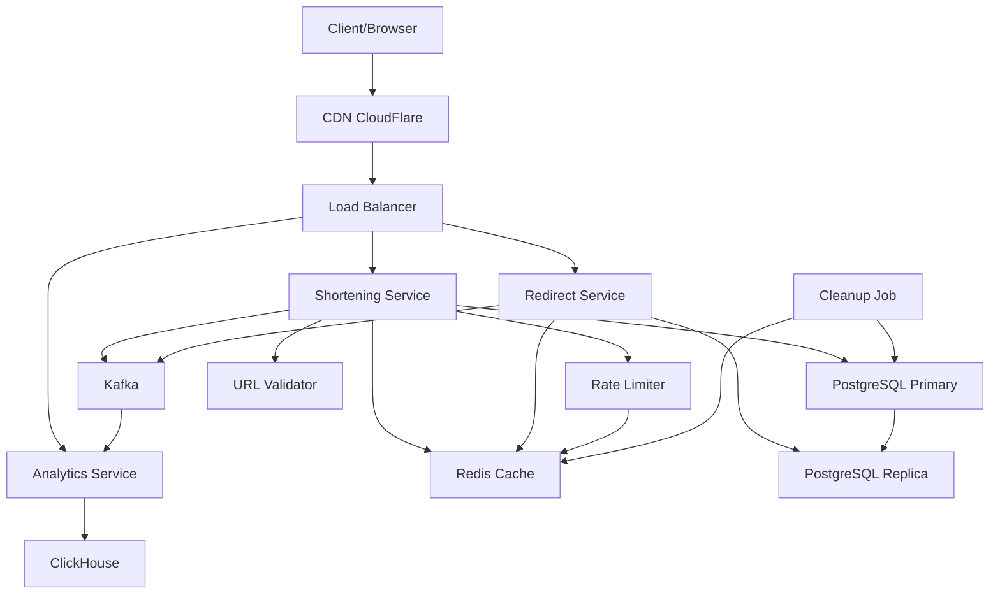

# URL Shortener - System Design

## Problem Description

Design a URL shortening service like bit.ly or TinyURL that converts long URLs into short, manageable links. The system should:
- Accept a long URL and generate a unique short code
- Redirect users from short URL to the original long URL
- Track analytics (clicks, geographic data, referrers)
- Support custom short codes (vanity URLs)
- Handle expiration of URLs
- Provide high availability and low latency globally

---

## What Distributed System Concepts Interviewer Expects

1. **Horizontal Scalability**: How to scale read-heavy workloads across multiple servers
2. **Data Partitioning/Sharding**: Strategies for distributing URL mappings across databases
3. **Caching Strategy**: Multi-level caching for frequently accessed URLs
4. **CAP Theorem Trade-offs**: Choosing consistency vs availability for different operations
5. **Load Balancing**: Distributing traffic efficiently across application servers
6. **Rate Limiting**: Preventing abuse and ensuring fair usage
7. **Distributed ID Generation**: Creating unique short codes in a distributed environment
8. **Database Replication**: Master-slave architecture for read scalability
9. **Global Distribution**: Using CDN and geographic load balancing
10. **Eventual Consistency**: Accepting eventual consistency for analytics data

---

## Functional and Non-Functional Requirements

### Functional Requirements

1. **URL Shortening**: Given a long URL, generate a unique short URL
2. **URL Redirection**: Redirect users from short URL to original URL (301/302)
3. **Custom Short URLs**: Allow users to specify custom short codes
4. **URL Expiration**: Support time-based expiration of URLs
5. **Analytics Tracking**: Track clicks, referrers, geographic location, devices
6. **User Accounts**: Optional user registration to manage URLs
7. **URL Deletion**: Allow users to delete their shortened URLs
8. **Link Preview**: Show metadata/preview of destination URL

### Non-Functional Requirements

1. **High Availability**: 99.99% uptime (4 nines)
2. **Low Latency**: Sub-100ms redirect latency globally
3. **Scalability**: Handle billions of URLs and millions of requests per second
4. **Durability**: URLs should never be lost once created
5. **Security**: Prevent malicious URLs, spam, and abuse
6. **Read-Heavy**: Read:Write ratio approximately 100:1
7. **No Single Point of Failure**: System should survive component failures
8. **Global Accessibility**: Low latency worldwide

---

## Capacity Estimation

### Traffic Estimates

**Daily Active Users (DAU)**: 100 million users
**Monthly Active Users (MAU)**: 500 million users

### URL Creation (WRITE Operations)

- **Assumption**: Each user creates 0.1 URLs per day on average
- **URLs created per day**: 100M users × 0.1 = 10 million URLs/day
- **URLs created per second**: 10M / 86,400 ≈ **115 URLs/second**
- **Peak traffic (3x)**: 345 URLs/second

This write load is manageable. Even at peak, a single database server can handle hundreds of writes per second. However, we'll design for horizontal scalability to handle growth.

### URL Redirection (READ Operations)

- **Assumption**: Each shortened URL is accessed 10 times on average
- **Redirects per day**: 10M URLs × 10 = 100 million redirects/day
- **Redirects per second**: 100M / 86,400 ≈ **1,157 redirects/second**
- **Peak traffic (10x)**: 11,570 redirects/second

This confirms the read-heavy nature (100:1 read-to-write ratio). At peak, we need to handle over 10,000 redirects per second, which requires caching and load balancing across multiple application servers.

### Storage Estimates

**Per URL Storage**:
- Short code: 7 bytes (7 characters)
- Original URL: 500 bytes (average)
- User ID: 8 bytes
- Created timestamp: 8 bytes
- Expiration: 8 bytes
- Metadata: 100 bytes
- **Total per URL**: ~630 bytes ≈ **1 KB** (with indexing overhead)

**5-Year Storage Requirement**:
- URLs created per year: 10M × 365 = 3.65 billion URLs
- 5 years: 3.65B × 5 = **18.25 billion URLs**
- Storage needed: 18.25B × 1 KB = **18.25 TB**

This is manageable with modern databases. With replication (3x), we need approximately 55 TB of storage over 5 years.

### Bandwidth Estimates

**Incoming (URL creation)**:
- 115 URLs/sec × 500 bytes = 57.5 KB/sec ≈ **0.46 Mbps**

**Outgoing (Redirects)**:
- 1,157 redirects/sec × 200 bytes (HTTP redirect response) = 231 KB/sec ≈ **1.85 Mbps**

Bandwidth is not a constraint. The system is more compute and latency-sensitive.

### Cache Memory Requirements

**Assumption**: 20% of URLs generate 80% of traffic (Pareto principle)

- URLs to cache: 18.25B × 0.20 = 3.65 billion URLs
- Cache size needed: 3.65B × 1 KB = **3.65 TB**

This is expensive for memory. We'll use a tiered approach:
- **Hot cache (Redis)**: Top 1% of URLs = 182M URLs × 1 KB = **182 GB** (affordable)
- **Warm cache (CDN)**: Distributed globally, caching based on regional access patterns

---

## Technologies Choices & Justification

### Application Layer
- **Technology**: Node.js/Go/Java (Spring Boot)
- **Justification**: High-throughput, non-blocking I/O for handling concurrent redirects. Go preferred for low latency and efficient resource usage.

### Load Balancer
- **Technology**: NGINX/HAProxy or Cloud Load Balancer (AWS ALB, GCP Load Balancer)
- **Justification**: Distribute traffic across application servers, health checks, SSL termination.

### Cache Layer
- **Technology**: Redis Cluster
- **Justification**: In-memory data store with microsecond latency, supports TTL, distributed caching, and high availability through clustering.

### CDN
- **Technology**: CloudFlare, Fastly, or AWS CloudFront
- **Justification**: Edge caching for global low latency, DDoS protection, and reducing load on origin servers.

### Message Queue
- **Technology**: Apache Kafka or AWS Kinesis
- **Justification**: Decouple analytics ingestion, handle high-throughput event streaming, replay capability for data recovery.

### Analytics Storage
- **Technology**: ClickHouse or Apache Druid
- **Justification**: Columnar databases optimized for time-series analytics, fast aggregations, and high ingestion rates.

### Rate Limiting
- **Technology**: Redis (Token Bucket algorithm)
- **Justification**: Distributed rate limiting across servers, fast atomic operations.

### Monitoring
- **Technology**: Prometheus + Grafana, DataDog, or New Relic
- **Justification**: Real-time metrics, alerting, distributed tracing for microservices.

---

## Database Selection

### Primary Database: PostgreSQL (with Read Replicas)

**Why PostgreSQL?**

1. **ACID Compliance**: Strong consistency for URL creation ensures no duplicate short codes
2. **Mature Ecosystem**: Well-tested replication, backup, and recovery tools
3. **Indexing**: Excellent support for B-tree indexes on short codes for fast lookups
4. **Scalability**: Supports read replicas for scaling reads, and sharding for horizontal scaling
5. **JSON Support**: Store metadata flexibly while maintaining relational integrity

**Alternative: Cassandra (NoSQL)**

For extreme scale (trillions of URLs), Cassandra offers:
- Linear scalability
- Multi-datacenter replication
- High write throughput

**Trade-off**: Eventual consistency and more complex operations. For URL shortener, PostgreSQL with read replicas is sufficient initially, with migration path to Cassandra if needed.

### Cache Database: Redis

- In-memory storage for hot URLs
- TTL support for cache expiration
- Distributed clustering for high availability
- Pub/sub for cache invalidation

### Analytics Database: ClickHouse

- Optimized for write-heavy analytics workloads
- Columnar storage for efficient aggregations
- Real-time analytics queries
- Handles billions of events

---

## Data Modeling With Indexing or Sharding

### URLs Table (PostgreSQL)

```sql
CREATE TABLE urls (
    id BIGSERIAL PRIMARY KEY,
    short_code VARCHAR(10) UNIQUE NOT NULL,
    original_url TEXT NOT NULL,
    user_id BIGINT,
    created_at TIMESTAMP DEFAULT CURRENT_TIMESTAMP,
    expires_at TIMESTAMP,
    is_custom BOOLEAN DEFAULT FALSE,
    is_active BOOLEAN DEFAULT TRUE,
    click_count BIGINT DEFAULT 0
);

-- Indexes
CREATE UNIQUE INDEX idx_short_code ON urls(short_code);
CREATE INDEX idx_user_id ON urls(user_id);
CREATE INDEX idx_created_at ON urls(created_at);
CREATE INDEX idx_expires_at ON urls(expires_at) WHERE expires_at IS NOT NULL;
```

**Indexing Strategy**:
- `idx_short_code`: Primary lookup index (most frequent query)
- `idx_user_id`: For user dashboard queries
- `idx_created_at`: For analytics and cleanup jobs
- `idx_expires_at`: Partial index for expired URL cleanup

### Users Table

```sql
CREATE TABLE users (
    id BIGSERIAL PRIMARY KEY,
    email VARCHAR(255) UNIQUE NOT NULL,
    password_hash VARCHAR(255),
    api_key VARCHAR(64) UNIQUE,
    created_at TIMESTAMP DEFAULT CURRENT_TIMESTAMP,
    tier VARCHAR(20) DEFAULT 'free', -- free, pro, enterprise
    rate_limit_per_day INT DEFAULT 100
);

CREATE UNIQUE INDEX idx_email ON users(email);
CREATE UNIQUE INDEX idx_api_key ON users(api_key);
```

### Analytics Events Table (ClickHouse)

```sql
CREATE TABLE click_events (
    event_id UUID,
    short_code String,
    clicked_at DateTime,
    ip_address String,
    country String,
    city String,
    user_agent String,
    referrer String,
    device_type String -- mobile, desktop, tablet
) ENGINE = MergeTree()
PARTITION BY toYYYYMM(clicked_at)
ORDER BY (short_code, clicked_at);
```

**ClickHouse Partitioning**:
- Partition by month for efficient data management and purging old data
- Ordered by short_code and timestamp for fast time-range queries

### Sharding Strategy

**For URLs Table** (when single PostgreSQL instance reaches limits):

**Sharding Key**: `short_code`

1. **Hash-based Sharding**:
   - Hash the short_code and use modulo to determine shard
   - Example: `shard_id = hash(short_code) % num_shards`
   - Pros: Even distribution
   - Cons: Difficult to add new shards (requires rehashing)

2. **Range-based Sharding**:
   - Shard based on short_code range (e.g., a-m on shard1, n-z on shard2)
   - Pros: Easy to add shards
   - Cons: Potential hot spots if certain characters are more common

**Recommendation**: Start with hash-based sharding using consistent hashing to minimize data movement when adding shards.

### Redis Cache Schema

```
Key: "url:{short_code}"
Value: {
    "original_url": "https://...",
    "user_id": 12345,
    "expires_at": 1735689600
}
TTL: 3600 seconds (1 hour for hot URLs)
```

---

## Service Decomposition With Responsibility & Communication

### 1. URL Shortening Service

**Responsibilities**:
- Generate unique short codes (Base62 encoding)
- Validate URLs and check for malicious content
- Store URL mappings in database
- Handle custom short code requests
- Check for collisions

**APIs Exposed**:
- `POST /shorten`: Create short URL
- `GET /urls/{user_id}`: List user's URLs
- `DELETE /urls/{short_code}`: Delete URL

**Communication**:
- Writes to PostgreSQL primary
- Invalidates cache if URL is updated/deleted
- Publishes events to Kafka for analytics

### 2. Redirect Service

**Responsibilities**:
- Resolve short code to original URL
- Perform 301 (permanent) or 302 (temporary) redirect
- Check URL expiration
- Update click count

**APIs Exposed**:
- `GET /{short_code}`: Redirect to original URL

**Communication**:
- Reads from Redis cache (if miss, read from PostgreSQL replica)
- Publishes click events to Kafka asynchronously
- Updates cache with fetched URLs

### 3. Analytics Service

**Responsibilities**:
- Consume click events from Kafka
- Enrich events (IP to geo-location, user-agent parsing)
- Batch insert into ClickHouse
- Provide aggregated analytics

**APIs Exposed**:
- `GET /analytics/{short_code}`: Get click statistics
- `GET /analytics/{short_code}/geo`: Geographic distribution
- `GET /analytics/{short_code}/referrers`: Top referrers

**Communication**:
- Consumes from Kafka
- Writes to ClickHouse
- Reads from ClickHouse for dashboard queries

### 4. Rate Limiting Service

**Responsibilities**:
- Enforce API rate limits per user/IP
- Implement token bucket or sliding window algorithm
- Block abusive traffic

**Communication**:
- Uses Redis for distributed counters
- Middleware in API Gateway

### 5. URL Validation Service

**Responsibilities**:
- Check for malicious URLs (phishing, malware)
- Validate URL format
- Check against blacklists

**APIs Exposed**:
- `POST /validate`: Internal API for URL validation

**Communication**:
- Integrates with Google Safe Browsing API
- Uses internal blacklist database

### 6. Cleanup Service (Background Job)

**Responsibilities**:
- Remove expired URLs from database
- Archive old analytics data
- Clean up unused short codes

**Communication**:
- Scheduled cron job
- Reads/writes to PostgreSQL
- Invalidates cache for expired URLs

---

## API Design & Security

### Public APIs

#### 1. Create Short URL

```http
POST /api/v1/shorten
Content-Type: application/json
Authorization: Bearer <api_key>

Request:
{
    "url": "https://www.example.com/very/long/url/path",
    "custom_code": "mylink",  // Optional
    "expires_in_days": 30     // Optional
}

Response (201 Created):
{
    "short_url": "https://short.ly/mylink",
    "short_code": "mylink",
    "original_url": "https://www.example.com/very/long/url/path",
    "created_at": "2025-01-15T10:30:00Z",
    "expires_at": "2025-02-14T10:30:00Z"
}

Errors:
- 400: Invalid URL format
- 409: Custom code already taken
- 429: Rate limit exceeded
- 403: URL blocked (malicious)
```

#### 2. Redirect to Original URL

```http
GET /{short_code}

Response (301 Moved Permanently):
Location: https://www.example.com/very/long/url/path

Errors:
- 404: Short code not found
- 410: URL expired
```

#### 3. Get URL Analytics

```http
GET /api/v1/analytics/{short_code}
Authorization: Bearer <api_key>

Response (200 OK):
{
    "short_code": "mylink",
    "total_clicks": 1523,
    "unique_visitors": 847,
    "clicks_by_date": [
        {"date": "2025-01-15", "clicks": 245},
        {"date": "2025-01-14", "clicks": 198}
    ],
    "top_countries": [
        {"country": "US", "clicks": 450},
        {"country": "UK", "clicks": 230}
    ],
    "top_referrers": [
        {"referrer": "twitter.com", "clicks": 320},
        {"referrer": "facebook.com", "clicks": 180}
    ]
}
```

#### 4. Delete URL

```http
DELETE /api/v1/urls/{short_code}
Authorization: Bearer <api_key>

Response (204 No Content)

Errors:
- 404: Short code not found
- 403: Not authorized to delete this URL
```

### Security Measures

1. **Authentication**:
   - API key-based authentication for programmatic access
   - OAuth 2.0 for web dashboard
   - JWT tokens for session management

2. **Rate Limiting**:
   - Free tier: 100 URLs/day, 1000 redirects/day
   - Pro tier: 10,000 URLs/day, unlimited redirects
   - IP-based rate limiting for anonymous requests

3. **Input Validation**:
   - Sanitize all input URLs
   - Limit URL length (max 2048 characters)
   - Validate custom short codes (alphanumeric only, 4-10 chars)

4. **Malicious URL Prevention**:
   - Integration with Google Safe Browsing API
   - Maintain internal blacklist of blocked domains
   - Report mechanism for users to flag malicious URLs

5. **HTTPS Only**:
   - Enforce HTTPS for all API endpoints
   - HSTS headers to prevent downgrade attacks

6. **DDoS Protection**:
   - Use CDN with DDoS mitigation (CloudFlare)
   - Rate limiting at edge locations
   - CAPTCHA for suspicious traffic patterns

7. **Data Privacy**:
   - Hash IP addresses before storing for analytics
   - GDPR compliance: allow users to delete their data
   - No tracking of redirect URLs in server logs

---

## High Level Flow Diagram



### Flow Details:

**URL Creation Flow (Write Path)**:
1. Client sends long URL → CDN → Load Balancer
2. Load Balancer routes to **Shortening Service**
3. Shortening Service:
   - Checks rate limits via **Rate Limiter** (uses Redis)
   - Validates URL via **URL Validator**
   - Generates unique short code
   - Writes to **PostgreSQL Primary**
   - Updates **Redis Cache**
   - Publishes event to **Kafka**

**URL Redirect Flow (Read Path)**:
1. Client requests short URL → CDN (80% served from edge cache)
2. If CDN miss → Load Balancer → **Redirect Service**
3. Redirect Service:
   - Checks **Redis Cache** first (sub-millisecond)
   - If cache miss → reads from **PostgreSQL Replica**
   - Returns 301/302 redirect
   - Publishes click event to **Kafka** (async)

**Analytics Flow**:
1. **Analytics Service** consumes events from **Kafka**
2. Enriches events (IP to geo, user-agent parsing)
3. Batch writes to **ClickHouse**
4. Serves analytics queries from **ClickHouse**

**Background Jobs**:
- **Cleanup Job**: Removes expired URLs from PostgreSQL, invalidates cache
- **PostgreSQL Replication**: Primary continuously replicates to replicas

---

## Deep Dive On Design

### 1. Short Code Generation Strategy

**Goal**: Generate unique, collision-resistant short codes efficiently.

**Approach: Base62 Encoding + Auto-incrementing Counter**

**Why Base62?**
- Character set: [a-z, A-Z, 0-9] = 62 characters
- Compact representation: 7 characters = 62^7 ≈ 3.5 trillion combinations
- URL-safe (no special characters needing encoding)

**Implementation**:

```python
import hashlib
import base64

# Approach 1: Counter-based (Centralized)
def generate_short_code_v1(counter_value):
    """
    Use auto-incrementing counter from database
    """
    base62_chars = "0123456789abcdefghijklmnopqrstuvwxyzABCDEFGHIJKLMNOPQRSTUVWXYZ"
    code = ""
    while counter_value > 0:
        code = base62_chars[counter_value % 62] + code
        counter_value //= 62
    return code.zfill(7)  # Pad to 7 characters

# Approach 2: Hash-based (Distributed)
def generate_short_code_v2(url, attempt=0):
    """
    Hash URL and encode, handle collisions with salt
    """
    content = url + str(attempt)
    hash_value = hashlib.sha256(content.encode()).digest()
    # Take first 6 bytes, encode to base62
    num = int.from_bytes(hash_value[:6], 'big')
    return generate_short_code_v1(num)[:7]

# Approach 3: Snowflake ID (Distributed)
def generate_snowflake_id():
    """
    64-bit ID: timestamp(41) + machine_id(10) + sequence(12)
    Then encode to Base62
    """
    # Implementation details omitted for brevity
    pass
```

**Chosen Approach**: **Snowflake ID + Base62**

**Rationale**:
1. **Distributed**: Each service instance can generate IDs independently
2. **No collisions**: Guaranteed uniqueness through timestamp + machine ID
3. **Sortable**: IDs contain timestamp, useful for analytics
4. **Scalable**: No centralized bottleneck

**Collision Handling**:
- With Snowflake IDs, collisions are theoretically impossible
- For custom short codes, check uniqueness in database
- If collision detected, prompt user to choose different code

### 2. Caching Strategy (Multi-Level)

**Level 1: CDN Edge Cache**
- Cache 302 redirects at edge locations
- 1-hour TTL
- Reduces load on origin servers by 70-80%
- Geographic distribution ensures low latency

**Level 2: Redis Application Cache**
- In-memory cache for URL mappings
- TTL: 1 hour for popular URLs, 5 minutes for others
- Cache warming: Pre-populate top 1000 URLs at startup
- Cache invalidation: On URL deletion or update

**Level 3: Database Query Cache**
- PostgreSQL query result caching
- Helps with repeated analytical queries

**Cache Aside Pattern**:

```python
def resolve_short_code(short_code):
    # 1. Check Redis cache
    url = redis.get(f"url:{short_code}")
    if url:
        return url

    # 2. Cache miss - Query database replica
    url = db_replica.query("SELECT original_url FROM urls WHERE short_code = ?", short_code)

    if url:
        # 3. Update cache
        redis.setex(f"url:{short_code}", 3600, url)
        return url

    return None  # 404
```

**Cache Stampede Prevention**:
- Use distributed locks (Redis SETNX) when cache misses occur
- Only one request fetches from DB, others wait
- Probabilistic early expiration to avoid simultaneous expiry

### 3. Handling High Read Traffic

**Problem**: 10,000+ redirects/second at peak

**Solutions**:

1. **Horizontal Scaling**:
   - Deploy 20+ redirect service instances behind load balancer
   - Each instance handles 500 req/sec
   - Auto-scaling based on CPU/latency metrics

2. **Database Read Replicas**:
   - 5+ read replicas for PostgreSQL
   - Load balance read queries across replicas
   - Replication lag typically <100ms

3. **Async Analytics**:
   - Redirect immediately, log analytics asynchronously
   - Use Kafka to buffer analytics events
   - Prevents analytics from blocking redirects

4. **CDN Offloading**:
   - 80% of redirects served from CDN edge
   - Only 20% reach origin servers

### 4. Handling URL Expiration

**Approach: Lazy Deletion + Background Cleanup**

**Lazy Deletion**:
```python
def redirect(short_code):
    url_data = get_url(short_code)

    if not url_data:
        return 404

    # Check expiration at read time
    if url_data.expires_at and now() > url_data.expires_at:
        return 410  # Gone

    return redirect_to(url_data.original_url)
```

**Background Cleanup Job**:
- Runs daily at 2 AM (low traffic period)
- Soft-delete: Mark URLs as `is_active = false`
- Hard-delete: After 30 days grace period
- Benefits: Allows URL recovery if mistake

### 5. Analytics Pipeline Design

**Goal**: Track billions of click events without impacting redirect latency

**Architecture**:

1. **Event Generation** (Redirect Service):
   - On each redirect, create lightweight event
   - Non-blocking: Fire-and-forget to Kafka
   - Event size: ~200 bytes

2. **Event Streaming** (Kafka):
   - 3 partitions per topic for parallelism
   - Retention: 7 days
   - Replication factor: 3 for durability

3. **Event Processing** (Analytics Service):
   - Consumer group with 3 workers
   - Batch processing: 1000 events per batch
   - Enrichment: IP → GeoIP, UserAgent parsing

4. **Storage** (ClickHouse):
   - Columnar storage for fast aggregations
   - Partitioned by month
   - Materialized views for common queries

**Example Enrichment**:
```python
def process_click_event(event):
    # Enrich event
    geo = geoip_lookup(event.ip_address)
    device = parse_user_agent(event.user_agent)

    enriched_event = {
        'short_code': event.short_code,
        'clicked_at': event.timestamp,
        'country': geo.country,
        'city': geo.city,
        'device_type': device.type,  # mobile, desktop
        'referrer': event.referrer
    }

    # Batch insert to ClickHouse
    batch.append(enriched_event)
    if len(batch) >= 1000:
        clickhouse.insert_batch(batch)
        batch.clear()
```

### 6. Rate Limiting Implementation

**Token Bucket Algorithm with Redis**:

```python
def check_rate_limit(user_id, max_requests=100, window=86400):
    """
    Token bucket: 100 requests per day
    """
    key = f"rate_limit:{user_id}"

    # Get current tokens
    current = redis.get(key)

    if current is None:
        # First request, initialize bucket
        redis.setex(key, window, max_requests - 1)
        return True

    if int(current) > 0:
        # Consume a token
        redis.decr(key)
        return True

    # Rate limit exceeded
    return False
```

**Sliding Window Log** (more accurate):
- Store timestamp of each request in Redis sorted set
- Remove timestamps older than window
- Count remaining timestamps

**DDoS Protection**:
- Aggressive rate limiting at CDN level
- IP-based throttling: 10 requests/second per IP
- CAPTCHA challenge for suspicious patterns

### 7. Database Sharding When Needed

**Trigger**: When single PostgreSQL instance reaches limits:
- 10,000+ writes/sec
- Database size > 1 TB
- Query latency > 50ms

**Sharding Strategy**:

**Shard by short_code hash**:
```python
def get_shard(short_code, num_shards=8):
    hash_value = int(hashlib.md5(short_code.encode()).hexdigest(), 16)
    return hash_value % num_shards

def write_url(short_code, url_data):
    shard_id = get_shard(short_code)
    db = get_database_shard(shard_id)
    db.insert(url_data)

def read_url(short_code):
    shard_id = get_shard(short_code)
    db = get_database_shard(shard_id)
    return db.query(short_code)
```

**Challenges**:
- User-specific queries (get all URLs by user) require fan-out to all shards
- Solution: Maintain user→short_code mapping in separate table/service

---

## Reliability and Monitoring

### High Availability Strategies

1. **Multi-Region Deployment**:
   - Active-active in 3 AWS regions (US-East, EU-West, Asia-Pacific)
   - Route53 geo-routing for low latency
   - Cross-region database replication

2. **Database Replication**:
   - PostgreSQL primary with 5 read replicas
   - Automatic failover with Patroni/Stolon
   - Point-in-time recovery (PITR) with 30-day retention

3. **Redis High Availability**:
   - Redis Sentinel for automatic failover
   - 3-node cluster with replication
   - Persistent snapshots to S3

4. **Kafka Resilience**:
   - 3-broker cluster with replication factor 3
   - Zookeeper quorum for coordination
   - Retention: 7 days allows replay

5. **Circuit Breakers**:
   - Fail fast when dependencies are down
   - Fallback: Serve stale cache data if DB unavailable
   - Graceful degradation: Analytics optional, redirects critical

### Monitoring Metrics

**Golden Signals**:

1. **Latency**:
   - P50, P95, P99 redirect latency (target: P99 < 100ms)
   - API endpoint latency
   - Database query times

2. **Traffic**:
   - Requests per second by endpoint
   - Cache hit rate (target: >90%)
   - Error rate by status code

3. **Errors**:
   - 4xx error rate (client errors)
   - 5xx error rate (server errors - target: <0.1%)
   - Database connection errors
   - Kafka consumer lag

4. **Saturation**:
   - CPU utilization by service
   - Memory usage
   - Database connections pool usage
   - Kafka partition lag

**Dashboards**:
- Real-time traffic dashboard (last 1 hour)
- System health dashboard (all services status)
- Database performance dashboard
- Cost dashboard (AWS spending)

**Alerting**:

| Alert | Threshold | Severity | Action |
|-------|-----------|----------|--------|
| P99 latency > 200ms | 5 min | Warning | Investigate cache/DB |
| Error rate > 1% | 2 min | Critical | Page on-call |
| Cache hit rate < 80% | 10 min | Warning | Check cache size |
| Database replica lag > 10s | 5 min | Critical | Check replication |
| Disk usage > 85% | 1 hour | Warning | Provision storage |
| Kafka consumer lag > 1M | 15 min | Critical | Scale consumers |

**Logging Strategy**:
- **Structured JSON logs** for easy parsing
- **Log Levels**: DEBUG, INFO, WARN, ERROR
- **Centralized Logging**: ELK stack (Elasticsearch, Logstash, Kibana)
- **Log Retention**: 30 days for application logs, 90 days for audit logs
- **Correlation IDs**: Track requests across services

**Distributed Tracing**:
- Use Jaeger or DataDog APM
- Trace requests from API Gateway → Services → Database
- Identify bottlenecks in request path

---

## Bottlenecks and Failure Points In This Design

### 1. Single Database Primary (Write Bottleneck)

**Problem**: All writes go to PostgreSQL primary. At extreme scale (10,000+ writes/sec), single primary becomes bottleneck.

**Failure Mode**: Primary database crashes → No new URLs can be created

**Mitigations**:
- Database sharding (horizontal scaling)
- Use PostgreSQL with high IOPS SSD (AWS io2)
- Connection pooling (PgBouncer)
- Automatic failover with Patroni
- Backup primary in standby mode

**Detection**: Monitor write latency and connection pool exhaustion

---

### 2. Cache Invalidation Complexity

**Problem**: When URL is deleted or updated, need to invalidate cache across CDN, Redis, and potentially user browsers.

**Failure Mode**: Stale cache serves old/deleted URLs

**Mitigations**:
- Use 302 (temporary) redirects instead of 301 (permanent) to prevent browser caching
- Implement cache invalidation API for CDN
- Use cache versioning: `url:{short_code}:v2`
- Short TTLs (1 hour) limit stale data window

**Trade-off**: 302 redirects mean search engines may not pass full SEO value

---

### 3. ID Generation in Distributed System

**Problem**: Generating unique short codes across multiple service instances can lead to collisions.

**Failure Mode**: Two instances generate same short code → Database constraint violation

**Mitigations**:
- Use Snowflake ID algorithm (timestamp + machine_id + sequence)
- Reserve ID ranges per instance
- Retry with different ID on collision (rare)
- Use distributed locking for custom short codes

---

### 4. Analytics Event Loss

**Problem**: If Kafka or ClickHouse is down, analytics events may be lost.

**Failure Mode**: Click events dropped → Underreported analytics

**Mitigations**:
- Kafka replication factor 3 (durability)
- Dead letter queue for failed events
- Async logging: If Kafka unavailable, log to disk and replay later
- Accept eventual consistency for analytics (not critical path)

**Trade-off**: Prioritize redirect availability over perfect analytics

---

### 5. Hot Partition Problem

**Problem**: If one URL goes viral (e.g., shared by celebrity), single partition/shard gets overwhelmed.

**Failure Mode**: High latency or timeouts for hot URL

**Mitigations**:
- Cache hot URLs aggressively at CDN edge
- Multiple Redis replicas for read scaling
- Monitor for hot keys and add dedicated cache
- Rate limit at user level to prevent abuse

---

### 6. DNS and CDN as Single Point of Failure

**Problem**: If DNS provider (Route53) or CDN (CloudFlare) goes down, entire service unavailable.

**Failure Mode**: Users can't resolve domain name → Service unreachable

**Mitigations**:
- Use multiple DNS providers (Route53 + Cloudflare secondary)
- Multiple CDN providers with failover
- DDoS protection at network layer
- Health checks and automatic failover

**Reality Check**: DNS/CDN providers have 99.99%+ SLA, more reliable than our own infrastructure

---

### 7. Cold Start Problem

**Problem**: After deployment or crash, Redis cache is empty. Sudden traffic spike hits database.

**Failure Mode**: Database overwhelmed with queries → Cascade failure

**Mitigations**:
- Cache warming: Pre-populate top URLs on startup
- Gradual traffic ramp-up after deployment
- Circuit breaker: Throttle requests if DB latency spikes
- Read from cache with probabilistic refreshing

---

### 8. Analytics Query Performance

**Problem**: Complex analytics queries (e.g., "top URLs last 30 days") can be slow on billions of records.

**Failure Mode**: Dashboard timeouts or high CPU on ClickHouse

**Mitigations**:
- Materialized views for common aggregations
- Pre-compute daily/hourly rollups
- Limit query time range (e.g., max 90 days)
- Query result caching (Redis)
- Rate limit analytics API

---

### 9. URL Validation Service Latency

**Problem**: External malicious URL checking (Google Safe Browsing API) adds latency to URL creation.

**Failure Mode**: URL creation takes 500ms+ instead of 50ms

**Mitigations**:
- Async validation: Create URL immediately, validate in background
- Mark URL as "pending" until validated
- Cache validation results (domain-level)
- Timeout external API calls (max 200ms)
- Fallback: Skip validation if API unavailable

**Trade-off**: Security vs. latency

---

### 10. Clock Skew in Distributed System

**Problem**: Snowflake IDs depend on system clocks. If clocks drift, IDs may not be monotonic or could collide.

**Failure Mode**: Duplicate IDs or IDs going backward in time

**Mitigations**:
- Use NTP for clock synchronization
- Detect clock skew and abort if >1 second drift
- Add random component to IDs as additional safeguard

---

## Where AI Fits in This Design

### 1. Malicious URL Detection (ML-based)

**Use Case**: Detect phishing, malware, and spam URLs in real-time

**Approach**:
- Train ML model on features: domain age, SSL certificate, URL structure, content keywords
- Use pre-trained models (Google Safe Browsing, VirusTotal)
- Real-time inference: <50ms latency

**Implementation**:
- Feature extraction: URL length, special characters, domain reputation
- Model: Random Forest or Gradient Boosting (XGBoost)
- Deployment: Model served via TensorFlow Serving or AWS SageMaker endpoint

**Benefits**:
- Catch new malicious URLs not in blacklists
- Reduce reliance on external APIs
- Customizable to platform-specific threats

---

### 2. Smart URL Expiration Prediction

**Use Case**: Predict optimal expiration time based on URL usage patterns

**Approach**:
- Analyze historical click patterns
- Predict when URL will become inactive (0 clicks for 30 days)
- Suggest expiration time to user

**Model**:
- Time-series forecasting (LSTM or Prophet)
- Input: Historical click data, URL metadata
- Output: Probability distribution of future clicks

**Value**: Save storage by auto-expiring unused URLs

---

### 3. Personalized URL Recommendations

**Use Case**: Suggest relevant short URLs to users based on their browsing history

**Approach**:
- Collaborative filtering: Users who clicked URL A also clicked URL B
- Content-based filtering: Similar URL topics
- Hybrid model

**Implementation**:
- Embeddings for URLs based on content/metadata
- Real-time recommendation API
- Use ClickHouse for fast filtering

**Application**: Dashboard feature "Trending URLs in your network"

---

### 4. Anomaly Detection for Traffic Spikes

**Use Case**: Detect unusual traffic patterns (DDoS, viral content, bot attacks)

**Approach**:
- Train model on normal traffic patterns
- Detect deviations: sudden spike, geographic anomaly, bot-like behavior
- Alert or auto-scale resources

**Model**:
- Isolation Forest or Autoencoders for anomaly detection
- Real-time stream processing with Kafka Streams

**Benefits**:
- Proactive DDoS mitigation
- Identify viral URLs early (provision extra cache)
- Detect scraping bots

---

### 5. Intelligent Caching with RL

**Use Case**: Optimize cache eviction policy using reinforcement learning

**Approach**:
- Traditional: LRU (Least Recently Used)
- AI: RL agent learns optimal eviction based on access patterns
- Maximize cache hit rate

**Model**:
- RL algorithm: Deep Q-Network (DQN)
- State: Current cache contents, access history
- Action: Which item to evict
- Reward: Cache hit rate improvement

**Research**: Companies like Facebook have explored this (LeCAR cache)

---

### 6. Natural Language Short Code Generation

**Use Case**: Generate human-readable short codes based on URL content

**Approach**:
- Extract keywords from destination URL title/content
- Generate memorable short code: "nyt-climate-article" instead of "a7dK3p1"
- Use GPT/LLM for creative naming

**Example**:
- URL: https://nytimes.com/2025/01/15/climate-change-report
- AI-generated code: "nyt-climate2025"

**Benefits**:
- Better user experience
- Easier to share verbally
- SEO-friendly

---

### 7. Content Summarization for Link Previews

**Use Case**: Generate rich link previews with AI-summarized content

**Approach**:
- Fetch destination page content
- Use LLM (GPT-4) to generate 1-2 sentence summary
- Display in link preview

**API Example**:
```json
{
    "short_url": "short.ly/a7dK3p1",
    "preview": {
        "title": "Climate Change Report 2025",
        "summary": "New UN report warns of accelerating climate impacts...",
        "image": "https://..."
    }
}
```

**Value**: Users know what they're clicking before redirect

---

### 8. Spam and Abuse Detection with NLP

**Use Case**: Detect spammy URLs at creation time

**Approach**:
- Analyze URL patterns: repetitive domains, suspicious keywords
- NLP on destination page content
- Behavioral analysis: User creates 100 URLs in 1 minute

**Model**:
- BERT-based text classification
- Features: URL structure, domain reputation, user behavior

**Action**: Block or flag for manual review

---

### 9. Dynamic Rate Limiting with AI

**Use Case**: Adaptive rate limiting based on user behavior

**Approach**:
- Traditional: Fixed rate limit (100/day)
- AI: Learn user patterns, adjust limits dynamically
- Detect legitimate power users vs. bots

**Model**:
- User clustering (K-means)
- Behavioral profiling: Time of day, URL patterns
- Adjust rate limits per user segment

**Benefits**: Reduce false positives (blocking legitimate users)

---

### 10. Chatbot for Customer Support

**Use Case**: AI assistant to help users with common issues

**Approach**:
- Fine-tuned LLM on URL shortener domain knowledge
- Handle queries: "How do I create custom short URL?", "Why is my link blocked?"
- Escalate complex issues to human support

**Integration**: Embed chat widget in dashboard

---

## 5 Most Asked Follow-Up Questions

### 1. How would you handle analytics at massive scale (1 trillion events/year)?

**Challenge**: 1 trillion events/year = 31,700 events/second. Single ClickHouse instance may struggle.

**Solution**:

**Distributed ClickHouse Cluster**:
- 10-node ClickHouse cluster with sharding
- Shard by `short_code` hash for even distribution
- Replication factor: 2 for durability

**Data Archiving**:
- Hot data (last 30 days): Full granularity in ClickHouse
- Warm data (30-365 days): Aggregated daily rollups
- Cold data (>1 year): Archive to S3, queryable via Athena

**Sampling**:
- Store 100% of events for popular URLs (top 10%)
- Sample 10% of events for long-tail URLs
- Use statistical extrapolation for approximate counts

**Approximation Algorithms**:
- Use HyperLogLog for unique visitor counts (memory efficient)
- Count-Min Sketch for top-K queries
- Trade accuracy for scalability

**Batch Processing**:
- Real-time: Recent 24 hours (ClickHouse)
- Historical: Spark batch jobs on S3 data

**Cost Optimization**:
- Compress old data (Parquet format)
- Lifecycle policies: Delete >2 year old data

---

### 2. How do you prevent someone from creating a short URL for malicious sites?

**Multi-Layered Defense**:

**1. Real-time URL Validation**:
- **Google Safe Browsing API**: Check against known malicious URLs
- **VirusTotal API**: Scan URL reputation
- **Timeout**: 200ms max, proceed if APIs unavailable

**2. Domain Blacklist**:
- Maintain internal blacklist of banned domains
- Community-sourced (user reports)
- Auto-block known malware/phishing domains

**3. Machine Learning Classifier**:
- Train model on features:
  - Domain age (newly registered domains suspicious)
  - SSL certificate validity
  - URL structure (e.g., many dashes, digits)
  - Homograph attacks (e.g., gοοgle.com with Cyrillic 'o')
- Real-time inference on URL creation

**4. Content Analysis** (Async):
- Fetch destination page content
- Check for phishing keywords: "verify account", "urgent action"
- Image analysis: Detect fake login forms (visual similarity)

**5. Rate Limiting**:
- Limit URLs per user/IP to prevent mass spam

**6. User Reporting**:
- "Report Malicious Link" button
- Human review queue
- Auto-disable URL if >10 reports

**7. Retroactive Scanning**:
- Daily batch job to rescan all active URLs
- Disable if newly flagged as malicious

**8. URL Tombstoning**:
- If URL disabled, show interstitial warning page instead of redirect
- User can proceed at own risk (with CAPTCHA)

**Trade-offs**:
- False positives: Legitimate URLs blocked (provide appeal process)
- Latency: Validation adds 50-200ms to URL creation

---

### 3. How would you design the system to support custom domains (e.g., go.company.com)?

**Requirement**: Enterprise users want branded short URLs: go.company.com/promo instead of short.ly/a7dK3p1

**Architecture Changes**:

**1. DNS Configuration**:
- User adds CNAME record: `go.company.com` → `short.ly`
- Our system handles requests for any custom domain

**2. Domain Verification**:
- User claims domain in dashboard
- Verify ownership: Add TXT record to DNS
- Check periodically to ensure domain still owned

**3. SSL/TLS Certificates**:
- Automatic SSL provisioning (Let's Encrypt)
- Use SNI (Server Name Indication) to serve correct cert per domain
- Challenge: Managing thousands of certificates
- Solution: Use wildcard certs or AWS Certificate Manager auto-renewal

**4. Database Schema Update**:

```sql
CREATE TABLE custom_domains (
    id BIGSERIAL PRIMARY KEY,
    user_id BIGINT NOT NULL,
    domain VARCHAR(255) UNIQUE NOT NULL,
    verified_at TIMESTAMP,
    ssl_cert_id VARCHAR(100)
);

-- Update URLs table
ALTER TABLE urls ADD COLUMN domain_id BIGINT REFERENCES custom_domains(id);
```

**5. Routing Logic**:

```python
def resolve_short_code(request):
    host = request.headers['Host']  # go.company.com
    path = request.path  # /promo

    # Check if custom domain
    domain = get_custom_domain(host)
    if domain:
        url = db.query(
            "SELECT original_url FROM urls WHERE short_code = ? AND domain_id = ?",
            path[1:], domain.id
        )
    else:
        # Default short.ly domain
        url = db.query(
            "SELECT original_url FROM urls WHERE short_code = ?",
            path[1:]
        )

    return redirect(url)
```

**6. Billing**:
- Custom domain feature for Pro/Enterprise tier
- Charge per domain: $5/month per domain

**7. CDN Support**:
- Add custom domains to CDN configuration
- CloudFlare allows custom domains via API

**Challenges**:
- **SSL Management**: Automate cert provisioning/renewal for thousands of domains
- **DNS Propagation**: Takes time, educate users
- **Abuse**: Prevent users from claiming domains they don't own

---

### 4. What happens when database fails? How do you ensure zero downtime?

**Failure Scenarios & Mitigations**:

**Scenario 1: PostgreSQL Primary Fails**

**Immediate Impact**: No new URLs can be created (writes fail)

**Mitigation**:
1. **Automatic Failover** (Patroni/Stolon):
   - Detect primary failure via health checks (3-second interval)
   - Promote read replica to new primary (10-20 seconds)
   - Update load balancer to point to new primary
   - **Downtime**: 15-30 seconds for writes

2. **Fallback Mode**:
   - If failover delayed, queue write requests in Kafka
   - Process once primary restored
   - User sees "URL creation in progress" message

3. **Split-Brain Prevention**:
   - Use consensus (Raft via etcd) to elect new primary
   - Fence old primary to prevent dual writes

**Scenario 2: PostgreSQL Replica Fails**

**Immediate Impact**: Reduced read capacity, higher load on remaining replicas

**Mitigation**:
1. **Load Balancer Health Checks**:
   - Remove failed replica from pool immediately
   - Distribute traffic to healthy replicas
   - **Downtime**: None (if sufficient replicas)

2. **Auto-Scaling**:
   - Provision new replica automatically (takes 10-15 minutes)
   - Restore from backup and catch up via WAL replication

**Scenario 3: Redis Cluster Fails**

**Immediate Impact**: Cache misses, increased DB load

**Mitigation**:
1. **Redis Sentinel Failover**:
   - Promote replica to primary (5-10 seconds)
   - Application automatically reconnects

2. **Graceful Degradation**:
   - Serve from PostgreSQL replicas (slower but functional)
   - Implement circuit breaker to prevent DB overload
   - Throttle requests if needed

3. **Cache Bypass Mode**:
   - If Redis completely down, skip cache
   - Use DB query result cache

**Scenario 4: Multi-Region Failure**

**Immediate Impact**: Entire region unavailable (rare, e.g., AWS US-East outage)

**Mitigation**:
1. **Multi-Region Active-Active**:
   - Deploy in 3 regions: US-East, EU-West, Asia-Pacific
   - Route53 health checks: Route traffic away from failed region
   - **Downtime**: None (for users in other regions)

2. **Cross-Region Replication**:
   - PostgreSQL streaming replication across regions (async)
   - Accept eventual consistency (5-10 second lag)

3. **Data Consistency**:
   - Use distributed database (CockroachDB) for multi-region ACID
   - Trade-off: Higher write latency

**Zero Downtime Deployment Strategy**:

1. **Blue-Green Deployment**:
   - Deploy new version to "green" environment
   - Health check green environment
   - Switch load balancer to green (zero downtime)
   - Keep blue as rollback option

2. **Database Migrations**:
   - Backward-compatible schema changes
   - Example: Adding column with default value
   - Apply migration during low-traffic period
   - Use tools like Liquibase/Flyway for versioning

3. **Connection Draining**:
   - Before instance shutdown, stop accepting new connections
   - Wait for existing connections to complete (30s timeout)
   - Then terminate instance

**Chaos Engineering**:
- Regularly test failures in production (GameDay)
- Use Chaos Monkey to randomly terminate instances
- Verify automatic recovery works

---

### 5. How would you implement a URL "preview" feature before redirect?

**Requirement**: Show user a preview page with destination URL info before redirecting (security feature).

**Use Cases**:
1. **Security**: Warn users about suspicious links
2. **Transparency**: Show destination before clicking
3. **Analytics**: Display click statistics on preview page

**Implementation**:

**Approach 1: Interstitial Page (Forced Preview)**

When user clicks `short.ly/abc123`:

1. **First, show preview page**:
   ```
   GET /abc123 → Returns HTML preview page
   ```

2. **Preview page displays**:
   - Destination URL: https://example.com/page
   - Page title and description (scraped metadata)
   - Screenshot of destination page (optional)
   - Security status: "Safe" or "Caution"
   - Click statistics: "Clicked 1,234 times"
   - "Continue" button → Redirects to destination

**Pros**: Enforces security check
**Cons**: Adds friction, slower UX

**Approach 2: Optional Preview (Query Parameter)**

Default behavior: Direct redirect
Optional preview: `short.ly/abc123?preview=1`

**Implementation**:

```python
def handle_redirect(short_code, preview=False):
    url_data = get_url_data(short_code)

    if preview or url_data.force_preview:
        # Render preview page
        return render_template('preview.html',
            destination=url_data.original_url,
            metadata=fetch_metadata(url_data.original_url),
            stats=get_click_stats(short_code)
        )
    else:
        # Direct redirect
        return redirect(url_data.original_url, code=302)
```

**Force Preview Cases**:
- URL flagged as suspicious (medium risk)
- User enabled "always preview" in settings
- First time clicking this URL (optional security feature)

**Metadata Scraping**:

```python
import requests
from bs4 import BeautifulSoup

def fetch_metadata(url):
    try:
        response = requests.get(url, timeout=5)
        soup = BeautifulSoup(response.content, 'html.parser')

        return {
            'title': soup.find('title').text,
            'description': soup.find('meta', {'name': 'description'})['content'],
            'image': soup.find('meta', {'property': 'og:image'})['content'],
            'site_name': soup.find('meta', {'property': 'og:site_name'})['content']
        }
    except:
        return {'title': url, 'description': 'No preview available'}
```

**Caching Metadata**:
- Store in Redis: `metadata:{url_hash}`
- TTL: 24 hours
- Refresh daily for popular URLs

**Preview Page Design** (HTML):

```html
<!DOCTYPE html>
<html>
<head>
    <title>Link Preview - short.ly</title>
</head>
<body>
    <div class="preview-container">
        <h2>You are being redirected to:</h2>
        <div class="destination-box">
            <strong>{{ destination }}</strong>
        </div>

        <div class="metadata">
            
            <h3>{{ metadata.title }}</h3>
            <p>{{ metadata.description }}</p>
        </div>

        <div class="security-badge">
            ✓ Verified Safe
        </div>

        <div class="stats">
            Clicked {{ stats.click_count }} times
        </div>

        <button onclick="window.location.href='{{ destination }}'">
            Continue to destination
        </button>

        <p>
            <small>Redirecting automatically in <span id="countdown">5</span> seconds...</small>
        </p>
    </div>

    <script>
        // Auto-redirect after 5 seconds
        let seconds = 5;
        setInterval(() => {
            seconds--;
            document.getElementById('countdown').innerText = seconds;
            if (seconds === 0) {
                window.location.href = '{{ destination }}';
            }
        }, 1000);
    </script>
</body>
</html>
```

**Advanced: Screenshot Preview**

Use headless browser (Puppeteer) to capture screenshot:

```python
from pyppeteer import launch

async def capture_screenshot(url):
    browser = await launch()
    page = await browser.newPage()
    await page.goto(url)
    screenshot = await page.screenshot()
    await browser.close()
    return screenshot
```

**Challenge**: Expensive (slow, resource-intensive)
**Solution**:
- Pre-generate screenshots for popular URLs
- Store in S3/CDN
- Fallback to metadata-only preview if screenshot unavailable

**Privacy Consideration**:
- Don't leak referrer information when redirecting
- Use `rel="noreferrer"` in preview page links

---

