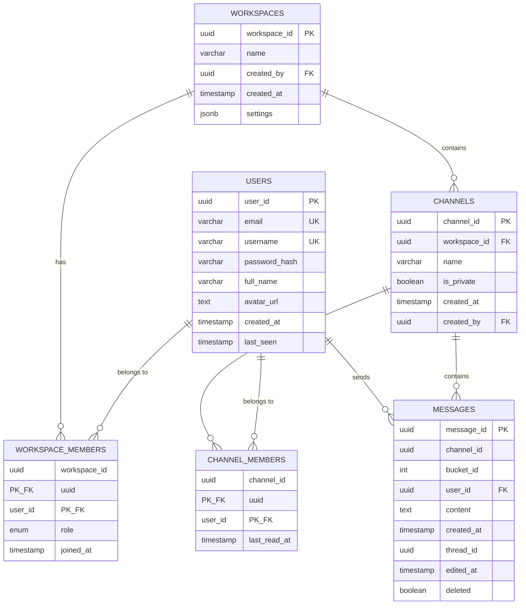
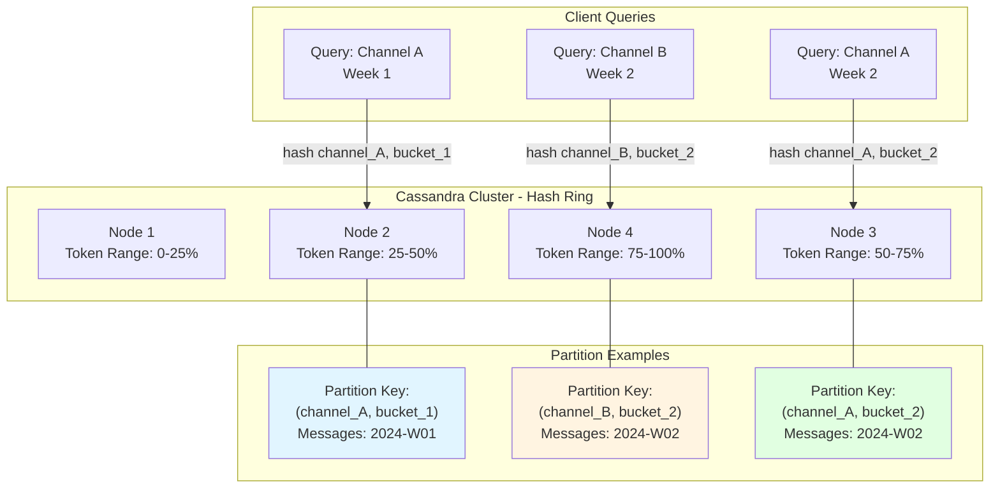
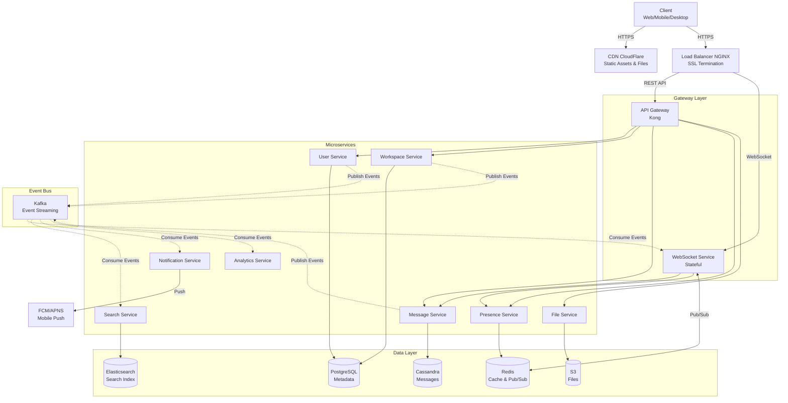
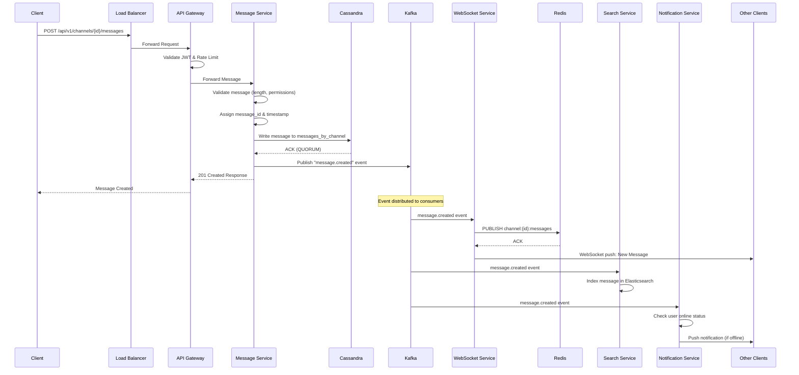
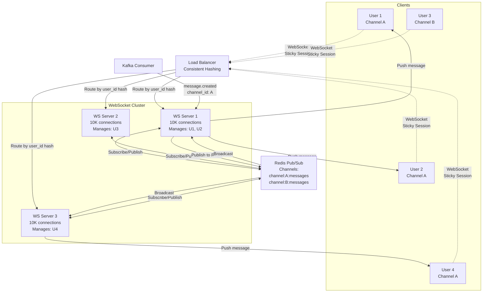
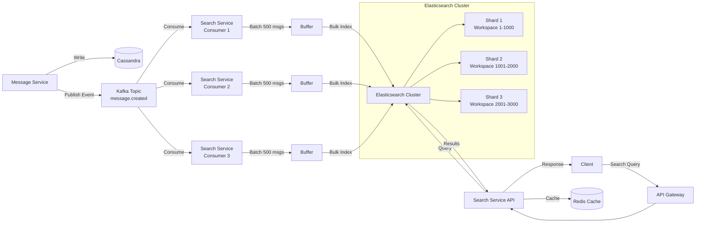
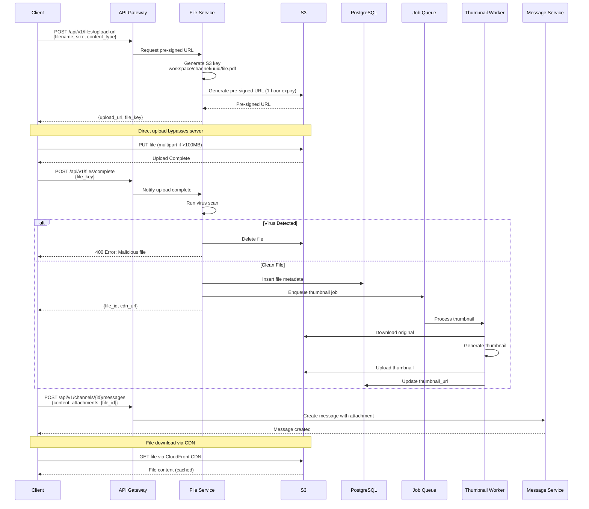
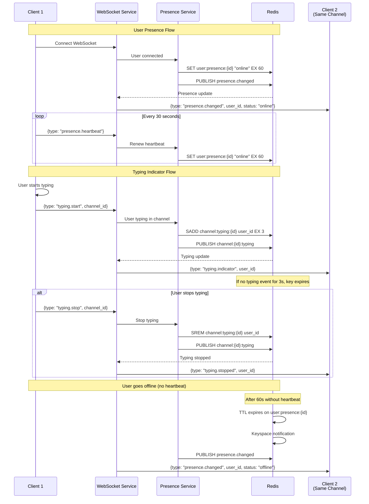
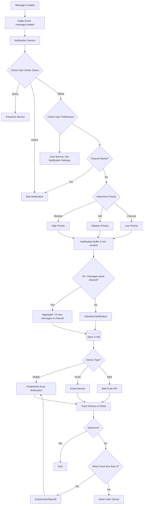

# SYSTEM DESIGN: SLACK (REAL-TIME TEAM COLLABORATION PLATFORM)

Problem Description
-------------------
Design a real-time team collaboration and messaging platform like Slack that enables:
- Real-time messaging across channels and direct messages
- File sharing and search
- User presence and typing indicators
- Notifications across multiple devices
- Thread-based conversations
- Integration with third-party services
- Search across messages and files
- Audio/video calling capabilities


What Distributed System Concepts Interviewer Expects
-----------------------------------------------------
1. Real-time communication patterns (WebSockets, Server-Sent Events, Long Polling)
2. Message ordering and consistency in distributed systems
3. Horizontal scaling of WebSocket connections
4. Data partitioning and sharding strategies
5. Event-driven architecture and message queues
6. Caching strategies for frequently accessed data
7. CAP theorem trade-offs (prioritizing availability and partition tolerance)
8. Eventually consistent systems
9. Load balancing for stateful connections
10. Distributed search systems
11. CDN usage for static assets and file storage
12. Rate limiting and backpressure handling


Functional and Non Functional Requirements
-------------------------------------------

FUNCTIONAL REQUIREMENTS:
1. User Management: Registration, authentication, profile management
2. Workspace Management: Create/manage workspaces with multiple channels
3. Real-time Messaging: Send/receive messages in channels and DMs instantly
4. Threading: Reply to messages in threads
5. File Sharing: Upload and share files (images, documents, videos)
6. Search: Full-text search across messages, files, and users
7. Notifications: Push notifications for mentions, DMs, and activity
8. User Presence: Show online/offline/away status
9. Typing Indicators: Show when users are typing
10. Reactions: Add emoji reactions to messages
11. Message Editing/Deletion: Edit and delete sent messages
12. Integrations: Connect third-party apps and bots

NON-FUNCTIONAL REQUIREMENTS:
1. Low Latency: Messages delivered within 100-200ms
2. High Availability: 99.99% uptime (4.32 minutes downtime/month)
3. Scalability: Support millions of concurrent users and billions of messages
4. Consistency: Message ordering preserved per channel
5. Durability: Zero message loss
6. Security: End-to-end encryption for sensitive data, secure authentication
7. Performance: Handle 100K+ messages per second
8. Reliability: Graceful degradation during failures


Capacity Estimation for DAU/MAU, Throughput per second for READ and WRITE, Storage estimate
--------------------------------------------------------------------------------------------

SCALE ASSUMPTIONS (Similar to Slack's actual scale):
- Monthly Active Users (MAU): 50 million users
- Daily Active Users (DAU): 20 million users (40% of MAU)
- Average workspaces per user: 3
- Average channels per workspace: 50
- Average messages per user per day: 50 messages
- Average message size: 200 bytes (text) + metadata
- File uploads: 10% of messages include files
- Average file size: 2 MB

TRAFFIC ESTIMATION:

Write Operations (Messages):
- Total messages per day: 20M users × 50 messages = 1 billion messages/day
- Messages per second: 1B / 86,400 seconds ≈ 11,600 messages/second
- Peak load (3x average): ~35,000 messages/second

This means our system needs to handle approximately 35,000 write operations per second during peak hours. Each write involves inserting the message into the database, updating caches, and broadcasting to connected clients via WebSockets.

Read Operations (Message fetching, search, presence):
- Each user reads 10x more than they write (scrolling, refreshing)
- Read operations: 11,600 × 10 = 116,000 reads/second
- Peak read load: ~350,000 reads/second

The read-heavy nature (10:1 read-to-write ratio) is typical for messaging platforms since users spend more time consuming messages than creating them. This drives our decision to implement aggressive caching strategies.

STORAGE ESTIMATION:

Message Storage:
- Text storage per message: 200 bytes × 1B messages/day = 200 GB/day
- With metadata (timestamps, user IDs, channel IDs, reactions): ~500 bytes/message
- Daily message storage: 500 GB/day
- Annual message storage: 500 GB × 365 = ~180 TB/year
- With 5-year retention: 180 TB × 5 = 900 TB

File Storage:
- Files uploaded daily: 1B messages × 10% = 100M files/day
- Daily file storage: 100M × 2 MB = 200 TB/day
- Annual file storage: 200 TB × 365 = 73 PB/year
- With 5-year retention: 365 PB

The file storage dominates our storage requirements. This justifies using object storage (S3) with lifecycle policies to move older files to cheaper cold storage tiers.

Total Storage Needs:
- Message data: ~900 TB for 5 years
- File data: ~365 PB for 5 years
- Indexes and caches: 20% overhead = ~73 PB
- TOTAL: ~440 PB over 5 years

Database Operations:
- We need to support 35K writes/second and 350K reads/second
- With database replication factor of 3: need to handle 105K writes/second across cluster
- This scale requires sharding and distributed databases

WebSocket Connections:
- Concurrent users: 20M DAU, assume 30% online simultaneously
- Active connections: 6 million concurrent WebSocket connections
- At 10K connections per server: need 600 WebSocket servers
- With redundancy and load distribution: ~1000 servers


Technologies Choices & Justification
------------------------------------

1. REAL-TIME COMMUNICATION:
   - WebSockets (primary): Bidirectional, persistent connections for instant message delivery
   - Server-Sent Events (fallback): For clients that can't maintain WebSockets
   - Technology: Socket.io or native WebSocket with Redis Pub/Sub for horizontal scaling

2. MESSAGE QUEUE:
   - Apache Kafka: High-throughput distributed event streaming for message processing pipeline
   - Handles 35K+ messages/second with durability and ordering guarantees
   - Partitioned by channel_id for parallel processing

3. CACHING:
   - Redis Cluster: For user sessions, presence data, recent messages, typing indicators
   - In-memory cache with sub-millisecond latency
   - Memcached: For simple key-value caching of API responses

4. CDN:
   - CloudFlare/CloudFront: Serve static assets, uploaded files, and images globally
   - Reduces latency for file downloads from 1000ms to <50ms

5. LOAD BALANCER:
   - Layer 7 (Application): NGINX for HTTP/REST APIs
   - Layer 4 (Transport): HAProxy for WebSocket connections (sticky sessions based on user_id)

6. SEARCH:
   - Elasticsearch: Full-text search across messages and files
   - Distributed inverted index with ~1-2 second indexing delay (acceptable)

7. FILE STORAGE:
   - Amazon S3 or MinIO: Object storage for files with 99.999999999% durability
   - Lifecycle policies to transition old files to Glacier for cost savings

8. API GATEWAY:
   - Kong or AWS API Gateway: Rate limiting, authentication, API versioning


Database Selection
------------------

PRIMARY DATABASE (Message Storage):
- Cassandra (NoSQL - Wide Column Store)

  JUSTIFICATION:
  - Write-optimized: Excellent for high write throughput (35K msgs/sec)
  - Horizontal scalability: Add nodes linearly to handle growth
  - Eventual consistency acceptable for messages (AP in CAP theorem)
  - Time-series data model fits message history perfectly
  - No single point of failure with multi-datacenter replication

  ALTERNATIVES CONSIDERED:
  - MongoDB: Good but less write-optimized than Cassandra
  - PostgreSQL: Strong consistency but harder to scale writes horizontally

METADATA DATABASE (Users, Workspaces, Channels):
- PostgreSQL (Relational Database)

  JUSTIFICATION:
  - Strong consistency needed for user accounts and permissions
  - ACID transactions for workspace/channel operations
  - Relational data with complex joins (user memberships, permissions)
  - Moderate write volume (user operations << message operations)
  - Excellent support for complex queries and indexes

CACHE LAYER:
- Redis Cluster

  JUSTIFICATION:
  - In-memory: Sub-millisecond latency for presence, typing indicators
  - Pub/Sub: Broadcast typing indicators and presence updates
  - Data structures: Lists for recent messages, Sets for online users
  - Persistence: AOF and RDB for durability

SEARCH INDEX:
- Elasticsearch

  JUSTIFICATION:
  - Inverted index for full-text search
  - Horizontal scaling across shards
  - Rich query language for complex searches
  - Near real-time indexing (1-2 second refresh interval)


Data Modelling With Indexing or Sharding
-----------------------------------------



CASSANDRA SCHEMA (Messages):

Table: messages_by_channel
PRIMARY KEY ((channel_id, bucket_id), created_at, message_id)
- channel_id: UUID (partition key)
- bucket_id: INT (partition key - time bucket: daily or weekly)
- created_at: TIMESTAMP (clustering key - descending order)
- message_id: UUID
- user_id: UUID
- content: TEXT
- thread_id: UUID (nullable)
- edited_at: TIMESTAMP
- deleted: BOOLEAN
- reactions: MAP<TEXT, LIST<UUID>>
- attachments: LIST<TEXT> (S3 URLs)

SHARDING STRATEGY:
- Partition by (channel_id, bucket_id): Distributes channel data across nodes
- Time bucketing prevents hot partitions as channels grow
- Each bucket typically spans 1 week to balance partition size
- Query pattern: "Fetch messages from channel X between time T1 and T2"



INDEXING:
- Secondary Index on user_id for "all messages by user" queries
- Materialized view: messages_by_user for user's message history

Table: messages_by_thread
PRIMARY KEY (thread_id, created_at, message_id)
- Optimized for fetching thread replies quickly

POSTGRESQL SCHEMA (Metadata):

Table: users
- user_id: UUID PRIMARY KEY
- email: VARCHAR(255) UNIQUE NOT NULL
- username: VARCHAR(50) UNIQUE NOT NULL
- password_hash: VARCHAR(255)
- full_name: VARCHAR(100)
- avatar_url: TEXT
- created_at: TIMESTAMP
- last_seen: TIMESTAMP

Indexes:
- UNIQUE INDEX on email
- UNIQUE INDEX on username
- INDEX on last_seen for presence queries

Table: workspaces
- workspace_id: UUID PRIMARY KEY
- name: VARCHAR(100)
- created_by: UUID FOREIGN KEY (users)
- created_at: TIMESTAMP
- settings: JSONB

Table: channels
- channel_id: UUID PRIMARY KEY
- workspace_id: UUID FOREIGN KEY (workspaces)
- name: VARCHAR(100)
- is_private: BOOLEAN
- created_at: TIMESTAMP
- created_by: UUID

Indexes:
- INDEX on workspace_id for listing channels
- COMPOSITE INDEX (workspace_id, name) for search

Table: workspace_members
- workspace_id: UUID
- user_id: UUID
- role: ENUM('admin', 'member', 'guest')
- joined_at: TIMESTAMP
- PRIMARY KEY (workspace_id, user_id)

Table: channel_members
- channel_id: UUID
- user_id: UUID
- last_read_at: TIMESTAMP (for unread count)
- PRIMARY KEY (channel_id, user_id)

Indexes:
- INDEX on user_id for user's channels
- INDEX on (user_id, last_read_at) for unread message computation

SHARDING STRATEGY:
- PostgreSQL: Shard by workspace_id using Citus or application-level sharding
- Each shard contains all data for a set of workspaces
- Allows co-located queries for workspace operations

REDIS DATA STRUCTURES:

**User Presence:**
```
Key: user:presence:{user_id}
Type: HASH
Value: {
  "status": "online",
  "last_active": "2024-01-15T10:30:00Z",
  "devices": ["web", "mobile"]
}
TTL: 5 minutes (renewed by heartbeat)
```

**Typing Indicators:**
```
Key: channel:typing:{channel_id}
Type: SET
Value: {user_id_1, user_id_2, user_id_3}
TTL: 3 seconds per member
```

**Recent Messages Cache:**
```
Key: channel:recent_messages:{channel_id}
Type: LIST
Value: [message_1, message_2, ...message_50]
Description: Stores last 50 messages as JSON strings
TTL: 1 hour
```

**Unread Counts:**
```
Key: user:unread_count:{user_id}:{channel_id}
Type: INTEGER
Value: 15
TTL: 7 days
```


Service Decomposition With Responsibility & Communication
----------------------------------------------------------

MICROSERVICES ARCHITECTURE:

1. API GATEWAY SERVICE
   - Responsibilities: Authentication, rate limiting, routing, API versioning
   - Technology: Kong or custom Node.js/Go service
   - Communication: REST/gRPC to downstream services

2. USER SERVICE
   - Responsibilities: User registration, authentication (JWT), profile management
   - Database: PostgreSQL (users table)
   - Cache: Redis (session tokens, user profiles)
   - Communication: REST API, publishes user events to Kafka

3. WORKSPACE SERVICE
   - Responsibilities: Workspace/channel CRUD, membership management, permissions
   - Database: PostgreSQL (workspaces, channels, members)
   - Communication: REST API, gRPC for internal service-to-service calls

4. MESSAGE SERVICE
   - Responsibilities: Create, edit, delete messages; message validation
   - Database: Cassandra (messages)
   - Message Queue: Publishes to Kafka for downstream processing
   - Communication: REST API for writes, gRPC for reads

5. WEBSOCKET SERVICE (Connection Manager)
   - Responsibilities: Maintain WebSocket connections, broadcast messages
   - Stateful: Each instance manages subset of user connections
   - Cache: Redis Pub/Sub for cross-server message broadcasting
   - Scaling: Consistent hashing to route users to specific servers
   - Communication: Consumes from Kafka, uses Redis Pub/Sub

6. NOTIFICATION SERVICE
   - Responsibilities: Send push notifications, email notifications, in-app notifications
   - Message Queue: Consumes from Kafka (message.created events)
   - External: Firebase Cloud Messaging (FCM), Apple Push Notification Service (APNS)
   - Communication: Kafka consumer

7. PRESENCE SERVICE
   - Responsibilities: Track online/offline/away status, typing indicators
   - Cache: Redis (presence data with TTL)
   - Communication: WebSocket for real-time updates, REST API for queries

8. FILE SERVICE
   - Responsibilities: File upload/download, thumbnail generation, virus scanning
   - Storage: S3/MinIO for file storage
   - Cache: CloudFront CDN for file delivery
   - Communication: REST API for uploads, pre-signed URLs for downloads

9. SEARCH SERVICE
   - Responsibilities: Index messages/files, execute search queries
   - Index: Elasticsearch
   - Message Queue: Consumes from Kafka (message.created events) for indexing
   - Communication: REST API for search queries

10. ANALYTICS SERVICE
    - Responsibilities: Track user engagement, message metrics, system health
    - Database: ClickHouse or Snowflake (columnar DB for analytics)
    - Message Queue: Consumes all events from Kafka
    - Communication: Internal only, exports to BI tools

INTER-SERVICE COMMUNICATION:

Synchronous (Request-Response):
- REST API: External clients → API Gateway → Services
- gRPC: Service-to-service for low latency (e.g., WebSocket Service → Message Service)

Asynchronous (Event-Driven):
- Kafka Topics:
  - message.created: Published by Message Service, consumed by WebSocket, Notification, Search, Analytics
  - user.updated: Published by User Service
  - presence.changed: Published by Presence Service
  - file.uploaded: Published by File Service

SERVICE DISCOVERY:
- Consul or Kubernetes DNS for dynamic service discovery

CIRCUIT BREAKER:
- Hystrix or Resilience4j to prevent cascading failures


API Design & Security
----------------------

### REST API ENDPOINTS

**Authentication APIs:**
```
POST   /api/v1/auth/register
POST   /api/v1/auth/login
POST   /api/v1/auth/logout
POST   /api/v1/auth/refresh-token
```

**User APIs:**
```
GET    /api/v1/users/{user_id}
PUT    /api/v1/users/{user_id}
GET    /api/v1/users/search?q={query}
```

**Workspace APIs:**
```
POST   /api/v1/workspaces
GET    /api/v1/workspaces/{workspace_id}
PUT    /api/v1/workspaces/{workspace_id}
DELETE /api/v1/workspaces/{workspace_id}
POST   /api/v1/workspaces/{workspace_id}/members
GET    /api/v1/workspaces/{workspace_id}/members
```

**Channel APIs:**
```
POST   /api/v1/workspaces/{workspace_id}/channels
GET    /api/v1/workspaces/{workspace_id}/channels
GET    /api/v1/channels/{channel_id}
PUT    /api/v1/channels/{channel_id}
DELETE /api/v1/channels/{channel_id}
POST   /api/v1/channels/{channel_id}/members
```

**Message APIs:**
```
POST   /api/v1/channels/{channel_id}/messages
GET    /api/v1/channels/{channel_id}/messages?limit=50&before={timestamp}
PUT    /api/v1/messages/{message_id}
DELETE /api/v1/messages/{message_id}
POST   /api/v1/messages/{message_id}/reactions
POST   /api/v1/messages/{message_id}/threads
```

**File APIs:**
```
POST   /api/v1/files/upload
GET    /api/v1/files/{file_id}
DELETE /api/v1/files/{file_id}
```

**Search APIs:**
```
GET    /api/v1/search?q={query}&workspace_id={id}&type=messages|files
```

### WEBSOCKET API

**Connection URL:**
```
wss://realtime.slack.com/ws?token={jwt_token}
```

**Client → Server Messages:**

Send Message:
```json
{
  "type": "message.send",
  "channel_id": "uuid",
  "content": "Hello world",
  "thread_id": "uuid"
}
```

Typing Indicator:
```json
{
  "type": "typing.start",
  "channel_id": "uuid"
}
```

Presence Update:
```json
{
  "type": "presence.update",
  "status": "away"
}
```

**Server → Client Messages:**

New Message:
```json
{
  "type": "message.new",
  "message": {
    "message_id": "uuid",
    "user_id": "uuid",
    "content": "Hello world",
    "created_at": "2024-01-15T10:30:00Z"
  },
  "channel_id": "uuid"
}
```

Typing Indicator:
```json
{
  "type": "typing.indicator",
  "channel_id": "uuid",
  "user_id": "uuid",
  "username": "john"
}
```

Presence Changed:
```json
{
  "type": "presence.changed",
  "user_id": "uuid",
  "status": "online"
}
```

### SECURITY MEASURES

**1. AUTHENTICATION:**
- JWT (JSON Web Tokens) with short expiry (15 minutes)
- Refresh tokens (30 days) stored in httpOnly cookies
- Multi-factor authentication (MFA) for sensitive operations

Example JWT Payload:
```json
{
  "user_id": "550e8400-e29b-41d4-a716-446655440000",
  "workspace_id": "660e8400-e29b-41d4-a716-446655440000",
  "roles": ["member"],
  "iat": 1705315200,
  "exp": 1705316100
}
```

**2. AUTHORIZATION:**
- Role-Based Access Control (RBAC): admin, member, guest
- Permission checks at API Gateway and service level
- Channel-level permissions (public/private channels)

Permission Matrix:
```
Action              | Admin | Member | Guest
--------------------|-------|--------|-------
Create Channel      |   ✓   |   ✓    |   ✗
Delete Channel      |   ✓   |   ✗    |   ✗
Invite Members      |   ✓   |   ✓    |   ✗
Send Messages       |   ✓   |   ✓    |   ✓
Delete Any Message  |   ✓   |   ✗    |   ✗
```

**3. DATA ENCRYPTION:**
- TLS 1.3 for all API communication
- Encryption at rest for databases (AES-256)
- Optional end-to-end encryption for enterprise customers

**4. RATE LIMITING:**
```
Per-User Limits:
- API Requests: 100 requests/minute
- Messages: 10 messages/second
- File Uploads: 20 files/hour

Per-IP Limits (Authentication):
- Login Attempts: 5 attempts/minute
- Registration: 3 registrations/hour
```

**5. INPUT VALIDATION:**
- Sanitize all user inputs to prevent XSS and SQL injection
- Message size limits: 4,000 characters max
- File size limits: 1 GB per file
- Content Security Policy (CSP) headers
- File type validation (whitelist: images, documents, videos)

**6. API SECURITY:**
- CORS configuration for web clients
- API versioning to prevent breaking changes
- Request signing for webhook integrations
- API key rotation every 90 days

Webhook Signature Verification:
```
HMAC-SHA256(secret_key, request_body) == X-Slack-Signature
```

**7. AUDIT LOGGING:**
- Log all authentication events, admin actions, file access
- Immutable audit trail stored in separate database
- Retention: 7 years for compliance

Audit Log Entry Example:
```json
{
  "timestamp": "2024-01-15T10:30:00Z",
  "event_type": "message.deleted",
  "actor": {
    "user_id": "uuid",
    "username": "john.doe",
    "ip_address": "192.168.1.1"
  },
  "resource": {
    "message_id": "uuid",
    "channel_id": "uuid"
  },
  "action": "DELETE",
  "result": "SUCCESS"
}
```


High Level Flow Diagram
------------------------



MESSAGE FLOW (Sending a Message):



Step-by-step breakdown:

1. User types message in UI and clicks send
2. Client sends HTTP POST to /api/v1/channels/{id}/messages
3. Load Balancer routes to API Gateway
4. API Gateway validates JWT token, checks rate limits
5. Request forwarded to Message Service
6. Message Service:
   a. Validates message (length, permissions)
   b. Assigns message_id and timestamp
   c. Writes to Cassandra (messages_by_channel table)
   d. Publishes event to Kafka topic: "message.created"
   e. Returns 201 Created response to client
7. Kafka distributes event to consumers:
   - WebSocket Service: Reads event, broadcasts to all clients in channel
   - Search Service: Indexes message in Elasticsearch
   - Notification Service: Sends push notifications to offline users
   - Analytics Service: Records metrics
8. WebSocket clients receive real-time message update


Deep Dive On Design
-------------------

1. REAL-TIME MESSAGE DELIVERY (WebSocket Architecture)

CHALLENGE: How to deliver messages instantly to millions of concurrent users?

SOLUTION:
- WebSocket Service cluster with sticky sessions (user consistently routed to same server)
- Redis Pub/Sub for cross-server broadcasting
- Consistent hashing to distribute users across WebSocket servers



FLOW:
1. User connects via WebSocket to server A
2. Server A stores connection in memory: {user_id → websocket_connection}
3. User subscribes to channels: server A subscribes to Redis channels
4. When message arrives in channel X:
   - Kafka message consumed by any WebSocket server instance
   - That server publishes to Redis channel: "channel:X:messages"
   - All WebSocket servers subscribed to "channel:X:messages" receive event
   - Each server checks if it has connected users in channel X
   - If yes, pushes message through WebSocket to those users

HORIZONTAL SCALING:
- Each WebSocket server handles 10K connections (with 4 CPU cores, 16GB RAM)
- For 6M concurrent users: need 600 servers
- Load balancer uses consistent hashing on user_id
- If server fails, users reconnect and load balancer assigns to different server

OPTIMIZATION:
- Connection pooling: Redis connection pool for pub/sub
- Message batching: Batch multiple messages in 100ms window before broadcasting
- Compression: Use WebSocket compression (permessage-deflate) to reduce bandwidth


2. MESSAGE ORDERING AND CONSISTENCY

CHALLENGE: How to guarantee message ordering in a distributed system?

SOLUTION:
- Messages in a channel are ordered by timestamp (clustering key in Cassandra)
- Lamport timestamps or vector clocks to handle clock skew
- Optimistic locking for message edits/deletes

CASSANDRA CONSISTENCY:
- Write with QUORUM consistency (2 of 3 replicas must acknowledge)
- Read with QUORUM consistency for critical operations
- Eventual consistency acceptable for message history (use LOCAL_ONE for performance)

ORDERING GUARANTEES:
- Per-channel ordering guaranteed by Cassandra's clustering key
- Global ordering not required (threads in different channels are independent)
- Client-side message buffering with sequence numbers to detect gaps

HANDLING CONFLICTS:
- Message edits: Use message_id + version number, last-write-wins
- Concurrent edits rare due to UI locking (can only edit own recent messages)


3. UNREAD MESSAGE COUNT

CHALLENGE: How to efficiently compute unread message counts for each channel?

SOLUTION:
- Store last_read_at timestamp in channel_members table (PostgreSQL)
- Count unread messages: COUNT(*) WHERE channel_id = X AND created_at > last_read_at
- Cache unread counts in Redis with 5-minute TTL

OPTIMIZATION:
- Precompute unread counts asynchronously when messages arrive
- Use Redis INCR/DECR for real-time updates
- Periodic reconciliation job to fix drift between cache and database

API RESPONSE:
```
GET /api/v1/channels?workspace_id=123
```

Returns:
```json
[
  {
    "channel_id": "abc",
    "name": "general",
    "unread_count": 15,
    "last_message": {
      "message_id": "xyz",
      "user_id": "user123",
      "content": "Latest message here",
      "created_at": "2024-01-15T10:30:00Z"
    }
  }
]
```


4. FULL-TEXT SEARCH

CHALLENGE: How to search across billions of messages efficiently?

SOLUTION:
- Elasticsearch cluster with sharding by workspace_id

Elasticsearch Index Structure:
```json
{
  "workspace_id": "uuid",
  "channel_id": "uuid",
  "message_id": "uuid",
  "user_id": "uuid",
  "content": "searchable text",
  "created_at": "timestamp",
  "thread_id": "uuid"
}
```



INDEXING PIPELINE:
1. Message created → Kafka event
2. Search Service consumes event (consumer group)
3. Transforms message to Elasticsearch document
4. Bulk indexes to Elasticsearch (batch 500 messages)
5. Refresh interval: 1 second (near real-time)

SEARCH QUERY:
```
GET /api/v1/search?q=database&workspace_id=123
```

Elasticsearch query:
```json
{
  "query": {
    "bool": {
      "must": [
        {"match": {"content": "database"}},
        {"term": {"workspace_id": "123"}}
      ]
    }
  },
  "sort": [{"created_at": "desc"}],
  "size": 20
}
```

OPTIMIZATION:
- Use analyzers for language-specific stemming (English: "running" → "run")
- Fuzzy matching for typo tolerance
- Highlight matched terms in results
- Cache frequent searches in Redis


5. FILE UPLOAD AND SHARING

CHALLENGE: How to handle large file uploads (up to 1GB) efficiently?

SOLUTION:
- Direct upload to S3 using pre-signed URLs (avoids server bandwidth)
- Multi-part upload for files > 100MB
- CloudFront CDN for fast downloads globally



UPLOAD FLOW:

**Step 1: Request Upload URL**
```
POST /api/v1/files/upload-url
```
Request:
```json
{
  "filename": "report.pdf",
  "size": 1048576,
  "content_type": "application/pdf"
}
```
Response:
```json
{
  "upload_url": "https://s3.amazonaws.com/bucket/workspace/channel/uuid/report.pdf?signature=...",
  "file_key": "workspace/channel/uuid/report.pdf",
  "expires_at": "2024-01-15T11:30:00Z"
}
```

**Step 2: Upload File Directly to S3**
```
PUT {upload_url}
Body: [binary file data]
Headers:
  Content-Type: application/pdf
  Content-Length: 1048576
```

**Step 3: Notify Upload Complete**
```
POST /api/v1/files/complete
```
Request:
```json
{
  "file_key": "workspace/channel/uuid/report.pdf"
}
```
Response:
```json
{
  "file_id": "f123e456-e89b-12d3-a456-426614174000",
  "cdn_url": "https://cdn.slack.com/files/f123e456.pdf",
  "thumbnail_url": "https://cdn.slack.com/thumbnails/f123e456.jpg",
  "size": 1048576,
  "content_type": "application/pdf"
}
```

**Step 4: Attach File to Message**
```
POST /api/v1/channels/{channel_id}/messages
```
Request:
```json
{
  "content": "See attached report",
  "attachments": ["f123e456-e89b-12d3-a456-426614174000"]
}
```

OPTIMIZATION:
- Lazy thumbnail generation (on first access)
- CloudFront caching with 1-year TTL for immutable files
- Lifecycle policy: Move files older than 1 year to S3 Glacier (90% cost reduction)


6. PRESENCE AND TYPING INDICATORS

CHALLENGE: How to show real-time presence (online/offline/away) for millions of users?

SOLUTION:
- Redis with TTL for presence data
- Heartbeat mechanism: Client sends heartbeat every 30 seconds
- Server sets Redis key with 60-second TTL



PRESENCE FLOW:
1. User connects via WebSocket
2. Presence Service sets Redis key: SET user:presence:{user_id} "online" EX 60
3. Client sends heartbeat: {"type": "presence.heartbeat"}
4. Server renews TTL: SET user:presence:{user_id} "online" EX 60
5. If no heartbeat for 60 seconds, key expires → user appears offline
6. Presence changes published to Redis Pub/Sub → broadcast to relevant users

TYPING INDICATORS:
1. User starts typing → Client sends: {"type": "typing.start", "channel_id": "abc"}
2. Presence Service adds to Redis Set: SADD channel:typing:{channel_id} {user_id} EX 3
3. Broadcast to channel members via WebSocket
4. If no typing event for 3 seconds, key expires → typing stops

OPTIMIZATION:
- Rate limit typing events: Max 1 per second per user
- Don't broadcast typing to users not currently viewing channel
- Aggregate typing users: "3 people are typing..." instead of individual indicators


7. NOTIFICATIONS

CHALLENGE: How to send notifications to offline users without spamming?

SOLUTION:
- Notification rules engine: Allow users to configure preferences
- Smart batching: Group multiple messages into single notification
- Device-specific delivery: Push to mobile, email, or in-app



NOTIFICATION FLOW:
1. Message created → Kafka event
2. Notification Service consumes event
3. Check if user is online (query Presence Service)
4. If offline:
   a. Check notification preferences (query User Service)
   b. Check if user has muted channel
   c. Determine notification priority (mention > DM > channel message)
   d. Send push notification via FCM/APNS
5. Store notification in database for in-app notification center

BATCHING:
- Buffer notifications for 5 minutes
- If user receives 10+ messages in same channel, send single notification:
  "15 new messages in #engineering"

OPTIMIZATION:
- Use Redis to track recent notifications (prevent duplicates)
- Exponential backoff for failed deliveries
- Unsubscribe users who never open notifications (inactive devices)


Reliability and Monitoring
---------------------------

HIGH AVAILABILITY MEASURES:

1. REDUNDANCY:
   - Multi-region deployment (3 AWS regions: us-east-1, eu-west-1, ap-southeast-1)
   - Active-active setup: All regions serve traffic
   - Data replication: Cassandra multi-DC replication factor 3

2. FAILOVER:
   - Database: Automatic failover with 30-second RTO
   - WebSocket servers: Client auto-reconnects with exponential backoff
   - Kafka: Multi-broker setup with replication factor 3

3. LOAD BALANCING:
   - Geographic load balancing: Route users to nearest region
   - Health checks: Remove unhealthy instances from rotation
   - Circuit breakers: Prevent cascading failures

4. DATA DURABILITY:
   - Cassandra: Quorum writes ensure data persisted to 2+ replicas
   - S3: 99.999999999% durability with cross-region replication
   - Kafka: Replication factor 3 with min.insync.replicas=2

5. GRACEFUL DEGRADATION:
   - If search service down: Disable search, core messaging continues
   - If presence service down: Show all users as "unknown status"
   - If notification service down: Queue notifications for later delivery

MONITORING AND OBSERVABILITY:

1. METRICS (Prometheus + Grafana):
   - Infrastructure: CPU, memory, disk, network per service
   - Application: Request rate, error rate, latency (p50, p95, p99)
   - Business: Messages/sec, DAU, MAU, file uploads/sec

   KEY METRICS:
   - Message delivery latency: p99 < 200ms
   - API latency: p95 < 100ms
   - WebSocket connection success rate: > 99.5%
   - Error rate: < 0.1%

2. LOGGING (ELK Stack - Elasticsearch, Logstash, Kibana):
   - Structured JSON logs from all services
   - Correlation IDs for request tracing across services
   - Log levels: ERROR, WARN, INFO, DEBUG
   - Centralized log aggregation

3. DISTRIBUTED TRACING (Jaeger or DataDog):
   - Trace requests across microservices
   - Identify slow services in request path
   - Example trace: API Gateway → Message Service → Cassandra → WebSocket Service

4. ALERTING (PagerDuty):
   - Critical: Page on-call engineer immediately
     - Database down, API error rate > 1%, p99 latency > 1s
   - Warning: Alert during business hours
     - Disk usage > 80%, memory usage > 85%
   - Info: Slack notifications
     - Deployment completed, scaling event

5. HEALTH CHECKS:
   - Liveness probe: Is service running? (GET /health)
   - Readiness probe: Is service ready to accept traffic? (GET /ready)
   - Deep health check: Test dependencies (database, cache, Kafka)

DISASTER RECOVERY:

1. BACKUP STRATEGY:
   - Cassandra: Daily snapshots to S3, 30-day retention
   - PostgreSQL: Continuous WAL archiving, point-in-time recovery
   - Redis: RDB snapshots every 6 hours, AOF for durability

2. RECOVERY TIME OBJECTIVE (RTO): 15 minutes
   - Automated failover to standby region
   - DNS update to reroute traffic

3. RECOVERY POINT OBJECTIVE (RPO): 1 minute
   - Maximum acceptable data loss
   - Achieved through synchronous replication in critical path

CHAOS ENGINEERING:

- Regularly test failure scenarios:
  - Random server termination (simulated by Chaos Monkey)
  - Network latency injection
  - Database failover drills
  - Regional outage simulation


Bottlenecks and Failure Points In this Design
----------------------------------------------

IDENTIFIED BOTTLENECKS:

1. WEBSOCKET CONNECTION CAPACITY:
   - Issue: Each WebSocket server limited to 10K connections
   - Impact: Need 600+ servers for 6M concurrent users
   - Mitigation: Use more efficient WebSocket libraries (uWebSockets.js), horizontal scaling
   - Cost: High infrastructure cost for stateful servers

2. CASSANDRA WRITE THROUGHPUT:
   - Issue: Single-region Cassandra cluster may bottleneck at 50K writes/sec
   - Impact: Peak load (35K msgs/sec) approaches limit
   - Mitigation: Add more nodes, optimize write path (batch writes), use LOCAL quorum
   - Trade-off: Higher infrastructure cost vs. write capacity

3. REDIS PUB/SUB SCALABILITY:
   - Issue: Redis Pub/Sub uses single-threaded event loop
   - Impact: High message volume in popular channels may cause latency spikes
   - Mitigation: Shard Redis by channel groups, use Redis Cluster
   - Alternative: Consider NATS or Apache Pulsar for higher throughput pub/sub

4. KAFKA CONSUMER LAG:
   - Issue: If consumers fall behind, notifications and search indexing delayed
   - Impact: Users don't receive timely notifications, search results outdated
   - Mitigation: Scale consumer groups, optimize consumer processing, monitor lag
   - SLA: Consumer lag < 5 seconds for critical topics (notifications)

5. ELASTICSEARCH INDEXING:
   - Issue: Indexing 11,600 messages/sec requires significant Elasticsearch resources
   - Impact: Search index may lag behind real-time by 10-30 seconds
   - Mitigation: Batch indexing, increase shard count, use faster disks (SSD)
   - Trade-off: Acceptable for search (users expect slight delay)

6. POSTGRESQL CONNECTION POOLING:
   - Issue: PostgreSQL limited to 100-200 connections per instance
   - Impact: Connection exhaustion under high load
   - Mitigation: Use PgBouncer (connection pooler), read replicas, caching

SINGLE POINTS OF FAILURE:

1. API GATEWAY:
   - Failure: If API Gateway down, all requests fail
   - Mitigation: Multi-instance deployment with load balancer, health checks
   - Redundancy: Deploy across 3+ availability zones

2. REDIS MASTER FAILURE:
   - Failure: If Redis master fails, cache writes fail
   - Mitigation: Redis Sentinel for automatic failover (30-second downtime)
   - Impact: Brief spike in database load during failover

3. KAFKA CLUSTER:
   - Failure: If Kafka cluster down, async processing stops
   - Mitigation: Multi-broker setup with replication, cross-region replication
   - Impact: Notifications and search delayed until recovery

4. LOAD BALANCER:
   - Failure: If load balancer fails, traffic cannot reach services
   - Mitigation: Use cloud-managed load balancers (AWS ALB/NLB) with 99.99% SLA
   - Redundancy: Multi-AZ deployment

CASCADING FAILURE SCENARIOS:

1. THUNDERING HERD:
   - Scenario: Cache expiration causes simultaneous database queries
   - Example: Popular channel's cache expires, 10K users request messages
   - Mitigation: Staggered cache expiration (TTL + random jitter), cache warming

2. RETRY STORM:
   - Scenario: Service outage causes clients to retry aggressively
   - Example: WebSocket service down, 6M clients retry connection immediately
   - Mitigation: Exponential backoff with jitter, rate limiting, circuit breakers

3. DATABASE OVERLOAD:
   - Scenario: Cache failure leads to cache stampede on database
   - Mitigation: Request coalescing (deduplicate concurrent identical queries)
   - Circuit breaker: If database slow, return cached/stale data

MITIGATION STRATEGIES:

1. RATE LIMITING:
   - Per-user limits: 100 API requests/minute, 10 messages/second
   - Per-IP limits: 1000 requests/minute (prevent DDoS)

2. CIRCUIT BREAKERS:
   - If downstream service error rate > 50%, open circuit for 30 seconds
   - Return cached data or graceful error response

3. BULKHEADS:
   - Isolate thread pools for different operations
   - Database query pool separate from API request pool

4. BACKPRESSURE:
   - If Kafka consumer lag > 10 seconds, slow down message ingestion
   - HTTP 429 (Too Many Requests) during extreme load


Where AI fits in this design
-----------------------------

1. INTELLIGENT MESSAGE SEARCH:
   - Semantic search using embeddings (OpenAI, Cohere)
   - Example: Search "project deadline" finds messages about "due dates" and "timelines"
   - Implementation: Generate embeddings for messages, store in vector database (Pinecone, Weaviate)
   - Query: Convert search query to embedding, find nearest neighbors

2. MESSAGE SUMMARIZATION:
   - Summarize long threads or channels with 100+ unread messages
   - Example: "30 messages in #engineering discussed database migration, decided to use PostgreSQL"
   - Implementation: Use LLM (GPT-4, Claude) to generate summaries
   - Trigger: User opens channel with 50+ unread messages, show summary at top

3. SMART NOTIFICATIONS:
   - ML model predicts notification urgency based on content
   - Example: Mention in critical discussion → high priority, casual chat → low priority
   - Implementation: Train classification model on historical data (which notifications were read)
   - Features: Message content, sender, channel, time of day, user's read patterns

4. AUTO-RESPONSE SUGGESTIONS:
   - Suggest quick replies based on message context
   - Example: Message: "Can you review the PR?" → Suggestions: "Sure, I'll check it out", "Done!", "Can you send the link?"
   - Implementation: Fine-tune LLM on company's historical message data

5. CONTENT MODERATION:
   - Detect toxic messages, spam, or sensitive information
   - Example: Automatically flag messages with credit card numbers or profanity
   - Implementation: Use moderation API (OpenAI Moderation) or train custom classifier
   - Action: Warn user before sending, require admin approval

6. MEETING NOTES EXTRACTION:
   - Extract action items, decisions from meeting discussions
   - Example: "Alice will finish the design by Friday" → Action item assigned to Alice
   - Implementation: NLP extraction model (spaCy, GPT-4)
   - Output: Generate structured summary with tasks, owners, deadlines

7. PERSONALIZED CHANNEL RECOMMENDATIONS:
   - Recommend channels based on user's interests and activity
   - Example: User frequently discusses "machine learning" → Recommend #ai-research channel
   - Implementation: Collaborative filtering or content-based recommendations
   - Data: User's message history, channel topics, user clusters

8. SENTIMENT ANALYSIS:
   - Detect team morale trends from message sentiment
   - Example: Negative sentiment spike in #support → Alert manager
   - Implementation: Sentiment classification model (BERT-based)
   - Dashboard: Show sentiment trends over time per channel/workspace

9. SMART THREADING:
   - Auto-suggest when reply should be in thread vs. main channel
   - Example: 3+ back-and-forth messages → Suggest starting a thread
   - Implementation: Heuristic rules + ML model

10. CODE SNIPPET DETECTION AND FORMATTING:
    - Auto-detect code in messages and apply syntax highlighting
    - Example: Detect Python code and format with proper indentation
    - Implementation: Language detection model (GitHub's linguist)

AI INFRASTRUCTURE:

- Inference Service:
  - Dedicated service for AI/ML predictions
  - GPU instances for model inference (NVIDIA A10, T4)
  - Model serving: TensorFlow Serving, TorchServe, or SageMaker

- Feature Store:
  - Cache computed features for ML models (user embeddings, channel metadata)
  - Technology: Feast, Tecton

- Model Monitoring:
  - Track model performance (accuracy, latency)
  - A/B testing framework for new models
  - Rollback mechanism for poorly performing models


5 Most asked follow-up questions
---------------------------------

1. HOW DO YOU HANDLE MESSAGE EDITS AND ENSURE ALL CLIENTS SEE THE UPDATE?

ANSWER:
- When user edits message, client sends PUT /api/v1/messages/{message_id}
- Message Service updates Cassandra (SET content = new_content, edited_at = timestamp WHERE message_id = X)
- Publishes event to Kafka: "message.edited" with message_id and new content
- WebSocket Service broadcasts update to all clients in channel
- Clients update their local message cache
- Optimistic locking: Include version number to prevent concurrent edit conflicts
- If two users edit simultaneously (rare), last write wins (LWW)
- Edited messages marked with "Edited" label in UI
- Edit history stored for audit (optional enterprise feature)

2. HOW DO YOU HANDLE CHANNEL MEMBER LIST CHANGES (JOINS/LEAVES)?

ANSWER:
- Membership stored in PostgreSQL (channel_members table)
- When user joins channel:
  - Workspace Service adds row: INSERT INTO channel_members (channel_id, user_id)
  - Publishes event to Kafka: "channel.member_joined"
  - WebSocket Service broadcasts to all channel members
  - New member's client subscribes to Redis channel for that channel_id
  - Load last 50 messages from cache/database for new member
- When user leaves:
  - Remove from channel_members table
  - Publish "channel.member_left" event
  - Unsubscribe from Redis channel
- For large channels (10K+ members), don't broadcast individual joins/leaves (too noisy)

3. HOW DO YOU ENSURE DATA CONSISTENCY BETWEEN CACHE (REDIS) AND DATABASE (CASSANDRA)?

ANSWER:
Cache-Aside Pattern with Write-Through:
- Write path:
  1. Write to Cassandra first (source of truth)
  2. If successful, update Redis cache
  3. If Redis update fails, acceptable (cache will be repopulated on next read)
- Read path:
  1. Check Redis cache first
  2. If cache miss, query Cassandra
  3. Store result in Redis with TTL (1 hour)

Cache Invalidation:
- On message edit/delete, invalidate Redis cache for that channel
- Use cache versioning: Key format "channel:messages:{channel_id}:v{version}"
- Increment version on schema changes to invalidate all old caches

Consistency Trade-offs:
- Eventual consistency acceptable for message cache
- Stale cache (1-2 seconds) acceptable vs. database load
- Critical operations (DMs, mentions) bypass cache and query database directly

Reconciliation:
- Background job runs every 5 minutes to detect drift
- Compare cache vs. database for sample of channels
- Alert if drift exceeds threshold (>1%)

4. HOW DO YOU HANDLE VERY LARGE CHANNELS (100K+ MEMBERS)?

ANSWER:
Challenges:
- Broadcasting message to 100K WebSocket connections is slow (1-2 seconds)
- Presence updates (online/offline) create too many events
- Typing indicators unusable (100 people typing simultaneously)

Solutions:
1. BROADCAST OPTIMIZATION:
   - Fan-out on read instead of fan-out on write
   - Don't push messages to inactive users (not currently viewing channel)
   - Client polls for new messages every 5 seconds instead of WebSocket push
   - Lazy loading: Only load active members, not all 100K

2. PRESENCE SIMPLIFICATION:
   - Don't show individual online status for large channels
   - Show aggregate: "5,432 members online" instead of individual indicators
   - Only show presence for direct messages and small channels (<100 members)

3. TYPING INDICATORS:
   - Disable typing indicators for large channels
   - Or show aggregate: "Several people are typing..." without names

4. PAGINATION:
   - Paginate member list (show 50 at a time)
   - Infinite scroll for message history

5. SHARDING:
   - Shard large channel messages across multiple Cassandra partitions
   - Use bucket_id based on time (daily buckets)

EXAMPLE:
- Slack's #general channel in large workspaces:
  - No typing indicators
  - Simplified presence ("X members online")
  - Client-side polling for new messages
  - Works well for 100K+ members

5. HOW DO YOU HANDLE DISASTER RECOVERY AND DATA LOSS SCENARIOS?

ANSWER:
Backup Strategy:
- Cassandra: Daily snapshots to S3, incremental backups every 6 hours
- PostgreSQL: Continuous WAL archiving, enables point-in-time recovery (PITR)
- Redis: RDB snapshots every 6 hours, AOF (Append-Only File) for durability
- S3 files: Cross-region replication to secondary region

Recovery Scenarios:

1. SINGLE NODE FAILURE:
   - Cassandra: Repair operation streams data from healthy replicas
   - PostgreSQL: Promote read replica to master (30-second downtime)
   - Redis: Sentinel promotes replica to master automatically
   - RTO: 1-2 minutes, RPO: 0 (no data loss due to replication)

2. DATA CENTER FAILURE:
   - Multi-region deployment: Failover to secondary region
   - DNS update to reroute traffic (TTL: 60 seconds)
   - Cassandra: Multi-DC replication ensures data available in other region
   - RTO: 5 minutes, RPO: 0 (synchronous cross-region replication)

3. DATA CORRUPTION:
   - Restore from latest backup snapshot
   - PostgreSQL: Use PITR to restore to 5 minutes before corruption
   - Cassandra: Restore table snapshot from S3
   - RTO: 30 minutes, RPO: 5 minutes (worst case: lose last 5 minutes of data)

4. ACCIDENTAL DATA DELETION:
   - Soft deletes: Messages marked as deleted but not physically removed for 30 days
   - Admin can recover deleted messages within 30-day window
   - After 30 days, permanent deletion (compliance requirement)

Testing:
- Monthly disaster recovery drills
- Test failover to secondary region
- Verify backup restoration process
- Simulate data corruption and recovery

Compliance:
- GDPR: User data deletion within 30 days of request
- Audit logs: Immutable, stored for 7 years
- Encryption: At rest (AES-256) and in transit (TLS 1.3)
