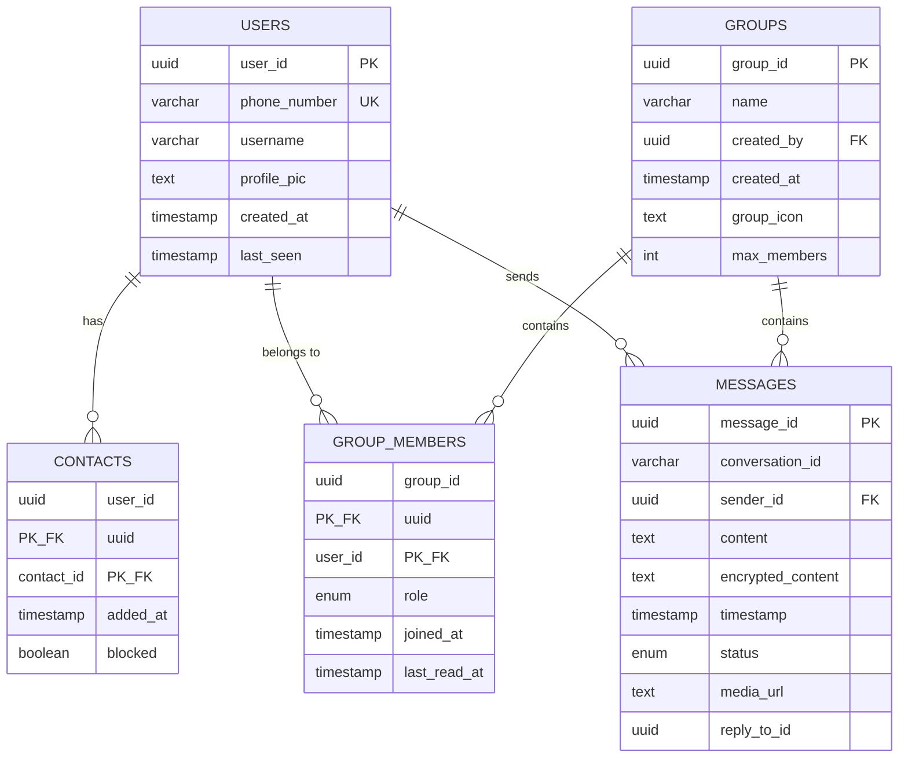
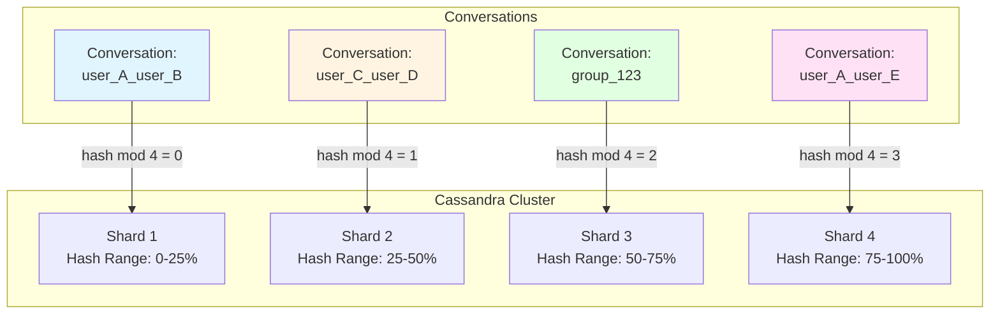
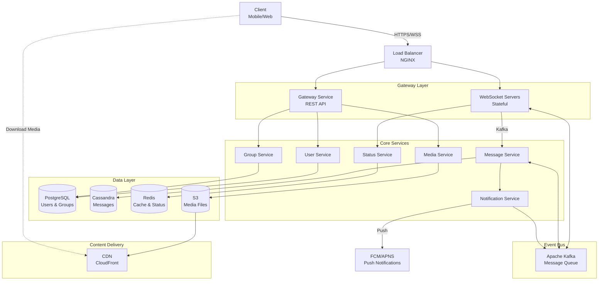
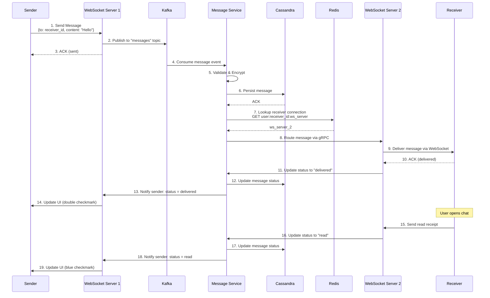
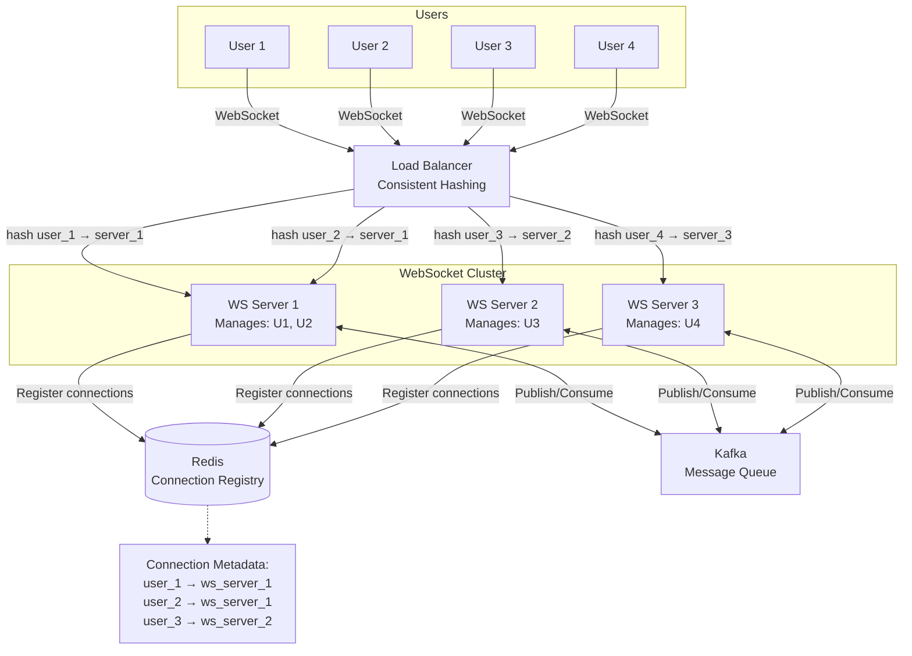
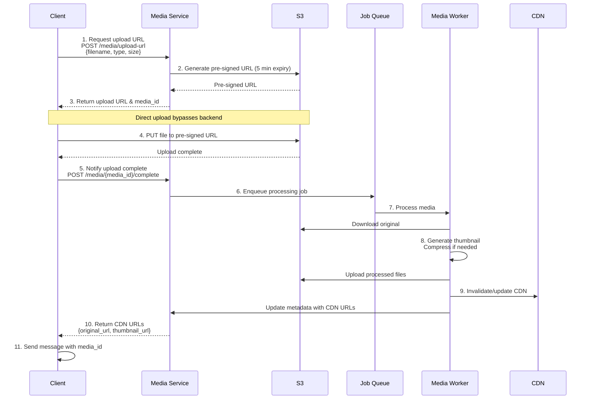
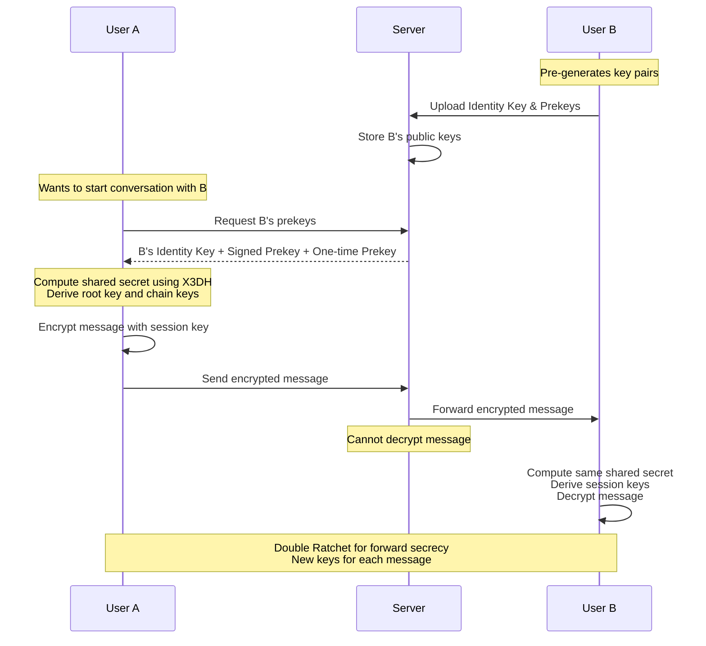

# WhatsApp System Design

## 1hr System Design Interview

**Topic:** Design WhatsApp - A real-time messaging platform

---

## Problem Description

Design a scalable, real-time messaging system like WhatsApp that allows users to:
- Send and receive text messages in real-time
- Support one-to-one and group conversations
- Handle media sharing (images, videos, documents)
- Show online/offline status and message delivery status (sent, delivered, read)
- Support end-to-end encryption
- Handle billions of users globally with low latency

---

## What Distributed System Concepts Interviewer Expects

- **Real-time Communication:** WebSockets, long polling, or server-sent events
- **Message Queue Systems:** For reliable message delivery
- **Distributed Caching:** For user sessions and frequently accessed data
- **Database Partitioning/Sharding:** To handle massive user base
- **Consistent Hashing:** For distributing users across servers
- **Load Balancing:** For distributing traffic across multiple servers
- **CAP Theorem:** Understanding trade-offs (Availability vs Consistency)
- **Message Ordering:** Ensuring messages are delivered in order
- **Idempotency:** Handling duplicate message requests
- **Push Notifications:** For offline message delivery
- **CDN:** For media content delivery

---

## Functional and Non-Functional Requirements

### Functional Requirements
1. Users can send/receive one-to-one messages in real-time
2. Users can create group chats and send messages to groups
3. Support for media sharing (images, videos, audio, documents)
4. Message delivery status (sent, delivered, read receipts)
5. Online/offline status indicators
6. Message history persistence
7. User authentication and profile management
8. Push notifications for offline users
9. End-to-end encryption for messages

### Non-Functional Requirements
1. **Low Latency:** Messages should be delivered within 200ms
2. **High Availability:** 99.99% uptime
3. **Scalability:** Support billions of users and handle peak loads
4. **Consistency:** Messages should be delivered in order
5. **Reliability:** No message loss
6. **Security:** End-to-end encryption, secure authentication
7. **Fault Tolerance:** System should handle server failures gracefully
8. **Global Distribution:** Low latency for users across the world

---

## Capacity Estimation for DAU/MAU, Throughput per second for READ and WRITE, Storage estimate

### User Estimates
- **MAU (Monthly Active Users):** 2 billion users
- **DAU (Daily Active Users):** 1 billion users (50% of MAU)
- **Average messages per user per day:** 40 messages
- **Peak usage:** 3x average during peak hours

### Throughput Estimates

**WRITE Operations (Sending Messages):**
- Total messages per day: 1B users × 40 messages = 40 billion messages/day
- Messages per second: 40B / 86,400 = ~463K messages/second
- Peak throughput: 463K × 3 = ~1.4M messages/second

**READ Operations (Receiving Messages):**
- Assuming 1:1 average (each message sent is received by one user): ~463K reads/second
- For groups (avg 5 people): 463K × 3 = ~1.4M reads/second
- Peak read throughput: ~4M reads/second

### Storage Estimates

**Message Storage:**
- Average message size: 100 bytes (text)
- Media messages: 20% of messages, average size 200KB
- Daily storage for text: 40B × 80% × 100 bytes = 3.2 TB/day
- Daily storage for media: 40B × 20% × 200KB = 1,600 TB/day
- **Total daily storage: ~1,603 TB/day**
- Annual storage: ~585 PB/year

**Metadata Storage:**
- User profiles: 2B users × 10KB = 20 TB
- Message metadata: 40B messages × 500 bytes = 20 TB/day

**Retention Policy:**
- Messages: Store indefinitely (with archival after 1 year)
- Media: Store for 2 years, then archive/compress

---

## Technologies Choices & Justification

### Real-time Communication
- **WebSockets:** For bidirectional real-time communication between clients and servers
- **XMPP or Custom Protocol:** For lightweight message exchange

### Message Queue
- **Apache Kafka:** For reliable, scalable message delivery with high throughput
- **RabbitMQ:** For message routing in group chats

### Backend Services
- **Go/Node.js:** For WebSocket servers (high concurrency support)
- **Java/Python:** For business logic services

### Cache Layer
- **Redis:** For user sessions, online status, and frequently accessed data
- **Memcached:** For caching user profiles and metadata

### Search
- **Elasticsearch:** For message search functionality

### Media Storage
- **S3/Cloud Storage:** For storing images, videos, documents
- **CDN (CloudFront/Cloudflare):** For fast media delivery globally

### Monitoring
- **Prometheus + Grafana:** For metrics and monitoring
- **ELK Stack:** For log aggregation and analysis

### Load Balancing
- **NGINX/HAProxy:** For distributing traffic across WebSocket servers

---

## Database Selection

### Primary Database
**Cassandra or MongoDB (NoSQL)**

**Justification:**
- High write throughput for storing billions of messages
- Horizontal scalability through sharding
- Support for time-series data (messages ordered by timestamp)
- Eventual consistency acceptable for message storage
- Wide column store perfect for conversation-based queries

**Schema Design:**
```
Messages Table:
- partition_key: conversation_id (user1_user2 or group_id)
- clustering_key: timestamp
- columns: message_id, sender_id, content, status, media_url, encrypted_content
```

### Secondary Database
**PostgreSQL/MySQL (Relational)**

**Use Cases:**
- User authentication and profiles
- User relationships (contacts, blocked users)
- Group metadata
- ACID transactions for critical operations

**Schema:**
```
Users: user_id, phone_number, username, profile_pic, created_at, last_seen
Contacts: user_id, contact_id, added_at
Groups: group_id, name, created_by, created_at
GroupMembers: group_id, user_id, role, joined_at
```

### Cache Layer
**Redis**
- User online/offline status (TTL-based)
- Active WebSocket connections mapping
- Recent messages cache (last 50 messages per conversation)
- Undelivered message queues

---

## Data Modelling With Indexing or Sharding



### Sharding Strategy

**User-based Sharding:**
- Shard key: `hash(user_id) % number_of_shards`
- All user data and their messages stored in same shard
- Ensures data locality for user queries

**Conversation-based Sharding (Preferred):**
- Shard key: `hash(conversation_id) % number_of_shards`
- conversation_id: `min(user1_id, user2_id)_max(user1_id, user2_id)` for 1:1
- conversation_id: `group_id` for groups
- All messages in a conversation stored together



### Indexing Strategy

**Messages Table (Cassandra):**
```
PRIMARY KEY ((conversation_id), timestamp DESC)
```
- Automatically indexed on partition key and clustering key
- Efficient range queries for fetching message history

**Users Table (PostgreSQL):**
```
PRIMARY INDEX: user_id
UNIQUE INDEX: phone_number
INDEX: username (for search)
```

**Groups Table:**
```
PRIMARY INDEX: group_id
INDEX: created_by (for user's groups)
```

**GroupMembers Table:**
```
COMPOSITE INDEX: (group_id, user_id)
INDEX: user_id (for finding all groups of a user)
```

### Data Replication
- **Cassandra:** Replication factor of 3 for durability
- **PostgreSQL:** Master-slave replication for read scalability
- **Redis:** Redis Sentinel for high availability

---

## Service Decomposition With Responsibility & Communication

### Microservices Architecture

**1. Gateway Service**
- **Responsibility:** API gateway, authentication, rate limiting, request routing
- **Communication:** REST API, gRPC
- **Tech:** NGINX, Kong, or custom with Node.js

**2. WebSocket Service**
- **Responsibility:** Maintain persistent WebSocket connections, route messages
- **Communication:** WebSocket protocol
- **Tech:** Node.js/Go with Socket.io or native WebSockets
- **Scaling:** Stateful service, uses consistent hashing for connection distribution

**3. Message Service**
- **Responsibility:** Message validation, encryption, persistence, delivery orchestration
- **Communication:** Kafka (async), gRPC (sync)
- **Tech:** Java/Go

**4. User Service**
- **Responsibility:** User management, authentication, profile management, contacts
- **Communication:** REST API, gRPC
- **Tech:** Java/Python
- **Database:** PostgreSQL

**5. Group Service**
- **Responsibility:** Group creation, member management, group metadata
- **Communication:** REST API, gRPC
- **Tech:** Java/Python
- **Database:** PostgreSQL

**6. Notification Service**
- **Responsibility:** Push notifications to offline users
- **Communication:** Kafka consumer, FCM/APNS APIs
- **Tech:** Python/Node.js

**7. Media Service**
- **Responsibility:** Upload/download media files, compression, thumbnail generation
- **Communication:** REST API
- **Tech:** Go/Python
- **Storage:** S3 + CDN

**8. Status Service**
- **Responsibility:** Track online/offline status, last seen, typing indicators
- **Communication:** Redis pub/sub, WebSocket
- **Tech:** Node.js/Go
- **Storage:** Redis

**9. Analytics Service**
- **Responsibility:** Track user activity, message metrics, system health
- **Communication:** Kafka consumer
- **Tech:** Python/Scala
- **Storage:** Data warehouse (BigQuery, Snowflake)

### Inter-Service Communication
- **Synchronous:** gRPC for low-latency service-to-service calls
- **Asynchronous:** Kafka for event-driven architecture
- **Service Discovery:** Consul/Eureka
- **API Gateway:** For client-facing APIs

---

## API Design & Security

### REST APIs

**User APIs:**
```
POST   /api/v1/users/register
POST   /api/v1/users/login
GET    /api/v1/users/{userId}/profile
PUT    /api/v1/users/{userId}/profile
GET    /api/v1/users/{userId}/contacts
POST   /api/v1/users/{userId}/contacts
```

**Message APIs:**
```
POST   /api/v1/messages/send
GET    /api/v1/messages/{conversationId}?limit=50&offset=0
PUT    /api/v1/messages/{messageId}/status
DELETE /api/v1/messages/{messageId}
```

**Group APIs:**
```
POST   /api/v1/groups
GET    /api/v1/groups/{groupId}
PUT    /api/v1/groups/{groupId}
POST   /api/v1/groups/{groupId}/members
DELETE /api/v1/groups/{groupId}/members/{userId}
```

**Media APIs:**
```
POST   /api/v1/media/upload
GET    /api/v1/media/{mediaId}
```

### WebSocket Events

**Client to Server:**

Send Message:
```json
{
  "type": "send_message",
  "data": {
    "conversationId": "user1_user2",
    "content": "Hello!",
    "encryptedContent": "AES256_ENCRYPTED_CONTENT_HERE",
    "messageId": "550e8400-e29b-41d4-a716-446655440000",
    "timestamp": 1705315200000
  }
}
```

Typing Indicator:
```json
{
  "type": "typing_indicator",
  "data": {
    "conversationId": "user1_user2",
    "isTyping": true
  }
}
```

Message Acknowledgment:
```json
{
  "type": "message_ack",
  "data": {
    "messageId": "550e8400-e29b-41d4-a716-446655440000",
    "status": "delivered"
  }
}
```

**Server to Client:**

New Message:
```json
{
  "type": "new_message",
  "data": {
    "messageId": "550e8400-e29b-41d4-a716-446655440000",
    "conversationId": "user1_user2",
    "senderId": "user1",
    "senderName": "John Doe",
    "content": "Hello!",
    "encryptedContent": "AES256_ENCRYPTED_CONTENT_HERE",
    "timestamp": 1705315200000,
    "mediaUrl": null
  }
}
```

Message Status Update:
```json
{
  "type": "message_status",
  "data": {
    "messageId": "550e8400-e29b-41d4-a716-446655440000",
    "status": "delivered",
    "timestamp": 1705315205000
  }
}
```

User Online Status:
```json
{
  "type": "user_status",
  "data": {
    "userId": "user1",
    "status": "online",
    "lastSeen": 1705315200000
  }
}
```

### Security Measures

**1. Authentication:**
- JWT tokens for API authentication (15 min expiry)
- Phone number verification with 6-digit OTP
- Device-based authentication for multi-device support
- Token refresh mechanism with refresh tokens (30 days)

Example JWT Payload:
```json
{
  "user_id": "550e8400-e29b-41d4-a716-446655440000",
  "phone_number": "+1234567890",
  "device_id": "device_abc123",
  "iat": 1705315200,
  "exp": 1705316100
}
```

**2. Authorization:**
- Role-based access control (RBAC) for group permissions
- Group roles: admin, member, guest
- Validate user permissions before message access
- Permission checks at API Gateway and service level

Permission Matrix for Groups:
```
Action                | Admin | Member | Guest
----------------------|-------|--------|-------
Add Members           |   ✓   |   ✗    |   ✗
Remove Members        |   ✓   |   ✗    |   ✗
Change Group Settings |   ✓   |   ✗    |   ✗
Send Messages         |   ✓   |   ✓    |   ✓
View Messages         |   ✓   |   ✓    |   ✓
```

**3. End-to-End Encryption:**
- Signal Protocol for E2E encryption
- X3DH (Extended Triple Diffie-Hellman) for key exchange
- Double Ratchet algorithm for perfect forward secrecy
- Server only stores encrypted messages (cannot decrypt)

Key Exchange Flow:
```
User A → Server: Request User B's public prekey
Server → User A: User B's public prekey
User A: Compute shared secret using X3DH
User A → Server: Encrypted message
Server → User B: Forward encrypted message (cannot read content)
```

**4. Transport Security:**
- TLS 1.3 for all API calls
- WSS (WebSocket Secure) for WebSocket connections
- Certificate pinning on mobile apps
- HSTS (HTTP Strict Transport Security) enabled

**5. Rate Limiting:**
```
Per-User Limits:
- Messages: 100 messages/minute
- API Calls: 1000 requests/minute
- Group Creation: 5 groups/hour
- Contact Adds: 20 contacts/hour

Per-IP Limits:
- Registration: 3 accounts/hour
- Login Attempts: 5 attempts/15 minutes
- OTP Requests: 3 requests/hour
```

DDoS Protection:
- Rate limiting at load balancer (NGINX)
- Cloudflare for traffic filtering
- IP blacklisting for abusive patterns

**6. Input Validation:**
- Sanitize all user inputs to prevent XSS and injection attacks
- Message content length: Max 65,536 characters
- File type whitelist: images (JPG, PNG), videos (MP4), documents (PDF)
- File size limits: Images 16MB, Videos 100MB, Documents 100MB
- Filename sanitization to prevent directory traversal

**7. Data Privacy:**
- GDPR compliance (right to be forgotten, data portability)
- Data retention: Messages stored indefinitely, but user can delete
- Metadata minimization: Store only essential data
- User data deletion on account closure within 30 days
- Privacy settings: Last seen, profile photo visibility controls

---

## High Level Flow Diagram



### Message Flow (1:1 Chat)



---

## Deep Dive On Design

### 1. Real-time Message Delivery

**WebSocket Connection Management:**
- Each user maintains a persistent WebSocket connection to a WebSocket server
- Consistent hashing ensures the same user connects to the same server (sticky sessions)
- Connection metadata stored in Redis: `user_id -> ws_server_ip`
- Heartbeat mechanism (ping/pong) to detect dead connections



**Message Routing:**
```
1. User A sends message to User B
2. WebSocket Server A receives message
3. Publishes to Kafka topic: "messages"
4. Message Service consumes from Kafka
5. Saves message to Cassandra (persistence)
6. Checks Redis for User B's WebSocket server
7. If online: Routes to WebSocket Server B via internal RPC
8. WebSocket Server B delivers to User B
9. If offline: Queues for push notification
```

### 2. Message Ordering and Consistency

**Lamport Timestamps:**
- Each message gets a timestamp: `(logical_clock, sender_id)`
- Ensures total ordering even with clock skew

**Message Sequencing:**
- Cassandra's clustering key on timestamp ensures ordered storage
- Client-side sequence numbers for detecting gaps

**Duplicate Detection:**
- Message ID (UUID) generated client-side
- Idempotency check in Message Service
- Redis cache of recent message IDs (sliding window)

### 3. Group Chat Optimization

**Fan-out Strategy:**
- **Fan-out on Write:** For small groups (<100 members)
  - Message Service creates N copies (one per member)
  - Each copy delivered independently
  - Better read performance

- **Fan-out on Read:** For large groups (>100 members)
  - Single message stored with group_id
  - Members fetch messages when they open the chat
  - Reduces write amplification

**Group Message Delivery:**
```
1. User sends message to group
2. Message Service saves once with group_id
3. Fetches group members from cache/DB
4. For each online member:
   - Looks up WebSocket connection
   - Routes message to respective WebSocket server
5. For offline members:
   - Increments unread count in Redis
   - Triggers push notification (batched)
```

### 4. Media Handling

**Upload Flow:**



**Download Flow:**
```
1. Client receives message with media_id
2. Client requests CDN URL from cache or Media Service
3. Downloads from CDN (edge location - low latency)
4. Lazy loading for chat history (thumbnails first)
5. Full resolution loaded on user interaction
```

### 5. Online/Offline Status

**Implementation:**
- Redis key: `user:{userId}:status` with TTL of 30 seconds
- Client sends heartbeat every 15 seconds
- On disconnect: TTL expires, user marked offline
- Last seen timestamp: Updated on disconnect

**Status Updates:**
- Redis Pub/Sub for broadcasting status changes
- Only notify users who have the person in their contacts
- Optimize by maintaining a "subscribed_users" list per user

### 6. Message Delivery Guarantees

**Acknowledgment Levels:**
1. **Sent:** Message saved to server
2. **Delivered:** Message delivered to recipient's device
3. **Read:** Recipient opened the chat and read the message

**Reliability:**
- At-least-once delivery using Kafka
- Retry logic with exponential backoff
- Dead letter queue for permanently failed messages
- Client-side retry for network failures

**Offline Message Delivery:**
```
1. Message stored in Cassandra
2. Added to user's offline queue in Redis
3. Push notification sent via FCM/APNS
4. On reconnect:
   - Client requests pending messages
   - Server delivers queued messages
   - Clears offline queue
```

### 7. Encryption Architecture

**End-to-End Encryption (Signal Protocol):**
- Each user has identity key pair (long-term)
- Session keys established via X3DH (Extended Triple Diffie-Hellman)
- Double Ratchet algorithm for forward secrecy

**Key Exchange:**
```
1. User A wants to chat with User B
2. A fetches B's public prekey from server
3. A generates shared secret using X3DH
4. Messages encrypted with session keys
5. Server stores encrypted messages (can't decrypt)
```

**Multi-device Support:**
- Each device has its own key pair
- Message encrypted separately for each device
- Sesame Algorithm for synchronizing keys

### 8. Scalability Patterns

**Horizontal Scaling:**
- Stateless services: Scale by adding instances
- WebSocket servers: Use consistent hashing
- Database: Shard by conversation_id

**Read/Write Optimization:**
- Read replicas for user/group data
- Write-through cache for messages
- Batch writes to reduce database load

**Geographic Distribution:**
- Multi-region deployment
- Messages stored in region closest to users
- Cross-region replication for disaster recovery

---

## Reliability and Monitoring

### High Availability

**Redundancy:**
- Multiple instances of each service (3+ per region)
- Multi-AZ deployment for databases
- Load balancing with health checks
- Automatic failover for database masters

**Fault Tolerance:**
- Circuit breaker pattern for service calls
- Graceful degradation (disable features if dependent service fails)
- Message queue buffers temporary spikes

**Data Durability:**
- Cassandra replication factor: 3
- S3 for media (11 9's durability)
- Regular backups (daily snapshots)
- Point-in-time recovery

### Monitoring and Observability

**Metrics (Prometheus):**
- Message throughput (sent/delivered/failed)
- WebSocket connections (active/total)
- API latency (p50, p95, p99)
- Database query performance
- Queue lag (Kafka consumer lag)
- Error rates per service
- Cache hit ratios

**Logging (ELK Stack):**
- Structured logging with correlation IDs
- Centralized log aggregation
- Log levels: DEBUG, INFO, WARN, ERROR
- Sensitive data masking

**Tracing (Jaeger):**
- Distributed tracing for request flows
- Identify bottlenecks in message delivery
- Trace context propagation across services

**Alerting (PagerDuty):**
- Critical alerts: Service down, database unreachable
- Warning alerts: High latency, elevated error rates
- On-call rotation for 24/7 coverage

**Dashboards (Grafana):**
- Real-time system health
- Message delivery funnel
- User activity metrics
- Infrastructure utilization

### Disaster Recovery

**Backup Strategy:**
- Daily database snapshots
- Transaction log backups (WAL for PostgreSQL)
- Media files replicated across regions
- Configuration backups

**Recovery Procedures:**
- RTO (Recovery Time Objective): 15 minutes
- RPO (Recovery Point Objective): 5 minutes
- Runbooks for common failure scenarios
- Regular disaster recovery drills

**Chaos Engineering:**
- Randomly terminate services to test resilience
- Simulate network partitions
- Test database failover procedures

---

## Bottlenecks and Failure Points In this Design

### Bottlenecks

**1. WebSocket Server Limitations**
- **Problem:** Each WebSocket server has a connection limit (~65K connections per server)
- **Impact:** Need many servers for billions of users
- **Mitigation:**
  - Horizontal scaling with consistent hashing
  - Connection pooling and multiplexing
  - Regional distribution

**2. Message Service as Single Point of Failure**
- **Problem:** All messages flow through Message Service
- **Impact:** If it fails, no messages are delivered
- **Mitigation:**
  - Multiple instances with load balancing
  - Kafka provides buffering during outages
  - Circuit breaker to prevent cascade failures

**3. Database Hotspots**
- **Problem:** Celebrity users or viral groups cause uneven load
- **Impact:** Single shard gets overloaded
- **Mitigation:**
  - Further partition hot conversations
  - Cache frequently accessed data
  - Rate limiting on viral groups

**4. Kafka Consumer Lag**
- **Problem:** High message volume causes consumer lag
- **Impact:** Delayed message delivery
- **Mitigation:**
  - Scale Kafka consumers horizontally
  - Partition by conversation_id for parallelism
  - Monitor lag and auto-scale

**5. Media Upload/Download**
- **Problem:** Large files cause bandwidth bottlenecks
- **Impact:** Slow upload/download times
- **Mitigation:**
  - Direct S3 upload (bypass backend)
  - CDN for downloads
  - Compress media on upload
  - Chunked upload for large files

**6. Group Message Fan-out**
- **Problem:** Large groups (>1000 members) cause write amplification
- **Impact:** Slow delivery, high server load
- **Mitigation:**
  - Fan-out on read for large groups
  - Batch notifications
  - Limit group size or throttle messages

### Failure Points

**1. WebSocket Connection Drops**
- **Failure:** Network issues, server restarts
- **Recovery:**
  - Automatic reconnection with exponential backoff
  - Resume from last received message
  - Offline message queue

**2. Message Service Failure**
- **Failure:** Service crash, deployment error
- **Recovery:**
  - Kafka retains messages (retention: 7 days)
  - Restart service and resume processing
  - Dead letter queue for corrupted messages

**3. Database Outage**
- **Failure:** Cassandra node failure, network partition
- **Recovery:**
  - Replication ensures availability (RF=3)
  - Automatic failover to replica
  - Hinted handoff for temporary node failure

**4. Redis Failure**
- **Failure:** Cache server crash
- **Recovery:**
  - Redis Sentinel for automatic failover
  - Read from database if cache miss
  - Rebuild cache from DB (warm-up)

**5. Kafka Broker Failure**
- **Failure:** Broker crashes, disk failure
- **Recovery:**
  - Kafka replication (RF=3)
  - ISR (In-Sync Replicas) ensures data safety
  - Leader election for partitions

**6. CDN/S3 Outage**
- **Failure:** AWS region outage, CDN issues
- **Recovery:**
  - Multi-region replication
  - Fallback to origin server
  - Retry with exponential backoff

**7. Message Ordering Issues**
- **Failure:** Clock skew, network delays
- **Recovery:**
  - Lamport timestamps
  - Client-side sequence validation
  - Server-side ordering by clustering key

**8. Split Brain Scenario**
- **Failure:** Network partition causes two leaders
- **Recovery:**
  - Consensus algorithm (Raft/Paxos)
  - Quorum-based writes
  - Merge conflict resolution

---

## Where AI fits in this design

### 1. Smart Reply Suggestions
- **Use Case:** Suggest quick replies based on message context
- **Implementation:**
  - NLP model (BERT, GPT) analyzes incoming message
  - Generates 3-5 contextual reply suggestions
  - On-device inference for privacy (TensorFlow Lite)
- **Privacy:** All processing happens on device, no data sent to server

### 2. Spam and Abuse Detection
- **Use Case:** Detect and filter spam, scams, harmful content
- **Implementation:**
  - ML model trained on labeled spam dataset
  - Real-time classification in Message Service
  - Patterns: unsolicited messages, phishing links, hate speech
- **Action:** Flag, warn user, or block messages
- **Human in the Loop:** Escalate edge cases to moderators

### 3. Message Translation
- **Use Case:** Translate messages between languages in real-time
- **Implementation:**
  - Detect language of incoming message
  - Translate using neural MT model (Google Translate API, or self-hosted)
  - Show original and translated text
- **Optimization:** Cache translations for common phrases

### 4. Content Moderation
- **Use Case:** Detect inappropriate images/videos
- **Implementation:**
  - Computer vision model (ResNet, EfficientNet)
  - Analyze uploaded media in Media Service
  - Detect: nudity, violence, graphic content
- **Action:** Blur or block content, notify user

### 5. Chatbot Integration
- **Use Case:** Businesses can deploy AI chatbots for customer support
- **Implementation:**
  - Webhook integration for business accounts
  - NLP bot responds to common queries
  - Escalate to human agent when needed
- **Examples:** Order tracking, FAQs, appointment booking

### 6. Smart Notifications
- **Use Case:** Prioritize important notifications, reduce noise
- **Implementation:**
  - ML model learns user behavior (which chats are opened first)
  - Ranks notifications by importance
  - Silences low-priority groups during focus time
- **Features:** Smart bundling, "important" badge

### 7. Voice Message Transcription
- **Use Case:** Transcribe voice messages to text
- **Implementation:**
  - Speech-to-text model (Whisper, Google Speech API)
  - Asynchronous processing after upload
  - Show transcription alongside audio
- **Privacy:** Optional feature, user consent required

### 8. Sentiment Analysis
- **Use Case:** Detect user sentiment for business analytics
- **Implementation:**
  - Analyze message sentiment (positive, negative, neutral)
  - Aggregate for businesses to gauge customer satisfaction
  - Dashboard showing sentiment trends
- **Privacy:** Only for business accounts, opt-in

### 9. Contact Recommendations
- **Use Case:** Suggest contacts to add or groups to join
- **Implementation:**
  - Collaborative filtering based on mutual contacts
  - Graph analysis of social network
  - Suggest "People you may know"
- **Privacy:** On-device matching, no centralized graph

### 10. Anomaly Detection
- **Use Case:** Detect unusual activity for security
- **Implementation:**
  - ML model learns normal user behavior
  - Detect anomalies: login from new location, unusual message volume
  - Trigger 2FA or account security alert
- **Examples:** Account takeover prevention, fraud detection

### 11. Emoji and Sticker Suggestions
- **Use Case:** Suggest relevant emojis/stickers while typing
- **Implementation:**
  - NLP model analyzes text in real-time
  - Suggests contextually relevant emojis
  - On-device for responsiveness
- **Training:** User interactions (which suggestions are used)

### 12. Message Search Enhancement
- **Use Case:** Semantic search instead of keyword matching
- **Implementation:**
  - Embedding model (Sentence-BERT) creates vector representations
  - Store embeddings in vector database (Pinecone, Milvus)
  - Similarity search for "find message about vacation"
- **Privacy:** Optional, user-controlled indexing

---

## 5 Most Asked Follow-up Questions

### 1. How do you handle message synchronization across multiple devices?

**Answer:**

**Challenge:** User has WhatsApp on phone, web, and tablet—messages must sync across all devices in real-time.

**Solution:**

**Device Registration:**
- Each device gets a unique `device_id` when logged in
- Stored in database: `user_id -> [device1, device2, device3]`

**Message Delivery:**
- When a message is sent to `user_id`, Message Service looks up all registered devices
- Encrypts message separately for each device (different encryption keys)
- Delivers to all online devices simultaneously via their WebSocket connections
- For offline devices, queues the message and sends push notification

**Synchronization:**
- Each device maintains local message database (SQLite)
- On reconnect, device requests messages since `last_sync_timestamp`
- Server sends all missed messages
- Device merges with local database, resolving conflicts by timestamp

**Read Receipts:**
- When any device reads a message, status update sent to all other devices
- All devices update UI to show "read" status

**Message Sending:**
- Message sent from any device is immediately synced to all other devices
- Appears in "sent messages" across all devices

**Optimization:**
- Primary device (phone) gets all messages
- Secondary devices (web) can be configured for "notifications only"

---

### 2. How would you ensure message ordering in a distributed system with network delays?

**Answer:**

**Challenge:** Messages can arrive out of order due to network delays, server processing time, and distributed architecture.

**Solution:**

**1. Timestamp Strategy (Hybrid Logical Clocks):**
```
timestamp = (physical_time, logical_counter, sender_id)
```
- `physical_time`: Wall clock time (milliseconds since epoch)
- `logical_counter`: Incremented for messages sent in the same millisecond
- `sender_id`: Breaks ties

**2. Cassandra Clustering Key:**
```
PRIMARY KEY ((conversation_id), timestamp DESC)
```
- Messages automatically sorted by timestamp when stored
- Fetching messages always returns in order

**3. Client-side Sequencing:**
- Each message has `sequence_number` starting from 1 per conversation
- Client displays messages by sequence number
- If gap detected (e.g., receive msg 5 before msg 4), request missing messages

**4. Kafka Partition Ordering:**
- Partition by `conversation_id`
- All messages for a conversation go to same partition
- Kafka guarantees order within partition

**5. Delivery Acknowledgment:**
```
Client                          Server
  │                               │
  │─────── msg1 (seq=1) ─────────>│
  │<────── ack1 (seq=1) ──────────│
  │─────── msg2 (seq=2) ─────────>│
  │<────── ack2 (seq=2) ──────────│
```
- Client waits for ack before displaying "sent"
- If ack doesn't arrive, retry

**6. Receiver-side Ordering:**
- Receiver buffers out-of-order messages
- Delivers to UI only when all previous messages received
- Example: Receive msg 3, buffer it. When msg 2 arrives, deliver both.

**7. Vector Clocks (Advanced):**
- For group chats with multiple senders
- Each member maintains vector: `{user1: 5, user2: 3, user3: 7}`
- Detect causal relationships and concurrent messages

---

### 3. How do you handle the "thundering herd" problem when a celebrity user comes online?

**Answer:**

**Problem:** A celebrity with 10M followers comes online. All followers get a status update simultaneously, causing a spike in traffic that can overwhelm servers.

**Solutions:**

**1. Rate Limiting:**
- Limit status update notifications to 1000 requests/second per user
- Prioritize close contacts (frequently messaged)

**2. Batching:**
- Instead of sending 10M individual notifications, batch them
- Send to 100K users, wait 100ms, send to next 100K
- Total delivery time: 10 seconds (acceptable for status updates)

**3. Bloom Filters:**
- Before sending status update, check Bloom filter: "Did this user recently check celebrity's status?"
- If yes, skip notification (they already know)

**4. Fan-out Optimization:**
- Don't fan out to all followers immediately
- Only notify users who have the celebrity in active chats (recent conversations)
- Others get status update lazily when they open the chat

**5. Tiered Notification:**
- **Tier 1:** Close contacts (last messaged <7 days) - immediate
- **Tier 2:** Regular contacts (7-30 days) - delayed by 5 sec
- **Tier 3:** Inactive contacts (>30 days) - delayed by 30 sec or skip

**6. Redis Pub/Sub Optimization:**
- Don't publish to 10M subscribers
- Use a tiered pub/sub: celebrity status -> regional servers -> users
- Regional servers aggregate and throttle

**7. Caching:**
- Cache celebrity status in CDN/edge locations
- Clients poll CDN instead of hitting origin server

**8. Graceful Degradation:**
- If system overloaded, temporarily disable status updates for high-follower accounts
- Display last known status (with timestamp)

**9. Predictive Loading:**
- If user opens chat with celebrity, immediately show "last seen X minutes ago"
- Fetch real-time status asynchronously

**10. Architectural Change:**
- For celebrity accounts (followers > 1M), use pull model instead of push
- Users fetch status when needed, not pushed to them

---

### 4. How do you handle message delivery when the recipient is offline for days or weeks?

**Answer:**

**Challenge:** User goes offline for 2 weeks, returns, and should receive all missed messages without overwhelming the device or network.

**Solution:**

**1. Persistent Message Storage:**
- All messages stored in Cassandra with unlimited retention (default)
- Even if user offline for months, messages remain available

**2. Offline Message Queue (Redis):**
```
Key: user:{userId}:offline_messages
Value: List of message_ids (sorted by timestamp)
```
- Add messages to queue when user offline
- Set TTL: 30 days (after which rely on Cassandra)

**3. Incremental Sync:**
- Client sends: `last_sync_timestamp` when reconnecting
- Server returns messages since that timestamp
- Client: "Last synced: 2024-01-01, now is 2024-01-15"
- Server: "Here are messages from 2024-01-01 to 2024-01-15"

**4. Pagination:**
```
GET /messages?userId={userId}&since={timestamp}&limit=100
```
- Return 100 messages at a time
- Client requests next page after processing first batch
- Prevents overwhelming device memory

**5. Priority Queue:**
- Prioritize messages from individual chats over groups
- Deliver important messages first (from starred contacts)

**6. Push Notification Summary:**
- On reconnect, show notification: "You have 1,247 new messages"
- User can choose to load all or mark as read

**7. Background Sync:**
- iOS/Android background sync APIs
- Fetch recent messages even before user opens app
- SQLite local database updated in background

**8. Media Lazy Loading:**
- Don't download all media immediately
- Fetch text messages first
- Load thumbnails on-demand
- Full media loaded when user clicks

**9. Compression:**
- Compress message payload (gzip) for transmission
- Reduces bandwidth and speeds up sync

**10. Conflict Resolution:**
- If user sent messages on another device while offline, merge
- Use timestamp and sequence number to resolve conflicts

**11. Notifications:**
- Send bundled push notifications: "243 messages from 15 chats"
- Don't send 1000 individual notifications

**Edge Case - Extremely Long Offline Period (>6 months):**
- Implement "reset sync" option
- Download only last 30 days of messages
- Older messages fetched on-demand when user scrolls up

---

### 5. How would you implement end-to-end encryption while supporting multi-device and message search?

**Answer:**

**Challenge:** E2E encryption means server can't read messages, but users want to search messages and sync across devices. These seem contradictory.

**Solution:**

**1. End-to-End Encryption (Signal Protocol):**

**Key Exchange (X3DH):**



**Session Keys:**
- Each conversation has unique session keys
- Rotated with Double Ratchet algorithm (forward secrecy)
- Server stores encrypted messages, can't decrypt
- Perfect forward secrecy: Compromising current keys doesn't expose past messages

**2. Multi-Device Support:**

**Challenge:** Each device needs to decrypt messages, but sharing keys compromises security.

**Solution - Separate Device Keys:**
- Each device generates its own key pair
- Server stores public keys for all devices: `user_id -> [device1_pubkey, device2_pubkey]`
- Sender encrypts message multiple times (once per recipient device)

```
Message to User B (3 devices):
- encrypted_content_device1 (encrypted with device1_pubkey)
- encrypted_content_device2 (encrypted with device2_pubkey)
- encrypted_content_device3 (encrypted with device3_pubkey)
```

**Sesame Algorithm (Key Synchronization):**
- Primary device (phone) generates master key
- Encrypted master key shared with secondary devices via QR code or secure channel
- Secondary devices derive session keys from master key

**Device Verification:**
- When adding new device, existing device must approve
- Safety number verification (like WhatsApp)

**3. Message Search with E2E Encryption:**

**Problem:** Server can't index encrypted messages for search.

**Solution - Client-Side Search:**

**On-Device Indexing:**
- Device decrypts messages and builds local search index (SQLite FTS)
- Search happens entirely on device
- Fast for recent messages, slow for old messages

**Optimization - Encrypted Index:**
```
1. Client creates search index of decrypted messages
2. Encrypts the index with device key
3. Uploads encrypted index to server (optional, for backup)
4. On new device, download encrypted index and decrypt
```

**Bloom Filter Search:**
- Server maintains Bloom filter of encrypted message hashes
- Client can check "Does this conversation contain word X?"
- Download only relevant conversations for deep search

**Hybrid Approach:**
- Recent messages (last 30 days): Full-text search on device
- Older messages: Keyword search with on-demand decryption
- "Search as you type" only searches cached messages

**4. Metadata Leakage Protection:**

Server knows:
- Who sent message to whom (conversation_id)
- Timestamp
- Message size

Server doesn't know:
- Message content
- Attachments (encrypted before upload)

**Padding:**
- Add random padding to messages to hide size
- Makes traffic analysis harder

**5. Backup and Restore:**

**iCloud/Google Drive Encrypted Backup:**
- User generates backup key (derived from passphrase)
- All messages encrypted with backup key
- Uploaded to user's cloud storage
- Server never sees decryption key

**Trade-off:**
- If user forgets passphrase, messages lost forever
- WhatsApp approach: Warn user, make it optional

**6. Group Chat Encryption:**

**Sender Keys (Efficient Group E2E):**
- Group admin generates `group_key`
- Encrypted with each member's public key and shared
- All messages in group encrypted with `group_key`
- When member leaves, group key rotated

**7. Web Client:**

**Challenge:** Browser can't persist keys securely.

**Solution:**
- Phone acts as key server
- Web client requests keys from phone via QR code pairing
- All decryption happens on phone, sent to browser over secure channel
- Or: Web client generates temporary session keys, deleted on logout

**Summary:**
- **E2E Encryption:** Signal Protocol, perfect forward secrecy
- **Multi-Device:** Per-device encryption, key synchronization
- **Search:** Client-side indexing, encrypted index backup
- **Trade-off:** Slight complexity for users, but strong privacy
