# Leaderboard Top-K System Design

> **1hr System Design Interview For A Staff Engineer Role with 10 Years of Experience**

---

## 📋 Table of Contents
- [Problem Description](#problem-description)
- [Distributed System Concepts](#distributed-system-concepts)
- [Requirements](#requirements)
- [Capacity Estimation](#capacity-estimation)
- [Technology Choices](#technology-choices)
- [Database Selection](#database-selection)
- [Data Modeling](#data-modeling)
- [Service Decomposition](#service-decomposition)
- [API Design & Security](#api-design--security)
- [High Level Architecture](#high-level-architecture)
- [Deep Dive On Design](#deep-dive-on-design)
- [Reliability and Monitoring](#reliability-and-monitoring)
- [Bottlenecks and Failure Points](#bottlenecks-and-failure-points)
- [AI Integration](#ai-integration)
- [Follow-up Questions](#follow-up-questions)

---

## Problem Description

Design a **real-time leaderboard system** that displays top-K players/users based on their scores. The system should support millions of concurrent users playing games or competing in activities, where scores are constantly updated and users want to see their rank and the top performers in real-time.

---

## Distributed System Concepts

### What Interviewer Expects

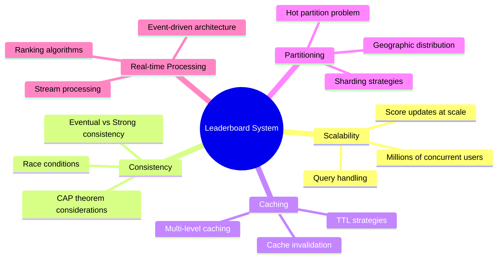
```mermaid
mindmap
  root((Leaderboard System))
    Scalability
      Millions of concurrent users
      Score updates at scale
      Query handling
    Consistency
      CAP theorem considerations
      Eventual vs Strong consistency
      Race conditions
    Caching
      Multi-level caching
      TTL strategies
      Cache invalidation
    Partitioning
      Sharding strategies
      Hot partition problem
      Geographic distribution
    Real-time Processing
      Stream processing
      Event-driven architecture
      Ranking algorithms
```

**Key Concepts:**
- **Scalability**: Handling millions of concurrent score updates and leaderboard queries
- **Consistency vs Availability trade-offs**: CAP theorem considerations for score updates
- **Caching strategies**: Multi-level caching for top-K results
- **Data partitioning**: Sharding strategies for user scores
- **Real-time processing**: Stream processing for score updates
- **Ranking algorithms**: Efficient top-K computation at scale
- **Hot partition problem**: Handling celebrity users with massive followers checking their ranks
- **Race conditions**: Concurrent score updates for the same user
- **Global vs Regional leaderboards**: Geographic distribution considerations

---

## Requirements

### Functional Requirements

| Feature | Description |
|---------|-------------|
| Score Updates | Users can submit score updates |
| Top-K Query | Users can query top-K players globally (e.g., top 100) |
| User Rank | Users can query their own rank |
| Multiple Timeframes | Support daily, weekly, monthly, all-time leaderboards |
| Regional Leaderboards | Support country/region-specific leaderboards |
| Score Increments | Handle score increments (not just replacements) |
| Pagination | Support paginated leaderboard results |
| Historical Data | Historical leaderboard snapshots |

### Non-Functional Requirements

| Requirement | Target |
|-------------|--------|
| **Availability** | 99.99% uptime |
| **Read Latency** | P99 < 100ms |
| **Write Latency** | P99 < 200ms |
| **Consistency** | Eventual consistency for leaderboards, strong consistency for user scores |
| **Scalability** | 100M+ active users, 10K+ score updates/sec |
| **Real-time Updates** | Leaderboard reflects changes within seconds |
| **Fault Tolerance** | No data loss on failures |
| **Cost Efficiency** | Efficient resource utilization |

---

## Capacity Estimation

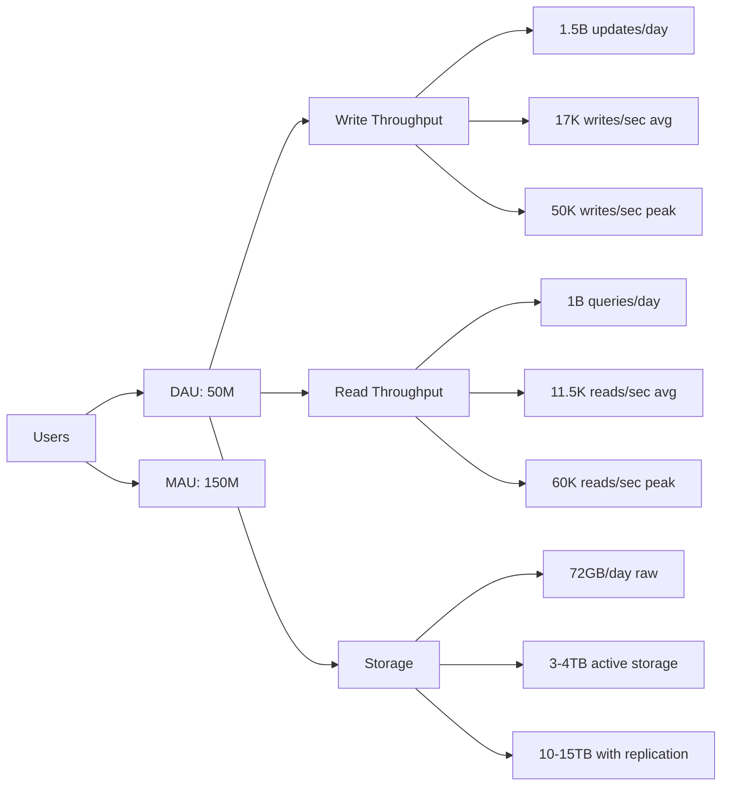
```mermaid
graph LR
    A[Users] --> B[DAU: 50M]
    A --> C[MAU: 150M]

    B --> D[Write Throughput]
    D --> E[1.5B updates/day]
    D --> F[17K writes/sec avg]
    D --> G[50K writes/sec peak]

    B --> H[Read Throughput]
    H --> I[1B queries/day]
    H --> J[11.5K reads/sec avg]
    H --> K[60K reads/sec peak]

    B --> L[Storage]
    L --> M[72GB/day raw]
    L --> N[3-4TB active storage]
    L --> O[10-15TB with replication]
```

### Daily Active Users (DAU)
**50 million** daily active users who actively participate in gaming or competitive activities. This represents a highly engaged user base similar to popular mobile games.

### Monthly Active Users (MAU)
**150 million** users engage with the platform at least once per month, giving us a **DAU/MAU ratio of 33%**, which is healthy for a gaming platform.

### Write Throughput (Score Updates)

Each active user submits score updates throughout their session. Assuming:
- **3 gaming sessions per day** per user
- **10 score updates per session**
- Total: `50M users × 30 updates = 1.5 billion updates/day`

With peak traffic patterns (5x average during 4-hour peak):
- **Average**: ~17,000 writes/second
- **Peak**: ~50,000 writes/second

### Read Throughput (Leaderboard Queries)

Users query leaderboards more frequently than updating scores:
- **20 leaderboard checks per day** per user
- Total: `50M users × 20 queries = 1 billion queries/day`

Traffic distribution:
- **Average**: ~11,500 reads/second
- **Peak**: ~60,000 reads/second

### Storage Estimation

**Per score entry**:
- UserID (8 bytes) + Score (8 bytes) + Timestamp (8 bytes) + LeaderboardID (8 bytes) + Metadata (16 bytes) = **48 bytes**

**Storage breakdown**:
- Daily leaderboard: `1.5B entries × 48 bytes = 72 GB/day`
- Weekly rollup: ~500 GB (aggregated)
- Monthly rollup: ~2 TB (aggregated)
- All-time: `150M users × 10 leaderboards × 48 bytes = 72 GB`

**Total**:
- **3-4 TB** active storage (with compression)
- **10-15 TB** with replication and historical archives
- **100 GB** cache storage for hot data (top-K results)

---

## Technology Choices

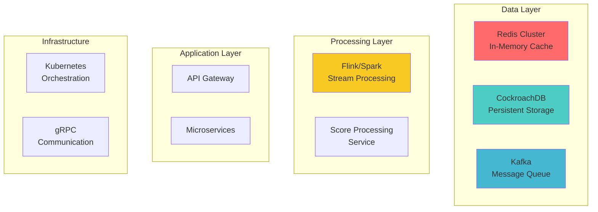
```mermaid
graph TB
    subgraph "Data Layer"
        A[Redis Cluster<br/>In-Memory Cache]
        B[CockroachDB<br/>Persistent Storage]
        C[Kafka<br/>Message Queue]
    end

    subgraph "Processing Layer"
        D[Flink/Spark<br/>Stream Processing]
        E[Score Processing<br/>Service]
    end

    subgraph "Application Layer"
        F[API Gateway]
        G[Microservices]
    end

    subgraph "Infrastructure"
        H[Kubernetes<br/>Orchestration]
        I[gRPC<br/>Communication]
    end

    style A fill:#ff6b6b
    style B fill:#4ecdc4
    style C fill:#45b7d1
    style D fill:#f9ca24
```

### Key Technologies & Justification

| Technology | Purpose | Justification |
|-----------|---------|---------------|
| **Redis Sorted Sets** | In-memory leaderboard storage | O(log N) updates, O(log N + K) top-K retrieval, sub-millisecond latency |
| **Apache Kafka** | Message queue | High throughput (millions msg/sec), durability, replay capability |
| **CockroachDB** | Persistent storage | Horizontal scalability, strong consistency, PostgreSQL compatibility |
| **Apache Flink** | Stream processing | Real-time aggregation, exactly-once semantics, low latency |
| **Redis/Memcached** | Multi-layer caching | Structured data (Redis), simple key-value (Memcached) |
| **Kubernetes** | Container orchestration | Auto-scaling, elastic scaling for gaming traffic patterns |
| **gRPC** | Inter-service communication | Low latency, efficient serialization vs REST |

---

## Database Selection

### Primary Database: CockroachDB (Distributed SQL)

**Justification**:
- PostgreSQL compatibility with horizontal scalability
- Strong consistency guarantees
- Automatic sharding and replication across regions
- SQL interface for complex analytics
- No single point of failure

### Cache Layer: Redis Cluster

**Justification**:
- Sorted Sets purpose-built for leaderboards
- Commands: ZADD, ZINCRBY, ZRANGE, ZREVRANK
- Automatic sharding and high availability
- Persistence (AOF + RDB) for recovery

### Message Queue: Apache Kafka

**Justification**:
- Distributed log architecture for durability
- High throughput for millions of updates
- Topic partitioning for parallel processing
- Consumer groups for scalable workers

---

## Data Modeling

### Database Schema

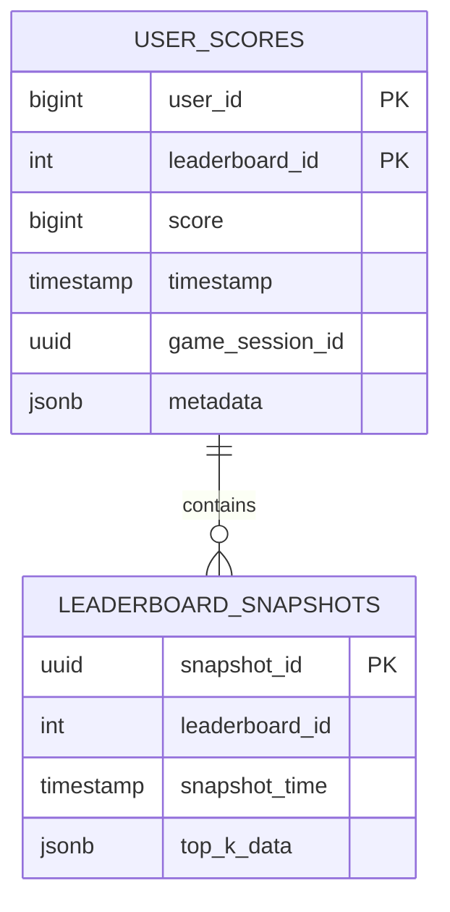
```mermaid
erDiagram
    USER_SCORES ||--o{ LEADERBOARD_SNAPSHOTS : contains

    USER_SCORES {
        bigint user_id PK
        int leaderboard_id PK
        bigint score
        timestamp timestamp
        uuid game_session_id
        jsonb metadata
    }

    LEADERBOARD_SNAPSHOTS {
        uuid snapshot_id PK
        int leaderboard_id
        timestamp snapshot_time
        jsonb top_k_data
    }
```

#### User Scores Table (CockroachDB)

```sql
CREATE TABLE user_scores (
    user_id BIGINT,
    leaderboard_id INT,
    score BIGINT,
    timestamp TIMESTAMP,
    game_session_id UUID,
    metadata JSONB,
    PRIMARY KEY (leaderboard_id, user_id),
    INDEX idx_score_timestamp (leaderboard_id, score DESC, timestamp DESC)
);
```

**Sharding Strategy**:
- Hash-based sharding by `leaderboard_id`
- Each leaderboard becomes a separate partition
- Sub-partitioned by `user_id` ranges for parallel processing
- Prevents hot partitions (queries scoped to specific leaderboard)

#### Leaderboard Snapshots Table

```sql
CREATE TABLE leaderboard_snapshots (
    snapshot_id UUID PRIMARY KEY,
    leaderboard_id INT,
    snapshot_time TIMESTAMP,
    top_k_data JSONB,
    INDEX idx_leaderboard_time (leaderboard_id, snapshot_time DESC)
);
```

**Purpose**: Periodic snapshots (hourly/daily) for historical queries and quick recovery

### Redis Data Model

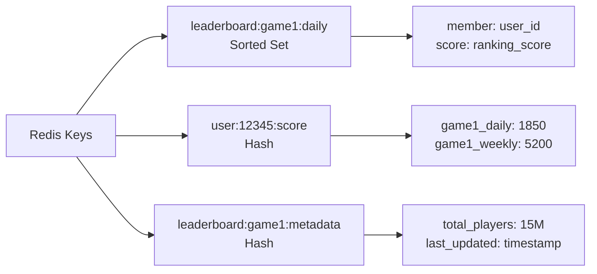
```mermaid
graph LR
    A[Redis Keys] --> B[leaderboard:game1:daily<br/>Sorted Set]
    A --> C[user:12345:score<br/>Hash]
    A --> D[leaderboard:game1:metadata<br/>Hash]

    B --> E[member: user_id<br/>score: ranking_score]
    C --> F[game1_daily: 1850<br/>game1_weekly: 5200]
    D --> G[total_players: 15M<br/>last_updated: timestamp]
```

**Key Patterns**:
- `leaderboard:{leaderboard_id}:{timeframe}` - Sorted Set
  - Example: `leaderboard:game1:daily`
  - Score = ranking score, Member = user_id

- `user:{user_id}:score` - Hash
  - Stores current scores across all leaderboards

- `leaderboard:{id}:metadata` - Hash
  - Configuration and statistics

**Operations & Complexity**:
- `ZADD`: O(log N) - Add/update score
- `ZREVRANGE`: O(log N + K) - Get top-K
- `ZREVRANK`: O(log N) - Get user rank
- `ZSCORE`: O(1) - Get user score

**Sharding Strategy**:
- Consistent hashing based on `leaderboard_id`
- All operations for a leaderboard hit same shard (atomicity)

---

## Service Decomposition

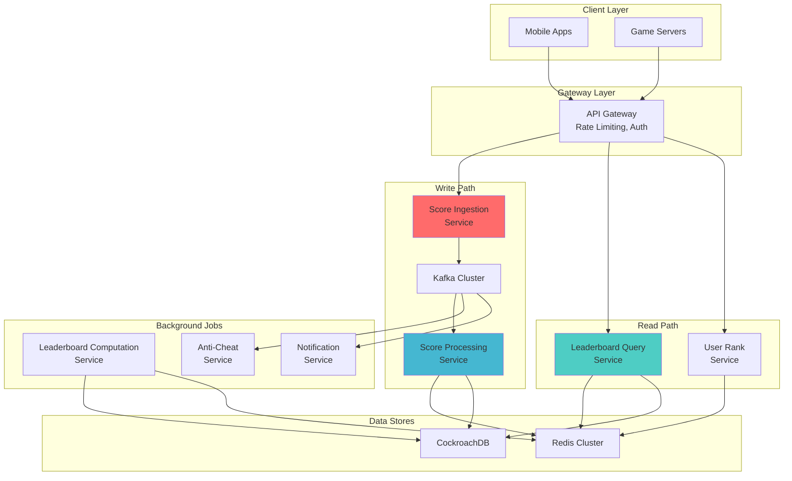
```mermaid
graph TB
    subgraph "Client Layer"
        A[Mobile Apps]
        B[Game Servers]
    end

    subgraph "Gateway Layer"
        C[API Gateway<br/>Rate Limiting, Auth]
    end

    subgraph "Write Path"
        D[Score Ingestion<br/>Service]
        E[Kafka Cluster]
        F[Score Processing<br/>Service]
    end

    subgraph "Read Path"
        G[Leaderboard Query<br/>Service]
        H[User Rank<br/>Service]
    end

    subgraph "Background Jobs"
        I[Leaderboard Computation<br/>Service]
        J[Anti-Cheat<br/>Service]
        K[Notification<br/>Service]
    end

    subgraph "Data Stores"
        L[Redis Cluster]
        M[CockroachDB]
    end

    A --> C
    B --> C
    C --> D
    C --> G
    C --> H
    D --> E
    E --> F
    E --> J
    E --> K
    F --> L
    F --> M
    G --> L
    G --> M
    H --> L
    I --> M
    I --> L

    style D fill:#ff6b6b
    style G fill:#4ecdc4
    style F fill:#45b7d1
```

### Service Descriptions

| Service | Responsibility | Communication | Scaling |
|---------|---------------|---------------|---------|
| **Score Ingestion** | Receives score updates, validates requests, publishes to Kafka | REST/gRPC API → Kafka | Stateless, horizontal behind LB |
| **Score Processing** | Consumes Kafka, updates Redis, persists to CockroachDB | Kafka consumer → Redis + DB | Consumer group, partitioned by leaderboard_id |
| **Leaderboard Query** | Serves top-K queries with caching | REST/gRPC API → Redis (fallback: DB) | Stateless, horizontal, CDN integration |
| **User Rank** | Individual user rank queries with aggressive caching | gRPC API → Redis | Stateless with local in-memory cache |
| **Leaderboard Computation** | Periodic recalculation, time-window aggregations | CronJobs → DB → Redis | Flink for parallel processing |
| **Notification** | Push notifications for milestones | Kafka → Firebase/SNS | Event-driven |
| **Anti-Cheat** | ML-based fraud detection | Kafka → ML models → separate DB | Async processing |
| **API Gateway** | Rate limiting, auth, routing | Entry point for all clients | Multiple instances |

---

## API Design & Security

### 1. Submit Score Update

```http
POST /api/v1/scores
Authorization: Bearer <JWT_TOKEN>
Content-Type: application/json
```

**Request**:
```json
{
    "user_id": "12345",
    "leaderboard_id": "game1_daily",
    "score_delta": 150,
    "game_session_id": "uuid",
    "timestamp": "2026-10-05T10:30:00Z",
    "signature": "hmac_signature"
}
```

**Response**:
```json
{
    "success": true,
    "new_score": 1850,
    "rank": 47,
    "request_id": "uuid"
}
```

**Security**:
- JWT authentication
- HMAC signature verification
- Rate limiting: 100 req/min per user
- Idempotency key support

---

### 2. Get Top-K Leaderboard

```http
GET /api/v1/leaderboards/{leaderboard_id}/top?limit=100&offset=0
Authorization: Bearer <JWT_TOKEN>
```

**Response**:
```json
{
    "leaderboard_id": "game1_daily",
    "timestamp": "2026-10-05T10:35:00Z",
    "entries": [
        {
            "rank": 1,
            "user_id": "999",
            "username": "ProGamer",
            "score": 9850,
            "country": "US"
        },
        {
            "rank": 2,
            "user_id": "777",
            "username": "Champion",
            "score": 9720,
            "country": "UK"
        }
    ],
    "total_players": 15000000,
    "cache_ttl": 30
}
```

**Security**:
- JWT authentication
- Rate limiting: 1000 req/min per user
- CDN caching: 30-second TTL
- Pagination max: 200

---

### 3. Get User Rank

```http
GET /api/v1/leaderboards/{leaderboard_id}/users/{user_id}/rank
Authorization: Bearer <JWT_TOKEN>
```

**Response**:
```json
{
    "user_id": "12345",
    "leaderboard_id": "game1_daily",
    "rank": 47,
    "score": 1850,
    "percentile": 99.7,
    "players_ahead": 46,
    "players_behind": 14999953
}
```

**Security**:
- JWT authentication
- Users can only query own rank (unless admin)
- Rate limiting: 500 req/min

---

### 4. Get Multiple Leaderboards (Batch)

```http
POST /api/v1/leaderboards/batch
Authorization: Bearer <JWT_TOKEN>
```

**Request**:
```json
{
    "leaderboard_ids": ["game1_daily", "game1_weekly", "game1_monthly"],
    "limit": 50
}
```

---

### Security Measures

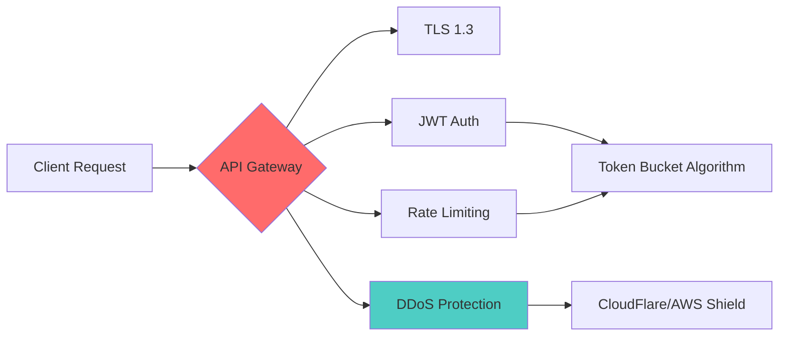
```mermaid
graph LR
    A[Client Request] --> B{API Gateway}
    B --> C[TLS 1.3]
    B --> D[JWT Auth]
    B --> E[Rate Limiting]
    B --> F[DDoS Protection]

    D --> G[Token Bucket Algorithm]
    E --> G

    F --> H[CloudFlare/AWS Shield]

    style B fill:#ff6b6b
    style F fill:#4ecdc4
```

**Comprehensive Security**:
- JWT-based authentication (15-minute expiration)
- API keys for game servers with IP whitelisting
- Rate limiting per user and per IP (Token Bucket algorithm)
- HMAC signature verification for score submissions
- TLS 1.3 for all communications
- DDoS protection via CloudFlare/AWS Shield
- Request validation and sanitization
- Audit logging for all score submissions

---

## High Level Architecture

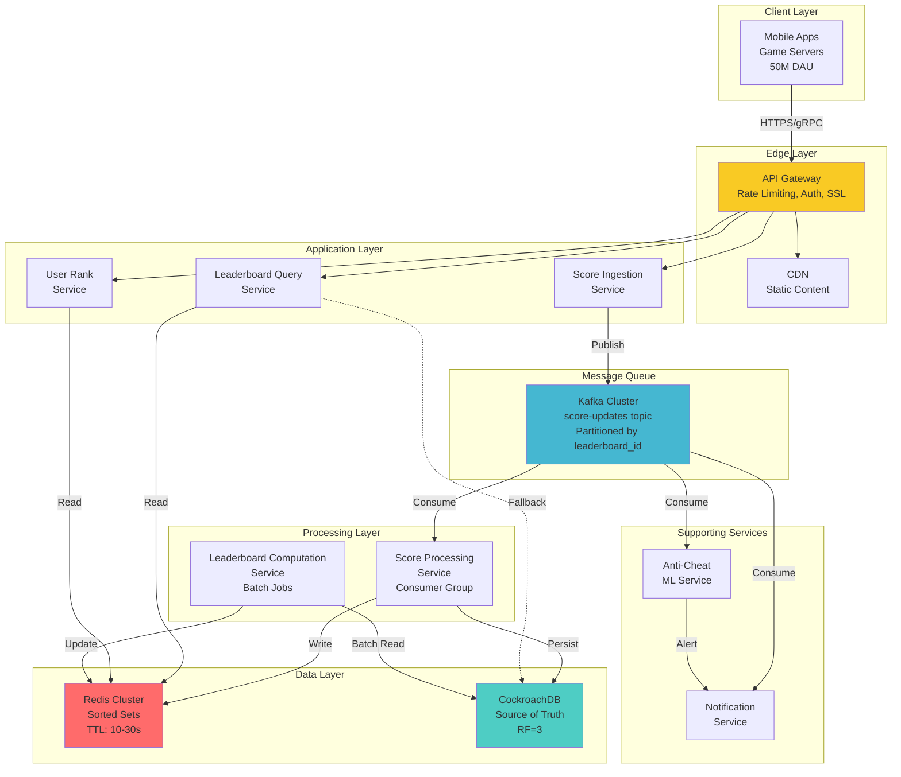
```mermaid
graph TB
    subgraph "Client Layer"
        A[Mobile Apps<br/>Game Servers<br/>50M DAU]
    end

    subgraph "Edge Layer"
        B[CDN<br/>Static Content]
        C[API Gateway<br/>Rate Limiting, Auth, SSL]
    end

    subgraph "Application Layer"
        D[Score Ingestion<br/>Service]
        E[Leaderboard Query<br/>Service]
        F[User Rank<br/>Service]
    end

    subgraph "Message Queue"
        G[Kafka Cluster<br/>score-updates topic<br/>Partitioned by leaderboard_id]
    end

    subgraph "Processing Layer"
        H[Score Processing<br/>Service<br/>Consumer Group]
        I[Leaderboard Computation<br/>Service<br/>Batch Jobs]
    end

    subgraph "Data Layer"
        J[Redis Cluster<br/>Sorted Sets<br/>TTL: 10-30s]
        K[CockroachDB<br/>Source of Truth<br/>RF=3]
    end

    subgraph "Supporting Services"
        L[Anti-Cheat<br/>ML Service]
        M[Notification<br/>Service]
    end

    A -->|HTTPS/gRPC| C
    C --> B
    C --> D
    C --> E
    C --> F

    D -->|Publish| G
    G -->|Consume| H
    G -->|Consume| L
    G -->|Consume| M

    H -->|Write| J
    H -->|Persist| K

    E -->|Read| J
    E -.->|Fallback| K
    F -->|Read| J

    I -->|Batch Read| K
    I -->|Update| J

    L -->|Alert| M

    style J fill:#ff6b6b
    style K fill:#4ecdc4
    style G fill:#45b7d1
    style C fill:#f9ca24
```

### Data Flow

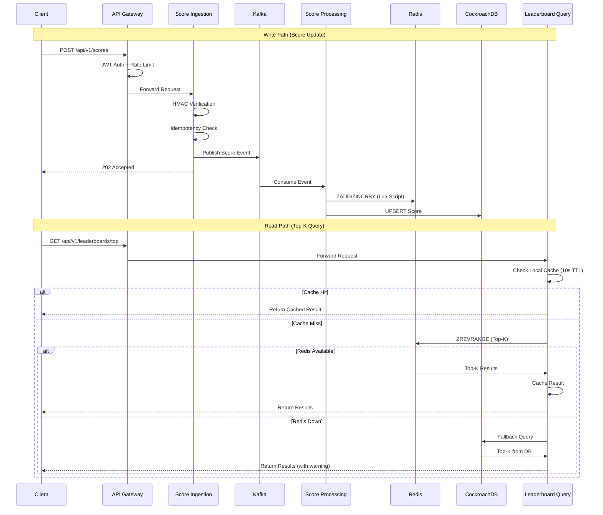
```mermaid
sequenceDiagram
    participant C as Client
    participant AG as API Gateway
    participant SI as Score Ingestion
    participant K as Kafka
    participant SP as Score Processing
    participant R as Redis
    participant DB as CockroachDB
    participant LQ as Leaderboard Query

    Note over C,LQ: Write Path (Score Update)
    C->>AG: POST /api/v1/scores
    AG->>AG: JWT Auth + Rate Limit
    AG->>SI: Forward Request
    SI->>SI: HMAC Verification
    SI->>SI: Idempotency Check
    SI->>K: Publish Score Event
    SI-->>C: 202 Accepted

    K->>SP: Consume Event
    SP->>R: ZADD/ZINCRBY (Lua Script)
    SP->>DB: UPSERT Score

    Note over C,LQ: Read Path (Top-K Query)
    C->>AG: GET /api/v1/leaderboards/top
    AG->>LQ: Forward Request
    LQ->>LQ: Check Local Cache (10s TTL)
    alt Cache Hit
        LQ-->>C: Return Cached Result
    else Cache Miss
        LQ->>R: ZREVRANGE (Top-K)
        alt Redis Available
            R-->>LQ: Top-K Results
            LQ->>LQ: Cache Result
            LQ-->>C: Return Results
        else Redis Down
            LQ->>DB: Fallback Query
            DB-->>LQ: Top-K from DB
            LQ-->>C: Return Results (with warning)
        end
    end
```

---

## Deep Dive On Design

### Score Update Flow (Write Path)

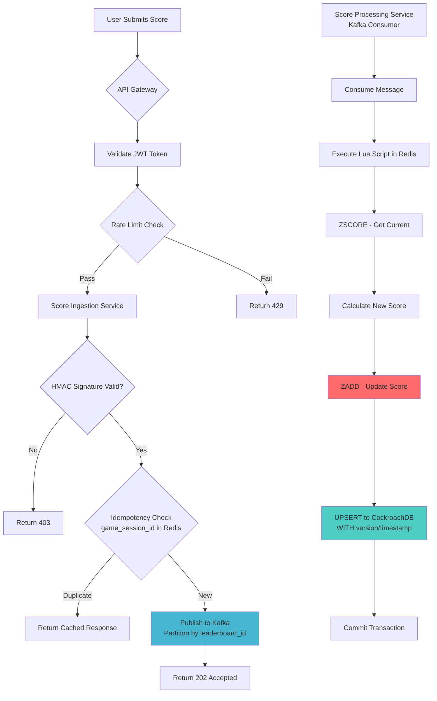
```mermaid
flowchart TD
    A[User Submits Score] --> B{API Gateway}
    B --> C[Validate JWT Token]
    C --> D{Rate Limit Check}
    D -->|Pass| E[Score Ingestion Service]
    D -->|Fail| F[Return 429]

    E --> G{HMAC Signature Valid?}
    G -->|No| H[Return 403]
    G -->|Yes| I{Idempotency Check<br/>game_session_id in Redis}

    I -->|Duplicate| J[Return Cached Response]
    I -->|New| K[Publish to Kafka<br/>Partition by leaderboard_id]
    K --> L[Return 202 Accepted]

    M[Score Processing Service<br/>Kafka Consumer] --> N[Consume Message]
    N --> O[Execute Lua Script in Redis]

    O --> P[ZSCORE - Get Current]
    P --> Q[Calculate New Score]
    Q --> R[ZADD - Update Score]

    R --> S[UPSERT to CockroachDB<br/>WITH version/timestamp]
    S --> T[Commit Transaction]

    style K fill:#45b7d1
    style R fill:#ff6b6b
    style S fill:#4ecdc4
```

#### Lua Script for Atomic Updates

```lua
-- Atomic score increment in Redis
local leaderboard_key = KEYS[1]
local user_id = ARGV[1]
local score_delta = ARGV[2]

-- Get current score (0 if not exists)
local current_score = redis.call('ZSCORE', leaderboard_key, user_id) or 0

-- Calculate new score
local new_score = current_score + score_delta

-- Update sorted set
redis.call('ZADD', leaderboard_key, new_score, user_id)

return new_score
```

**Key Design Decisions**:
1. **HMAC Signature**: Prevents score tampering using shared secret
2. **Idempotency Key**: Uses `game_session_id` with 24-hour TTL in Redis
3. **Kafka Partitioning**: By `leaderboard_id` ensures ordered processing per leaderboard
4. **Lua Script**: Ensures atomic read-modify-write in Redis
5. **Version Number**: In CockroachDB handles out-of-order Kafka replays

---

### Leaderboard Query Flow (Read Path)

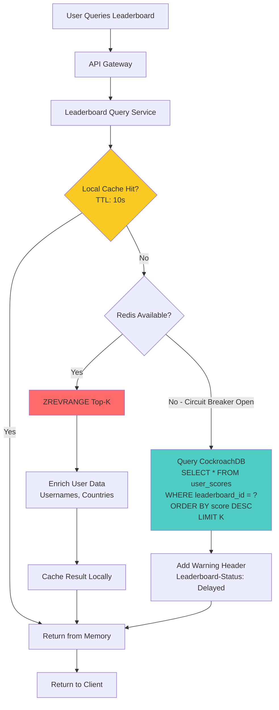
```mermaid
flowchart TD
    A[User Queries Leaderboard] --> B[API Gateway]
    B --> C[Leaderboard Query Service]

    C --> D{Local Cache Hit?<br/>TTL: 10s}
    D -->|Yes| E[Return from Memory]

    D -->|No| F{Redis Available?}
    F -->|Yes| G[ZREVRANGE Top-K]
    G --> H[Enrich User Data<br/>Usernames, Countries]
    H --> I[Cache Result Locally]
    I --> E

    F -->|No - Circuit Breaker Open| J[Query CockroachDB<br/>SELECT * FROM user_scores<br/>WHERE leaderboard_id = ?<br/>ORDER BY score DESC<br/>LIMIT K]

    J --> K[Add Warning Header<br/>Leaderboard-Status: Delayed]
    K --> E

    E --> L[Return to Client]

    style G fill:#ff6b6b
    style J fill:#4ecdc4
    style D fill:#f9ca24
```

**Caching Strategy**:
- **L1 Cache**: In-memory (10-second TTL) for extremely hot queries
- **L2 Cache**: Redis (30-second TTL)
- **L3 Cache**: CDN (60-second TTL) for public leaderboards
- **Fallback**: CockroachDB with indexed queries

**User Rank Query Optimization**:
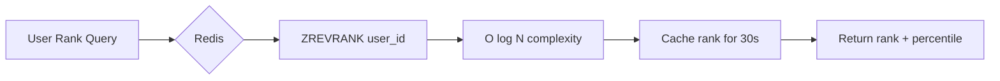
```mermaid
graph LR
    A[User Rank Query] --> B{Redis}
    B --> C[ZREVRANK user_id]
    C --> D[O log N complexity]
    D --> E[Cache rank for 30s]
    E --> F[Return rank + percentile]
```

---

### Handling Time Windows


```mermaid
gantt
    title Leaderboard Time Window Management
    dateFormat HH:mm
    axisFormat %H:%M

    section Daily
    Active Leaderboard       :active, 00:00, 23:59
    Midnight Reset          :crit, 00:00, 00:01
    Archive Previous Day    :crit, 00:01, 00:10

    section Weekly
    Aggregation Window      :00:00, 23:59
    Flink Processing        :12:00, 12:30

    section Monthly
    Continuous Aggregation  :00:00, 23:59
    End-of-Month Archive    :23:00, 23:59
```

**Daily Leaderboard Reset** (Midnight UTC):
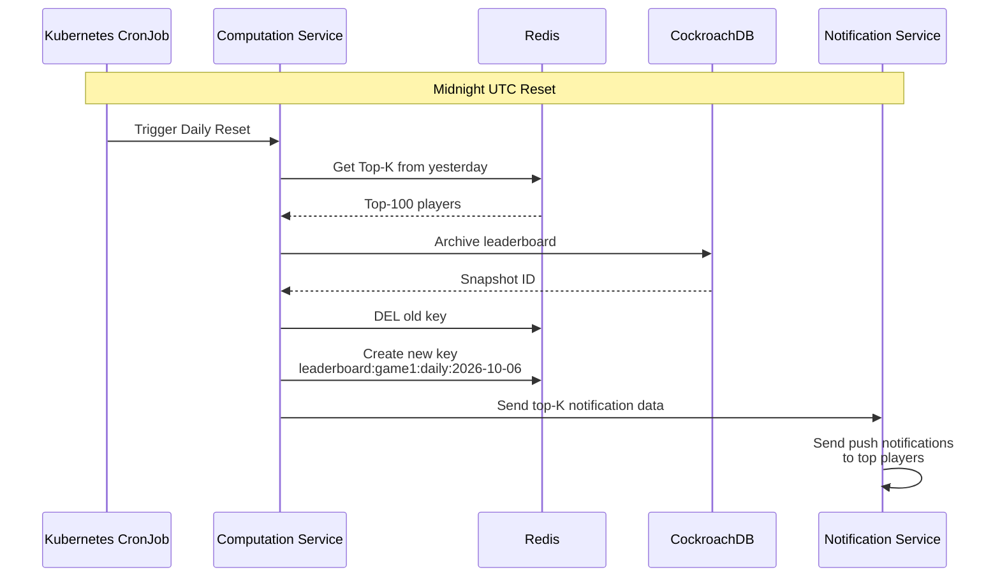
```mermaid
sequenceDiagram
    participant Cron as Kubernetes CronJob
    participant Comp as Computation Service
    participant Redis as Redis
    participant DB as CockroachDB
    participant Notif as Notification Service

    Note over Cron,Notif: Midnight UTC Reset
    Cron->>Comp: Trigger Daily Reset

    Comp->>Redis: Get Top-K from yesterday
    Redis-->>Comp: Top-100 players

    Comp->>DB: Archive leaderboard
    DB-->>Comp: Snapshot ID

    Comp->>Redis: DEL old key
    Comp->>Redis: Create new key<br/>leaderboard:game1:daily:2026-10-06

    Comp->>Notif: Send top-K notification data
    Notif->>Notif: Send push notifications<br/>to top players
```

**Weekly/Monthly Aggregation** (Apache Flink):
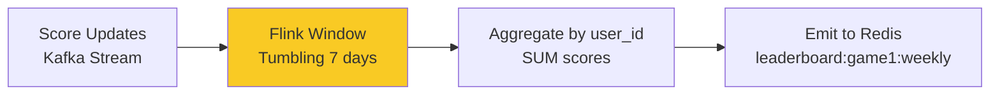
```mermaid
graph LR
    A[Score Updates<br/>Kafka Stream] --> B[Flink Window<br/>Tumbling 7 days]
    B --> C[Aggregate by user_id<br/>SUM scores]
    C --> D[Emit to Redis<br/>leaderboard:game1:weekly]

    style B fill:#f9ca24
```

---

### Consistency Model

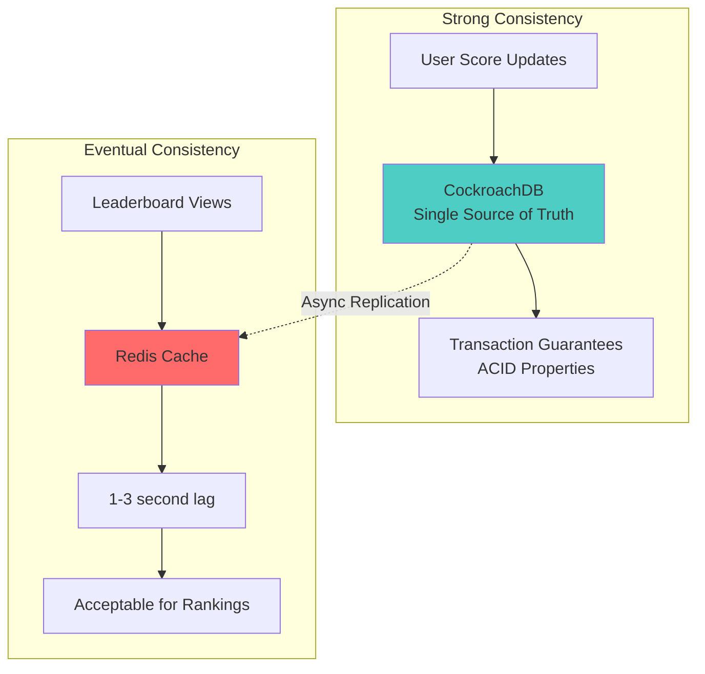
```mermaid
graph TB
    subgraph "Strong Consistency"
        A[User Score Updates] --> B[CockroachDB<br/>Single Source of Truth]
        B --> C[Transaction Guarantees<br/>ACID Properties]
    end

    subgraph "Eventual Consistency"
        D[Leaderboard Views] --> E[Redis Cache]
        E --> F[1-3 second lag]
        F --> G[Acceptable for Rankings]
    end

    B -.->|Async Replication| E

    style B fill:#4ecdc4
    style E fill:#ff6b6b
```

**Hybrid Model**:
- **Strong Consistency**: Individual user scores in CockroachDB
- **Eventual Consistency**: Global leaderboard views (1-3 second convergence)
- **Rationale**: Users accept slight ranking delays for better availability and latency

---

### Handling Hot Partitions

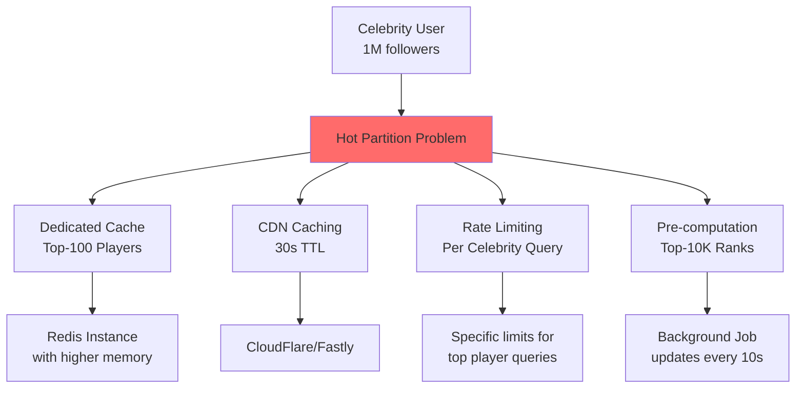
```mermaid
graph TB
    A[Celebrity User<br/>1M followers] --> B[Hot Partition Problem]

    B --> C[Dedicated Cache<br/>Top-100 Players]
    B --> D[CDN Caching<br/>30s TTL]
    B --> E[Rate Limiting<br/>Per Celebrity Query]
    B --> F[Pre-computation<br/>Top-10K Ranks]

    C --> G[Redis Instance<br/>with higher memory]
    D --> H[CloudFlare/Fastly]
    E --> I[Specific limits for<br/>top player queries]
    F --> J[Background Job<br/>updates every 10s]

    style B fill:#ff6b6b
```

---

## Reliability and Monitoring

### Monitoring Architecture

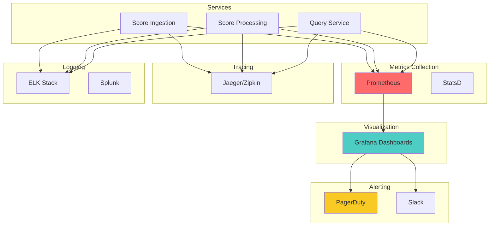
```mermaid
graph TB
    subgraph "Services"
        A[Score Ingestion]
        B[Score Processing]
        C[Query Service]
    end

    subgraph "Metrics Collection"
        D[Prometheus]
        E[StatsD]
    end

    subgraph "Visualization"
        F[Grafana Dashboards]
    end

    subgraph "Tracing"
        G[Jaeger/Zipkin]
    end

    subgraph "Logging"
        H[ELK Stack]
        I[Splunk]
    end

    subgraph "Alerting"
        J[PagerDuty]
        K[Slack]
    end

    A --> D
    B --> D
    C --> D
    A --> G
    B --> G
    C --> G
    A --> H
    B --> H
    C --> H

    D --> F
    F --> J
    F --> K

    style D fill:#ff6b6b
    style F fill:#4ecdc4
    style J fill:#f9ca24
```

### Key Metrics

| Category | Metric | Threshold | Action |
|----------|--------|-----------|--------|
| **Latency** | Write P99 | > 500ms | Alert + Scale |
| | Read P99 | > 200ms | Alert + Cache investigation |
| **Throughput** | Writes/sec | < 5K (expected 17K) | Alert |
| | Reads/sec | < 5K (expected 11.5K) | Alert |
| **Kafka** | Consumer Lag | > 10,000 msgs | Scale consumers |
| **Redis** | Hit Rate | < 90% | Investigate cache strategy |
| | Memory Usage | > 80% | Scale up/out |
| **Database** | Connection Pool | > 90% | Scale connections |
| | Query Latency | > 1s | Investigate slow queries |
| **Errors** | 5xx Rate | > 0.1% | Immediate page |

### Distributed Tracing

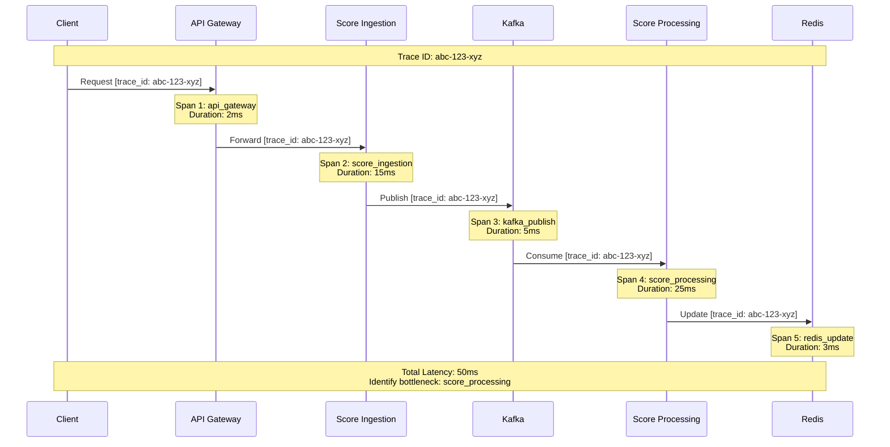
```mermaid
sequenceDiagram
    participant C as Client
    participant AG as API Gateway
    participant SI as Score Ingestion
    participant K as Kafka
    participant SP as Score Processing
    participant R as Redis

    Note over C,R: Trace ID: abc-123-xyz

    C->>AG: Request [trace_id: abc-123-xyz]
    Note over AG: Span 1: api_gateway<br/>Duration: 2ms

    AG->>SI: Forward [trace_id: abc-123-xyz]
    Note over SI: Span 2: score_ingestion<br/>Duration: 15ms

    SI->>K: Publish [trace_id: abc-123-xyz]
    Note over K: Span 3: kafka_publish<br/>Duration: 5ms

    K->>SP: Consume [trace_id: abc-123-xyz]
    Note over SP: Span 4: score_processing<br/>Duration: 25ms

    SP->>R: Update [trace_id: abc-123-xyz]
    Note over R: Span 5: redis_update<br/>Duration: 3ms

    Note over C,R: Total Latency: 50ms<br/>Identify bottleneck: score_processing
```

### Reliability Mechanisms

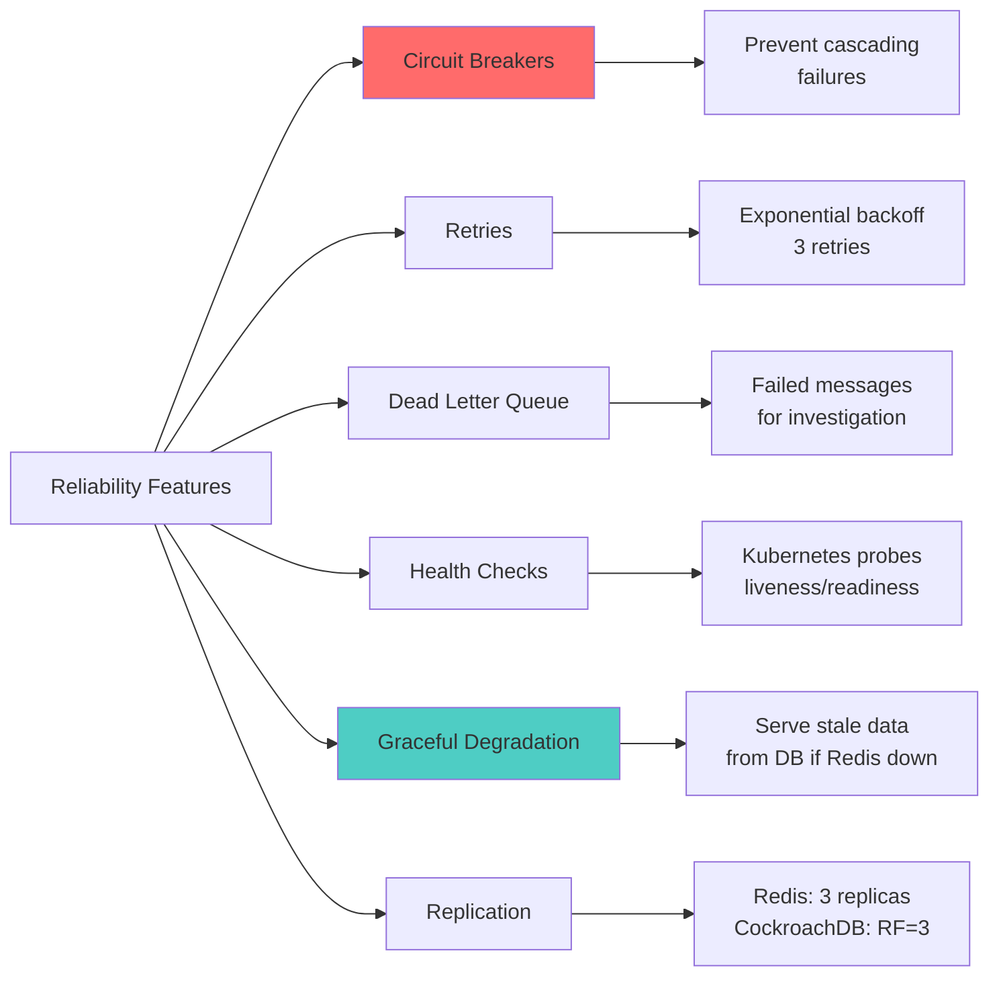
```mermaid
graph LR
    A[Reliability Features] --> B[Circuit Breakers]
    A --> C[Retries]
    A --> D[Dead Letter Queue]
    A --> E[Health Checks]
    A --> F[Graceful Degradation]
    A --> G[Replication]

    B --> H[Prevent cascading<br/>failures]
    C --> I[Exponential backoff<br/>3 retries]
    D --> J[Failed messages<br/>for investigation]
    E --> K[Kubernetes probes<br/>liveness/readiness]
    F --> L[Serve stale data<br/>from DB if Redis down]
    G --> M[Redis: 3 replicas<br/>CockroachDB: RF=3]

    style B fill:#ff6b6b
    style F fill:#4ecdc4
```

### Chaos Engineering

Regular chaos tests:
- Kill random service instances
- Introduce network latency/partitions
- Simulate Redis failure
- Test Kafka consumer lag under load

---

## Bottlenecks and Failure Points

```mermaid
mindmap
  root((Bottlenecks))
    Redis Capacity
      100M+ users in one leaderboard
      Memory overflow OOM
      Mitigation: Top-K approximation algorithms
    Kafka Consumer Lag
      10x traffic spikes
      Stale leaderboards
      Mitigation: Auto-scaling consumers
    Hot Key Problem
      Global leaderboard traffic
      Single shard overload
      Mitigation: Read replicas CDN caching
    Write Contention
      High-frequency user updates
      CockroachDB retries
      Mitigation: Batch writes UPSERT
    Service Failures
      Score Processing down
      Kafka backlog
      Mitigation: Multi-AZ deployment
    Clock Skew
      Out-of-order processing
      Time-bounded leaderboards
      Mitigation: NTP sync Kafka timestamps
```

### 1. Redis Capacity Bottleneck

**Problem**: Leaderboard with 100M+ users exceeds memory capacity (16 bytes/user = 1.6GB minimum)

**Mitigation**:
```mermaid
graph LR
    A[Large Leaderboard] --> B{Size Check}
    B -->|< 1M users| C[Store All in Redis]
    B -->|> 1M users| D[Top-K Approximation]

    D --> E[Count-Min Sketch<br/>Space-Saving Algorithm]
    E --> F[Store Top-1M in Redis]
    F --> G[Compute Lower Ranks<br/>from CockroachDB]
```

### 2. Kafka Consumer Lag

**Problem**: Traffic spike (10x) → consumers can't keep up → increasing lag

**Mitigation**:
```mermaid
graph TB
    A[Monitor Consumer Lag] --> B{Lag > 10K?}
    B -->|Yes| C[Auto-scale Consumer Group]
    C --> D[Add More Instances<br/>up to partition count]

    E[Kafka Partitions] --> F[100 partitions]
    F --> G[Support up to 100<br/>parallel consumers]

    B -->|No| H[Normal Operation]

    I[Pre-scale Before Events] --> J[Predict traffic patterns]
    J --> K[Scale up 30 min before]
```

### 3. Hot Key Problem in Redis

**Problem**: Global daily leaderboard → all traffic to one shard

**Mitigation Strategies**:

```mermaid
graph TB
    A[Hot Key Detection] --> B[Read Replicas]
    A --> C[Client-side Caching]
    A --> D[CDN Layer]
    A --> E[Split Leaderboard]

    B --> F[3-5 Redis read replicas<br/>for hot leaderboard]
    C --> G[10-30s TTL<br/>in application memory]
    D --> H[CloudFlare cache<br/>60s TTL]
    E --> I[Regional sub-leaderboards<br/>merge top-K results]
```

### 4. CockroachDB Write Contention

**Problem**: High-frequency updates to same user → transaction retries

**Mitigation**:
```mermaid
sequenceDiagram
    participant SP as Score Processing
    participant Buffer as Write Buffer
    participant DB as CockroachDB

    Note over SP,DB: Batching Strategy

    SP->>Buffer: Update 1 (user_123)
    SP->>Buffer: Update 2 (user_456)
    SP->>Buffer: Update 3 (user_123)

    Note over Buffer: Wait 1-2 seconds<br/>Aggregate updates

    Buffer->>Buffer: Merge user_123 updates
    Buffer->>DB: Batch UPSERT<br/>VALUES (123, final_score),<br/>(456, score)

    DB-->>Buffer: Success (1 transaction)
```

### 5. Network Partition

**Problem**: Partition between Score Processing and Redis

**Recovery Strategy**:
```mermaid
flowchart TD
    A[Network Partition Detected] --> B[Circuit Breaker Opens]
    B --> C[Queue Writes to Buffer]
    C --> D[Continue DB Writes]

    E[Partition Resolved] --> F[Circuit Breaker Closes]
    F --> G[Retry Buffered Updates]
    G --> H[Exponential Backoff]

    I[Reconciliation Job] --> J[Compare Redis vs DB]
    J --> K[Identify Missing Updates]
    K --> L[Backfill Redis]

    style B fill:#ff6b6b
    style F fill:#4ecdc4
```

### 6. Redis Complete Failure - Recovery Process

```mermaid
flowchart TB
    A[Redis Cluster Down] --> B[Circuit Breaker Triggers]
    B --> C[Route Queries to CockroachDB]
    C --> D[Return Data with Warning]

    E[Alert On-Call Engineers] --> F{Recovery Method}

    F -->|Option 1| G[Restore from RDB Snapshot]
    F -->|Option 2| H[Rebuild from CockroachDB]

    G --> I[Load Last Snapshot]
    I --> J[Replay Kafka from Snapshot Offset]

    H --> K[Reconstruction Job]
    K --> L[Read All Leaderboards from DB]
    L --> M[Batch ZADD to Redis<br/>10K users at a time]

    J --> N[80% Data Populated]
    M --> N

    N --> O[Reopen Circuit Breaker]
    O --> P[Resume Normal Operation]

    style A fill:#ff6b6b
    style P fill:#4ecdc4
```

**Recovery Time**: 10-30 minutes depending on data size

---

## AI Integration

```mermaid
mindmap
  root((AI in Leaderboards))
    Cheat Detection
      Anomaly detection
      Pattern analysis
      Collusion detection
    Personalization
      Player clustering
      Skill-based matching
      Custom leaderboards
    Predictions
      Rank forecasting
      Achievement timing
      Engagement optimization
    System Health
      Anomaly detection
      Predictive maintenance
      Capacity planning
```

### 1. Cheat Detection and Fraud Prevention

```mermaid
graph TB
    A[Score Submission] --> B[Feature Extraction]
    B --> C[Score Velocity]
    B --> D[Device Fingerprint]
    B --> E[Time Patterns]
    B --> F[Historical Performance]

    C --> G[ML Model Pipeline]
    D --> G
    E --> G
    F --> G

    G --> H[Isolation Forest<br/>Anomaly Detection]
    G --> I[XGBoost Classifier<br/>Cheat vs Legit]
    G --> J[Graph Neural Network<br/>Collusion Detection]

    H --> K{Suspicious?}
    I --> K
    J --> K

    K -->|Yes| L[Flag for Review]
    K -->|High Confidence| M[Auto-ban]
    K -->|No| N[Accept Score]

    L --> O[Human Review Queue]

    style L fill:#ff6b6b
    style N fill:#4ecdc4
```

**Features for ML Model**:
- Score velocity (points per time)
- Consistency with historical performance
- Device fingerprinting and IP patterns
- Time-of-day patterns
- Correlation with other users (collusion)
- Session duration vs score ratio

**Models**:
- **Isolation Forest**: Unsupervised anomaly detection
- **XGBoost**: Supervised classification (legit vs cheat)
- **Graph Neural Networks**: Detect collusion rings

---

### 2. Personalized Leaderboard Recommendations

```mermaid
graph LR
    A[User Behavior Data] --> B[Embedding Layer]
    B --> C[User Vectors<br/>play time, skill, modes]

    C --> D[Clustering Algorithm]
    D --> E[K-means / DBSCAN]

    E --> F[User Clusters]
    F --> G[Skill-based Groups]
    F --> H[Play-style Groups]

    G --> I[Show Players Like You<br/>Leaderboard]
    H --> I

    style I fill:#4ecdc4
```

**Benefits**:
- More relatable competition
- Increased engagement
- Better user experience

**Models**: K-means, DBSCAN, Matrix Factorization

---

### 3. Rank Prediction and Forecasting

```mermaid
graph TB
    A[User Score History] --> B[Time Series Analysis]
    B --> C[Score Velocity<br/>Trend Detection]

    C --> D[Forecasting Model]
    D --> E[ARIMA / Prophet]
    D --> F[LSTM Neural Network]

    E --> G[Predicted Rank in 7 Days]
    F --> G

    G --> H[User Notification:<br/>At your pace, reach<br/>Top 100 in 3 days!]

    style H fill:#f9ca24
```

**Use Cases**:
- Motivational predictions
- Achievement forecasting
- Engagement optimization

**Models**: ARIMA, Prophet, LSTM

---

### 4. Dynamic Difficulty and Score Balancing

```mermaid
graph LR
    A[Score Submissions<br/>by Level] --> B[Statistical Analysis]
    B --> C{Anomaly Detected?}

    C -->|Yes| D[Score Inflation<br/>in Level 7]
    C -->|No| E[Normal Distribution]

    D --> F[ML Model Recommends<br/>Adjust Multiplier]
    F --> G[0.8x multiplier for Level 7]

    G --> H[Apply Dynamic Balancing]

    style D fill:#ff6b6b
    style H fill:#4ecdc4
```

---

### 5. Intelligent Caching and Pre-fetching

```mermaid
sequenceDiagram
    participant U as User
    participant ML as ML Predictor
    participant Cache as Cache Warmer
    participant Redis as Redis

    U->>ML: User 123 checks daily leaderboard
    ML->>ML: Analyze: 80% of time<br/>user checks weekly next
    ML->>Cache: Pre-fetch weekly leaderboard
    Cache->>Redis: ZREVRANGE weekly (background)
    Redis-->>Cache: Weekly data loaded

    U->>Redis: Request weekly leaderboard
    Redis-->>U: Instant response (cached)
```

**Models**: Sequential pattern mining, RNNs

---

### 6. Content Moderation for Usernames

```mermaid
graph LR
    A[New Username Submission] --> B[BERT Model]
    B --> C[Toxic Content Detection]

    C --> D{Toxic?}
    D -->|Yes| E[Reject / Filter]
    D -->|No| F[Display on Leaderboard]

    style E fill:#ff6b6b
    style F fill:#4ecdc4
```

---

### 7. Engagement Optimization

```mermaid
graph TB
    A[User Behavior Patterns] --> B[Reinforcement Learning Agent]
    B --> C[Multi-Armed Bandit]
    B --> D[Deep Q-Learning]

    C --> E[Optimal Notification Time]
    D --> F[Optimal Leaderboard Check Reminder]

    E --> G[Send Notification:<br/>You're 5 points from<br/>moving up!]

    style G fill:#f9ca24
```

---

### 8. Anomaly Detection for System Health

```mermaid
graph TB
    A[System Metrics Stream] --> B[Latency Time Series]
    A --> C[Throughput Time Series]
    A --> D[Error Rate Time Series]

    B --> E[Autoencoder Model]
    C --> E
    D --> E

    E --> F[Normal Pattern Learned]

    G[Real-time Metrics] --> E
    E --> H{Anomaly?}

    H -->|Yes| I[Predict Outage in 15 min<br/>Alert Engineers]
    H -->|No| J[System Healthy]

    style I fill:#ff6b6b
    style J fill:#4ecdc4
```

**Models**: Autoencoders for multivariate time-series anomaly detection

---

## Follow-up Questions

### 1. How do you handle score updates for users in different time zones for daily leaderboards?

**Answer**: Daily leaderboards reset at **midnight UTC** consistently across all regions to ensure fairness. We don't use local time zones because that would create unfair advantages (users could "time travel" by changing regions).

```mermaid
graph TB
    A[Global Users] --> B[Midnight UTC Reset]
    B --> C[Fair for All Regions]

    D[Regional Leaderboards] --> E[Parallel to Global]
    E --> F[North America Daily<br/>Europe Daily<br/>Asia Daily]

    F --> G[User Sees Both:<br/>Global Rank + Regional Rank]

    style B fill:#4ecdc4
```

**Additional Features**:
- Regional leaderboards (e.g., "North America Daily") operate in parallel
- Separate Redis sorted sets per region
- Partitioned by `leaderboard_id` encoding region
- Users see both global and regional ranks in UI

---

### 2. How do you prevent cheating and score manipulation?

**Multi-layered Security Approach**:

```mermaid
graph TB
    A[Score Submission] --> B[Layer 1: HMAC Signature]
    B --> C[Layer 2: Server-side Validation]
    C --> D[Layer 3: ML Anomaly Detection]
    D --> E[Layer 4: Rate Limiting]
    E --> F[Layer 5: Trusted Server Model]
    F --> G[Layer 6: Audit Logs]
    G --> H[Layer 7: User Reporting]
    H --> I[Layer 8: Shadow Banning]

    style B fill:#ff6b6b
    style D fill:#f9ca24
    style I fill:#45b7d1
```

1. **HMAC Signatures**: All submissions signed with shared secret
2. **Server-side Validation**: Backend validates score deltas against game mechanics
3. **ML-based Anomaly Detection**: Pattern analysis for suspicious behavior
4. **Rate Limiting**: Prevents submission spam
5. **Trusted Server Model**: Game logic runs server-side for competitive modes
6. **Periodic Audits**: Compare scores against game session logs
7. **User Reporting**: Community flagging of suspicious players
8. **Shadow Banning**: Cheaters see their scores but removed from public leaderboards

---

### 3. How would you scale this system to support 1 billion daily active users?

**Scaling Strategy** (20x increase from 50M to 1B DAU):

```mermaid
graph TB
    A[1B DAU Challenge] --> B[Horizontal Sharding]
    A --> C[Approximate Algorithms]
    A --> D[Regional Deployments]
    A --> E[Aggressive Caching]

    B --> F[Split by Geography<br/>Split by User ID Ranges]
    C --> G[Count-Min Sketch<br/>Space-Saving Algorithm]
    D --> H[Local Leaderboards<br/>Aggregate Top-Ks]
    E --> I[CDN 60-120s TTL<br/>Read Replicas]

    F --> J[Merge Top-K Results]
    G --> J
    H --> J

    style A fill:#ff6b6b
    style J fill:#4ecdc4
```

**Specific Strategies**:
1. **Horizontal Sharding**: Split leaderboards geographically or by user ID ranges, merge top-K
2. **Approximate Algorithms**: Space-Saving, Count-Min Sketch for memory efficiency
3. **Regional Deployments**: Local leaderboards, global computed by aggregating regional top-Ks
4. **Aggressive Caching**: CDN layer with 60-120 second TTLs
5. **Read Replicas**: Redis and CockroachDB replicas
6. **Kafka Scaling**: 100 → 1000+ partitions, 1000+ parallel consumers
7. **Cost Optimization**: Store only top-10M users in hot cache, compute lower ranks on-demand

---

### 4. What happens if Redis completely fails? How do you recover?

**Failure Response and Recovery**:

```mermaid
sequenceDiagram
    participant R as Redis Cluster
    participant CB as Circuit Breaker
    participant LQ as Query Service
    participant DB as CockroachDB
    participant Alert as Alerting
    participant Eng as Engineers

    Note over R: Redis Fails
    R->>CB: Health Check Fails
    CB->>CB: Open Circuit
    CB->>LQ: Route to Fallback
    LQ->>DB: Query CockroachDB<br/>(indexed query)
    DB-->>LQ: Top-K results (slower)
    LQ-->>LQ: Add Warning Header

    CB->>Alert: Trigger Alert
    Alert->>Eng: Page On-Call

    Eng->>R: Provision New Cluster
    Eng->>R: Restore from RDB Snapshot

    Note over Eng: Reconstruction Job
    Eng->>DB: Read Source of Truth
    DB-->>Eng: All Leaderboard Data
    Eng->>R: Batch ZADD<br/>10K users at a time

    Note over R: 80% Populated
    Eng->>CB: Reopen Circuit
    CB->>LQ: Resume Redis Queries

    Note over R: Recovery Time: 10-30 min
```

**Recovery Process**:
1. Circuit breaker routes queries to CockroachDB (slower but functional)
2. Users see warning: "Leaderboard data may be delayed"
3. Engineers provision new Redis cluster or restore from RDB snapshot
4. Reconstruction job reads from CockroachDB (source of truth)
5. Batch ZADD operations rebuild sorted sets (10-30 minutes)
6. Once 80% populated, reopen circuit breaker
7. Score updates continue flowing to Kafka throughout (no data loss)

---

### 5. How do you handle users who want to see their friends' ranks instead of global top-K?

**Friend Leaderboard Implementation**:

```mermaid
graph TB
    A[User Requests Friend Leaderboard] --> B{Friend List Size}

    B -->|< 500 friends| C[On-Demand Approach]
    B -->|> 1000 friends| D[Pre-computed Approach]

    C --> E[Query Social Graph]
    E --> F[Get Friend IDs]
    F --> G[For Each Friend:<br/>ZSCORE from Redis]
    G --> H[Sort In-Memory]
    H --> I[Cache Result 60s]

    D --> J[Separate Redis Sorted Set<br/>friend_leaderboard:user123]
    J --> K[Updated via Pub/Sub<br/>when friend scores change]
    K --> L[ZREVRANGE<br/>Direct Query]

    I --> M[Return Friend Leaderboard]
    L --> M

    style C fill:#4ecdc4
    style D fill:#f9ca24
```

**Two Approaches**:

1. **On-Demand (Most Users < 500 friends)**:
   - Query social graph for friend list
   - Fetch each friend's score using `ZSCORE`
   - Sort in-memory (small dataset)
   - Cache per user with 60-second TTL
   - **Trade-off**: Slightly slower query, less write amplification

2. **Pre-computed (Highly Connected Users > 1000 friends)**:
   - Maintain separate Redis sorted set per user (`friend_leaderboard:user123`)
   - Updated via Pub/Sub when any friend's score changes
   - Direct `ZREVRANGE` query (fast)
   - **Trade-off**: Write amplification (1 score update → N updates where N = friend count)

---

## Summary

This leaderboard top-K design provides:

- **Scalability**: 50M DAU, 50K writes/sec peak, 60K reads/sec peak
- **Low Latency**: P99 < 100ms reads, P99 < 200ms writes
- **High Availability**: 99.99% uptime with multi-region deployment
- **Consistency**: Hybrid model (strong for user scores, eventual for leaderboards)
- **Real-time Updates**: 1-3 second convergence
- **Fault Tolerance**: Circuit breakers, fallback mechanisms, data replication
- **AI Integration**: Cheat detection, personalization, predictions, system health monitoring

**Key Technologies**: Redis Sorted Sets, Kafka, CockroachDB, Flink, Kubernetes, gRPC

---

*Last Updated: 2026-10-05*
