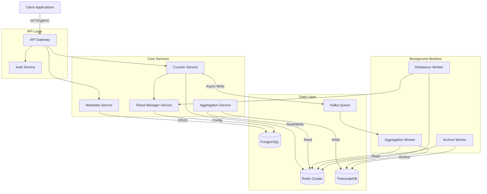
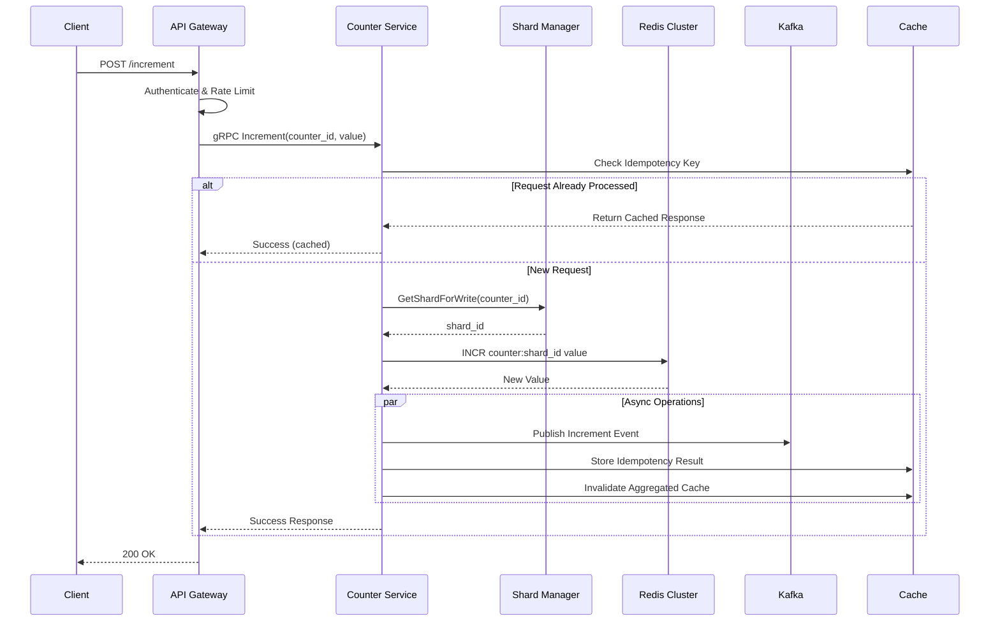
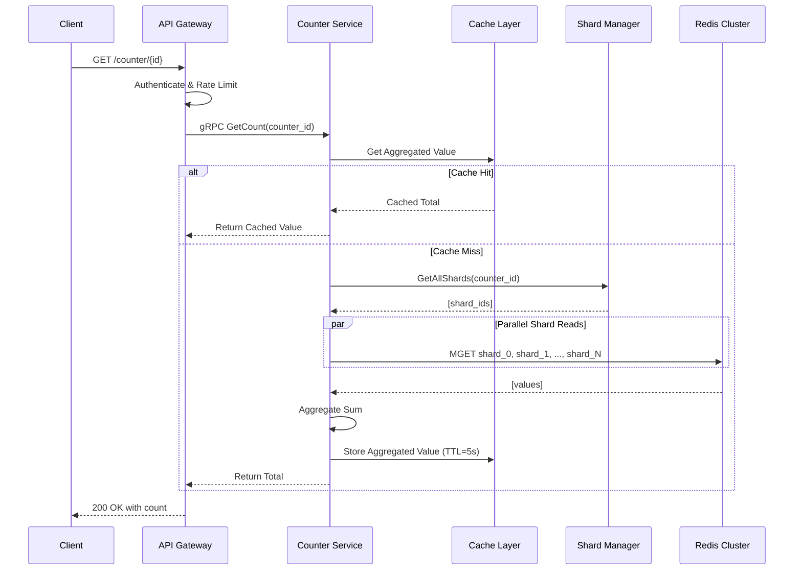
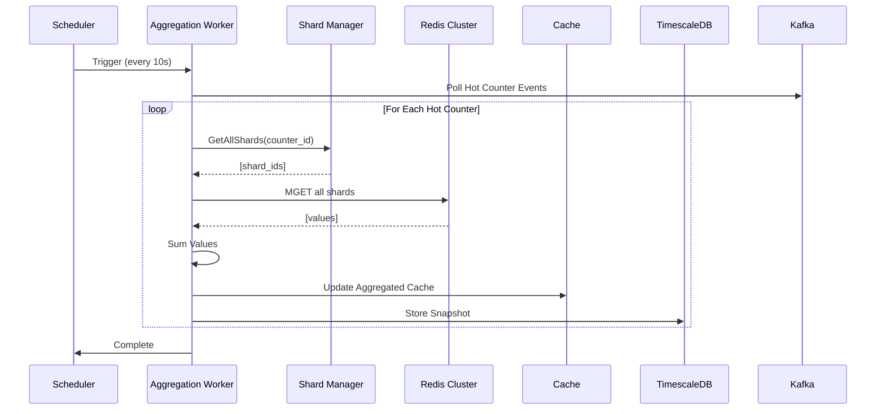

# Distributed Sharded Counter System Design

## Problem Description

Design a highly scalable distributed counter system that can handle millions of concurrent increment/decrement operations with eventual consistency guarantees. The system should support use cases like:
- Social media post likes/views counters
- Video view counts (like YouTube)
- Website visitor counters
- E-commerce inventory tracking
- Real-time analytics dashboards
- Advertisement impression tracking

The system must handle massive write throughput while providing reasonably accurate count reads with acceptable latency. Key challenges include avoiding write contention on a single counter, handling network partitions, and maintaining data consistency across distributed nodes.

## What Distributed System Concepts Interviewer Expects

1. **Sharding Strategy**: Understanding of horizontal partitioning to distribute counter load across multiple nodes
2. **CAP Theorem Trade-offs**: Choosing between consistency and availability during network partitions
3. **Eventual Consistency**: Implementing conflict-free replicated data types (CRDTs) or similar patterns
4. **Write Contention**: Solutions to hot-key problems and lock contention
5. **Distributed Consensus**: When and how to use consensus algorithms (Raft, Paxos) if needed
6. **Data Replication**: Multi-leader vs single-leader replication strategies
7. **Conflict Resolution**: Handling concurrent updates to the same counter
8. **Quorum-based Operations**: Read/write quorums for tunable consistency
9. **Clock Synchronization**: Handling logical clocks (vector clocks, Lamport timestamps)
10. **Fault Tolerance**: Dealing with node failures, network splits, and cascading failures

## Functional and Non-Functional Requirements

### Functional Requirements
1. **Increment Counter**: Atomically increment a counter by a given value (default 1)
2. **Decrement Counter**: Atomically decrement a counter by a given value
3. **Get Counter Value**: Retrieve the current count (may be eventually consistent)
4. **Create Counter**: Initialize a new counter with optional starting value
5. **Batch Operations**: Support batch increment/decrement operations
6. **Counter Reset**: Reset counter to zero or specific value
7. **Counter Expiry**: Support TTL-based counter expiration
8. **Range Queries**: Get counts for multiple counters in one request

### Non-Functional Requirements
1. **High Throughput**: Handle 1M+ writes/second globally
2. **Low Latency**: p99 write latency < 10ms, read latency < 5ms
3. **High Availability**: 99.99% uptime (52 minutes downtime/year)
4. **Horizontal Scalability**: Linear scaling with additional nodes
5. **Eventual Consistency**: Acceptable staleness of 1-2 seconds for reads
6. **Durability**: No data loss once operation is acknowledged
7. **Partition Tolerance**: Continue operations during network partitions
8. **Cost Efficiency**: Optimize for write-heavy workloads without excessive storage

## Capacity Estimation for DAU/MAU, Throughput per second for READ and WRITE, Storage Estimate

### Traffic Assumptions
Let's consider a global social media platform scale:

**Daily Active Users (DAU)**: 500 million users
**Monthly Active Users (MAU)**: 2 billion users

Each user generates counter interactions through various activities:
- Viewing posts/videos: 50 views per user per day
- Liking content: 20 likes per user per day
- Sharing content: 5 shares per user per day

Total counter increments per day = 500M users × 75 operations = 37.5 billion operations/day

### Write Throughput Calculation
Operations per second = 37.5B / 86,400 seconds ≈ **434,000 writes/second** on average

However, traffic is not uniform throughout the day. Peak hours (typically 8 PM - 11 PM local time) can see 3-5x average load. Also, viral content can create sudden spikes.

**Peak write throughput**: 434K × 5 = **2.17 million writes/second**

We should design for this peak load with additional headroom:
- **Target write capacity**: 3 million writes/second (38% buffer)

### Read Throughput Calculation
Users check counts when viewing content. Each post view requires reading multiple counters (likes, shares, comments, views).

Read operations per user per day = 50 views × 4 counters = 200 reads
Total reads per day = 500M × 200 = 100 billion reads/day

**Average read throughput**: 100B / 86,400 ≈ **1.16 million reads/second**
**Peak read throughput**: 1.16M × 5 = **5.8 million reads/second**

With buffer: **Target read capacity**: 7 million reads/second

### Read:Write Ratio
This system has a **2.3:1 read-to-write ratio**, which is relatively balanced compared to typical web applications. This means we need to optimize equally for both read and write performance.

### Storage Estimation

Each counter entry needs to store:
- Counter ID (128-bit UUID): 16 bytes
- Current count value (64-bit integer): 8 bytes
- Metadata (creation time, last update, TTL): 24 bytes
- Sharding metadata and replication info: 16 bytes
- Total per counter: ~64 bytes

Assuming we track counts for:
- 10 billion unique content items (posts, videos, etc.)
- Each item has 4 counter types (views, likes, shares, comments)
- Total unique counters = 40 billion

But with sharding, each counter is split into N shards (let's say 100 shards per counter to handle write contention).

**Storage calculation**:
- 40B counters × 100 shards × 64 bytes = 256 TB raw data
- With 3x replication factor: 768 TB
- With operational overhead (25%): **960 TB ≈ 1 PB total storage**

However, most counters can use periodic aggregation. We can keep shards in fast storage (SSD) for recent active counters and aggregate old shards into the database, reducing the working set to:
- Active counters (30 days): ~10% = **100 TB with replication**
- Historical aggregated data: 900 TB (can use cheaper HDD storage)

### Bandwidth Estimation
- Write bandwidth: 3M writes/sec × 64 bytes × 3 replicas = 576 MB/s ingress
- Read bandwidth: 7M reads/sec × 64 bytes = 448 MB/s egress
- Inter-datacenter replication: 576 MB/s per datacenter pair
- Total bandwidth with 3 datacenters: ~2-3 Gbps

## Technologies Choices & Justification

### Core Counter Engine
**Choice**: **Redis Cluster** with custom sharding logic

**Justification**:
- Atomic in-memory operations (INCR, DECR) with microsecond latency
- Built-in replication and cluster mode for horizontal scaling
- Supports TTL for automatic counter expiration
- Pipeline support for batch operations
- Active-active geo-replication with Redis Enterprise
- Proven at scale (Twitter, GitHub use Redis for counters)

**Alternative Considered**: Cassandra with counter columns
- Pros: Better for write-heavy workloads, built-in sharding
- Cons: Counter implementation has eventual consistency issues, repair complexities

### Metadata Store
**Choice**: **PostgreSQL** (with read replicas)

**Justification**:
- Store counter metadata (creation time, owner, configuration)
- ACID guarantees for counter lifecycle operations (create, delete)
- Excellent query performance for range queries
- Strong consistency for metadata operations
- Mature ecosystem and monitoring tools

### Message Queue
**Choice**: **Apache Kafka**

**Justification**:
- Buffer write spikes and provide backpressure protection
- Enable asynchronous processing of batch aggregations
- Provide audit log for all counter operations
- Exactly-once delivery semantics for critical operations
- High throughput (millions of messages/sec)

### Coordination Service
**Choice**: **Apache ZooKeeper** or **etcd**

**Justification**:
- Distributed configuration management
- Leader election for aggregation tasks
- Service discovery for dynamic shard mapping
- Distributed locks for admin operations
- Consensus-based consistency guarantees

### Caching Layer
**Choice**: **Redis** (separate from counter store)

**Justification**:
- Cache aggregated counter values
- Reduce load on primary counter shards
- TTL-based cache invalidation
- Atomic cache-aside pattern support

### Load Balancer
**Choice**: **Envoy Proxy** or **HAProxy**

**Justification**:
- Consistent hashing for shard routing
- Health checking and automatic failover
- Traffic shaping and rate limiting
- Observability (metrics, tracing)

### Observability Stack
**Choice**: Prometheus + Grafana + Jaeger

**Justification**:
- Real-time metrics collection and alerting
- Distributed tracing for latency debugging
- Counter health dashboards
- Anomaly detection for viral content

## Database Selection

### Primary Data Store: Redis Cluster

**Why Redis?**
1. **In-Memory Speed**: Write latency < 1ms, perfect for high-throughput counters
2. **Atomic Operations**: Native INCR/DECR operations are thread-safe
3. **Persistence Options**: RDB snapshots + AOF logs prevent data loss
4. **Clustering**: Automatic sharding across 16,384 hash slots
5. **Replication**: Master-replica with automatic failover

**Configuration**:
- AOF with fsync every second (balance between durability and performance)
- RDB snapshots every 5 minutes
- Maxmemory policy: allkeys-lru (evict least recently used)
- Cluster mode with 3 master nodes minimum

### Metadata Store: PostgreSQL

Stores counter definitions and configuration:

```sql
CREATE TABLE counters (
    counter_id UUID PRIMARY KEY,
    entity_id VARCHAR(255) NOT NULL,
    counter_type VARCHAR(50) NOT NULL,
    shard_count INT DEFAULT 100,
    created_at TIMESTAMP DEFAULT NOW(),
    ttl_seconds INT DEFAULT NULL,
    is_active BOOLEAN DEFAULT true,
    UNIQUE(entity_id, counter_type)
);

CREATE INDEX idx_entity_type ON counters(entity_id, counter_type);
CREATE INDEX idx_created_at ON counters(created_at);
```

### Time-Series Database: InfluxDB or TimescaleDB

**Purpose**: Store historical counter snapshots for analytics

**Why Time-Series DB?**
- Optimized for append-heavy workloads
- Automatic downsampling and retention policies
- Efficient compression for historical data
- Fast range queries for time-based analytics

## Data Modelling With Indexing or Sharding

### Shard Key Design

The core innovation is splitting each logical counter into N physical shards to distribute write load:

```
Logical Counter: video:12345:views
Physical Shards:
  - video:12345:views:shard0
  - video:12345:views:shard1
  - ...
  - video:12345:views:shard99
```

**Shard Selection Algorithm**:
```
shard_id = hash(request_id + timestamp) % shard_count
```

Using request_id (or user_id) + timestamp ensures random distribution and prevents hot shards.

### Data Model in Redis

```
Key Pattern: {entity}:{id}:{counter_type}:shard{N}
Value: Integer (64-bit)

Examples:
- video:abc123:views:shard0 → 15234
- video:abc123:views:shard1 → 15189
- video:abc123:likes:shard0 → 8934
- post:xyz789:shares:shard15 → 234
```

### Sharding Strategy

**Horizontal Sharding (Redis Cluster)**:
- Redis automatically shards keys across cluster nodes using hash slots
- 16,384 hash slots distributed across N master nodes
- CRC16(key) % 16384 determines slot assignment

**Application-Level Sharding**:
- Each logical counter split into 100 physical shards
- Write operations randomly select a shard
- Read operations aggregate all shards

**Combined Approach**:
```
Total shards = Redis cluster nodes × shards per counter
For 10 Redis nodes × 100 counter shards = 1,000 concurrent writers per counter
```

### Indexing Strategy (PostgreSQL)

```sql
-- B-tree index for exact lookups
CREATE INDEX idx_counter_entity ON counters(entity_id);

-- Composite index for common query pattern
CREATE INDEX idx_entity_type_active ON counters(entity_id, counter_type, is_active);

-- Partial index for active counters only
CREATE INDEX idx_active_counters ON counters(created_at) WHERE is_active = true;

-- Hash index for equality checks
CREATE INDEX idx_counter_type_hash ON counters USING HASH(counter_type);
```

### Replication Model

**Redis Replication**:
- 3 replicas per master (1 primary + 2 secondary)
- Asynchronous replication for performance
- Automatic failover via Redis Sentinel

**Cross-Datacenter Replication**:
- Multi-master Redis with conflict-free resolution
- Last-write-wins (LWW) with timestamp
- Periodic reconciliation jobs

## Service Decomposition With Responsibility & Communication



### Service Responsibilities

#### 1. API Gateway
**Responsibility**: Single entry point for all client requests
- Request routing and load balancing
- Rate limiting per client/API key
- Request/response transformation
- SSL termination
- Authentication/authorization integration

**Technology**: Envoy Proxy or Kong
**Communication**: HTTP/2, gRPC

#### 2. Counter Service
**Responsibility**: Core counter increment/decrement operations
- Handle INCR/DECR/GET operations
- Shard selection for writes
- Aggregation logic for reads
- Batch operation processing
- Circuit breaker for downstream services

**API Interface**:
```protobuf
service CounterService {
  rpc Increment(IncrementRequest) returns (IncrementResponse);
  rpc Decrement(DecrementRequest) returns (DecrementResponse);
  rpc GetCount(GetCountRequest) returns (GetCountResponse);
  rpc BatchIncrement(BatchIncrementRequest) returns (BatchResponse);
}
```

**Technology**: Go or Rust for high performance
**Communication**: gRPC for internal, REST for external

#### 3. Shard Manager Service
**Responsibility**: Shard configuration and routing
- Maintain shard mapping (counter → shard count)
- Dynamic shard rebalancing
- Shard health monitoring
- Consistent hashing for shard selection

**Key Functions**:
- `getShardForWrite(counterId) → shardId`
- `getAllShards(counterId) → [shardIds]`
- `rebalanceShards(counterId, newShardCount)`

**Technology**: Go with in-memory cache
**Communication**: gRPC

#### 4. Metadata Service
**Responsibility**: Counter lifecycle management
- Create/delete counters
- Store counter configuration (shard count, TTL)
- Counter discovery and search
- Ownership and access control

**Technology**: Java Spring Boot or Go
**Database**: PostgreSQL
**Communication**: REST API

#### 5. Aggregation Service
**Responsibility**: Real-time and batch aggregation
- Sum counter shards for read requests
- Periodic aggregation jobs (every 10s)
- Cache aggregated values
- Publish to analytics pipeline

**Aggregation Logic**:
```python
def get_count(counter_id):
    shard_ids = shard_manager.get_all_shards(counter_id)

    # Check cache first
    cached_value = cache.get(f"agg:{counter_id}")
    if cached_value and not_too_stale(cached_value):
        return cached_value

    # Aggregate from shards
    total = sum(redis.get(shard_id) for shard_id in shard_ids)

    # Cache result
    cache.set(f"agg:{counter_id}", total, ttl=5)
    return total
```

**Technology**: Python or Go
**Communication**: gRPC

### Background Workers

#### 6. Aggregation Worker
**Responsibility**: Periodic shard aggregation
- Runs every 10 seconds
- Aggregates hot counters to reduce read latency
- Updates cache layer
- Publishes to Kafka for analytics

**Technology**: Python with Celery or Go
**Trigger**: Cron-based or event-driven

#### 7. Archive Worker
**Responsibility**: Historical data archival
- Move cold counter data to time-series DB
- Reduce Redis memory footprint
- Implement retention policies
- Generate daily snapshots

**Technology**: Python or Scala
**Schedule**: Runs hourly

#### 8. Rebalance Worker
**Responsibility**: Dynamic shard rebalancing
- Monitor hot counters (viral content)
- Increase shard count for hot counters
- Migrate data during rebalancing
- Zero-downtime shard splits

**Technology**: Go
**Trigger**: Event-driven based on metrics

### Inter-Service Communication Patterns

1. **Synchronous (gRPC)**:
   - Counter Service ↔ Shard Manager
   - API Gateway ↔ Core Services
   - Low latency, strong consistency

2. **Asynchronous (Kafka)**:
   - Counter writes → Kafka → Aggregation Worker
   - Event sourcing for audit logs
   - Decouples producers from consumers

3. **Request-Response (REST)**:
   - External clients → API Gateway
   - Admin operations on Metadata Service

## API Design & Security

### Public REST API

#### Increment Counter
```http
POST /v1/counters/{counterId}/increment
Content-Type: application/json
Authorization: Bearer {token}

Request:
{
  "value": 1,
  "idempotency_key": "req_abc123"
}

Response: 200 OK
{
  "counter_id": "video:abc123:views",
  "operation": "increment",
  "request_id": "req_abc123",
  "timestamp": "2026-10-05T10:30:00Z"
}
```

#### Get Counter Value
```http
GET /v1/counters/{counterId}
Authorization: Bearer {token}

Response: 200 OK
{
  "counter_id": "video:abc123:views",
  "value": 1523789,
  "last_updated": "2026-10-05T10:30:00Z",
  "consistency": "eventual"
}
```

#### Batch Increment
```http
POST /v1/counters/batch/increment
Content-Type: application/json
Authorization: Bearer {token}

Request:
{
  "operations": [
    {"counter_id": "video:abc123:views", "value": 1},
    {"counter_id": "video:abc123:likes", "value": 1},
    {"counter_id": "user:user456:followers", "value": 1}
  ],
  "idempotency_key": "batch_xyz789"
}

Response: 200 OK
{
  "batch_id": "batch_xyz789",
  "success_count": 3,
  "failed_count": 0,
  "timestamp": "2026-10-05T10:30:00Z"
}
```

#### Create Counter
```http
POST /v1/counters
Content-Type: application/json
Authorization: Bearer {token}

Request:
{
  "entity_id": "video:abc123",
  "counter_type": "views",
  "initial_value": 0,
  "shard_count": 100,
  "ttl_seconds": 2592000
}

Response: 201 Created
{
  "counter_id": "video:abc123:views",
  "entity_id": "video:abc123",
  "counter_type": "views",
  "shard_count": 100,
  "created_at": "2026-10-05T10:30:00Z"
}
```

### Internal gRPC API

```protobuf
syntax = "proto3";

package counter.v1;

service CounterService {
  rpc Increment(IncrementRequest) returns (IncrementResponse);
  rpc Decrement(DecrementRequest) returns (DecrementResponse);
  rpc GetCount(GetCountRequest) returns (GetCountResponse);
  rpc BatchIncrement(BatchIncrementRequest) returns (BatchIncrementResponse);
  rpc GetMultiple(GetMultipleRequest) returns (GetMultipleResponse);
}

message IncrementRequest {
  string counter_id = 1;
  int64 value = 2;
  string idempotency_key = 3;
  int64 timestamp = 4;
}

message IncrementResponse {
  string counter_id = 1;
  string request_id = 2;
  bool success = 3;
  string error_message = 4;
}

message GetCountRequest {
  string counter_id = 1;
  bool strong_consistency = 2;
}

message GetCountResponse {
  string counter_id = 1;
  int64 value = 2;
  int64 last_updated = 3;
  string consistency_level = 4;
}

message BatchIncrementRequest {
  repeated IncrementRequest operations = 1;
  string batch_id = 2;
}

message BatchIncrementResponse {
  string batch_id = 1;
  int32 success_count = 2;
  int32 failed_count = 3;
  repeated IncrementResponse results = 4;
}
```

### Security Measures

#### 1. Authentication & Authorization
- **JWT-based authentication** for API access
- **API keys** for machine-to-machine communication
- **OAuth 2.0** for third-party integrations
- **mTLS** for internal service-to-service communication

#### 2. Rate Limiting
```yaml
Rate Limits:
  - Tier: Free
    Requests: 1,000/hour
    Burst: 100/minute

  - Tier: Premium
    Requests: 100,000/hour
    Burst: 10,000/minute

  - Tier: Enterprise
    Requests: Unlimited
    Burst: 100,000/minute
```

**Implementation**: Token bucket algorithm at API Gateway

#### 3. Input Validation
- Counter ID format validation (alphanumeric + special chars)
- Value bounds checking (-2^63 to 2^63-1)
- Idempotency key validation
- Request size limits (1KB for single, 100KB for batch)

#### 4. Idempotency
- Idempotency keys stored in Redis with 24-hour TTL
- Prevents duplicate increments from retries
- Returns cached response for duplicate requests

```python
def increment_with_idempotency(counter_id, value, idempotency_key):
    # Check if request already processed
    cached = redis.get(f"idempotency:{idempotency_key}")
    if cached:
        return cached

    # Process increment
    result = increment_counter(counter_id, value)

    # Cache result
    redis.setex(f"idempotency:{idempotency_key}", 86400, result)
    return result
```

#### 5. DDoS Protection
- CloudFlare or AWS Shield for network-level protection
- Application-level rate limiting
- IP-based blocking for abusive clients
- Challenge-response for suspicious traffic

#### 6. Data Encryption
- **In-transit**: TLS 1.3 for all external communication
- **At-rest**: AES-256 encryption for Redis persistence files
- **Database**: PostgreSQL with transparent data encryption (TDE)

#### 7. Audit Logging
- Log all write operations to Kafka
- Include: user_id, counter_id, operation, timestamp, IP address
- Retention: 90 days in hot storage, 7 years in cold storage
- Compliance: GDPR, SOC2, PCI-DSS

## High Level Flow Diagram

### Write Path (Increment Counter)



### Read Path (Get Counter)



### Background Aggregation Flow



## Deep Dive On Design

### Shard Management Deep Dive

#### Dynamic Shard Allocation

The system uses adaptive sharding based on counter hotness:

**Cold Counters** (< 10 writes/sec): 10 shards
**Warm Counters** (10-100 writes/sec): 50 shards
**Hot Counters** (100-1000 writes/sec): 100 shards
**Viral Counters** (> 1000 writes/sec): 500 shards

**Detection Logic**:
```python
class ShardRebalancer:
    def detect_hot_counters(self):
        # Monitor write rate from Kafka events
        counter_rates = defaultdict(int)

        # Last 60 seconds of events
        events = kafka.consume(topic='counter-events',
                              time_window=60)

        for event in events:
            counter_rates[event.counter_id] += 1

        # Identify counters needing more shards
        for counter_id, rate in counter_rates.items():
            current_shards = shard_manager.get_shard_count(counter_id)

            if rate > 1000 and current_shards < 500:
                self.increase_shards(counter_id, 500)
            elif rate > 100 and current_shards < 100:
                self.increase_shards(counter_id, 100)
```

#### Shard Splitting Strategy

When increasing shards from N to M:
1. **Create new shards**: Add M-N new shard keys in Redis
2. **Dual-write phase**: Write to both old and new shard sets (1 minute)
3. **Copy existing data**: Background job redistributes data
4. **Switch reads**: Update routing to read from M shards
5. **Cleanup**: Delete old shards after 24 hours

### Consistency Model Deep Dive

#### Write Consistency

**Option 1: Eventual Consistency (Default)**
- Write to any shard asynchronously
- No coordination between shards
- Fastest writes (< 1ms)
- Acceptable for most counters

**Option 2: Strong Consistency**
- Use Redis transactions (MULTI/EXEC)
- Write to quorum of replicas
- Slower (5-10ms) but guaranteed accuracy
- For financial counters, inventory

**Implementation**:
```python
def increment_strongly_consistent(counter_id, value):
    shard_id = select_shard(counter_id)

    # Get all replicas for this shard
    replicas = get_replicas(shard_id)
    quorum_size = len(replicas) // 2 + 1

    # Write to quorum
    successful_writes = 0
    for replica in replicas:
        try:
            result = replica.incr(shard_id, value)
            successful_writes += 1
            if successful_writes >= quorum_size:
                return result
        except Exception:
            continue

    raise Exception("Failed to achieve write quorum")
```

#### Read Consistency

**Option 1: Cached Read (Default)**
- Read from aggregated cache
- Staleness: 1-5 seconds
- Ultra-fast (< 1ms)

**Option 2: Fresh Read**
- Aggregate all shards in real-time
- No staleness
- Slower (10-20ms)

**Option 3: Quorum Read**
- Read from majority of replicas
- Take maximum value
- Strongest consistency (50ms)

### Conflict Resolution

In multi-datacenter deployments, conflicts arise from concurrent updates:

**Strategy: Last-Write-Wins (LWW) with Lamport Timestamps**

```python
class CounterWithTimestamp:
    def __init__(self):
        self.value = 0
        self.timestamp = 0  # Lamport clock

    def increment(self, delta, incoming_timestamp):
        # Always accept writes from the future
        if incoming_timestamp > self.timestamp:
            self.value += delta
            self.timestamp = incoming_timestamp
        else:
            # Conflict detected - use commutative property
            # Increments are commutative, so just apply
            self.value += delta
            self.timestamp = max(self.timestamp, incoming_timestamp)
```

**CRDT Approach (Advanced)**:
Use Grow-Only Counter (G-Counter) for partition tolerance:
- Each datacenter maintains its own counter
- Final value = sum of all datacenter counters
- Mathematically proven convergence

### Failure Handling Deep Dive

#### Redis Node Failure

**Detection**:
- Redis Sentinel monitors all nodes (3-second heartbeat)
- After 3 missed heartbeats (9 seconds), mark node as down

**Recovery**:
1. Sentinel initiates automatic failover
2. Promote replica to master (< 30 seconds)
3. Update shard routing in Shard Manager
4. Redirect writes to new master
5. Former master rejoins as replica when recovered

**Data Loss**:
- AOF with fsync=everysec: Max 1 second of data loss
- For zero data loss: Use fsync=always (performance hit)

#### Network Partition

**Scenario**: Datacenter A can't reach Datacenter B

**Approach**: Multi-master with conflict resolution
- Each DC continues accepting writes
- Use vector clocks to track causality
- Reconciliation when partition heals

**Example**:
```
DC-A: counter = 100, vector_clock = {A:5, B:3}
DC-B: counter = 105, vector_clock = {A:3, B:7}

After partition heals:
Merge: counter = 110 (sum increments from both)
vector_clock = {A:5, B:7}
```

#### Cascading Failure Prevention

1. **Circuit Breaker**:
   - Open circuit after 50% error rate
   - Half-open after 30 seconds
   - Close after 10 successful requests

2. **Bulkhead Pattern**:
   - Separate connection pools per shard
   - Failure in one shard doesn't affect others

3. **Backpressure**:
   - Kafka queue buffers write spikes
   - Return 503 when queue > 1M messages

### Operational Considerations

#### Monitoring Metrics

**Key Metrics**:
1. Write throughput per second (target: 3M)
2. Read throughput per second (target: 7M)
3. p50/p99/p999 latency for reads and writes
4. Error rate (target: < 0.1%)
5. Cache hit rate (target: > 95%)
6. Shard distribution (CV < 0.1 for uniform)
7. Redis memory usage (alert at 80%)
8. Kafka lag (alert if > 100k messages)

**Alerts**:
```yaml
alerts:
  - name: HighWriteLatency
    condition: p99_write_latency > 10ms for 5 minutes
    action: Page on-call engineer

  - name: CacheHitRateLow
    condition: cache_hit_rate < 90% for 10 minutes
    action: Notify team channel

  - name: RedisMemoryHigh
    condition: redis_memory_usage > 80%
    action: Trigger auto-scaling or archival
```

#### Capacity Planning

**Scaling Triggers**:
- Write throughput > 70% capacity: Add Redis nodes
- Read throughput > 70% capacity: Add cache layer nodes
- Memory usage > 80%: Archive cold data or add nodes

**Scaling Procedure**:
1. Add new Redis nodes to cluster
2. Rebalance hash slots (resharding)
3. Update Shard Manager routing
4. Monitor for hotspots

## Reliability and Monitoring

### High Availability Architecture

#### Multi-Region Deployment

```
Region A (Primary):
- 3 Redis master nodes
- 3 replicas per master
- 5 Counter Service instances
- Load balancer with health checks

Region B (Secondary):
- 3 Redis master nodes (replicated from A)
- 3 replicas per master
- 5 Counter Service instances
- Load balancer

Region C (DR):
- Standby replicas
- Cold start < 5 minutes
```

**Failover Strategy**:
- DNS-based failover (TTL: 60 seconds)
- Active-active in Region A and B
- Automatic failover if region latency > 100ms

#### Replication Lag Monitoring

```python
def monitor_replication_lag():
    for replica in get_all_replicas():
        info = replica.info('replication')
        lag = info['master_repl_offset'] - info['replica_repl_offset']

        if lag > 1000000:  # 1M operations behind
            alert('High replication lag', replica_id=replica.id)

        metrics.gauge('replication.lag', lag, tags=[f'replica:{replica.id}'])
```

### Disaster Recovery

#### Backup Strategy

1. **Redis RDB Snapshots**:
   - Every 5 minutes to S3
   - Retention: 7 days hot, 90 days cold
   - Compression: LZ4

2. **PostgreSQL Backups**:
   - Continuous WAL archiving
   - Daily full backups
   - Point-in-time recovery (PITR) capability

3. **Kafka Topic Backups**:
   - Mirror Maker 2 to DR cluster
   - 30-day retention

#### Recovery Time Objective (RTO) / Recovery Point Objective (RPO)

- **RTO**: 5 minutes (time to restore service)
- **RPO**: 1 minute (acceptable data loss)

**Recovery Procedure**:
1. Detect failure via monitoring (30 seconds)
2. Initiate automatic failover (1 minute)
3. DNS propagation (1 minute)
4. Health check validation (30 seconds)
5. Full capacity restored (2 minutes)

### Monitoring Dashboard

#### Real-Time Metrics

```
Dashboard: Distributed Counter System

[System Health]
├─ Overall Uptime: 99.99%
├─ Active Counters: 42M
├─ Total Operations/sec: 8.5M (3.2M writes, 5.3M reads)
└─ Error Rate: 0.02%

[Performance Metrics]
├─ Write Latency: p50=0.8ms | p99=2.1ms | p999=8.5ms
├─ Read Latency: p50=1.2ms | p99=4.8ms | p999=15ms
└─ Cache Hit Rate: 97.3%

[Resource Utilization]
├─ Redis Memory: 72% (720GB / 1TB)
├─ CPU Usage: 45% avg across nodes
├─ Network: 1.8 Gbps in | 1.2 Gbps out
└─ Kafka Lag: 12k messages (< 1 second)

[Hot Counters] (Top 5)
├─ video:viral123:views → 45k writes/sec (500 shards)
├─ post:trending456:likes → 23k writes/sec (200 shards)
└─ ...
```

### Alerting Strategy

#### Alert Levels

**P0 - Critical** (page immediately):
- Service down in any region
- Error rate > 1%
- Data loss detected

**P1 - High** (page during business hours):
- Latency p99 > 20ms
- Cache hit rate < 85%
- Replication lag > 10 seconds

**P2 - Medium** (ticket):
- Memory usage > 80%
- Unusual traffic patterns
- Failed background jobs

#### On-Call Runbooks

**Runbook: High Write Latency**
1. Check Redis CPU usage → scale if > 80%
2. Check for hot counters → increase shards
3. Check network latency → route to different region
4. Check Kafka backlog → scale consumers

## Bottlenecks and Failure Points In This Design

### Bottleneck 1: Aggregation Read Latency

**Problem**: Reading all shards for aggregation is slow (O(N) where N = shard count)

**Impact**: p99 read latency > 50ms for counters with 500 shards

**Solution**:
1. **Aggressive caching**: Cache aggregated values with 5-second TTL
2. **Background aggregation**: Pre-compute popular counters every 10 seconds
3. **Approximate algorithms**: Use HyperLogLog for estimates
4. **Read replicas**: Distribute shard reads across replicas

### Bottleneck 2: Metadata Service Single Point of Failure

**Problem**: PostgreSQL is a single point of failure for counter creation/deletion

**Impact**: Can't create new counters during PostgreSQL outage

**Solution**:
1. **PostgreSQL replication**: Multi-master with Patroni
2. **Read replicas**: Offload reads to replicas
3. **Caching layer**: Cache counter metadata in Redis (1 hour TTL)
4. **Eventual consistency**: Allow counter creation without immediate metadata write

### Bottleneck 3: Hot Shard Problem

**Problem**: Even with sharding, a viral video can overwhelm a single Redis node

**Impact**: Write latency spikes, potential node crash

**Solution**:
1. **Dynamic resharding**: Automatically increase shard count for hot counters
2. **Rate limiting**: Limit writes per counter per second
3. **Write buffering**: Use Kafka to buffer and batch writes
4. **Client-side aggregation**: Aggregate increments client-side before sending

### Bottleneck 4: Cross-Region Replication Lag

**Problem**: Multi-region replication introduces lag (100-500ms)

**Impact**: Users see stale counts in different regions

**Solution**:
1. **Regional counters**: Split counter per region, aggregate periodically
2. **Sticky routing**: Route users to same region for consistency
3. **Conflict-free merge**: Use CRDTs for automatic conflict resolution
4. **Eventual consistency SLA**: Set expectations (5-second staleness acceptable)

### Failure Point 1: Redis Cluster Split-Brain

**Scenario**: Network partition causes two nodes to both think they're master

**Impact**: Divergent counter values, data inconsistency

**Mitigation**:
1. **Redis Sentinel quorum**: Require majority vote for failover (3+ sentinels)
2. **Fencing**: Old master rejects writes after partition
3. **Reconciliation**: Merge counters using vector clocks after partition heals
4. **Monitoring**: Alert on split-brain detection

### Failure Point 2: Kafka Message Loss

**Scenario**: Kafka broker crashes before replicating messages

**Impact**: Lost increment operations, undercounted values

**Mitigation**:
1. **Replication factor**: Set `min.insync.replicas=2`
2. **Producer acknowledgment**: Use `acks=all`
3. **Idempotency**: Enable producer idempotency
4. **Audit trail**: Compare Redis values with Kafka event stream periodically

### Failure Point 3: Clock Skew in Distributed System

**Scenario**: Server clocks drift, causing timestamp conflicts

**Impact**: Incorrect conflict resolution, out-of-order operations

**Mitigation**:
1. **NTP synchronization**: Keep clock skew < 100ms
2. **Logical clocks**: Use Lamport timestamps instead of wall clock
3. **TrueTime-like**: Use bounded clock uncertainty (Google Spanner approach)
4. **Monitoring**: Alert on clock skew > 1 second

### Failure Point 4: Thundering Herd on Cache Invalidation

**Scenario**: Popular counter's cache expires, causing simultaneous shard aggregations

**Impact**: Redis overload, latency spike

**Mitigation**:
1. **Probabilistic early expiration**: Randomly expire 0-5 seconds before TTL
2. **Cache warming**: Background job refreshes cache before expiration
3. **Request coalescing**: Merge concurrent requests for same counter
4. **Negative caching**: Cache "counter not found" responses

## Where AI Fits in This Design

### 1. Anomaly Detection for Counter Fraud

**Use Case**: Detect bot-driven fake views/likes

**ML Model**: Isolation Forest or Autoencoders

**Features**:
- Increment velocity (sudden spikes)
- User behavior patterns (same IP, user-agent)
- Temporal patterns (all increments within 1 second)
- Geographic distribution (all from same region)

**Implementation**:
```python
class CounterAnomalyDetector:
    def __init__(self):
        self.model = IsolationForest(contamination=0.01)
        self.feature_window = 60  # seconds

    def extract_features(self, counter_id):
        events = kafka.get_events(counter_id, last_n_seconds=60)

        features = {
            'increment_rate': len(events) / 60,
            'unique_ips': len(set(e.ip for e in events)),
            'variance': np.var([e.value for e in events]),
            'hour_of_day': datetime.now().hour,
            'burst_score': self.calculate_burst(events)
        }
        return features

    def predict(self, counter_id):
        features = self.extract_features(counter_id)
        score = self.model.decision_function([features])[0]

        if score < -0.5:  # Anomaly threshold
            self.flag_counter(counter_id, score)
```

**Action**: Flag suspicious counters, require CAPTCHA for further increments

### 2. Predictive Auto-Scaling

**Use Case**: Predict traffic spikes before they happen

**ML Model**: LSTM time-series forecasting

**Training Data**:
- Historical traffic patterns (hourly, daily, weekly)
- Event calendar (sports events, product launches)
- External signals (trending hashtags, news)

**Implementation**:
- Predict traffic 30 minutes ahead
- Auto-scale Redis nodes proactively
- Pre-warm cache for predicted hot counters

### 3. Intelligent Shard Allocation

**Use Case**: Optimize shard count based on counter characteristics

**ML Model**: Gradient Boosting (XGBoost)

**Features**:
- Counter type (views, likes, shares)
- Entity popularity score
- Historical write rate
- Time since creation
- Geographic distribution

**Output**: Recommended shard count (10-500)

**Training**:
```python
def train_shard_predictor():
    # Collect training data
    counters = get_historical_counters(days=90)

    X = []
    y = []  # Actual shard count that was needed

    for counter in counters:
        features = [
            counter.entity_popularity,
            counter.avg_write_rate,
            counter.peak_write_rate,
            counter.duration_days,
            counter.category_encoding
        ]
        X.append(features)
        y.append(counter.optimal_shard_count)

    model = xgboost.XGBRegressor()
    model.fit(X, y)
    return model
```

### 4. Intelligent Caching with Reinforcement Learning

**Use Case**: Decide which counters to cache and for how long

**ML Model**: Deep Q-Network (DQN)

**State**:
- Counter read frequency
- Cache hit rate
- Memory pressure
- Read latency

**Actions**:
- Cache with TTL (1s, 5s, 30s, 60s)
- Don't cache
- Evict from cache

**Reward**:
- +1 for cache hit
- -0.1 for cache miss
- -0.5 for high memory usage
- -1 for p99 latency > 10ms

### 5. Natural Language Query Interface

**Use Case**: Allow developers to query counter stats using natural language

**ML Model**: Fine-tuned LLM (GPT-4 or Claude)

**Example**:
```
User: "Show me the top 10 viral videos in the last hour"

AI Translation:
SELECT counter_id, value
FROM counters
WHERE counter_type = 'views'
  AND created_at > NOW() - INTERVAL '1 hour'
ORDER BY value DESC
LIMIT 10;
```

### 6. Automated Root Cause Analysis

**Use Case**: Diagnose performance issues automatically

**ML Model**: Graph Neural Network on system topology

**Inputs**:
- Service dependency graph
- Metrics time series
- Log patterns
- Alert history

**Output**: Probable root cause with confidence score

**Example Output**:
```
Detected: High read latency (p99 = 45ms)

Root Cause Analysis:
1. Redis node-3 CPU = 95% (confidence: 0.85)
   └─ Likely cause: Hot counter video:xyz123 (50k writes/sec)
   └─ Recommendation: Increase shards from 100 to 500

2. Network congestion in us-east-1 (confidence: 0.45)
   └─ Recommendation: Route traffic to us-west-2
```

## 5 Most Asked Follow-Up Questions

### Q1: How do you handle exactly-once semantics for counter increments?

**Answer**:

The system uses a combination of techniques:

1. **Idempotency Keys**: Every increment request includes a unique idempotency key (UUID). We store these keys in Redis with 24-hour TTL:
```python
def increment_idempotent(counter_id, value, idempotency_key):
    # Check if already processed
    cached = redis.get(f"idempotency:{idempotency_key}")
    if cached:
        return json.loads(cached)

    # Process increment
    result = increment_counter(counter_id, value)

    # Cache result for 24 hours
    redis.setex(
        f"idempotency:{idempotency_key}",
        86400,
        json.dumps(result)
    )
    return result
```

2. **Kafka Exactly-Once**: Enable Kafka transactions with `enable.idempotence=true` and `transactional.id` for producers. This ensures events are written exactly once to Kafka.

3. **Redis Transactions**: For critical counters (e.g., financial), use Redis MULTI/EXEC blocks:
```python
pipe = redis.pipeline()
pipe.watch(counter_key)  # Optimistic locking
pipe.multi()
pipe.incr(counter_key, value)
pipe.set(f"idempotency:{key}", result)
pipe.execute()
```

4. **Reconciliation Jobs**: Periodically compare Kafka event stream totals with Redis values to detect and correct discrepancies.

**Trade-off**: Idempotency adds 5-10ms latency due to Redis lookups, but ensures correctness.

---

### Q2: What happens if a counter receives 1 million increments per second? Won't even 500 shards be insufficient?

**Answer**:

You're correct - this is a critical edge case. Our solution has multiple layers:

**Layer 1: Client-Side Batching**
```javascript
// Client-side aggregation
class CounterClient {
    constructor() {
        this.localBuffer = {};
        this.flushInterval = 1000; // 1 second
    }

    increment(counterId) {
        this.localBuffer[counterId] = (this.localBuffer[counterId] || 0) + 1;
    }

    flush() {
        for (const [counterId, value] of Object.entries(this.localBuffer)) {
            api.increment(counterId, value);  // Single request with value=1000
        }
        this.localBuffer = {};
    }
}
```

**Layer 2: Server-Side Buffering**
Use Kafka as a buffer and aggregate increments in 100ms windows:
```python
# Consumer aggregates events
window_counters = defaultdict(int)

for event in kafka.consume(timeout=100):  # 100ms window
    window_counters[event.counter_id] += event.value

# Flush aggregated increments
for counter_id, total in window_counters.items():
    redis.incrby(get_shard(counter_id), total)
```

**Layer 3: Approximate Counting**
For truly viral counters (> 1M writes/sec), switch to probabilistic data structures:
- **HyperLogLog** for unique counts (2% error, 12KB memory)
- **Count-Min Sketch** for frequency estimates

**Layer 4: Rate Limiting**
Cap increments per counter at 100k/sec and return 429 (Too Many Requests) beyond that. This prevents system overload.

**Real-world Example**: YouTube doesn't show exact view counts in real-time for viral videos. They show "1.2M views" instead of precise counts, using approximate algorithms.

---

### Q3: How do you handle counter decrements for scenarios like inventory management where accuracy is critical?

**Answer**:

Counter decrements are fundamentally harder than increments because they can go negative (overselling). For inventory specifically:

**Approach 1: Reserved Shards (Recommended)**
Instead of decrementing freely, use a reservation system:

```python
def reserve_inventory(product_id, quantity):
    # Get current inventory across shards
    total = get_count(f"inventory:{product_id}")

    if total < quantity:
        return {"success": False, "reason": "insufficient_inventory"}

    # Reserve from specific shard with lock
    shard_id = select_random_shard(product_id)

    with redis.lock(f"lock:inventory:{product_id}:{shard_id}"):
        current = redis.get(f"inventory:{product_id}:{shard_id}")

        if current >= quantity:
            redis.decrby(f"inventory:{product_id}:{shard_id}", quantity)
            redis.setex(f"reservation:{order_id}", 300, quantity)
            return {"success": True, "reservation_id": order_id}
        else:
            # Try another shard
            return reserve_inventory(product_id, quantity)
```

**Approach 2: Single-Master Shard**
For critical counters, use only 1 shard (sacrifices throughput for consistency):
```python
def critical_decrement(counter_id, value):
    # No sharding - single source of truth
    with redis.lock(counter_id, timeout=5):
        current = redis.get(counter_id)

        if current < value:
            raise InsufficientCountError()

        return redis.decrby(counter_id, value)
```

**Approach 3: Pessimistic Locking**
Use distributed locks (Redlock algorithm) across shards:
```python
from redis_lock import Lock

def safe_decrement(counter_id, value):
    shard_ids = get_all_shards(counter_id)
    locks = [Lock(redis, f"lock:{shard}") for shard in shard_ids]

    # Acquire all locks
    for lock in locks:
        lock.acquire()

    try:
        total = sum(redis.get(shard) for shard in shard_ids)

        if total < value:
            raise ValueError("Insufficient count")

        # Decrement from first shard
        redis.decrby(shard_ids[0], value)
    finally:
        # Release all locks
        for lock in locks:
            lock.release()
```

**Trade-off**: Strong consistency requires synchronization, reducing throughput to ~1000 ops/sec per counter. For high-accuracy inventory, this is acceptable.

---

### Q4: How do you migrate counters from the old system to this new distributed system without downtime?

**Answer**:

Zero-downtime migration follows a multi-phase approach:

**Phase 1: Dual-Write (Week 1-2)**
```python
def increment_with_dual_write(counter_id, value):
    # Write to both old and new systems
    futures = [
        executor.submit(old_system.increment, counter_id, value),
        executor.submit(new_system.increment, counter_id, value)
    ]

    # Wait for both
    results = [f.result() for f in futures]

    # Log discrepancies
    if results[0] != results[1]:
        logger.warning(f"Counter mismatch: {counter_id}")

    return results[1]  # Return new system result
```

**Phase 2: Background Backfill (Week 2-3)**
```python
def backfill_counters():
    # Get all counters from old system
    old_counters = old_system.get_all_counters()

    for counter in old_counters:
        old_value = counter.value
        new_value = new_system.get_count(counter.id)

        # Calculate difference
        diff = old_value - new_value

        if diff > 0:
            # Backfill missing increments
            new_system.increment(counter.id, diff)
            logger.info(f"Backfilled {counter.id} with {diff}")
```

**Phase 3: Dual-Read with Comparison (Week 3-4)**
```python
def get_count_with_validation(counter_id):
    old_value = old_system.get_count(counter_id)
    new_value = new_system.get_count(counter_id)

    # Alert if difference > 1%
    if abs(old_value - new_value) / old_value > 0.01:
        alert(f"Counter drift detected: {counter_id}")

    return new_value
```

**Phase 4: Read Cutover (Week 4)**
- Switch all reads to new system
- Keep dual-writes running for safety

**Phase 5: Write Cutover (Week 5)**
- Stop writes to old system
- Monitor for issues for 1 week

**Phase 6: Decomission (Week 6)**
- Remove old system
- Archive historical data

**Rollback Plan**: At any phase, can revert by switching read/write to old system.

---

### Q5: How do you ensure data consistency across multiple data centers with active-active replication?

**Answer**:

Active-active multi-datacenter consistency is achieved through a combination of techniques:

**Approach 1: CRDT-based Counters (Preferred)**

Use Conflict-Free Replicated Data Types (specifically, G-Counter):

```python
class GCounter:
    """Grow-Only Counter CRDT"""

    def __init__(self, datacenter_id):
        self.id = datacenter_id
        self.counts = {}  # {datacenter_id: count}

    def increment(self, value=1):
        self.counts[self.id] = self.counts.get(self.id, 0) + value

    def value(self):
        return sum(self.counts.values())

    def merge(self, other):
        """Merge with another datacenter's counter"""
        for dc_id, count in other.counts.items():
            self.counts[dc_id] = max(
                self.counts.get(dc_id, 0),
                count
            )
```

Each datacenter maintains its own increment count. Final value = sum of all datacenters. Merges are commutative and associative, guaranteeing eventual consistency.

**Approach 2: Vector Clocks for Causality**

Track causality to resolve conflicts:

```python
class CounterWithVectorClock:
    def __init__(self, datacenter_id):
        self.value = 0
        self.vector_clock = {datacenter_id: 0}
        self.dc_id = datacenter_id

    def increment(self, delta):
        self.value += delta
        self.vector_clock[self.dc_id] += 1

    def merge(self, other):
        # Check if one dominates the other
        if self.happens_before(other):
            # Other is newer, use its value
            self.value = other.value
            self.vector_clock = other.vector_clock
        elif other.happens_before(self):
            # Self is newer, keep current value
            pass
        else:
            # Concurrent updates - sum them
            self.value += other.value
            self.merge_clocks(other.vector_clock)

    def happens_before(self, other):
        return all(
            self.vector_clock.get(dc, 0) <= other.vector_clock.get(dc, 0)
            for dc in set(self.vector_clock) | set(other.vector_clock)
        )
```

**Approach 3: Periodic Reconciliation**

Background job compares counter values across datacenters:

```python
def reconcile_counters():
    for counter_id in get_all_counter_ids():
        dc1_value = dc1_redis.get(counter_id)
        dc2_value = dc2_redis.get(counter_id)
        dc3_value = dc3_redis.get(counter_id)

        # Take maximum (assumes monotonic increases)
        max_value = max(dc1_value, dc2_value, dc3_value)

        # Update all datacenters to max
        if dc1_value < max_value:
            dc1_redis.set(counter_id, max_value)
        if dc2_value < max_value:
            dc2_redis.set(counter_id, max_value)
        if dc3_value < max_value:
            dc3_redis.set(counter_id, max_value)

        # Log discrepancies
        if dc1_value != dc2_value or dc2_value != dc3_value:
            metrics.increment('counter.reconciliation.divergence')
```

**Approach 4: Quorum-Based Consistency**

For critical counters, use quorum reads/writes:

```python
def write_with_quorum(counter_id, value):
    datacenters = [dc1_redis, dc2_redis, dc3_redis]
    quorum_size = len(datacenters) // 2 + 1  # Majority

    successful_writes = 0
    for dc in datacenters:
        try:
            dc.incr(counter_id, value)
            successful_writes += 1
        except Exception:
            continue

    if successful_writes >= quorum_size:
        return {"success": True}
    else:
        # Rollback partial writes
        raise QuorumNotReached()
```

**Trade-offs**:
- CRDT: Perfect eventual consistency, but requires more storage
- Vector Clocks: Tracks causality, but clock size grows with DCs
- Reconciliation: Simple, but temporary inconsistency
- Quorum: Strong consistency, but higher latency (cross-DC roundtrip)

**Recommendation**: Use CRDT for social media counters (eventual consistency OK) and quorum writes for financial counters (strong consistency required).

---

