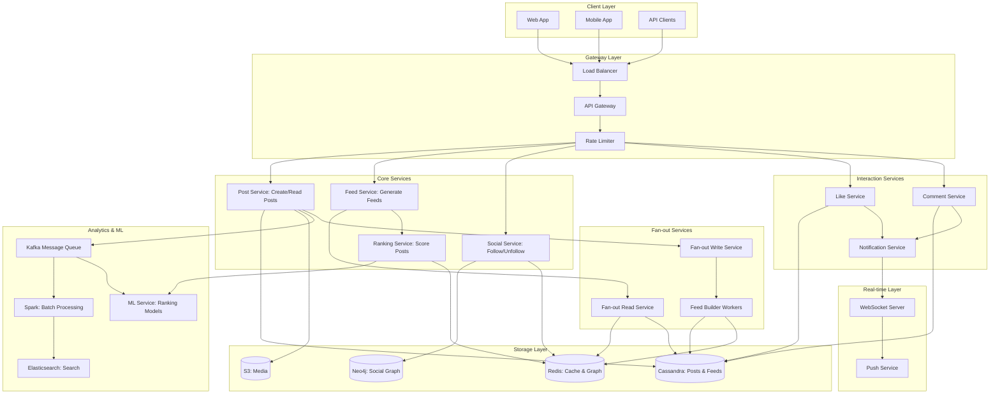
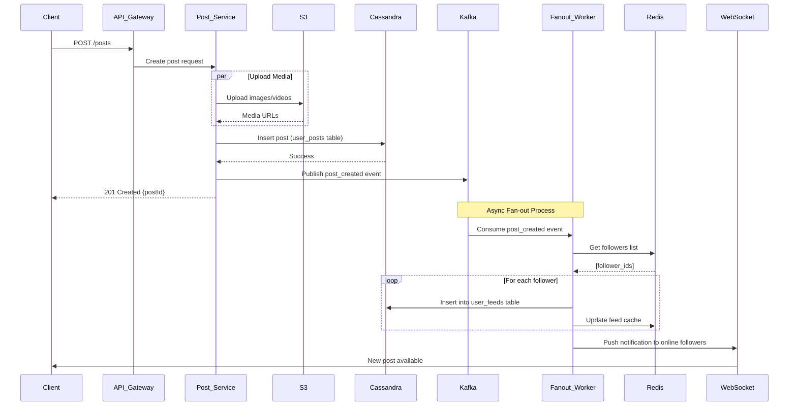
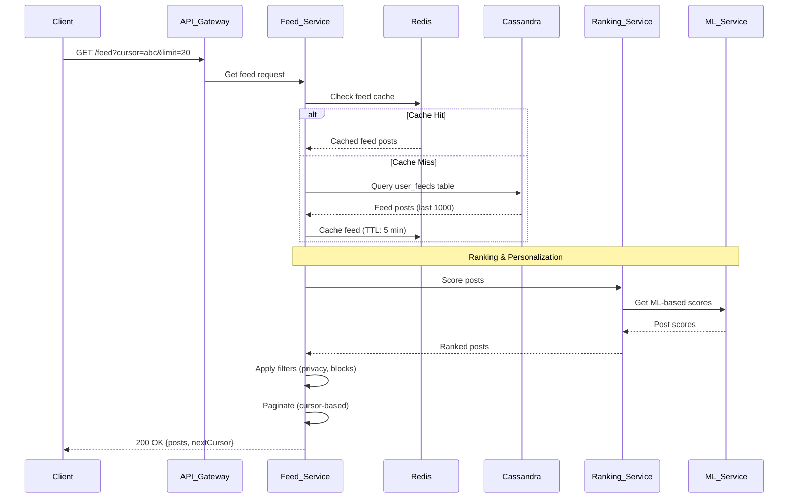
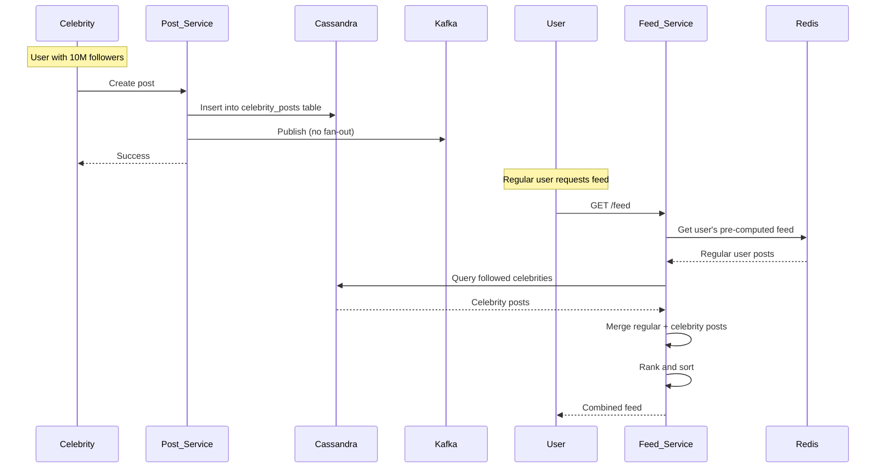
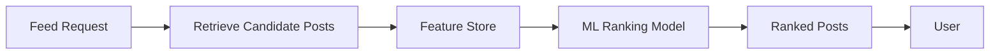

# Newsfeed System Design

## Problem Description

Design a scalable social media newsfeed system like Facebook, Twitter, or Instagram that displays personalized content to users. The system should aggregate posts from users' friends/followees, rank them by relevance, and deliver them with low latency. It must handle millions of concurrent users, support real-time updates, and scale to billions of posts while maintaining high availability and consistent user experience.

## What Distributed System Concepts Interviewer Expects

- **Fan-out Architecture**: Understanding of fan-out-on-write vs fan-out-on-read patterns
- **Feed Generation**: Pre-computed vs on-demand feed generation strategies
- **Ranking Algorithms**: Content ranking and personalization at scale
- **Push vs Pull Models**: Real-time updates using WebSockets, long polling, or server-sent events
- **Cache Invalidation**: Handling stale feed data when new posts arrive
- **Hot Users Problem**: Celebrities with millions of followers causing system bottlenecks
- **Eventual Consistency**: CAP theorem tradeoffs in distributed feed generation
- **Graph Database**: Social graph storage and traversal for connections
- **Time-Series Data**: Efficient storage and retrieval of chronological posts
- **Content Delivery**: CDN for media (images, videos) in posts

## Functional and Non-Functional Requirements

### Functional Requirements

1. **Post Creation**: Users can create posts with text, images, videos, links
2. **Follow/Unfollow**: Users can follow other users to see their content
3. **Feed Generation**: Display personalized feed with posts from followed users
4. **Feed Refresh**: Pull-to-refresh and automatic updates for new content
5. **Interactions**: Like, comment, share posts
6. **Notifications**: Real-time notifications for interactions
7. **Pagination**: Infinite scroll with cursor-based pagination
8. **Content Types**: Support text, images, videos, polls, links
9. **Privacy Settings**: Public, friends-only, or private posts
10. **Trending/Discovery**: Explore page with trending content

### Non-Functional Requirements

1. **Low Latency**: Feed loads in <200ms, new posts appear within seconds
2. **High Availability**: 99.99% uptime for core feed functionality
3. **Scalability**: Support 500M Daily Active Users (DAU)
4. **Consistency**: Eventually consistent feed is acceptable (slight delays tolerated)
5. **Personalization**: Relevant content ranking based on user preferences
6. **Media Performance**: Fast image/video loading with adaptive quality
7. **Real-time Updates**: New posts appear without manual refresh
8. **Fairness**: Balanced content from different creators
9. **Data Durability**: Zero loss of user posts
10. **Cost Efficiency**: Optimize for storage and compute at scale

## Capacity Estimation for DAU/MAU, Throughput, Storage

### User Metrics

Let's design for **500 Million Daily Active Users (DAU)** and **1.5 Billion Monthly Active Users (MAU)**, representing a large-scale social network like Facebook or Instagram.

Assume:
- **Average session**: 30 minutes per day
- **Average follows**: 200 users per person
- **Feed views per session**: User scrolls through 50 posts
- **Post creation rate**: 10% of DAU create posts, averaging 2 posts/day each

### Write Throughput (Post Creation)

Posts created per day:
- **Daily posts**: 500M DAU × 10% × 2 posts = **100 million posts/day**
- **Writes per second**: 100M / 86,400 ≈ **1,160 posts/second**
- **Peak writes** (3x average during peak hours): **~3,500 posts/second**

This write throughput is manageable with horizontal scaling. However, the fan-out operations (distributing posts to followers' feeds) create significantly more work.

### Fan-out Write Amplification

When a user posts, the system must update feeds for all their followers:
- **Average followers per user**: 200
- **Fan-out operations**: 1,160 posts/sec × 200 followers = **232,000 feed updates/second**
- **Peak fan-out**: **~700,000 feed updates/second**

This is the critical scaling challenge. With celebrities having millions of followers, a single post can trigger millions of feed updates.

### Read Throughput (Feed Generation)

Feed requests per day:
- **Feed views per user**: 500M users × 50 posts/session = **25 billion post views/day**
- **Feed requests**: Users typically load 20 posts at a time, so 25B / 20 = **1.25 billion feed requests/day**
- **Reads per second**: 1.25B / 86,400 ≈ **14,500 feed requests/second**
- **Peak reads**: **~45,000 feed requests/second**

Read-to-write ratio: ~12:1 (feed requests to post creation). This is relatively balanced compared to read-heavy systems.

### Storage Estimation

**Post Data**:
- Average post size:
  - Text: 500 bytes
  - Metadata (user_id, timestamp, likes, etc.): 500 bytes
  - Total per post (without media): 1 KB
- Daily post storage: 100M posts × 1 KB = **100 GB/day**
- Annual storage: 100 GB × 365 = **36.5 TB/year**

**Media Storage**:
- Assume 60% of posts have images, 10% have videos
- Image average: 500 KB per post
- Video average: 5 MB per post
- Daily media storage: (60M × 500KB) + (10M × 5MB) = 30 TB + 50 TB = **80 TB/day**
- Annual media storage: 80 TB × 365 = **29 PB/year**

**Feed Cache Storage**:
- Cache 1,000 posts per active user's feed
- 500M DAU × 1 KB × 1,000 posts = **500 TB** (in-memory cache)
- Use tiered caching to reduce cost

**Total Storage (5 years with 20% growth YoY)**:
- Posts metadata: ~36.5 TB × 5 × 1.5 average = **274 TB**
- Media: ~29 PB × 5 × 1.5 average = **218 PB**
- **Total**: ~**220 PB** over 5 years

With deduplication, compression, and lifecycle policies (delete old low-engagement posts), this can be reduced by 30-40%.

### Network Bandwidth

**Read bandwidth** (serving feeds):
- 45,000 requests/sec × 20 posts × 1 KB metadata = **900 MB/sec = 7.2 Gbps** (metadata)
- Media served via CDN: 45,000 requests/sec × 10 images × 500 KB = **225 GB/sec = 1.8 Tbps** (handled by CDN)

**Write bandwidth** (ingesting posts):
- 3,500 posts/sec × 1 KB = **3.5 MB/sec** (negligible)
- Media uploads: 3,500 posts/sec × 0.6 × 500 KB = **1 GB/sec = 8 Gbps** (media ingestion)

## Technologies Choices & Justification

### Application Layer
- **Go or Java**: High-performance, concurrent request handling for feed generation
- **Node.js**: Real-time WebSocket servers for live updates
- **Load Balancer**: AWS ALB or Nginx with consistent hashing for session affinity

### Graph Storage
- **Neo4j or Apache Cassandra**: Social graph storage (follows, friendships)
- **Redis Graph**: In-memory graph for hot paths (frequently accessed connections)

### Post Storage
- **Apache Cassandra or ScyllaDB**: Distributed NoSQL for time-series post data
- **Reasoning**: Write-optimized, handles time-series data excellently, eventual consistency acceptable

### Feed Cache
- **Redis Cluster**: In-memory cache for pre-computed feeds (fan-out-on-write)
- **Memcached**: Alternative for pure caching without persistence needs

### Object Storage
- **AWS S3 or Cloudflare R2**: Images and videos
- **CDN (CloudFront/Cloudflare)**: Global content delivery for media

### Message Queue
- **Apache Kafka**: Fan-out operations, feed updates, analytics
- **RabbitMQ**: Real-time notifications

### Search & Discovery
- **Elasticsearch**: Full-text search for posts, trending topics
- **Apache Spark**: Batch processing for trending algorithms

### Ranking & ML
- **Python (TensorFlow/PyTorch)**: ML models for feed ranking
- **Feature Store (Feast)**: Store user/post features for ranking

### Real-time Updates
- **WebSockets (Socket.io)**: Push new posts to connected clients
- **Server-Sent Events (SSE)**: Lightweight alternative for one-way updates

### Monitoring
- **Prometheus + Grafana**: Metrics and dashboards
- **Jaeger**: Distributed tracing
- **ELK Stack**: Centralized logging

## Database Selection

### Primary Database: Apache Cassandra

**Why Cassandra?**
- **Write-Optimized**: Handles 700K feed updates/second with linear scalability
- **Time-Series Perfect**: Natural fit for chronological post data (partition by user_id, sort by timestamp)
- **High Availability**: No single point of failure, multi-datacenter replication
- **Tunable Consistency**: Choose between consistency and availability per query
- **Proven at Scale**: Used by Instagram, Netflix, Apple for similar workloads

**Data Model**:
```
Partition Key: user_id (distributes data across nodes)
Clustering Key: post_timestamp (sorts data within partition)
```

### Social Graph: Neo4j + Redis

**Why Neo4j?**
- **Graph Queries**: Efficiently traverse social relationships (friends-of-friends, recommendations)
- **Cypher Query Language**: Expressive queries for complex graph patterns
- **Use Cases**: Friend suggestions, connection exploration, influence analysis

**Why Redis (Supplement)?**
- **Hot Graph Cache**: Cache frequently accessed connections in memory
- **Fast Lookups**: O(1) follower/following list retrieval
- **Pub/Sub**: Real-time follow/unfollow events

### Alternative: PostgreSQL + Graph Extensions

For smaller scale (<10M users), PostgreSQL with recursive CTEs can handle social graphs adequately.

## Data Modelling With Indexing or Sharding

### Cassandra Schema

#### 1. Posts Table
```sql
CREATE TABLE posts (
    post_id UUID PRIMARY KEY,
    user_id UUID,
    content TEXT,
    media_urls LIST<TEXT>,
    created_at TIMESTAMP,
    like_count INT,
    comment_count INT,
    share_count INT,
    privacy VARCHAR,
    INDEX idx_user_created (user_id, created_at)
);

-- Partition by user_id, sort by created_at for user timeline
CREATE TABLE user_posts (
    user_id UUID,
    created_at TIMESTAMP,
    post_id UUID,
    content TEXT,
    media_urls LIST<TEXT>,
    like_count INT,
    comment_count INT,
    PRIMARY KEY (user_id, created_at)
) WITH CLUSTERING ORDER BY (created_at DESC);
```

#### 2. Feeds Table (Pre-computed Feeds)
```sql
-- Fan-out-on-write approach
CREATE TABLE user_feeds (
    user_id UUID,
    feed_timestamp TIMESTAMP,
    post_id UUID,
    author_id UUID,
    content TEXT,
    media_urls LIST<TEXT>,
    score DOUBLE,  -- Ranking score
    PRIMARY KEY (user_id, feed_timestamp, post_id)
) WITH CLUSTERING ORDER BY (feed_timestamp DESC, post_id ASC);

-- Each user's feed stores posts from people they follow
-- Sorted by timestamp for chronological ordering
```

#### 3. Social Graph (in Redis)
```
# Followers: Set of user_ids who follow this user
SET followers:{user_id} [follower_id1, follower_id2, ...]

# Following: Set of user_ids this user follows
SET following:{user_id} [following_id1, following_id2, ...]

# Follower count (for quick access)
HASH user_stats:{user_id} followers_count 1000000 following_count 500
```

#### 4. Interactions Table
```sql
CREATE TABLE post_likes (
    post_id UUID,
    user_id UUID,
    liked_at TIMESTAMP,
    PRIMARY KEY (post_id, user_id)
);

CREATE TABLE post_comments (
    post_id UUID,
    comment_id UUID,
    user_id UUID,
    content TEXT,
    created_at TIMESTAMP,
    PRIMARY KEY (post_id, created_at, comment_id)
) WITH CLUSTERING ORDER BY (created_at DESC);
```

### Sharding Strategy

**Cassandra Auto-Sharding**:
- Cassandra automatically shards data using consistent hashing on partition key
- **Posts**: Sharded by `post_id` (even distribution)
- **User Feeds**: Sharded by `user_id` (co-locates user's feed on same nodes)
- **Replication Factor**: 3 (data replicated across 3 nodes)

**Hot User Handling**:
- Celebrities with millions of followers require special handling
- Store celebrity posts in separate table with read replicas
- Use fan-out-on-read for users with >1M followers

### Indexing Strategy

**Cassandra Secondary Indexes** (use sparingly):
- Secondary index on `user_posts.user_id` for fetching user's timeline
- Materialized views for different query patterns

**Elasticsearch Indexes**:
- Full-text index on post content for search
- Inverted index on hashtags for trending detection

## Service Decomposition With Responsibility & Communication



### Service Responsibilities

#### 1. Post Service
- **Responsibilities**:
  - Create new posts (text, images, videos)
  - Validate content (spam detection, profanity filter)
  - Upload media to S3
  - Store post metadata in Cassandra
  - Trigger fan-out process
- **API**: `POST /posts`, `GET /posts/{post_id}`, `DELETE /posts/{post_id}`
- **Technology**: Go for high concurrency
- **Scaling**: Stateless, horizontal scaling

#### 2. Feed Service
- **Responsibilities**:
  - Generate personalized feed for user
  - Merge pre-computed feed with real-time posts
  - Apply ranking algorithm
  - Paginate results
- **API**: `GET /feed?user_id={id}&cursor={cursor}&limit=20`
- **Technology**: Java/Go
- **Caching**: Heavy Redis usage for feed cache

#### 3. Fan-out Write Service
- **Responsibilities**:
  - When user creates post, distribute to all followers' feeds
  - Handle celebrity users differently (skip fan-out)
  - Batch updates to reduce load
  - Queue management for async processing
- **Technology**: Go with Kafka consumers
- **Scaling**: Multiple workers consuming from Kafka partitions

#### 4. Fan-out Read Service
- **Responsibilities**:
  - For celebrity posts, fetch posts on-demand when user requests feed
  - Merge celebrity posts with pre-computed feed
  - Cache results
- **Technology**: Go
- **Optimization**: Cache celebrity timelines separately

#### 5. Social Service
- **Responsibilities**:
  - Follow/unfollow users
  - Update social graph in Neo4j and Redis
  - Fetch follower/following lists
  - Friend recommendations
- **API**: `POST /users/{id}/follow`, `DELETE /users/{id}/unfollow`, `GET /users/{id}/followers`
- **Technology**: Java with Neo4j driver

#### 6. Ranking Service
- **Responsibilities**:
  - Score posts based on ML model
  - Consider: recency, engagement, user preferences, content type
  - Personalization based on user history
- **Technology**: Python (ML inference), gRPC for inter-service
- **Model**: TensorFlow Serving or PyTorch Serve

#### 7. WebSocket Server
- **Responsibilities**:
  - Maintain persistent connections with clients
  - Push new posts in real-time
  - Handle connection lifecycle
  - Authenticate connections
- **Technology**: Node.js with Socket.io
- **Scaling**: Sticky sessions with Redis Pub/Sub for cross-server messaging

#### 8. Notification Service
- **Responsibilities**:
  - Send notifications for likes, comments, mentions
  - Push notifications via FCM/APNs
  - In-app notifications
- **Technology**: Go
- **Queue**: Kafka for async processing

### Inter-Service Communication

**Synchronous** (gRPC/REST):
- Feed Service → Ranking Service
- Post Service → Social Service (get followers)
- API Gateway → All services

**Asynchronous** (Kafka):
- Post Created → Fan-out Service
- Like/Comment → Notification Service
- All interactions → Analytics Service

**Caching Patterns**:
- Cache-Aside: Check Redis → Query Cassandra → Update Redis
- Write-Through: Update Cassandra + Redis simultaneously

## API Design & Security

### REST API Endpoints

#### 1. Create Post
```http
POST /api/v1/posts
Authorization: Bearer <token>
Content-Type: application/json

Request:
{
  "content": "Just finished a great book!",
  "media": ["https://upload-url.com/abc123"],
  "privacy": "public",  // public, friends, private
  "location": "San Francisco, CA"
}

Response: 201 Created
{
  "postId": "uuid-123",
  "userId": "uuid-456",
  "content": "Just finished a great book!",
  "mediaUrls": ["https://cdn.example.com/abc123.jpg"],
  "createdAt": "2026-01-15T10:30:00Z",
  "likeCount": 0,
  "commentCount": 0
}
```

#### 2. Get Feed
```http
GET /api/v1/feed?cursor=abc123&limit=20
Authorization: Bearer <token>

Response: 200 OK
{
  "posts": [
    {
      "postId": "uuid-789",
      "author": {
        "userId": "uuid-456",
        "username": "john_doe",
        "avatarUrl": "https://cdn.example.com/avatar.jpg"
      },
      "content": "Hello world!",
      "mediaUrls": [],
      "createdAt": "2026-01-15T10:30:00Z",
      "likeCount": 42,
      "commentCount": 5,
      "hasLiked": false,
      "score": 0.95  // Ranking score
    }
  ],
  "nextCursor": "xyz789",
  "hasMore": true
}
```

#### 3. Follow User
```http
POST /api/v1/users/{userId}/follow
Authorization: Bearer <token>

Response: 200 OK
{
  "userId": "uuid-456",
  "isFollowing": true,
  "followerCount": 1001
}
```

#### 4. Like Post
```http
POST /api/v1/posts/{postId}/like
Authorization: Bearer <token>

Response: 200 OK
{
  "postId": "uuid-789",
  "likeCount": 43,
  "hasLiked": true
}
```

#### 5. Get User Timeline
```http
GET /api/v1/users/{userId}/posts?cursor=abc&limit=20
Authorization: Bearer <token> (optional, depends on privacy)

Response: 200 OK
{
  "posts": [...],
  "nextCursor": "xyz",
  "hasMore": true
}
```

#### 6. Search Posts
```http
GET /api/v1/search?q=machine+learning&type=posts&limit=20
Authorization: Bearer <token>

Response: 200 OK
{
  "results": [...],
  "total": 1523,
  "page": 1
}
```

### WebSocket API

```javascript
// Connect
const socket = io('wss://api.example.com', {
  auth: { token: 'Bearer <jwt>' }
});

// Subscribe to feed updates
socket.emit('subscribe_feed', { userId: 'uuid-123' });

// Receive new posts
socket.on('new_post', (post) => {
  // Display new post at top of feed
  console.log('New post:', post);
});

// Receive notifications
socket.on('notification', (notification) => {
  // Show notification
  console.log('New like:', notification);
});
```

### Security Measures

#### 1. Authentication & Authorization
- **JWT Tokens**: 24-hour access tokens, 30-day refresh tokens
- **OAuth 2.0**: Support for social login (Google, Facebook, Apple)
- **Token Rotation**: Automatic refresh before expiry

#### 2. Rate Limiting
```
Per User:
- Post creation: 100 posts/hour
- Feed requests: 1000 requests/hour
- Follow actions: 200 follows/day (prevent spam)
- Like/comment: 500 actions/hour

Per IP:
- Anonymous requests: 100 requests/hour
```

Implementation: Redis with sliding window counter

#### 3. Content Security
- **Input Validation**: Max post length 10,000 characters
- **Media Validation**: Max 10 images, 1 video per post, size limits
- **XSS Prevention**: Sanitize HTML, CSP headers
- **SQL Injection**: Parameterized queries (Cassandra CQL)
- **CSRF Protection**: CSRF tokens for state-changing operations

#### 4. Abuse Prevention
- **Spam Detection**: ML model to detect spam posts
- **Bot Detection**: CAPTCHA after suspicious activity
- **Content Moderation**: AI-based NSFW detection, hate speech filter
- **Report System**: User reporting with moderation queue

#### 5. Privacy & Compliance
- **GDPR**: Data export, right to deletion, consent management
- **COPPA**: Age verification for <13 users
- **Privacy Controls**: Public/friends/private posts, block users
- **Data Encryption**: TLS 1.3 in transit, AES-256 at rest

#### 6. API Security Headers
```http
Strict-Transport-Security: max-age=31536000; includeSubDomains
X-Content-Type-Options: nosniff
X-Frame-Options: DENY
X-XSS-Protection: 1; mode=block
Content-Security-Policy: default-src 'self'
Referrer-Policy: strict-origin-when-cross-origin
```

## High Level Flow Diagram

### Create Post and Fan-out Flow



### Feed Generation Flow



### Hybrid Fan-out Flow (Celebrity User)



## Deep Dive On Design

### 1. Fan-out Architecture: Write vs Read

**Fan-out-on-Write (Push Model)**:
- When user creates post, immediately write to all followers' feeds
- Pre-compute feeds in advance
- **Pros**: Fast feed reads (already computed), low latency for users
- **Cons**: High write amplification, slow for users with many followers

**Fan-out-on-Read (Pull Model)**:
- When user requests feed, fetch posts from all followed users
- Compute feed on-demand
- **Pros**: No write amplification, works for any follower count
- **Cons**: Slow feed generation, high read latency

**Hybrid Approach (Recommended)**:
```
if user.followers_count < 1_000_000:
    use fan_out_on_write()
else:
    use fan_out_on_read()  // Celebrity users
```

**Implementation**:
```python
def create_post(user_id, content):
    # Step 1: Store post
    post_id = generate_id()
    cassandra.insert('posts', {
        'post_id': post_id,
        'user_id': user_id,
        'content': content,
        'created_at': now()
    })

    # Step 2: Get follower count
    follower_count = redis.get(f'user_stats:{user_id}:followers_count')

    # Step 3: Decide fan-out strategy
    if follower_count < 1_000_000:
        # Fan-out-on-write for regular users
        kafka.publish('fanout_post', {
            'post_id': post_id,
            'user_id': user_id,
            'followers': redis.smembers(f'followers:{user_id}')
        })
    else:
        # Fan-out-on-read for celebrities
        cassandra.insert('celebrity_posts', {
            'user_id': user_id,
            'post_id': post_id,
            'created_at': now()
        })

    return post_id
```

**Fanout Worker**:
```python
def fanout_worker(event):
    post_id = event['post_id']
    followers = event['followers']

    # Batch insert (1000 at a time)
    batch_size = 1000
    for i in range(0, len(followers), batch_size):
        batch = followers[i:i+batch_size]

        # Cassandra batch insert
        for follower_id in batch:
            cassandra.insert('user_feeds', {
                'user_id': follower_id,
                'feed_timestamp': now(),
                'post_id': post_id,
                'author_id': event['user_id']
            })

        # Update Redis cache (for online users only)
        for follower_id in batch:
            if redis.exists(f'online:{follower_id}'):
                redis.lpush(f'feed:{follower_id}', post_id)
                redis.ltrim(f'feed:{follower_id}', 0, 999)  # Keep 1000
```

### 2. Feed Ranking Algorithm

**Factors Considered**:
1. **Recency**: Newer posts score higher (time decay function)
2. **Engagement**: Likes, comments, shares (viral content)
3. **User Affinity**: How often user interacts with author
4. **Content Type**: User preferences (videos > images > text)
5. **Dwell Time**: How long users typically view this content
6. **Diversity**: Balance content from different creators

**Scoring Formula**:
```
score = w1 * recency_score
      + w2 * engagement_score
      + w3 * affinity_score
      + w4 * content_type_score
      + w5 * diversity_penalty

where weights (w1-w5) are learned via ML model
```

**Implementation**:
```python
def rank_feed(posts, user_id):
    user_features = get_user_features(user_id)  # Cached in Redis

    scored_posts = []
    for post in posts:
        # Feature extraction
        features = {
            'recency': time_decay(post.created_at),
            'engagement': (post.likes + 2*post.comments + 3*post.shares) / post.age_hours,
            'affinity': get_user_affinity(user_id, post.author_id),
            'content_type': user_features.preferred_content_type_score(post.type),
            'author_follower_count': post.author.followers_count
        }

        # ML model inference
        score = ml_model.predict(features)
        scored_posts.append((post, score))

    # Sort by score (descending)
    scored_posts.sort(key=lambda x: x[1], reverse=True)
    return [post for post, score in scored_posts]
```

**ML Model**:
- **Architecture**: Gradient Boosted Decision Trees (LightGBM) or Neural Network
- **Training**: User interaction data (clicks, dwell time, likes)
- **Features**: 100+ features including user demographics, post metadata, temporal features
- **Update Frequency**: Retrain weekly, A/B test new models
- **Serving**: TensorFlow Serving or custom Go service with ONNX model

### 3. Cache Strategy

**Multi-Level Caching**:

**Level 1: Client-Side (Browser/App)**
- Cache feed for 5 minutes
- Show cached feed immediately, refresh in background
- Cache user profiles, avatars

**Level 2: CDN (CloudFront)**
- Cache media (images/videos): TTL 1 year
- Cache public profiles: TTL 1 hour
- No caching for personalized feeds

**Level 3: Redis (Application)**
- **Feed Cache**: Store 1000 recent posts per user, TTL 10 minutes
- **Social Graph Cache**: Follower/following lists, TTL 1 hour
- **Post Cache**: Individual post data, TTL 30 minutes
- **User Profile Cache**: User metadata, TTL 1 hour

**Cache Invalidation**:
```python
def on_new_post(post_id, author_id):
    # Invalidate author's timeline cache
    redis.delete(f'timeline:{author_id}')

    # For fan-out-on-write: Already updated feed cache
    # For fan-out-on-read: No action needed (will fetch new posts)

def on_follow(user_id, target_id):
    # Invalidate user's following list
    redis.delete(f'following:{user_id}')
    # Invalidate target's follower list
    redis.delete(f'followers:{target_id}')
    # Invalidate user's feed (will include new posts from target)
    redis.delete(f'feed:{user_id}')
```

**Cache Warming**:
- Pre-populate feed cache for highly active users during off-peak hours
- Warm cache on user login (async background task)

### 4. Real-time Updates

**WebSocket Architecture**:
```javascript
// Server-side (Node.js)
io.on('connection', (socket) => {
    const userId = authenticate(socket.handshake.auth.token);

    // Join user's room
    socket.join(`user:${userId}`);

    // Mark user as online
    redis.setex(`online:${userId}`, 300, 1);  // 5 min TTL

    // Subscribe to feed updates
    const redisSub = redis.subscribe(`feed:${userId}`);
    redisSub.on('message', (channel, post) => {
        socket.emit('new_post', JSON.parse(post));
    });

    socket.on('disconnect', () => {
        redis.del(`online:${userId}`);
    });
});

// When new post created
function pushToFollowers(postId, authorId, followerIds) {
    const post = getPost(postId);

    for (const followerId of followerIds) {
        // Publish to Redis Pub/Sub
        redis.publish(`feed:${followerId}`, JSON.stringify(post));
    }
}
```

**Fallback Mechanism**:
- If WebSocket disconnects, fall back to long-polling
- Client polls `GET /feed/updates?since=timestamp` every 30 seconds

### 5. Pagination with Cursor

**Why Cursor-based?**
- Offset pagination breaks with real-time inserts
- Cursor ensures consistent pagination even as feed updates

**Implementation**:
```python
def get_feed(user_id, cursor=None, limit=20):
    if cursor:
        # Decode cursor to get last_timestamp and last_post_id
        last_timestamp, last_post_id = decode_cursor(cursor)

        # Fetch posts after cursor
        posts = cassandra.query('''
            SELECT * FROM user_feeds
            WHERE user_id = ?
              AND (feed_timestamp, post_id) < (?, ?)
            ORDER BY feed_timestamp DESC
            LIMIT ?
        ''', user_id, last_timestamp, last_post_id, limit)
    else:
        # First page
        posts = cassandra.query('''
            SELECT * FROM user_feeds
            WHERE user_id = ?
            ORDER BY feed_timestamp DESC
            LIMIT ?
        ''', user_id, limit)

    # Generate next cursor
    if len(posts) == limit:
        last_post = posts[-1]
        next_cursor = encode_cursor(last_post.feed_timestamp, last_post.post_id)
    else:
        next_cursor = None

    return posts, next_cursor

def encode_cursor(timestamp, post_id):
    data = f'{timestamp.isoformat()}:{post_id}'
    return base64.urlsafe_b64encode(data.encode()).decode()
```

### 6. Handling Data Consistency

**Consistency Tradeoffs**:
- **Strong Consistency**: Not required (eventual consistency acceptable)
- **Scenario**: User creates post → Followers see it within 1-2 seconds
- **Acceptable Delay**: 1-5 seconds for feed updates

**Cassandra Consistency Levels**:
```python
# Write: Use QUORUM (2 out of 3 replicas)
session.execute(insert_query, consistency_level=ConsistencyLevel.QUORUM)

# Read: Use ONE (fastest, eventual consistency)
session.execute(select_query, consistency_level=ConsistencyLevel.ONE)

# Critical reads (e.g., user profile): Use QUORUM
session.execute(select_query, consistency_level=ConsistencyLevel.QUORUM)
```

**Handling Split-Brain**:
- Use Last-Write-Wins (LWW) with timestamps
- Cassandra's conflict resolution handles this automatically

## Reliability and Monitoring

### High Availability Architecture

**Multi-Region Deployment**:
- **Primary Region**: US-East (50% traffic)
- **Secondary Regions**: EU-West (30%), Asia-Pacific (20%)
- **Active-Active**: All regions serve traffic, data replicated async

**Redundancy**:
- **Application Servers**: Auto-scaling (min: 50, max: 1000)
- **Cassandra Cluster**: 30 nodes per region, RF=3
- **Redis Cluster**: 20 nodes (10 masters, 10 replicas)
- **Kafka**: 15 brokers per region

**Load Balancing**:
- **Global**: GeoDNS routing to nearest region
- **Regional**: AWS ALB distributes to availability zones
- **Service-Level**: Client-side load balancing for gRPC

### Monitoring Metrics

**Golden Signals**:
1. **Latency**:
   - Feed generation P99 < 200ms
   - Post creation P99 < 500ms
2. **Traffic**: 45K requests/sec
3. **Errors**: <0.1% error rate
4. **Saturation**:
   - Cassandra: 60-70% CPU utilization
   - Redis: 80% memory utilization

**Business Metrics**:
```
# Feed health
feed_generation_latency_seconds{percentile="p99"}
feed_posts_count{user_type="regular|celebrity"}
feed_refresh_rate

# Engagement
posts_created_total
likes_per_post_avg
comments_per_post_avg
dau_count
session_duration_seconds

# Fan-out
fanout_queue_depth
fanout_processing_latency_seconds
celebrity_posts_count
```

**Alerts**:
- Feed latency P99 > 500ms for 5 min → Critical
- Post creation failure rate > 1% → Critical
- Kafka consumer lag > 100K messages → Warning
- Redis memory > 90% → Warning
- Cassandra node down → Critical

### Disaster Recovery

**Backup Strategy**:
- **Cassandra**: Incremental backups every 6 hours to S3
- **Redis**: RDB snapshots every hour
- **S3 Media**: Cross-region replication enabled

**Recovery Objectives**:
- **RTO**: 15 minutes (failover to secondary region)
- **RPO**: 5 minutes (acceptable data loss)

**Failure Scenarios**:
1. **Region Failure**: Automatic DNS failover to healthy region (5 min)
2. **Database Failure**: Cassandra auto-repairs, Redis failover (30 sec)
3. **Service Failure**: Auto-scaling replaces unhealthy instances (2 min)

## Bottlenecks and Failure Points In This Design

### 1. Celebrity User Bottleneck

**Problem**: User with 50M followers creates post → 50M feed updates

**Impact**:
- Kafka queue overwhelmed
- Fanout workers lag behind
- Followers experience delayed feed updates

**Mitigations**:
- Hybrid fan-out (fan-out-on-read for >1M followers)
- Separate Kafka topic for celebrity posts
- Pre-compute celebrity timelines hourly
- Cache celebrity feeds separately

### 2. Thundering Herd on Cache Expiration

**Problem**: Popular post cache expires → 10K simultaneous requests hit Cassandra

**Mitigations**:
- Staggered cache expiration (add random jitter)
- Cache locking (first request regenerates, others wait)
- Cache pre-warming for trending content

### 3. Hot Partition in Cassandra

**Problem**: Celebrity user's timeline partition becomes hot spot

**Mitigations**:
- Separate table for celebrity posts with read replicas
- Client-side caching
- Use different partition key strategy (time-based buckets)

### 4. Kafka Consumer Lag

**Problem**: Fanout workers can't keep up with post creation rate

**Impact**: Feed updates delayed by minutes/hours

**Mitigations**:
- Horizontal scaling of fanout workers (100+ workers)
- Prioritize posts from active users
- Batch processing (process 1000 followers at a time)
- Circuit breaker to skip fan-out during extreme load

### 5. Redis Memory Exhaustion

**Problem**: Feed cache grows beyond available memory

**Mitigations**:
- LRU eviction policy
- Tiered caching (hot data in Redis, warm in Memcached)
- Reduce cache TTL during high load
- Separate Redis clusters by data type

### 6. S3 Rate Limits

**Problem**: 1M image uploads/hour exceeds S3 per-prefix limits

**Mitigations**:
- Use randomized prefixes: `media/{random_id}/{year}/{month}/{file}`
- S3 Transfer Acceleration
- Multiple S3 buckets with load balancing
- Pre-signed URLs for direct client uploads

### 7. Feed Ranking Latency

**Problem**: ML model inference adds 100-200ms latency to feed generation

**Mitigations**:
- Pre-compute scores during fan-out
- Use lightweight models (ONNX for fast inference)
- Batch scoring (score 100 posts at once)
- GPU instances for ML inference

### 8. WebSocket Connection Limits

**Problem**: Single server can handle ~64K concurrent WebSocket connections

**Impact**: Can't support 500M concurrent users

**Mitigations**:
- Horizontal scaling (1000+ WebSocket servers)
- Sticky sessions with consistent hashing
- Redis Pub/Sub for cross-server messaging
- Graceful degradation to polling

### 9. Cassandra Compaction Storms

**Problem**: Heavy writes cause compaction to fall behind → read latency spikes

**Mitigations**:
- Size-tiered compaction strategy (STCS)
- Rate-limit compactions during peak hours
- Separate write and read workloads (different tables)
- Monitor compaction lag

### 10. Cross-Region Replication Lag

**Problem**: User in Asia posts → Users in US don't see it for 30 seconds

**Mitigations**:
- Acceptable for eventual consistency
- Active-active with conflict resolution
- Prioritize same-region followers for fan-out
- Show "syncing" indicator to users

## Where AI Fits in This Design

### 1. Feed Ranking and Personalization

**Use Case**: Predict which posts users will engage with

**Implementation**:
- **Model**: Two-tower neural network (user tower + post tower)
- **Features**:
  - User: demographics, past interactions, dwell time history
  - Post: content type, author popularity, engagement velocity
- **Training**: Offline training on 7 days of interaction data
- **Serving**: Real-time inference via TensorFlow Serving
- **Optimization**: Post embeddings pre-computed and cached

**Architecture**:


**Metrics**:
- CTR (click-through rate): Target 15% improvement
- Dwell time: Target 20% increase
- DAU retention: Target 5% improvement

### 2. Content Moderation

**Use Case**: Detect hate speech, NSFW content, spam, fake news

**Implementation**:
- **Text**: BERT-based classifier for hate speech
- **Images**: ResNet-based NSFW detector
- **Videos**: Frame-by-frame analysis + audio transcription
- **Pipeline**: Async processing via Kafka

**Actions**:
- Confidence > 95%: Auto-remove + notify user
- Confidence 70-95%: Flag for human review
- Confidence < 70%: Allow but monitor

**False Positive Handling**:
- Users can appeal
- Human moderators review appeals
- Retrain model with corrected labels

### 3. Smart Notifications

**Use Case**: Send notifications only when user likely to engage

**Implementation**:
- **Model**: Predict probability of user opening notification
- **Features**: Time of day, user activity patterns, notification type, post author
- **Action**: Only send if probability > 40%
- **Result**: 60% reduction in notification spam, 2x engagement rate

### 4. Trending Topic Detection

**Use Case**: Identify viral content and trending hashtags

**Implementation**:
- **Real-time**: Spark Streaming on Kafka events
- **Algorithm**: Count hashtag mentions in rolling 1-hour window
- **Scoring**: `score = mention_count * velocity * diversity`
- **Velocity**: Rate of increase
- **Diversity**: Number of unique users mentioning

**Use Cases**:
- Show "Trending Now" section
- Boost trending posts in feed
- Send trending topic notifications

### 5. Friend Recommendations

**Use Case**: Suggest users to follow based on social graph

**Implementation**:
- **Graph Neural Network (GNN)**: Learn embeddings from social graph
- **Collaborative Filtering**: "Users who followed X also followed Y"
- **Content-Based**: Similar interests, demographics
- **Hybrid Model**: Combine all signals

**Architecture**:
```python
# Graph traversal
def recommend_friends(user_id, k=10):
    # Friends of friends (2-hop)
    candidates = neo4j.query('''
        MATCH (user:User {id: $user_id})-[:FOLLOWS]->(friend)-[:FOLLOWS]->(fof)
        WHERE NOT (user)-[:FOLLOWS]->(fof) AND user <> fof
        RETURN fof, count(*) as mutual_friends
        ORDER BY mutual_friends DESC
        LIMIT 100
    ''', user_id=user_id)

    # Score with ML model
    scores = ml_model.predict(candidates)
    return top_k(candidates, scores, k)
```

### 6. Content Understanding and Tagging

**Use Case**: Automatically tag posts with topics (sports, politics, food)

**Implementation**:
- **NLP**: Multi-label classification with BERT
- **Vision**: Image recognition with EfficientNet
- **Use Cases**:
  - Better search
  - Topic-based filtering
  - Personalized topic preferences

### 7. Spam and Bot Detection

**Use Case**: Identify fake accounts and bot behavior

**Implementation**:
- **Features**:
  - Account age, follower/following ratio
  - Posting frequency, content similarity
  - Interaction patterns (likes/comments/shares ratio)
- **Model**: Gradient boosted trees (LightGBM)
- **Action**: Shadowban or require verification

**Real-time Detection**:
```python
def check_bot_behavior(user_id):
    features = {
        'account_age_days': get_account_age(user_id),
        'follower_following_ratio': get_ratio(user_id),
        'posts_per_hour': get_post_rate(user_id),
        'content_similarity': calculate_similarity(user_id),
    }

    bot_probability = ml_model.predict(features)

    if bot_probability > 0.9:
        shadowban(user_id)
    elif bot_probability > 0.7:
        require_verification(user_id)
```

### 8. Smart Cropping and Thumbnail Generation

**Use Case**: Generate optimal thumbnails for images/videos

**Implementation**:
- **Saliency Detection**: Identify important regions in image
- **Face Detection**: Keep faces centered in thumbnails
- **Action Recognition**: Select best video frame as thumbnail

### 9. Automatic Captioning

**Use Case**: Generate alt text for images (accessibility + SEO)

**Implementation**:
- **Model**: Image captioning with vision transformer
- **Benefit**: Improve accessibility for visually impaired users

### 10. Engagement Prediction for Creators

**Use Case**: Help creators optimize posting time and content

**Implementation**:
- **Model**: Predict engagement (likes, shares) for draft post
- **Features**: Content, posting time, user's audience
- **UI**: "Best time to post: Today at 6 PM"

**Business Value**:
- Increase creator satisfaction
- Boost overall platform engagement
- Premium feature for monetization

## 5 Most Asked Follow-Up Questions

### Q1: How do you handle feed consistency when a user unfollows someone?

**Answer**:

When User A unfollows User B, we need to remove B's posts from A's feed while maintaining consistency.

**Immediate Action**:
```python
def unfollow(user_id, target_id):
    # 1. Update social graph
    redis.srem(f'following:{user_id}', target_id)
    redis.srem(f'followers:{target_id}', user_id)
    neo4j.query('MATCH (a:User {id: $user_id})-[r:FOLLOWS]->(b:User {id: $target_id}) DELETE r')

    # 2. Invalidate feed cache
    redis.delete(f'feed:{user_id}')

    # 3. Async cleanup (not critical)
    kafka.publish('unfollow_event', {
        'user_id': user_id,
        'target_id': target_id
    })

    return {'success': True}
```

**Background Cleanup** (Eventual Consistency):
```python
def cleanup_unfollowed_posts(user_id, target_id):
    # Delete posts from unfollowed user in feed table
    cassandra.execute('''
        DELETE FROM user_feeds
        WHERE user_id = ? AND author_id = ?
    ''', user_id, target_id)

    # This is not time-critical and can be done asynchronously
    # Feed cache is already invalidated, so next feed request will be correct
```

**Feed Generation After Unfollow**:
- On next feed request, cache is empty → regenerate from Cassandra
- Background cleanup ensures Cassandra is eventually consistent
- Time window: 1-2 minutes for full consistency

**Edge Case - User Refreshes Feed Immediately**:
- Feed regenerated from Cassandra
- Cassandra query filters by current following list (from Redis)
- Even if cleanup hasn't completed, feed is correct because we query: `WHERE author_id IN (current_following_list)`

**Why This Works**:
- Feed correctness depends on current following list (Redis), not Cassandra data
- Cassandra cleanup is just storage optimization
- No user-facing inconsistency

### Q2: How would you implement a "Stories" feature (like Instagram/Snapchat)?

**Answer**:

Stories are ephemeral content that disappear after 24 hours and require different architecture than regular feed.

**Key Differences**:
- **Ephemeral**: Auto-delete after 24 hours
- **Sequential**: Must be viewed in order
- **View Tracking**: Track who viewed each story
- **Real-time**: Must appear immediately for followers

**Architecture Changes**:

**Storage** (Use Redis for ephemeral data):
```python
# Stories data structure
ZADD stories:{user_id} {timestamp} {story_id}  # Sorted set by timestamp
HASH story:{story_id} {
    'user_id': 'uuid',
    'media_url': 'https://...',
    'created_at': timestamp,
    'expires_at': timestamp + 24h,
    'view_count': 0
}
SETEX story:{story_id}:viewers 24h {user_id1, user_id2, ...}  # Set of viewers
```

**TTL-based Expiration**:
- Redis automatically deletes stories after 24 hours
- Cron job cleans up S3 media files for expired stories

**Stories Feed**:
```python
def get_stories_feed(user_id):
    # Get all followed users
    following = redis.smembers(f'following:{user_id}')

    stories_by_user = []
    for followed_id in following:
        # Get active stories (not expired)
        now = time.time()
        stories = redis.zrangebyscore(
            f'stories:{followed_id}',
            now - 86400,  # Last 24 hours
            now
        )

        if stories:
            # Check if user has viewed all stories
            unviewed = []
            for story_id in stories:
                if not redis.sismember(f'story:{story_id}:viewers', user_id):
                    unviewed.append(story_id)

            stories_by_user.append({
                'user_id': followed_id,
                'stories': stories,
                'unviewed_count': len(unviewed),
                'has_unviewed': len(unviewed) > 0
            })

    # Sort: Users with unviewed stories first
    stories_by_user.sort(key=lambda x: x['has_unviewed'], reverse=True)

    return stories_by_user
```

**View Tracking**:
```python
def view_story(story_id, viewer_id):
    # Add viewer
    redis.sadd(f'story:{story_id}:viewers', viewer_id)

    # Increment view count
    redis.hincrby(f'story:{story_id}', 'view_count', 1)

    # Notify story creator (async)
    kafka.publish('story_viewed', {
        'story_id': story_id,
        'viewer_id': viewer_id
    })
```

**Real-time Updates**:
- When user posts story, push to all online followers via WebSocket
- Followers see red ring around profile picture indicating new story

**Storage Optimization**:
- Stories in Redis (ephemeral, fast)
- Regular posts in Cassandra (permanent, durable)
- Media in S3 with 24-hour lifecycle policy for stories

**Capacity**:
- 10% of users post 3 stories/day = 50M users × 3 = 150M stories/day
- Storage: 150M × 5MB average = **750 TB/day** (temporary)
- After 24 hours: Auto-deleted, so steady-state storage is **750 TB**

### Q3: How do you prevent feed manipulation and gaming the algorithm?

**Answer**:

Users may try to game the ranking algorithm to get more visibility through fake engagement, engagement pods, or clickbait.

**Detection Strategies**:

**1. Engagement Velocity Analysis**:
```python
def detect_fake_engagement(post_id):
    # Get engagement timeline
    likes_timeline = get_likes_over_time(post_id)

    # Calculate velocity (likes per minute)
    velocity = calculate_velocity(likes_timeline)

    # Red flags:
    # - Sudden spike (0 to 1000 likes in 1 minute)
    # - Unnatural pattern (exactly 10 likes every minute)
    # - Engagement from new accounts or bots

    if is_suspicious_pattern(velocity):
        # Demote post in ranking
        apply_penalty(post_id, penalty_factor=0.5)

        # Investigate likers
        likers = get_likers(post_id)
        bot_probability = check_accounts(likers)

        if bot_probability > 0.7:
            # Remove fake likes
            remove_fake_engagement(post_id, likers)
```

**2. Engagement Pod Detection**:
- Detect groups of users who always like each other's posts
- **Graph Analysis**: Find tightly connected clusters with unrealistic engagement
- **Action**: Reduce ranking boost from these interactions

**3. Clickbait Detection**:
```python
def detect_clickbait(post_content):
    # NLP features
    features = {
        'excessive_caps': count_caps_words(post_content),
        'sensational_words': count_words(['shocking', 'you wont believe', 'secret']),
        'question_hook': post_content.endswith('?'),
        'emoji_count': count_emojis(post_content),
        'actual_engagement_rate': get_engagement_rate(post_id),
        'expected_engagement_rate': predict_engagement(post_content)
    }

    clickbait_score = ml_model.predict(features)

    if clickbait_score > 0.8:
        # Demote in feed
        apply_penalty(post_id, penalty_factor=0.7)
```

**4. Dwell Time vs Engagement Mismatch**:
- Post with high likes but low dwell time → Likely engagement pod
- Users liked without actually reading/viewing

**5. Account Authenticity Score**:
```python
def calculate_authenticity_score(user_id):
    score = 1.0

    # Penalties
    if account_age < 30_days: score *= 0.7
    if follower_following_ratio > 100: score *= 0.5  # Suspicious
    if post_frequency > 50/day: score *= 0.6  # Bot-like
    if profile_incomplete: score *= 0.8
    if email_not_verified: score *= 0.5

    # Bonuses
    if phone_verified: score *= 1.2
    if has_genuine_interactions: score *= 1.3

    return min(score, 1.0)
```

**6. Diverse Engagement Sources**:
- Boost posts with engagement from diverse users (different demographics, locations)
- Penalize posts where all engagement comes from similar accounts

**7. Historical Behavior Analysis**:
- Track user's past violations
- Apply progressive penalties (first warning, then shadowban, then ban)

**8. A/B Testing New Signals**:
- Continuously experiment with new ranking signals
- Don't reveal exact algorithm to prevent gaming

**9. Human Review for High-Impact Cases**:
- Posts going viral (>1M views) reviewed by human moderators
- User reports trigger manual review

**10. Transparency for Creators**:
- Show creators their "content quality score"
- Educate on best practices
- Discourage gaming by making authentic content easier

### Q4: How would you implement a "recommended for you" section based on interests, not just follows?

**Answer**:

This requires content-based recommendations beyond the social graph.

**Architecture**:

**1. Interest Extraction**:
```python
def extract_user_interests(user_id):
    # Analyze user's interactions
    liked_posts = get_liked_posts(user_id, limit=1000)
    viewed_posts = get_viewed_posts(user_id, limit=5000)
    followed_users = get_following(user_id)

    # Extract topics from posts
    topics = []
    for post in liked_posts + viewed_posts:
        post_topics = extract_topics(post.content)  # ML model
        topics.extend(post_topics)

    # Weight by recency and interaction type
    # (like > view > follow)
    weighted_topics = calculate_weights(topics)

    # Store in user profile
    redis.zadd(f'interests:{user_id}', weighted_topics)

    return top_interests(weighted_topics, k=20)
```

**2. Post Embedding Generation**:
```python
def generate_post_embedding(post_id):
    post = get_post(post_id)

    # Multi-modal embedding
    text_embedding = bert_model.encode(post.content)

    if post.media:
        image_embedding = vision_model.encode(post.media[0])
        # Concatenate or average
        embedding = concat(text_embedding, image_embedding)
    else:
        embedding = text_embedding

    # Store in vector database
    pinecone.upsert(post_id, embedding, metadata={
        'author_id': post.author_id,
        'created_at': post.created_at,
        'engagement_score': post.engagement_score
    })

    return embedding
```

**3. Recommendation Generation**:
```python
def get_recommendations(user_id, limit=20):
    # Get user interest embedding (averaged from liked posts)
    user_interests = redis.zrange(f'interests:{user_id}', 0, -1, withscores=True)
    user_embedding = compute_user_embedding(user_interests)

    # Vector similarity search
    similar_posts = pinecone.query(
        vector=user_embedding,
        top_k=100,
        filter={
            'created_at': {'$gte': now() - 7_days},  # Recent posts only
            'author_id': {'$nin': get_following(user_id)}  # Not already following
        }
    )

    # Re-rank with ML model (consider engagement, diversity)
    candidates = []
    for post in similar_posts:
        score = ml_ranking_model.predict({
            'similarity': post.score,
            'engagement': post.metadata['engagement_score'],
            'recency': now() - post.metadata['created_at'],
            'user_diversity': calculate_diversity(user_id, post.author_id)
        })
        candidates.append((post, score))

    # Sort and return
    candidates.sort(key=lambda x: x[1], reverse=True)
    return [post for post, score in candidates[:limit]]
```

**4. Hybrid Feed**:
```python
def generate_hybrid_feed(user_id, limit=50):
    # 70% following-based feed
    following_posts = get_following_feed(user_id, limit=35)

    # 30% recommendation-based
    recommended_posts = get_recommendations(user_id, limit=15)

    # Interleave: 2 following posts, 1 recommended
    feed = []
    for i in range(max(len(following_posts), len(recommended_posts))):
        if i*2 < len(following_posts):
            feed.append(following_posts[i*2])
        if i*2+1 < len(following_posts):
            feed.append(following_posts[i*2+1])
        if i < len(recommended_posts):
            feed.append(recommended_posts[i])

    return feed[:limit]
```

**5. Topic Taxonomy**:
- Maintain hierarchy: Sports > Football > NFL > Dallas Cowboys
- Tag posts with topics (manual + ML)
- Allow users to select interests during onboarding

**6. Collaborative Filtering**:
```python
def collaborative_filtering(user_id):
    # Find similar users
    similar_users = find_similar_users(user_id, k=100)

    # Get posts liked by similar users
    recommendations = []
    for similar_user in similar_users:
        liked_posts = get_liked_posts(similar_user, limit=50)
        recommendations.extend(liked_posts)

    # Filter out already seen posts
    recommendations = filter_unseen(user_id, recommendations)

    return recommendations
```

**7. Explore Page**:
- Dedicated page for discovery
- Categories: Trending, For You, Topics (Sports, Tech, Food)
- A/B test different ranking algorithms

**8. Feedback Loop**:
- Track interactions with recommended posts
- Retrain models weekly
- Implicit feedback (views, dwell time) + explicit (hide post, not interested)

**9. Cold Start Problem**:
- New users: Show trending posts + onboarding interests
- New posts: Boost to small audience, measure engagement, decide if to promote

**10. Privacy**:
- Allow users to opt out of personalization
- Show chronological feed instead
- Transparent about data usage

### Q5: How do you handle content going viral and the resulting traffic spike?

**Answer**:

When a post goes viral (e.g., 10M views in 1 hour), the system experiences:
- 10M feed reads including this post
- Huge traffic to post's media (image/video)
- Massive database reads for post data
- High load on ranking service

**Immediate Detection**:
```python
def detect_viral_content():
    # Real-time analytics from Kafka
    for post_id, view_count in get_trending_posts():
        views_last_hour = get_views_last_hour(post_id)

        if views_last_hour > 100_000:  # Threshold for viral
            mark_as_viral(post_id)
            trigger_optimizations(post_id)
```

**Optimizations for Viral Content**:

**1. Aggressive Caching**:
```python
def optimize_viral_post(post_id):
    post_data = get_post(post_id)

    # Cache in multiple layers
    # Redis (1 hour TTL)
    redis.setex(f'viral_post:{post_id}', 3600, serialize(post_data))

    # CDN (cache at edge, 30 min TTL)
    cdn.cache(f'/posts/{post_id}', post_data, ttl=1800)

    # Pre-warm cache in all regions
    for region in ['us-east', 'eu-west', 'ap-south']:
        redis[region].setex(f'viral_post:{post_id}', 3600, serialize(post_data))
```

**2. Media Optimization**:
```python
def optimize_viral_media(media_url):
    # Increase CDN cache TTL
    cdn.update_ttl(media_url, ttl=7200)  # 2 hours

    # Pre-push to all edge locations
    cdn.pre_push(media_url, regions='all')

    # Generate multiple resolutions (if not already)
    if not exists_thumbnails(media_url):
        async_generate_thumbnails(media_url)
```

**3. Read Replica Scaling**:
```python
def scale_read_capacity(post_id):
    # Add dedicated read replicas for this post
    # (if using MySQL/PostgreSQL instead of Cassandra)

    # Cassandra: Already distributed, but increase replication factor temporarily
    cassandra.alter_table('posts', replication_factor=5)  # From 3 to 5
```

**4. Rate Limiting Bypass**:
```python
def handle_viral_post_request(post_id):
    # Bypass rate limiting for GET requests on viral posts
    # (writes still rate-limited to prevent abuse)

    if is_viral(post_id) and request.method == 'GET':
        return serve_from_cache(post_id)  # Fast path
    else:
        return apply_rate_limit_and_serve(post_id)
```

**5. Auto-Scaling**:
```
# CloudWatch alarm triggers
if feed_service_cpu > 80% for 3 minutes:
    scale_out(feed_service, target=current_instances * 1.5)

if redis_memory > 85%:
    provision_additional_redis_nodes()

if cassandra_read_latency_p99 > 100ms:
    add_cassandra_read_replicas()
```

**6. Circuit Breaker for Non-Critical Features**:
```python
def get_feed(user_id):
    posts = get_feed_posts(user_id)

    # If system under heavy load, skip expensive operations
    if system_load > 90%:
        # Skip ML ranking (use simple chronological)
        return posts[:50]

    try:
        ranked_posts = ranking_service.rank(posts)
        return ranked_posts
    except TimeoutError:
        # Fallback to unranked
        return posts[:50]
```

**7. Queue Management**:
```python
def manage_kafka_backlog():
    lag = kafka.get_consumer_lag('fanout_workers')

    if lag > 1_000_000:  # Too much backlog
        # Prioritize fan-out for non-viral posts
        # Skip fan-out for viral posts (already in everyone's feed via cache)

        # Or: Add more fanout workers dynamically
        kubernetes.scale('fanout-workers', replicas=current + 50)
```

**8. Graceful Degradation**:
- Disable real-time updates (WebSockets) temporarily
- Fall back to polling
- Show "experiencing high traffic" message

**9. Traffic Shaping**:
```python
def shape_traffic(post_id):
    # Introduce small delay for non-critical requests
    if is_viral(post_id) and not is_critical_user(request.user):
        time.sleep(0.1)  # 100ms delay to spread load
```

**10. Post-Mortem Analysis**:
- Analyze what went wrong
- Adjust thresholds and auto-scaling policies
- Improve detection and response time

**Real-World Example (Twitter)**:
- When Obama's "Four more years" tweet went viral
- 800K+ retweets in 24 hours
- Twitter served it via aggressive CDN caching
- Generated revenue from increased ad impressions

**Cost Implications**:
- Viral post with 10M views can cost $10K+ in CDN bandwidth
- Auto-scaling can increase compute costs by 3-5x during spike
- Trade-off: Cost vs user experience
- Business decision: Worth it for user acquisition and engagement

---

**End of Document**

This comprehensive newsfeed system design covers all critical aspects of building a production-ready social media feed at massive scale, suitable for a staff engineer interview with deep technical expertise.
