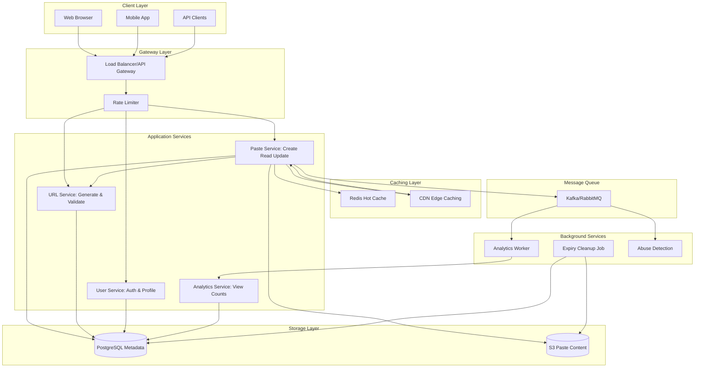
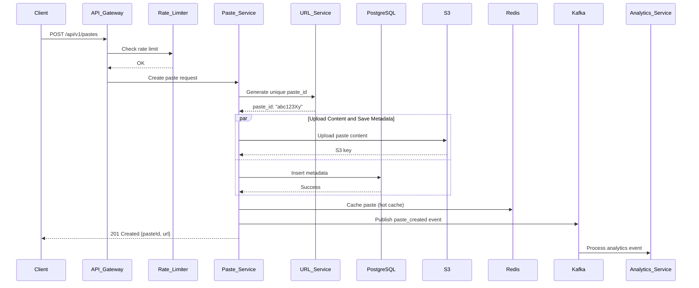
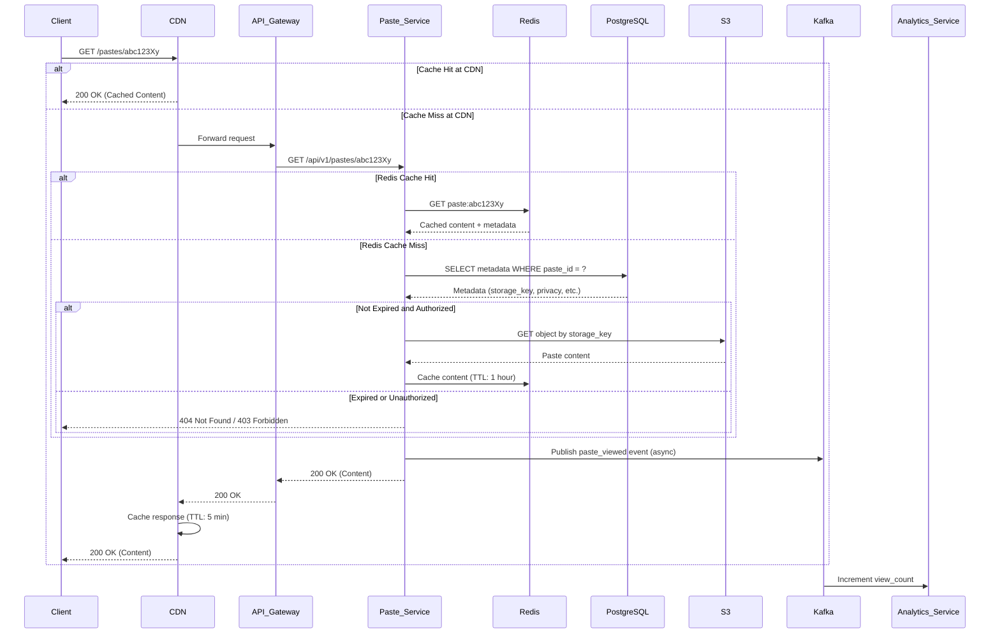
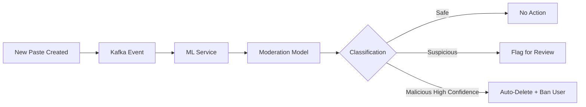
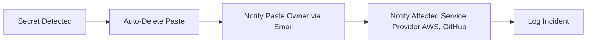
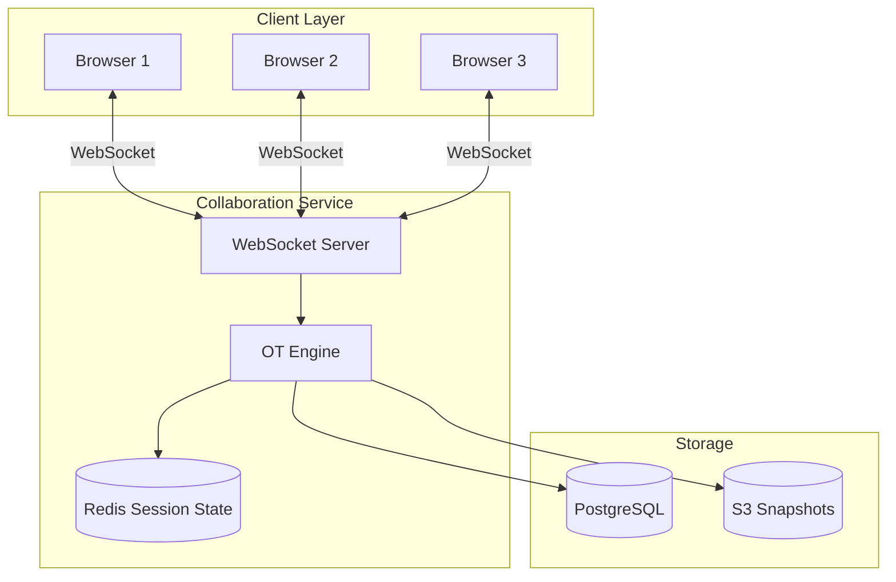

# Pastebin System Design

## Problem Description

Design a scalable web service like Pastebin that allows users to store and share plain text snippets. Users can create pastes with optional expiration times, custom URLs, and privacy settings (public, unlisted, private). The system should generate short URLs for easy sharing and support high read throughput with millions of daily users.

## What Distributed System Concepts Interviewer Expects

- **URL Shortening & ID Generation**: Understanding of distributed ID generation strategies (snowflake, UUID, base62 encoding)
- **Caching Strategy**: Multi-layer caching for frequently accessed pastes
- **Storage Partitioning**: Sharding strategies for massive text storage
- **Content Delivery**: CDN integration for static content and popular pastes
- **Rate Limiting**: Preventing abuse and spam
- **Data Expiration**: Efficient TTL-based cleanup mechanisms
- **Consistency vs Availability**: CAP theorem tradeoffs for paste creation and retrieval
- **Object Storage**: Using blob storage for text content at scale

## Functional and Non-Functional Requirements

### Functional Requirements

1. **Create Paste**: Users can create text snippets with optional title and expiration time
2. **Read Paste**: Users can access pastes via generated short URL
3. **Custom URLs**: Users can set custom aliases (if available)
4. **Expiration**: Support TTL-based auto-deletion (1 hour, 1 day, 1 week, 1 month, never)
5. **Privacy Levels**: Public (discoverable), Unlisted (only via link), Private (requires authentication)
6. **Syntax Highlighting**: Support for multiple programming languages
7. **Anonymous & Authenticated**: Both types of users can create pastes
8. **View Counter**: Track number of views per paste

### Non-Functional Requirements

1. **High Availability**: 99.9% uptime for read operations
2. **Low Latency**: Sub-100ms response time for paste retrieval
3. **Scalability**: Handle 100M+ active pastes
4. **Read-Heavy**: 100:1 read-to-write ratio
5. **Data Durability**: 99.999% durability for non-expired pastes
6. **Security**: Protection against malicious content, XSS, injection attacks
7. **Cost-Effective Storage**: Efficient storage for rarely accessed old pastes

## Capacity Estimation for DAU/MAU, Throughput, Storage

### User Metrics

Let's assume **10 Million Daily Active Users (DAU)** and **30 Million Monthly Active Users (MAU)**. This represents a healthy web service with regular usage patterns.

If we assume that **20% of DAU create new pastes** (2 million users), and each user creates an average of **1.5 pastes per day**, we get approximately **3 million new pastes per day**.

### Write Throughput

With 3 million pastes created per day:
- **Writes per second**: 3,000,000 / 86,400 ≈ **35 writes/second**
- **Peak writes** (assuming 3x average during peak hours): **~105 writes/second**

This is relatively manageable write throughput, allowing us to use traditional relational databases with proper indexing.

### Read Throughput

With a read-to-write ratio of 100:1 (typical for content sharing platforms):
- **Reads per second**: 35 × 100 = **3,500 reads/second**
- **Peak reads**: 105 × 100 = **~10,500 reads/second**

This read-heavy pattern justifies aggressive caching strategies. We expect that 80% of reads will target the most recent 20% of pastes (Pareto principle), making caching highly effective.

### Storage Estimation

Assuming average paste size of **10 KB** (accounting for code snippets and longer text):
- **Daily storage**: 3 million × 10 KB = **30 GB/day**
- **Annual storage**: 30 GB × 365 = **~11 TB/year**

If we retain pastes for 5 years on average (accounting for expirations):
- **Total storage needed**: 11 TB × 5 = **~55 TB**

With metadata (paste_id, user_id, timestamps, settings) averaging 500 bytes per paste:
- **Metadata storage for 1 billion pastes** (5 years): 1B × 500 bytes = **500 GB**

Adding 20% overhead for indexes and replication:
- **Total storage with overhead**: (55 TB + 0.5 TB) × 1.2 ≈ **67 TB**

This is well within the capacity of modern object storage systems like S3, which offer cost-effective storage with high durability.

## Technologies Choices & Justification

### Application Layer
- **Node.js/Express or Go**: Fast, lightweight, excellent for I/O-heavy operations. Go provides better performance and concurrency, Node.js offers faster development.
- **Load Balancer**: Nginx or AWS ALB for distributing traffic across application servers

### Caching Layer
- **Redis**: In-memory cache for hot pastes (recent and popular). Supports TTL natively, perfect for paste expiration.
- **CDN (CloudFront/CloudFlare)**: Cache popular pastes at edge locations for global users

### Database
- **PostgreSQL**: Metadata storage (paste_id, user_id, created_at, expires_at, privacy_level)
- **Object Storage (S3/MinIO)**: Actual paste content storage for cost-effectiveness and scalability

### Message Queue
- **Apache Kafka or RabbitMQ**: Asynchronous processing for analytics, view counting, and cleanup jobs

### Monitoring & Logging
- **Prometheus + Grafana**: Metrics and alerting
- **ELK Stack**: Centralized logging
- **Jaeger**: Distributed tracing

## Database Selection

### Metadata Database: PostgreSQL

**Why PostgreSQL?**
- **ACID Compliance**: Ensures data consistency for paste metadata
- **JSON Support**: Store flexible paste settings (syntax highlighting, privacy options)
- **Advanced Indexing**: B-tree indexes on paste_id, created_at, expires_at for fast lookups
- **Partitioning**: Native support for time-based partitioning (partition by creation date)
- **Proven Scalability**: Can handle millions of rows with proper indexing

### Content Storage: Object Storage (S3/MinIO)

**Why Object Storage?**
- **Cost-Effective**: ~$0.023/GB/month for S3 vs $0.10+/GB for database storage
- **Unlimited Scalability**: No need to worry about storage limits
- **Durability**: 99.999999999% (11 nines) durability in S3
- **Versioning**: Support for paste history/revisions
- **Lifecycle Policies**: Automatically transition old pastes to cheaper storage tiers (Glacier)

**Why Not MongoDB?**
- While MongoDB can handle document storage, our access patterns are simple key-value lookups
- Object storage provides better cost efficiency at scale
- PostgreSQL + S3 combination offers better separation of concerns

## Data Modelling With Indexing or Sharding

### PostgreSQL Schema

```sql
-- Users table
CREATE TABLE users (
    user_id BIGSERIAL PRIMARY KEY,
    username VARCHAR(50) UNIQUE,
    email VARCHAR(255) UNIQUE,
    created_at TIMESTAMP DEFAULT NOW(),
    INDEX idx_username (username),
    INDEX idx_email (email)
);

-- Pastes metadata table (partitioned by created_at)
CREATE TABLE pastes (
    paste_id VARCHAR(10) PRIMARY KEY,  -- Base62 encoded short ID
    user_id BIGINT REFERENCES users(user_id) ON DELETE SET NULL,
    title VARCHAR(255),
    storage_key VARCHAR(100) NOT NULL,  -- S3 object key
    size_bytes INTEGER NOT NULL,
    created_at TIMESTAMP DEFAULT NOW(),
    expires_at TIMESTAMP,  -- NULL means never expires
    privacy_level VARCHAR(20) DEFAULT 'public',  -- public, unlisted, private
    language VARCHAR(50),  -- For syntax highlighting
    view_count BIGINT DEFAULT 0,
    is_deleted BOOLEAN DEFAULT FALSE,
    INDEX idx_user_created (user_id, created_at DESC),
    INDEX idx_expires_at (expires_at) WHERE expires_at IS NOT NULL,
    INDEX idx_created_at (created_at DESC)
) PARTITION BY RANGE (created_at);

-- Create partitions for each month
CREATE TABLE pastes_2026_01 PARTITION OF pastes
    FOR VALUES FROM ('2026-01-01') TO ('2026-02-01');
CREATE TABLE pastes_2026_02 PARTITION OF pastes
    FOR VALUES FROM ('2026-02-01') TO ('2026-03-01');
-- ... and so on

-- Custom URL aliases
CREATE TABLE custom_urls (
    alias VARCHAR(50) PRIMARY KEY,
    paste_id VARCHAR(10) REFERENCES pastes(paste_id) ON DELETE CASCADE,
    created_at TIMESTAMP DEFAULT NOW(),
    INDEX idx_paste_id (paste_id)
);
```

### Indexing Strategy

1. **Primary Key Index (paste_id)**: B-tree index for O(log n) lookups
2. **Expiration Index (expires_at)**: Used by cleanup jobs to efficiently find expired pastes
3. **User Index (user_id, created_at)**: Support "my pastes" queries with temporal ordering
4. **Time-Based Partitioning**: Partition by month for efficient archival and deletion

### Sharding Strategy

**When to Shard?**: When single PostgreSQL instance exceeds 10M writes/day or 2TB database size

**Sharding Key**: `paste_id` (hash-based sharding)
- **Why paste_id?**: Most queries are by paste_id (primary access pattern)
- **Hash Function**: Consistent hashing with virtual nodes
- **Number of Shards**: Start with 8 shards, plan for 64

**Shard Distribution**:
```
shard_id = hash(paste_id) % num_shards
```

**Handling Custom URLs**: Store in separate database with cross-shard lookup table

### Object Storage Structure

```
s3://pastebin-content/
├── pastes/
│   ├── 2026/01/15/abc123.txt
│   ├── 2026/01/15/def456.txt
│   └── 2026/01/16/ghi789.txt
└── deleted/  # Soft delete with lifecycle policy
    └── 2026/01/abc123.txt
```

**Key Format**: `pastes/{year}/{month}/{day}/{paste_id}.txt`

Benefits:
- Efficient lifecycle policies by date prefix
- Easier analytics and debugging
- Support for S3 Select for querying

## Service Decomposition With Responsibility & Communication



### Service Responsibilities

#### 1. Paste Service (Core Service)
- **Responsibilities**:
  - Create new pastes
  - Retrieve paste content
  - Update/delete pastes
  - Handle caching logic
- **Technology**: Go/Node.js microservice
- **Communication**: REST APIs, gRPC for internal services
- **Scaling**: Horizontal scaling with stateless design

#### 2. URL Service
- **Responsibilities**:
  - Generate unique short IDs using distributed ID generation (Snowflake)
  - Validate custom URLs
  - Check for collisions
- **Technology**: Go for high-performance ID generation
- **Communication**: gRPC for low-latency internal calls
- **Scaling**: Stateless, can be replicated

#### 3. User Service
- **Responsibilities**:
  - User authentication (JWT tokens)
  - User profile management
  - Rate limiting per user
- **Technology**: Node.js/Express
- **Communication**: REST API
- **Database**: PostgreSQL (users table)

#### 4. Analytics Service
- **Responsibilities**:
  - Track view counts
  - Generate usage statistics
  - Popular pastes trending
- **Technology**: Python with Pandas for analytics
- **Communication**: Kafka for async event processing
- **Database**: Time-series database (InfluxDB) or Redis sorted sets

#### 5. Background Jobs
- **Expiry Cleanup Job**: Cron job running every hour to delete expired pastes
- **Abuse Detection**: ML-based content scanning for malicious content
- **Analytics Aggregation**: Batch processing for reports

### Inter-Service Communication

1. **Synchronous (REST/gRPC)**: Client → Paste Service, Paste Service → URL Service
2. **Asynchronous (Kafka)**: Paste creation → Analytics, View events → Analytics
3. **Cache-Aside Pattern**: Check Redis → PostgreSQL → S3 → Update Redis

## API Design & Security

### REST API Endpoints

#### 1. Create Paste
```http
POST /api/v1/pastes
Authorization: Bearer <token> (optional)
Content-Type: application/json

Request:
{
  "content": "console.log('Hello World');",
  "title": "My Code Snippet",
  "language": "javascript",
  "expiresIn": "7d",  // 1h, 1d, 7d, 30d, never
  "privacy": "unlisted",  // public, unlisted, private
  "customUrl": "my-snippet"  // optional
}

Response: 201 Created
{
  "pasteId": "abc123Xy",
  "url": "https://pastebin.com/abc123Xy",
  "shortUrl": "https://pbin.co/abc123Xy",
  "createdAt": "2026-01-15T10:30:00Z",
  "expiresAt": "2026-01-22T10:30:00Z"
}
```

#### 2. Read Paste
```http
GET /api/v1/pastes/{pasteId}
Authorization: Bearer <token> (for private pastes)

Response: 200 OK
{
  "pasteId": "abc123Xy",
  "content": "console.log('Hello World');",
  "title": "My Code Snippet",
  "language": "javascript",
  "createdAt": "2026-01-15T10:30:00Z",
  "expiresAt": "2026-01-22T10:30:00Z",
  "viewCount": 42,
  "author": "john_doe"  // null for anonymous
}
```

#### 3. Get Raw Paste
```http
GET /api/v1/pastes/{pasteId}/raw

Response: 200 OK
Content-Type: text/plain

console.log('Hello World');
```

#### 4. Delete Paste
```http
DELETE /api/v1/pastes/{pasteId}
Authorization: Bearer <token>

Response: 204 No Content
```

#### 5. List User Pastes
```http
GET /api/v1/users/me/pastes?page=1&limit=20
Authorization: Bearer <token>

Response: 200 OK
{
  "pastes": [...],
  "total": 150,
  "page": 1,
  "limit": 20
}
```

### Security Measures

#### 1. Authentication & Authorization
- **JWT Tokens**: Stateless authentication with 24-hour expiry
- **OAuth 2.0**: Support for Google, GitHub login
- **Anonymous Users**: Generate temporary session tokens

#### 2. Rate Limiting
```
Anonymous Users: 10 pastes/hour, 100 reads/minute
Authenticated Free: 50 pastes/hour, 500 reads/minute
Premium Users: 1000 pastes/hour, unlimited reads
```

Implementation: Redis-based sliding window rate limiter

#### 3. Content Security
- **Input Validation**: Max paste size 512KB, sanitize HTML
- **XSS Prevention**: Content-Security-Policy headers, escape output
- **CORS**: Restricted to allowed domains
- **SQL Injection**: Parameterized queries, ORM usage
- **DDoS Protection**: CloudFlare, rate limiting

#### 4. Abuse Prevention
- **Spam Detection**: ML model to detect spam patterns
- **Malicious Content**: Scan for malware signatures, phishing URLs
- **CAPTCHA**: On anonymous paste creation after rate limit warning
- **Profanity Filter**: Optional content filtering

#### 5. Data Privacy
- **Encryption**: TLS 1.3 for data in transit
- **S3 Encryption**: AES-256 encryption at rest
- **Private Pastes**: Access control with paste ownership verification
- **GDPR Compliance**: User data deletion, export capabilities

#### 6. API Security
```http
# Security Headers
Strict-Transport-Security: max-age=31536000
X-Content-Type-Options: nosniff
X-Frame-Options: DENY
X-XSS-Protection: 1; mode=block
Content-Security-Policy: default-src 'self'
```

## High Level Flow Diagram

### Create Paste Flow



### Read Paste Flow



## Deep Dive On Design

### 1. Distributed ID Generation (URL Service)

We need to generate short, unique IDs for billions of pastes. Requirements:
- **Short**: 6-8 characters for user-friendly URLs
- **Unique**: No collisions
- **Scalable**: Distributed generation without coordination

**Solution: Twitter Snowflake-inspired ID + Base62 Encoding**

```
Snowflake ID (64 bits):
[1 bit: unused][41 bits: timestamp][10 bits: machine id][12 bits: sequence]

- Timestamp: Milliseconds since epoch (69 years)
- Machine ID: 1024 different servers
- Sequence: 4096 IDs per millisecond per machine
- Capacity: 4M IDs/second across all machines
```

**Base62 Encoding**: Convert 64-bit integer to [a-zA-Z0-9]
- 64-bit number → ~11 character Base62 string
- Trim to 8 characters for practical URLs (62^8 = 218 trillion combinations)

**Collision Handling**:
1. Check PostgreSQL for existing paste_id (unique constraint)
2. If collision, increment sequence and retry
3. Probability: negligible with 62^8 space

### 2. Multi-Layer Caching Strategy

**Layer 1: CDN (Edge Cache)**
- **TTL**: 5 minutes for public pastes
- **Invalidation**: On paste deletion
- **Hit Rate**: 40-50% for popular content

**Layer 2: Redis (Hot Cache)**
- **TTL**: 1 hour for all pastes
- **Eviction**: LRU policy
- **Size**: Cache 1M most recent/popular pastes (~10GB)
- **Hit Rate**: 80-90% for Redis layer

**Layer 3: Database + Object Storage**
- **PostgreSQL**: Metadata lookup (indexed)
- **S3**: Content retrieval (durable storage)

**Cache Stampede Prevention**:
```go
// Pseudo-code
func GetPaste(pasteId string) (Paste, error) {
    // Try cache first
    paste, err := redis.Get(pasteId)
    if err == nil {
        return paste, nil
    }

    // Acquire lock for this paste_id
    lock := redis.Lock(pasteId, 10*time.Second)
    if !lock {
        // Wait and retry reading from cache
        time.Sleep(100 * time.Millisecond)
        return GetPaste(pasteId)
    }

    // Double-check cache after acquiring lock
    paste, err = redis.Get(pasteId)
    if err == nil {
        return paste, nil
    }

    // Fetch from database + S3
    paste, err = fetchFromDB(pasteId)
    if err != nil {
        return nil, err
    }

    // Update cache
    redis.Set(pasteId, paste, 1*time.Hour)
    return paste, nil
}
```

### 3. Expiration Handling

**Soft Delete Approach**:
1. Cleanup job runs every hour
2. Query: `SELECT paste_id, storage_key FROM pastes WHERE expires_at < NOW() AND is_deleted = FALSE LIMIT 10000`
3. Mark as deleted in PostgreSQL: `UPDATE pastes SET is_deleted = TRUE`
4. Delete from S3 (batch operation)
5. Invalidate Redis cache

**Lazy Deletion**:
- On read: Check `expires_at` before returning
- If expired: Return 404, trigger async cleanup

**S3 Lifecycle Policy**:
- After 90 days: Move to S3 Glacier (99% cost reduction)
- After 7 years: Permanent deletion

### 4. Handling High Write Spikes

**Write Path Optimization**:
1. **Async S3 Upload**: Upload to S3 in background, immediately return paste_id to user
2. **Batch Inserts**: Buffer metadata inserts in memory, flush every 100ms
3. **Write-Through Cache**: Update Redis on write for immediate read availability

**Database Write Scaling**:
- **Connection Pooling**: PgBouncer with 100-500 connections
- **Write Replicas**: PostgreSQL streaming replication (1 primary, 2 replicas)
- **Sharding**: Hash-based sharding by paste_id when exceeding 10M pastes/day

### 5. Content Delivery Optimization

**Static Assets**: HTML, CSS, JS served via CDN
**Paste Content**:
- Popular pastes cached at CDN edge
- Uncommon pastes served via S3 CloudFront distribution
- Gzip compression for text content (70% size reduction)

**Adaptive TTL**:
- High view count pastes: Longer CDN TTL (30 min)
- Low view count: Shorter TTL (1 min)

### 6. Privacy & Access Control

**Private Pastes**:
- Check `privacy_level` in metadata
- Verify `user_id` matches authenticated user
- CDN bypass for private pastes (no caching)

**Unlisted Pastes**:
- Not indexed for search
- Accessible only via direct URL
- Can be cached (reduces load)

### 7. Analytics Pipeline

**Real-time View Counting**:
```
User views paste → Kafka event → Analytics Worker → Redis INCR
Every 5 minutes: Flush Redis counters to PostgreSQL (batch update)
```

**Trending Algorithm**:
```
Score = (views_last_hour * 10) + (views_last_day * 1) + (age_penalty)
Store in Redis Sorted Set: ZADD trending {score} {paste_id}
```

## Reliability and Monitoring

### High Availability Architecture

**Multi-Region Deployment**:
- **Primary Region**: US-East
- **Secondary Region**: EU-West
- **Database Replication**: Cross-region async replication
- **S3 Cross-Region Replication**: Enabled for disaster recovery

**Redundancy**:
- **Application Servers**: Auto-scaling groups (min: 4, max: 50)
- **PostgreSQL**: Primary + 2 read replicas with auto-failover
- **Redis**: Redis Cluster with 3 masters, 3 replicas
- **Load Balancers**: Active-active setup across AZs

### Monitoring Metrics

**Golden Signals**:
1. **Latency**: P50, P95, P99 response times
   - Target: P95 < 100ms for reads, P95 < 500ms for writes
2. **Traffic**: Requests per second, bandwidth
3. **Errors**: 4xx/5xx error rates
   - Target: < 0.1% error rate
4. **Saturation**: CPU, memory, disk I/O, database connections

**Application Metrics** (Prometheus):
```
# Request metrics
http_requests_total{method, endpoint, status}
http_request_duration_seconds{method, endpoint}

# Business metrics
pastes_created_total
pastes_viewed_total
cache_hit_ratio{layer="redis"}
cache_hit_ratio{layer="cdn"}

# Database metrics
db_connection_pool_size
db_query_duration_seconds{query_type}
db_active_connections

# S3 metrics
s3_upload_duration_seconds
s3_download_duration_seconds
s3_errors_total
```

**Dashboards** (Grafana):
- **Service Health**: Request rate, error rate, latency
- **Resource Utilization**: CPU, memory, disk, network
- **Business Metrics**: Pastes created/viewed, trending pastes
- **Cache Performance**: Hit rates, eviction rates

**Alerts** (PagerDuty Integration):
- Error rate > 1% for 5 minutes → Page on-call engineer
- P95 latency > 500ms for 10 minutes → Warning
- Database CPU > 80% for 5 minutes → Page database team
- S3 upload failures > 10/minute → Critical alert

### Logging Strategy

**Structured Logging** (JSON format):
```json
{
  "timestamp": "2026-01-15T10:30:00Z",
  "level": "INFO",
  "service": "paste-service",
  "trace_id": "abc123",
  "user_id": "user_456",
  "paste_id": "xyz789",
  "action": "create_paste",
  "duration_ms": 45,
  "status": "success"
}
```

**Log Aggregation**: ELK Stack (Elasticsearch, Logstash, Kibana)
- **Retention**: 30 days for all logs, 90 days for error logs
- **Sampling**: 100% for errors, 10% for info logs in production

**Distributed Tracing**: Jaeger
- Trace request flow across microservices
- Identify bottlenecks and latency issues

### Disaster Recovery

**Backup Strategy**:
- **PostgreSQL**: Daily full backups, hourly incremental backups
- **S3**: Cross-region replication (enabled)
- **Redis**: RDB snapshots every 6 hours

**Recovery Time Objective (RTO)**: 1 hour
**Recovery Point Objective (RPO)**: 1 hour

**Failure Scenarios**:
1. **Single Server Failure**: Auto-scaling replaces within 5 minutes
2. **Database Failure**: Automatic failover to replica within 30 seconds
3. **Region Failure**: Manual DNS failover to secondary region (1 hour)
4. **Data Corruption**: Restore from backup (4 hours)

## Bottlenecks and Failure Points In This Design

### 1. Database Bottlenecks

**Problem**: PostgreSQL single primary can become write bottleneck at >10K writes/second

**Mitigations**:
- Vertical scaling (larger instance)
- Connection pooling with PgBouncer
- Write-ahead logging (WAL) optimization
- Eventually: Shard by paste_id

**Failure Impact**: Write operations fail, reads continue from cache/replicas

### 2. Redis Single Point of Failure

**Problem**: Redis cache failure causes all reads to hit database/S3

**Mitigations**:
- Redis Cluster with replication
- Circuit breaker pattern to prevent database overload
- Graceful degradation: Serve from database with higher latency

**Failure Impact**: 2-5x increase in read latency, potential database overload

### 3. S3 Rate Limits

**Problem**: S3 has per-prefix rate limits (3500 PUT/s, 5500 GET/s)

**Mitigations**:
- Use date-based prefixing (`2026/01/15/`) to distribute load
- Request rate increase from AWS
- Implement retry with exponential backoff
- Use S3 Transfer Acceleration for faster uploads

**Failure Impact**: Upload/download failures, users see errors

### 4. URL Generation Collisions

**Problem**: Birthday paradox causes ID collisions at scale

**Mitigations**:
- Large ID space (62^8 = 218 trillion)
- Unique constraint in database catches collisions
- Retry mechanism with new ID

**Failure Impact**: Rare collision causes 5-10ms retry delay

### 5. CDN Cache Poisoning

**Problem**: Malicious user creates paste with XSS, gets cached at CDN

**Mitigations**:
- Content sanitization before storage
- Content-Security-Policy headers
- CDN cache purge API for abuse reports

**Failure Impact**: XSS attack affects multiple users until cache expires

### 6. Abuse and Spam

**Problem**: Bots create millions of spam pastes

**Mitigations**:
- Rate limiting per IP address
- CAPTCHA after rate limit threshold
- ML-based spam detection
- User reporting and moderation

**Failure Impact**: Increased storage costs, polluted database

### 7. Hot Partition Problem

**Problem**: Viral paste causes single S3 object to be requested millions of times

**Mitigations**:
- CDN caching absorbs 95%+ of traffic
- S3 CloudFront distribution
- Redis cache as second layer

**Failure Impact**: Minimal due to caching layers

### 8. Expiry Job Lag

**Problem**: Millions of pastes expire simultaneously, cleanup job can't keep up

**Mitigations**:
- Batch processing (10K at a time)
- Distributed cleanup workers
- Lazy deletion on read
- S3 lifecycle policies as backup

**Failure Impact**: Expired pastes still accessible for few hours

### 9. Network Partition Between Services

**Problem**: Paste Service can't reach PostgreSQL or S3

**Mitigations**:
- Circuit breaker pattern
- Fallback to read replicas
- Queue writes to Kafka for later processing

**Failure Impact**: Temporary service degradation, eventual consistency

### 10. Kafka Message Loss

**Problem**: Analytics events lost if Kafka is down

**Mitigations**:
- Kafka replication factor: 3
- Producer acknowledgment: `all`
- Consumer group redundancy

**Failure Impact**: View counts slightly inaccurate, not critical

## Where AI Fits in This Design

### 1. Content Moderation

**Use Case**: Automatically detect and flag malicious, spam, or inappropriate content

**Implementation**:
- **ML Model**: BERT-based classifier trained on spam/malware datasets
- **Input**: Paste content (text)
- **Output**: Classification (safe, spam, malware, phishing, adult content)
- **Integration**: Background service processes new pastes asynchronously
- **Action**: Flag for review or auto-delete based on confidence score

**Architecture**:


**Technologies**: TensorFlow Serving, Python FastAPI, GPU instances for inference

### 2. Smart Syntax Detection

**Use Case**: Automatically detect programming language from paste content

**Implementation**:
- **ML Model**: Lightweight classifier trained on code datasets (GitHub)
- **Fallback**: Rule-based detection using keywords and patterns
- **Integration**: Real-time inference during paste creation
- **Benefit**: Better user experience, no manual language selection

**Example**:
```python
# Input: "def hello(): print('hi')"
# Prediction: Python (99% confidence)
```

### 3. Code Completion and Suggestions (Premium Feature)

**Use Case**: Provide code suggestions while user types (like GitHub Copilot)

**Implementation**:
- **Model**: CodeGen or similar transformer model
- **Architecture**: Streaming API for real-time suggestions
- **Privacy**: Optional opt-in feature, content not logged

### 4. Duplicate Paste Detection

**Use Case**: Detect near-duplicate pastes to save storage and prevent spam

**Implementation**:
- **Technique**: MinHash + Locality-Sensitive Hashing (LSH)
- **Process**:
  1. Generate MinHash signature for paste content
  2. Query LSH index for similar signatures
  3. If match found (>90% similarity), suggest existing paste
- **Benefit**: 10-15% storage savings, better user experience

**Architecture**:
```
New Paste → Generate MinHash → Query LSH Index → Find Similar?
                                                    ↓
                                         Yes: Suggest existing paste
                                         No: Store new paste + Update index
```

### 5. Trending Topic Detection

**Use Case**: Identify trending topics and popular code snippets

**Implementation**:
- **NLP**: Topic modeling using LDA or BERTopic
- **Analysis**: Batch job processes pastes created in last 24 hours
- **Output**: "Trending Now" section showing popular topics
- **Use Cases**:
  - Developer insights
  - Content recommendations
  - Marketing analytics

### 6. Security Vulnerability Detection

**Use Case**: Scan code pastes for common security vulnerabilities

**Implementation**:
- **Tools**: Integrate Semgrep, Bandit for static analysis
- **ML Enhancement**: Train model on CVE databases
- **Warnings**: Notify user if vulnerable patterns detected
- **Example**: Detect SQL injection, hardcoded secrets, XSS vulnerabilities

**User Experience**:
```
⚠️ Warning: This code may contain a SQL injection vulnerability
Line 15: Unparameterized SQL query detected
```

### 7. Intelligent Rate Limiting

**Use Case**: Detect bot behavior vs legitimate users dynamically

**Implementation**:
- **Features**: Request patterns, timing, content similarity, IP reputation
- **Model**: Anomaly detection (Isolation Forest or LSTM)
- **Action**: Adjust rate limits per user based on behavior
- **Benefit**: Less friction for legitimate users, better bot detection

### 8. Search and Recommendations (Future)

**Use Case**: Allow users to search public pastes, recommend similar pastes

**Implementation**:
- **Embeddings**: Generate vector embeddings using CodeBERT
- **Vector DB**: Store in Pinecone or Milvus
- **Search**: Semantic search for "find code that does X"
- **Recommendations**: "Users who viewed this also viewed..."

### 9. Automated Summarization

**Use Case**: Generate automatic summaries/descriptions for long pastes

**Implementation**:
- **Model**: T5 or GPT-based summarization
- **Trigger**: Automatically for pastes > 1000 lines
- **Output**: One-line description for preview

### 10. Abuse Pattern Learning

**Use Case**: Continuously improve spam detection from moderation decisions

**Implementation**:
- **Feedback Loop**: Human moderators label flagged content
- **Retraining**: Model retrained weekly with new labeled data
- **A/B Testing**: Gradual rollout of new models
- **Metrics**: Precision, recall, false positive rate

## 5 Most Asked Follow-Up Questions

### Q1: How would you scale this system to 1 billion pastes per day?

**Answer**:

At 1B pastes/day, we need to handle:
- **Write throughput**: 1B / 86,400 = **11,574 writes/second** (35K peak)
- **Read throughput**: 11,574 × 100 = **1.15M reads/second** (3.5M peak)
- **Storage**: 1B × 10KB = **10TB/day** = **3.65 PB/year**

**Scaling Strategy**:

1. **Database Sharding** (Critical):
   - Shard PostgreSQL by `paste_id` hash into **64 shards**
   - Each shard handles ~181 writes/sec (manageable)
   - Use Vitess or Citus for automated sharding

2. **Object Storage**:
   - S3 scales infinitely, no changes needed
   - Use S3 request rate optimizations (date prefixing)
   - Consider multi-region S3 buckets

3. **Caching**:
   - Scale Redis Cluster to **100+ nodes**
   - Increase CDN capacity (AWS CloudFront auto-scales)
   - Add regional CDN POPs

4. **Application Layer**:
   - Auto-scale to **500+ application servers**
   - Use Kubernetes for orchestration
   - Implement regional deployments

5. **ID Generation**:
   - Deploy **100+ URL Service instances**
   - Each generates 300-400 IDs/sec (plenty of capacity)

6. **Message Queue**:
   - Scale Kafka to **50+ brokers**
   - Use partitioning by `paste_id`

**Cost Estimation**:
- Storage: 3.65 PB/year × $0.023/GB = **$84K/month**
- Compute: ~$50K/month (500 instances)
- Network: ~$30K/month (egress)
- **Total**: ~$165K/month = $2M/year

### Q2: How do you handle privacy for sensitive pastes (e.g., private keys accidentally posted)?

**Answer**:

**Prevention**:
1. **Pre-upload Scanning**: Client-side regex checks for common patterns:
   - AWS keys: `AKIA[0-9A-Z]{16}`
   - Private SSH keys: `-----BEGIN.*PRIVATE KEY-----`
   - API tokens, passwords
   - Warning popup: "This looks like a private key. Are you sure?"

2. **Server-side Validation**: Re-scan on upload with comprehensive regex library

**Detection**:
1. **ML-based Secret Detection**: Use models trained on leaked credentials
2. **Integration with GitGuardian API** for professional secret scanning
3. **Community Reporting**: "Report sensitive content" button

**Remediation**:
1. **Immediate Deletion**:
   - Delete from PostgreSQL (mark as `is_deleted = TRUE`)
   - Delete from S3 immediately
   - Purge all CDN caches globally
   - Delete from Redis

2. **Notification Pipeline**:


3. **Audit Trail**: Log all access attempts to sensitive pastes before deletion

4. **User Education**: Send email with security best practices

**Legal Compliance**:
- DMCA takedown process for copyrighted content
- GDPR right-to-erasure (delete user data within 30 days)
- Law enforcement cooperation portal

### Q3: How would you implement real-time collaboration (multiple users editing same paste)?

**Answer**:

**Technology Choice**: **WebSockets + Operational Transformation (OT) or CRDTs**

**Architecture**:



**Implementation Steps**:

1. **WebSocket Connection**:
   - User opens paste → Establish WebSocket connection
   - Join room: `paste:{paste_id}`
   - Receive current document state and cursor positions

2. **Operational Transformation**:
   - Use **ShareDB** or **Yjs** library
   - Each keystroke → Generate operation: `{insert: "x", position: 10}`
   - Broadcast operation to all connected clients
   - OT engine resolves conflicts (concurrent edits)

3. **Session Management**:
   - Store active sessions in Redis:
     ```
     SET session:paste123 { "users": ["user1", "user2"], "version": 42 }
     ```
   - TTL: 1 hour (auto-cleanup)

4. **Conflict Resolution**:
   - **OT Algorithm**: Transform concurrent operations
   - Example:
     ```
     User A: Insert "x" at position 5
     User B: Insert "y" at position 5 (concurrent)
     Result: Both operations applied with transformed positions
     ```

5. **Persistence**:
   - Snapshot every 100 operations or 5 minutes
   - Store snapshot in S3
   - Store operation log in PostgreSQL for replay

6. **Presence Indicators**:
   - Show cursor positions and usernames
   - Color-coded per user
   - Redis Pub/Sub for cursor updates

**Scaling Considerations**:
- **Sticky Sessions**: Use consistent hashing to route users to same WebSocket server
- **Redis Pub/Sub**: For cross-server message broadcasting
- **Horizontal Scaling**: Run multiple WebSocket servers behind load balancer

**Limitations**:
- Max 20 concurrent editors per paste (UX degradation beyond)
- Lock paste after 1 hour of inactivity

### Q4: How do you implement a "burn after reading" feature (paste deletes after first view)?

**Answer**:

**Database Changes**:
```sql
ALTER TABLE pastes ADD COLUMN burn_after_reading BOOLEAN DEFAULT FALSE;
ALTER TABLE pastes ADD COLUMN view_limit INTEGER DEFAULT NULL;  -- NULL = unlimited
ALTER TABLE pastes ADD COLUMN current_views INTEGER DEFAULT 0;
```

**Implementation**:

1. **Create Paste with Burn Flag**:
```json
POST /api/v1/pastes
{
  "content": "Secret message",
  "burnAfterReading": true,
  "viewLimit": 1  // Delete after 1 view
}
```

2. **Read Flow with Atomic Check**:
```sql
BEGIN TRANSACTION;

-- Atomically increment view count and check limit
UPDATE pastes
SET current_views = current_views + 1
WHERE paste_id = 'abc123'
  AND (view_limit IS NULL OR current_views < view_limit)
  AND is_deleted = FALSE
RETURNING *;

-- If rows affected = 0, paste already deleted or limit reached
IF rows_affected = 0 THEN
    ROLLBACK;
    RETURN 404;
END IF;

-- Fetch content from S3
content = S3.get(storage_key);

-- If view limit reached, mark for deletion
IF current_views >= view_limit THEN
    UPDATE pastes SET is_deleted = TRUE WHERE paste_id = 'abc123';
    -- Async delete from S3 and cache
    Kafka.publish("paste_burned", {"paste_id": "abc123"});
END IF;

COMMIT;
RETURN content;
```

3. **Prevent Caching**:
```http
# Response headers for burn-after-reading pastes
Cache-Control: no-store, no-cache, must-revalidate
Pragma: no-cache
X-Burn-After-Reading: true
```

**Important: Skip Redis and CDN caching entirely for burn pastes**

4. **Security Considerations**:
   - **Race Condition**: Use database transaction to prevent multiple reads
   - **Crawler Protection**: Require CAPTCHA or authentication for burn pastes
   - **Preview Disabled**: No thumbnail or preview generation
   - **Bot Detection**: Check User-Agent, rate limit aggressively

5. **User Experience**:
   - Show warning before opening: "This message will be destroyed after reading"
   - Countdown timer after viewing (10 seconds to read)
   - No back button navigation
   - Screenshot warning (can't prevent, but warn user)

6. **Async Cleanup**:
```go
// Kafka consumer
func handlePasteBurned(event BurnEvent) {
    // Delete from S3
    s3.DeleteObject(event.StorageKey)

    // Delete from Redis (if cached)
    redis.Del("paste:" + event.PasteId)

    // Purge CDN (shouldn't be cached, but double-check)
    cdn.Purge(event.PasteId)

    // Log for audit
    auditLog.Write("Paste burned", event.PasteId, event.Timestamp)
}
```

### Q5: How would you monetize this service? What premium features would you offer?

**Answer**:

**Freemium Model** with three tiers:

#### Free Tier (Anonymous & Basic Users)
- 10 pastes/hour
- Max 100KB per paste
- Public and unlisted pastes only
- 30-day expiration max
- Ads displayed
- Standard syntax highlighting

#### Premium Tier ($5/month)
- 500 pastes/hour
- Max 1MB per paste
- Private pastes with password protection
- Custom URLs (branding)
- No ads
- Never-expire pastes
- Folders/organization
- Edit history (5 versions)
- Priority support

#### Team/Business Tier ($25/month per user)
- Unlimited pastes
- Max 10MB per paste
- Team collaboration (real-time editing)
- Advanced privacy controls
- SSO integration (SAML, OAuth)
- API access with higher rate limits
- Custom domain (paste.yourcompany.com)
- Audit logs and compliance reports
- SLA guarantee (99.9% uptime)
- Dedicated support

**Additional Monetization**:

1. **API Access**: $50/month for 1M API calls

2. **Enterprise Self-Hosted**: $10K/year for on-premises deployment

3. **Developer Tools Integration**:
   - VS Code extension (premium feature)
   - CLI tools with advanced features
   - GitHub integration (automatic paste creation for issues)

4. **White-Label Solution**: $500/month for fully customizable branded instance

5. **Data Export & Migration**: One-time fee $100 for bulk export

**Cost-Based Features**:
- **Storage-Heavy Users**: Charge for storage >5GB ($1/GB/month)
- **High Bandwidth**: Charge for >100GB/month egress ($0.10/GB)

**Value Proposition**:
- Free tier attracts users and builds network effects
- Premium tier targets developers ($60/year is affordable)
- Business tier targets companies (compliance, collaboration, support)

**Estimated Revenue** (assuming 10M DAU):
- 1% convert to Premium: 100K × $5 = **$500K/month**
- 0.1% convert to Business: 10K × $25 = **$250K/month**
- API & Enterprise: **$100K/month**
- **Total**: **$850K/month** = **$10M/year**

**Conversion Optimization**:
- Show "Upgrade to make this paste private" when user tries private paste
- Offer 7-day free trial for premium
- Annual discount (20% off)
- Student discounts (50% off with .edu email)

---

**End of Document**

This system design covers all aspects of building a production-ready Pastebin service at scale, with detailed technical decisions, failure handling, and business considerations suitable for a staff engineer interview.
