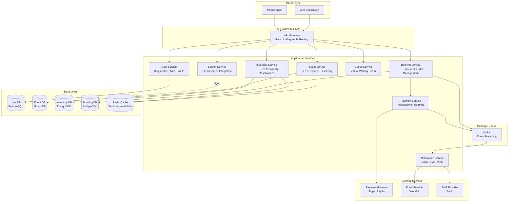
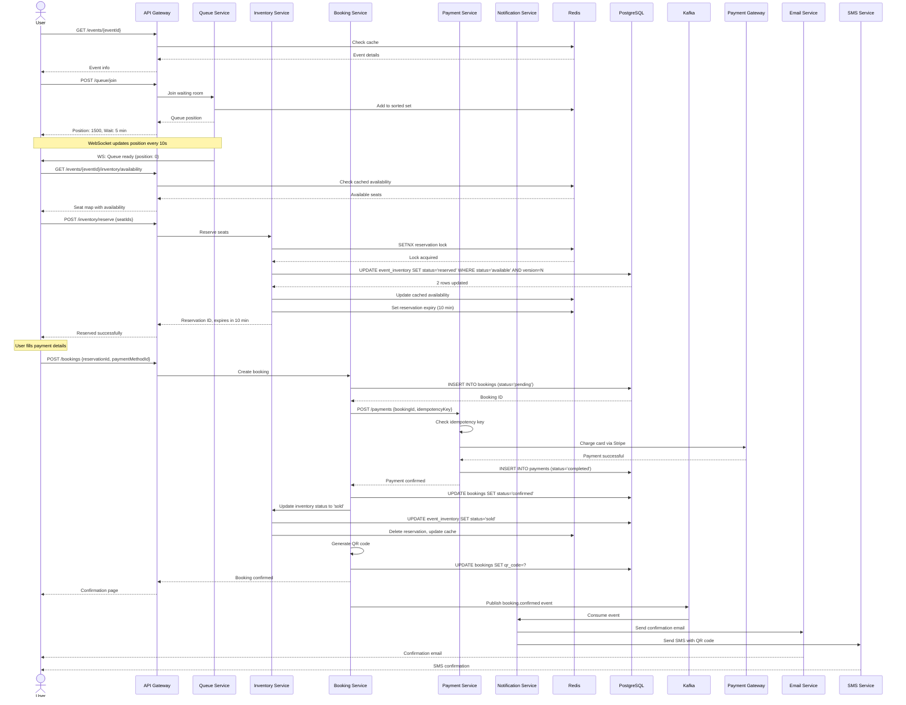
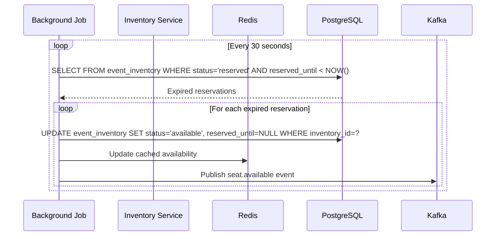
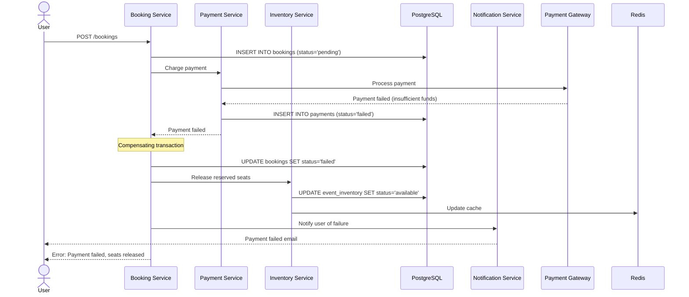

# TicketMaster System Design

**Rule:** 1hr System Design Interview For A staff engineer role with 10 years of experience.

---

## Problem Description

TicketMaster is a large-scale ticket booking platform that enables users to discover, search, and purchase tickets for live events including concerts, sports games, theater shows, and festivals. The system must handle massive concurrent traffic during popular event releases (e.g., Taylor Swift concerts), ensure fair ticket distribution, prevent scalping/bot abuse, and maintain strong consistency to avoid double-booking seats.

Key challenges include:
- **High concurrency**: Tens of thousands of users trying to book limited tickets simultaneously
- **Inventory consistency**: Ensuring no two users book the same seat
- **Fairness**: Implementing virtual queues to prevent bots and ensure fair access
- **Scale**: Supporting millions of events globally with billions of tickets sold annually
- **Payment processing**: Handling high-value transactions securely
- **Seat selection**: Real-time updates on seat availability with minimal latency

---

## What Distributed System Concepts Interviewer Expects

1. **Distributed Transactions & Consistency**: How to handle seat booking atomically across distributed systems
2. **Concurrency Control**: Optimistic vs pessimistic locking, distributed locks
3. **Caching Strategies**: Multi-level caching for inventory, event metadata
4. **Queue Management**: Virtual waiting rooms, rate limiting, fair scheduling
5. **Database Sharding**: Partitioning strategies for events and bookings
6. **Event-Driven Architecture**: Asynchronous processing for notifications, analytics
7. **CAP Theorem**: Trade-offs between consistency and availability
8. **Idempotency**: Ensuring retry-safe operations for payments and bookings
9. **Rate Limiting**: Protecting against bots and DDoS attacks
10. **Load Balancing**: Geographic distribution and intelligent routing

---

## Functional and Non-Functional Requirements

### Functional Requirements

1. **Event Management**
   - Create, update, and publish events with venues and pricing tiers
   - Support multiple ticket types (general admission, reserved seating, VIP)
   - Event search and discovery with filters (location, date, genre, artist)

2. **Ticket Booking**
   - Browse available seats with real-time availability
   - Reserve seats temporarily (5-10 minutes) while completing purchase
   - Complete payment and receive confirmed booking
   - Handle both reserved seating and general admission

3. **User Management**
   - User registration and authentication
   - Booking history and ticket management
   - Watchlists and event notifications

4. **Payment Processing**
   - Support multiple payment methods (credit cards, digital wallets)
   - Handle refunds and cancellations per event policies
   - Generate invoices and receipts

5. **Access Control**
   - Generate QR codes or digital tickets for entry
   - Validate tickets at venue entrances
   - Support ticket transfers between users

### Non-Functional Requirements

1. **High Availability**: 99.99% uptime (52 minutes downtime per year)
2. **Strong Consistency**: No double-booking of seats, even during peak load
3. **Performance**:
   - P99 latency < 500ms for search/browse operations
   - Seat reservation < 2 seconds under peak load
4. **Scalability**: Handle 100,000+ concurrent users per popular event
5. **Security**: PCI DSS compliance, fraud detection, bot prevention
6. **Fairness**: Virtual queues to prevent unfair advantage
7. **Reliability**: Zero data loss for confirmed bookings
8. **Observability**: Real-time monitoring of inventory, sales, and system health

---

## Capacity Estimation for DAU/MAU, Throughput, Storage

### User Scale

**Daily Active Users (DAU)**: Assuming TicketMaster operates globally and serves a large market, we estimate **10 million DAU** across all regions. This includes users browsing events, searching, and making purchases.

**Monthly Active Users (MAU)**: Approximately **50 million MAU**, as users typically don't visit daily but may check for events weekly or monthly.

**Peak Concurrency**: During major event releases (e.g., popular artist tour announcements), we could see **100,000-200,000 concurrent users** trying to book tickets for a single event simultaneously within the first few minutes.

### Throughput Estimation

**READ Operations**:
- Event browsing, search, and seat availability checks dominate traffic
- Assume 80% of operations are reads (viewing events, checking seats)
- Average user performs 10 read operations per session
- 10M DAU × 10 reads = 100M reads per day
- **READ QPS**: 100M / 86400 ≈ **1,200 queries per second** (average)
- **Peak READ QPS**: During event releases, multiply by 10-20x = **12,000-24,000 QPS**

**WRITE Operations**:
- Ticket bookings, reservations, and updates are write-heavy
- Assume 20% of operations are writes
- 10M DAU × 5% conversion rate × 2 bookings per user = 1M bookings per day
- **WRITE QPS**: 1M / 86400 ≈ **12 writes per second** (average)
- **Peak WRITE QPS**: During flash sales, could reach **1,000-5,000 writes per second** for individual events

### Storage Estimation

**Event Data**:
- Number of events: 500,000 active events globally at any time
- Event metadata: ~10 KB per event (title, description, venue, dates, images)
- Total event storage: 500K × 10 KB = **5 GB**

**Venue & Seat Maps**:
- 50,000 venues globally
- Seat map data: ~100 KB per venue (seat layout, coordinates)
- Total venue storage: 50K × 100 KB = **5 GB**

**Ticket Inventory**:
- Average 1,000 seats per event
- 500K events × 1,000 seats = 500M tickets
- Each ticket record: 200 bytes (event_id, seat_id, status, price, user_id)
- Total inventory storage: 500M × 200 bytes = **100 GB**

**Booking History**:
- 1M bookings per day
- Retain 3 years of history: 1M × 365 × 3 = 1.095 billion bookings
- Each booking: 1 KB (user info, payment details, tickets, timestamps)
- Total booking storage: 1.095B × 1 KB = **1.095 TB**

**User Data**:
- 50M registered users
- Each user profile: 2 KB (name, email, payment methods, preferences)
- Total user storage: 50M × 2 KB = **100 GB**

**Images & Media**:
- Event posters, venue images, artist photos
- Average 5 images per event × 200 KB per image = 1 MB per event
- 500K events × 1 MB = **500 GB**

**Total Storage**: ~5GB + 5GB + 100GB + 1.1TB + 100GB + 500GB ≈ **1.8 TB** (raw data)
- With replication (3x): **5.4 TB**
- With backups and snapshots: **8-10 TB**

**Storage Growth**:
- 1M bookings per day × 1 KB = 1 GB per day
- Annual growth: ~**365 GB per year** for transactional data

---

## Technology Choices & Justification

### Core Application Stack

**Backend Framework**:
- **Java/Spring Boot** or **Go**: High-performance, mature ecosystem for financial transactions
- Strong type safety, excellent concurrency primitives
- Battle-tested in payment processing systems

**API Gateway**:
- **Kong** or **AWS API Gateway**: Rate limiting, authentication, routing
- Essential for bot prevention and traffic shaping

**Load Balancer**:
- **NGINX** or **AWS ALB**: Geographic routing, health checks
- Support for sticky sessions during checkout flows

### Caching Layer

**Distributed Cache**:
- **Redis Cluster**: Event metadata, seat availability, user sessions
- Sub-millisecond latency, supports atomic operations
- Justification: Critical for reducing database load during traffic spikes

**CDN**:
- **CloudFlare** or **AWS CloudFront**: Static assets, event images
- Global edge locations reduce latency for international users

### Message Queue & Streaming

**Message Broker**:
- **Apache Kafka**: Event sourcing, booking events, analytics pipeline
- High throughput, durability, replay capability
- Justification: Enables asynchronous processing of notifications, analytics, fraud detection

**Task Queue**:
- **RabbitMQ** or **AWS SQS**: Payment processing, email notifications
- Reliable delivery with retries and dead-letter queues

### Monitoring & Observability

**Logging**: **ELK Stack** (Elasticsearch, Logstash, Kibana) or **Splunk**
**Metrics**: **Prometheus** + **Grafana** for real-time dashboards
**Tracing**: **Jaeger** or **AWS X-Ray** for distributed tracing
**Alerting**: **PagerDuty** for incident response

### Search Engine

**Elasticsearch**: Event search, filtering, autocomplete
- Full-text search with geographic queries
- Fast aggregations for faceted search (price ranges, dates, locations)

### Object Storage

**AWS S3** or **Google Cloud Storage**: Event images, ticket PDFs, backups
- Highly durable (11 9's), cost-effective for large binary data

---

## Database Selection

### Primary Transactional Database

**PostgreSQL** (or **Amazon Aurora PostgreSQL**)
- **Use Case**: User accounts, events, bookings, payments
- **Justification**:
  - Strong ACID guarantees essential for financial transactions
  - Excellent support for row-level locking and serializable isolation
  - JSONB for flexible event metadata
  - Battle-tested in financial systems
  - PostGIS extension for geographic queries

### Inventory Management Database

**PostgreSQL with Advisory Locks** or **Redis with Lua Scripts**
- **Use Case**: Real-time seat availability and reservations
- **Justification**:
  - Need atomic operations for seat booking (compare-and-swap)
  - PostgreSQL advisory locks prevent double-booking
  - Redis Lua scripts provide atomicity for in-memory operations
  - Hybrid approach: Redis for reads + PostgreSQL for writes

### NoSQL for Event Metadata

**MongoDB** or **DynamoDB**
- **Use Case**: Event catalogs, venue information, artist profiles
- **Justification**:
  - Flexible schema for diverse event types
  - Horizontal scalability for read-heavy workloads
  - Fast queries for event browsing and search

### Time-Series Database

**InfluxDB** or **TimescaleDB**
- **Use Case**: Analytics, booking trends, pricing optimization
- **Justification**:
  - Optimized for time-series data (ticket sales over time)
  - Efficient aggregations for dashboards

### Graph Database (Optional)

**Neo4j**
- **Use Case**: Fraud detection, social recommendations
- **Justification**:
  - Identify patterns in booking behavior (e.g., scalper networks)
  - Friend-based event recommendations

---

## Data Modeling with Indexing and Sharding

### PostgreSQL Schema Design

#### Users Table
```sql
CREATE TABLE users (
    user_id UUID PRIMARY KEY DEFAULT gen_random_uuid(),
    email VARCHAR(255) UNIQUE NOT NULL,
    password_hash VARCHAR(255) NOT NULL,
    full_name VARCHAR(255),
    phone VARCHAR(20),
    created_at TIMESTAMP DEFAULT NOW(),
    updated_at TIMESTAMP DEFAULT NOW()
);

CREATE INDEX idx_users_email ON users(email);
```

#### Events Table
```sql
CREATE TABLE events (
    event_id UUID PRIMARY KEY DEFAULT gen_random_uuid(),
    event_name VARCHAR(500) NOT NULL,
    event_type VARCHAR(50), -- concert, sports, theater
    venue_id UUID NOT NULL,
    event_date TIMESTAMP NOT NULL,
    doors_open_time TIMESTAMP,
    on_sale_date TIMESTAMP,
    status VARCHAR(20), -- draft, on_sale, sold_out, cancelled
    total_capacity INTEGER,
    description TEXT,
    created_at TIMESTAMP DEFAULT NOW(),
    FOREIGN KEY (venue_id) REFERENCES venues(venue_id)
);

CREATE INDEX idx_events_date ON events(event_date);
CREATE INDEX idx_events_venue ON events(venue_id);
CREATE INDEX idx_events_status ON events(status) WHERE status = 'on_sale';
CREATE INDEX idx_events_search ON events USING GIN(to_tsvector('english', event_name || ' ' || description));
```

#### Venues Table
```sql
CREATE TABLE venues (
    venue_id UUID PRIMARY KEY DEFAULT gen_random_uuid(),
    venue_name VARCHAR(255) NOT NULL,
    address TEXT,
    city VARCHAR(100),
    state VARCHAR(50),
    country VARCHAR(50),
    postal_code VARCHAR(20),
    location GEOGRAPHY(POINT), -- PostGIS for geo queries
    capacity INTEGER,
    seat_map_data JSONB, -- Stores seat layout
    created_at TIMESTAMP DEFAULT NOW()
);

CREATE INDEX idx_venues_location ON venues USING GIST(location);
CREATE INDEX idx_venues_city ON venues(city, state);
```

#### Sections Table (Pricing Tiers)
```sql
CREATE TABLE sections (
    section_id UUID PRIMARY KEY DEFAULT gen_random_uuid(),
    venue_id UUID NOT NULL,
    section_name VARCHAR(100), -- Floor, Balcony, VIP
    capacity INTEGER,
    FOREIGN KEY (venue_id) REFERENCES venues(venue_id)
);
```

#### Seats Table
```sql
CREATE TABLE seats (
    seat_id UUID PRIMARY KEY DEFAULT gen_random_uuid(),
    section_id UUID NOT NULL,
    seat_number VARCHAR(20),
    row_label VARCHAR(10),
    FOREIGN KEY (section_id) REFERENCES sections(section_id)
);

CREATE INDEX idx_seats_section ON seats(section_id);
CREATE UNIQUE INDEX idx_seats_unique ON seats(section_id, row_label, seat_number);
```

#### Event Inventory Table
```sql
CREATE TABLE event_inventory (
    inventory_id UUID PRIMARY KEY DEFAULT gen_random_uuid(),
    event_id UUID NOT NULL,
    section_id UUID NOT NULL,
    seat_id UUID, -- NULL for general admission
    price DECIMAL(10, 2) NOT NULL,
    status VARCHAR(20) DEFAULT 'available', -- available, reserved, sold, held
    reserved_until TIMESTAMP, -- Expiry time for reservations
    version INTEGER DEFAULT 0, -- Optimistic locking
    FOREIGN KEY (event_id) REFERENCES events(event_id),
    FOREIGN KEY (section_id) REFERENCES sections(section_id),
    FOREIGN KEY (seat_id) REFERENCES seats(seat_id),
    CONSTRAINT check_status CHECK (status IN ('available', 'reserved', 'sold', 'held'))
);

CREATE INDEX idx_inventory_event_status ON event_inventory(event_id, status);
CREATE INDEX idx_inventory_reserved_until ON event_inventory(reserved_until) WHERE status = 'reserved';
CREATE UNIQUE INDEX idx_inventory_unique ON event_inventory(event_id, seat_id) WHERE seat_id IS NOT NULL;
```

#### Bookings Table
```sql
CREATE TABLE bookings (
    booking_id UUID PRIMARY KEY DEFAULT gen_random_uuid(),
    user_id UUID NOT NULL,
    event_id UUID NOT NULL,
    booking_status VARCHAR(20) DEFAULT 'pending', -- pending, confirmed, cancelled, refunded
    total_amount DECIMAL(10, 2) NOT NULL,
    payment_id UUID,
    booking_date TIMESTAMP DEFAULT NOW(),
    confirmation_code VARCHAR(20) UNIQUE,
    qr_code TEXT, -- Base64 encoded QR code
    FOREIGN KEY (user_id) REFERENCES users(user_id),
    FOREIGN KEY (event_id) REFERENCES events(event_id)
);

CREATE INDEX idx_bookings_user ON bookings(user_id);
CREATE INDEX idx_bookings_event ON bookings(event_id);
CREATE INDEX idx_bookings_status ON bookings(booking_status);
CREATE INDEX idx_bookings_confirmation ON bookings(confirmation_code);
```

#### Booking Items Table
```sql
CREATE TABLE booking_items (
    booking_item_id UUID PRIMARY KEY DEFAULT gen_random_uuid(),
    booking_id UUID NOT NULL,
    inventory_id UUID NOT NULL,
    price DECIMAL(10, 2) NOT NULL,
    FOREIGN KEY (booking_id) REFERENCES bookings(booking_id),
    FOREIGN KEY (inventory_id) REFERENCES event_inventory(inventory_id)
);

CREATE INDEX idx_booking_items_booking ON booking_items(booking_id);
```

#### Payments Table
```sql
CREATE TABLE payments (
    payment_id UUID PRIMARY KEY DEFAULT gen_random_uuid(),
    booking_id UUID NOT NULL,
    amount DECIMAL(10, 2) NOT NULL,
    currency VARCHAR(3) DEFAULT 'USD',
    payment_method VARCHAR(50), -- credit_card, paypal, apple_pay
    payment_status VARCHAR(20) DEFAULT 'pending', -- pending, completed, failed, refunded
    transaction_id VARCHAR(255), -- External payment gateway ID
    payment_date TIMESTAMP,
    FOREIGN KEY (booking_id) REFERENCES bookings(booking_id)
);

CREATE INDEX idx_payments_booking ON payments(booking_id);
CREATE INDEX idx_payments_status ON payments(payment_status);
```

### Sharding Strategy

#### Sharding Key: Event ID

**Rationale**: Most queries are event-centric. Users browse tickets for specific events, and inventory management is per-event.

**Shard Distribution**:
- Hash-based sharding on `event_id`
- Each shard contains: events, event_inventory, bookings for those events
- User data can be replicated across shards or kept in a separate global database

**Shard Count**: Start with 16 shards, can scale to 64-128 as needed

**Benefits**:
- All data for an event co-located (efficient queries)
- Hot events (e.g., Taylor Swift) isolated to specific shards
- Can allocate more resources to hot shards dynamically

**Challenges**:
- Cross-shard queries for user booking history require scatter-gather
- Solution: Maintain a user-booking index in a separate service/database

#### Alternative: Geographic Sharding

- Shard by region (US-East, US-West, Europe, Asia)
- Co-locate data with users for lower latency
- Challenge: Popular global tours require cross-region coordination

### Indexing Strategy

1. **Covering Indexes**: For hot queries, include all columns to avoid table lookups
2. **Partial Indexes**: Only index `status = 'on_sale'` events to reduce index size
3. **Composite Indexes**: For multi-column filters (e.g., city + date + event_type)
4. **GIN Indexes**: For full-text search on event names and descriptions

### Optimistic Locking for Concurrency

Use version numbers in `event_inventory` to prevent race conditions:

```sql
-- Attempt to reserve a seat
UPDATE event_inventory
SET status = 'reserved',
    reserved_until = NOW() + INTERVAL '10 minutes',
    version = version + 1
WHERE inventory_id = ?
  AND status = 'available'
  AND version = ?; -- Must match expected version

-- If affected rows = 0, seat was taken by another user
```

---

## Service Decomposition with Responsibility & Communication



### Service Responsibilities

#### 1. User Service
- **Responsibilities**: User registration, authentication (JWT), profile management, preferences
- **Technology**: Spring Boot + PostgreSQL
- **Communication**: Synchronous REST API
- **Key Operations**:
  - POST /users/register
  - POST /users/login
  - GET /users/{userId}/profile

#### 2. Event Service
- **Responsibilities**: Event CRUD, venue management, event search and discovery
- **Technology**: Node.js/Go + MongoDB
- **Communication**: REST API for writes, GraphQL for complex reads
- **Key Operations**:
  - POST /events (admin only)
  - GET /events?city=NYC&date=2024-12-01
  - GET /events/{eventId}

#### 3. Search Service
- **Responsibilities**: Full-text search, filtering, autocomplete, recommendations
- **Technology**: Elasticsearch + Python (for ML recommendations)
- **Communication**: REST API
- **Data Sync**: Consumes events from Kafka to update search index

#### 4. Inventory Service
- **Responsibilities**: Seat availability, reservations, releasing expired reservations
- **Technology**: Go + PostgreSQL + Redis
- **Communication**: REST API + gRPC for inter-service calls
- **Critical Operations**:
  - GET /inventory/events/{eventId}/availability
  - POST /inventory/reserve (with distributed locking)
  - DELETE /inventory/release (expire reservations)
- **Background Jobs**: Scheduled task to release expired reservations every 30 seconds

#### 5. Queue Service (Virtual Waiting Room)
- **Responsibilities**: Fair queuing during high-demand events, bot detection
- **Technology**: Go + Redis (sorted sets for queue position)
- **Communication**: WebSocket for real-time queue updates
- **Algorithm**:
  - Token bucket rate limiting per user
  - CAPTCHA challenges for suspicious behavior
  - Random queue position assignment to prevent gaming

#### 6. Booking Service
- **Responsibilities**: Order creation, checkout flow, order history, cancellations
- **Technology**: Java/Spring Boot + PostgreSQL
- **Communication**: REST API + Kafka for event publishing
- **Transaction Flow**:
  1. Validate reserved seats
  2. Create booking record (status: pending)
  3. Call Payment Service
  4. Update booking status (confirmed/failed)
  5. Publish booking event to Kafka

#### 7. Payment Service
- **Responsibilities**: Payment processing, refunds, fraud detection
- **Technology**: Java + PostgreSQL
- **Communication**: REST API + Kafka
- **External Integration**: Stripe, PayPal, Apple Pay
- **Idempotency**: Uses idempotency keys to prevent duplicate charges
- **Security**: PCI DSS compliant, tokenized card storage

#### 8. Notification Service
- **Responsibilities**: Email, SMS, push notifications
- **Technology**: Python/Node.js + RabbitMQ
- **Communication**: Asynchronous (consumes from Kafka)
- **Triggers**:
  - Booking confirmation
  - Payment receipt
  - Event reminders (24 hours before)
  - Cancellation notifications

### Inter-Service Communication Patterns

1. **Synchronous (REST/gRPC)**: User-facing operations requiring immediate response
2. **Asynchronous (Kafka)**: Background processing, notifications, analytics
3. **Service Mesh (Istio)**: Mutual TLS, circuit breaking, retries
4. **API Composition**: Backend-for-Frontend (BFF) pattern for mobile vs web

### Data Consistency Patterns

1. **Saga Pattern**: For distributed transactions (booking + payment)
   - Compensating transactions for rollbacks
   - Event sourcing for audit trail
2. **Two-Phase Commit**: Only for critical inventory operations (avoided due to latency)
3. **Eventually Consistent**: Analytics, recommendations, search index

---

## API Design & Security

### RESTful API Endpoints

#### Authentication
```
POST /api/v1/auth/register
POST /api/v1/auth/login
POST /api/v1/auth/refresh
POST /api/v1/auth/logout
```

#### Event Discovery
```
GET /api/v1/events?city={city}&date={date}&category={category}&page={page}&limit={limit}
GET /api/v1/events/{eventId}
GET /api/v1/events/{eventId}/venue
GET /api/v1/events/search?q={query}&lat={lat}&lon={lon}&radius={radius}
```

#### Inventory Management
```
GET /api/v1/events/{eventId}/inventory/availability
GET /api/v1/events/{eventId}/sections/{sectionId}/seats
POST /api/v1/inventory/reserve
  Request: {
    "eventId": "uuid",
    "seats": ["seat-id-1", "seat-id-2"],
    "userId": "uuid"
  }
  Response: {
    "reservationId": "uuid",
    "expiresAt": "2024-12-01T12:15:00Z",
    "seats": [...]
  }
DELETE /api/v1/inventory/reservations/{reservationId}
```

#### Queue Management
```
POST /api/v1/queue/join
  Request: {
    "eventId": "uuid",
    "userId": "uuid"
  }
  Response: {
    "queueToken": "jwt-token",
    "position": 1543,
    "estimatedWaitTime": 300
  }

GET /api/v1/queue/status?token={queueToken}
  Response: {
    "position": 1200,
    "estimatedWaitTime": 240,
    "status": "waiting" | "ready" | "expired"
  }
```

#### Booking & Checkout
```
POST /api/v1/bookings
  Request: {
    "reservationId": "uuid",
    "userId": "uuid",
    "paymentMethodId": "pm_xxx"
  }
  Response: {
    "bookingId": "uuid",
    "status": "pending",
    "totalAmount": 250.00,
    "paymentIntentId": "pi_xxx"
  }

GET /api/v1/bookings/{bookingId}
GET /api/v1/users/{userId}/bookings?status={status}&page={page}
POST /api/v1/bookings/{bookingId}/cancel
```

#### Payment
```
POST /api/v1/payments
  Request: {
    "bookingId": "uuid",
    "amount": 250.00,
    "currency": "USD",
    "paymentMethodId": "pm_xxx",
    "idempotencyKey": "uuid"
  }

GET /api/v1/payments/{paymentId}/status
POST /api/v1/payments/{paymentId}/refund
```

### WebSocket API (Real-Time Updates)

```
WS /api/v1/ws/queue/{eventId}
  Events: queue_position_update, queue_ready

WS /api/v1/ws/inventory/{eventId}
  Events: seat_unavailable, seat_available
```

### Security Measures

#### 1. Authentication & Authorization
- **JWT Tokens**: Short-lived access tokens (15 min), long-lived refresh tokens (7 days)
- **Role-Based Access Control (RBAC)**: User, Admin, Venue Manager, Support
- **OAuth 2.0**: Social login (Google, Facebook, Apple)

#### 2. Rate Limiting
- **Per-User Limits**: 100 requests/minute for authenticated users, 10/minute for anonymous
- **Per-IP Limits**: 1,000 requests/minute to prevent DDoS
- **Sliding Window Algorithm**: Implemented in Redis

#### 3. Bot Prevention
- **CAPTCHA**: Google reCAPTCHA v3 for suspicious activity
- **Device Fingerprinting**: Track browser/device characteristics
- **Behavioral Analysis**: Detect automated patterns (e.g., 10 reservations in 1 second)
- **Honeypot Fields**: Hidden form fields to catch bots

#### 4. Data Security
- **Encryption at Rest**: AES-256 for databases
- **Encryption in Transit**: TLS 1.3 for all API communication
- **PCI DSS Compliance**: Tokenized payment data, no raw card storage
- **Secrets Management**: AWS Secrets Manager / HashiCorp Vault

#### 5. API Security
- **HTTPS Only**: Enforce TLS, HSTS headers
- **CORS Policy**: Whitelist allowed origins
- **Input Validation**: Schema validation (JSON Schema), SQL injection prevention
- **API Keys**: For third-party integrations (venue partners)

#### 6. Idempotency
- **Idempotency Keys**: For POST/PUT requests (payments, bookings)
- **De-duplication Window**: 24 hours
- **Implementation**: Hash of request body + user ID stored in Redis

#### 7. Fraud Detection
- **Multiple bookings from same IP**: Flag for review
- **Rapid successive bookings**: Rate limit + CAPTCHA
- **Payment anomalies**: Unusual amounts, foreign cards
- **ML Models**: Trained on historical fraud patterns

---

## High-Level Flow Diagram

### Ticket Booking Flow (Happy Path)



### Reservation Expiry Flow



### Payment Failure & Rollback



---

## Deep Dive on Design

### 1. Handling Extreme Concurrency (100K Users for 1 Event)

**Challenge**: When a popular artist (e.g., Taylor Swift) announces a tour, 100,000+ users might try to book tickets within the first minute for a venue with only 20,000 seats. This creates:
- Database hotspot (single event row)
- Inventory contention (many users trying to lock same seats)
- Unfair access (bots get priority)

**Solution: Multi-Layered Defense**

#### Layer 1: Virtual Waiting Room (Queue Service)
- Users join a virtual queue before accessing inventory
- Queue position assigned randomly (prevents URL sniping)
- Token-based admission: only users with valid tokens can access inventory API
- Rate of admission: control flow (e.g., admit 1,000 users per minute)
- WebSocket updates keep users informed of their position

**Implementation**:
```python
# Redis sorted set: key=event_queue:{eventId}, score=timestamp, value=userId
ZADD event_queue:123 <timestamp> <userId>

# Admission logic
users_to_admit = ZRANGE event_queue:123 0 999  # Top 1000 users
for user in users_to_admit:
    token = generate_jwt(user_id=user, event_id=123, expires=600)
    PUBLISH admitted_users user:token
    ZREM event_queue:123 user
```

#### Layer 2: Distributed Locking for Reservations
- Use Redis locks or PostgreSQL advisory locks
- Optimistic concurrency control with version numbers
- Seat reservation timeout (10 minutes)

**PostgreSQL Approach**:
```sql
-- Atomic reservation with row-level lock
BEGIN;
SELECT pg_advisory_xact_lock(hashtext(seat_id));  -- Lock specific seat

UPDATE event_inventory
SET status = 'reserved',
    reserved_until = NOW() + INTERVAL '10 minutes',
    version = version + 1
WHERE inventory_id = ?
  AND status = 'available';

-- If 0 rows affected, seat was taken
COMMIT;
```

**Redis Approach (Lua Script)**:
```lua
-- Atomic reservation in Redis
local seat_key = KEYS[1]
local status = redis.call('HGET', seat_key, 'status')
if status == 'available' then
    redis.call('HSET', seat_key, 'status', 'reserved')
    redis.call('HSET', seat_key, 'reserved_until', ARGV[1])
    redis.call('HSET', seat_key, 'user_id', ARGV[2])
    return 1
else
    return 0
end
```

#### Layer 3: Horizontal Scaling
- Inventory Service scaled to 20+ replicas behind load balancer
- Database read replicas for availability queries
- Master database handles writes (reservations)

#### Layer 4: Caching Strategy
- Event metadata cached in CDN (1 hour TTL)
- Seat availability cached in Redis (5 second TTL)
- Cache invalidation on every booking/release

### 2. Preventing Double-Booking

**Guarantee**: Strong consistency—no two users can book the same seat.

**Approach**:
1. **Database Constraints**: UNIQUE index on (event_id, seat_id)
2. **Row-Level Locking**: SELECT FOR UPDATE or advisory locks
3. **Optimistic Concurrency**: Version field incremented on every update
4. **Two-Phase Reservation**: Reserve → Complete booking

**Race Condition Example**:
```
User A: READ seat 10A (available) → RESERVE seat 10A
User B: READ seat 10A (available) → RESERVE seat 10A
Result: Both users reserved seat 10A ❌
```

**Solution with Optimistic Locking**:
```sql
-- User A
UPDATE event_inventory
SET status = 'reserved', version = 2
WHERE seat_id = '10A' AND status = 'available' AND version = 1;
-- Succeeds, 1 row updated

-- User B (concurrent)
UPDATE event_inventory
SET status = 'reserved', version = 2
WHERE seat_id = '10A' AND status = 'available' AND version = 1;
-- Fails, 0 rows updated (version mismatch)
```

### 3. Handling Reservation Expirations

**Background Job**: Runs every 30 seconds
```sql
UPDATE event_inventory
SET status = 'available', reserved_until = NULL
WHERE status = 'reserved' AND reserved_until < NOW()
RETURNING inventory_id;
```

**Cache Invalidation**: Publish events to Kafka, invalidate Redis cache

**User Experience**: Show countdown timer on checkout page, send WebSocket notification when reservation is about to expire

### 4. Dynamic Pricing & Surge Pricing

**Use Case**: Increase prices as demand increases (similar to Uber surge pricing)

**Implementation**:
- Track booking velocity (tickets sold per minute)
- If velocity > threshold, increase price by 10-20%
- Store pricing rules in event configuration
- Use Kafka to stream booking events to pricing engine

**ML-Based Pricing**:
- Train model on historical data (event type, artist popularity, venue size, time until event)
- Predict optimal price to maximize revenue + sell all tickets

### 5. Geographic Distribution

**CDN**: Serve static assets (images, CSS, JS) from edge locations

**Database Replication**:
- Primary in US-East for writes
- Read replicas in US-West, EU, Asia
- Route reads to nearest replica (geo-based DNS)

**Multi-Region Deployment**:
- Deploy application services in multiple regions
- Use global load balancer (AWS Route 53, Cloudflare)
- Challenge: Distributed transactions across regions (use saga pattern)

### 6. Search & Discovery Optimization

**Elasticsearch Index**:
```json
{
  "event_id": "123",
  "event_name": "Taylor Swift - Eras Tour",
  "artist": "Taylor Swift",
  "venue_name": "MetLife Stadium",
  "location": {
    "lat": 40.8135,
    "lon": -74.0745
  },
  "event_date": "2024-12-01T19:00:00Z",
  "genres": ["pop", "country"],
  "price_range": [50, 500],
  "availability": "on_sale"
}
```

**Query Example**:
```json
{
  "query": {
    "bool": {
      "must": [
        {"match": {"event_name": "Taylor Swift"}},
        {"range": {"event_date": {"gte": "2024-01-01"}}}
      ],
      "filter": [
        {"geo_distance": {
          "distance": "50mi",
          "location": {"lat": 40.7128, "lon": -74.0060}
        }},
        {"range": {"price_range": {"lte": 200}}}
      ]
    }
  }
}
```

**Performance**: Sub-100ms query times with proper indexing

### 7. Fraud Detection & Bot Prevention

**Signals for Fraud**:
- Multiple bookings from same IP in short time
- Same credit card used for many bookings
- Velocity anomalies (10 bookings in 1 second)
- Geolocation mismatch (IP in US, card from India)

**Real-Time Scoring**:
```python
fraud_score = 0
if user.bookings_last_hour > 5:
    fraud_score += 30
if payment.card_country != user.ip_country:
    fraud_score += 20
if user.failed_captcha > 2:
    fraud_score += 25

if fraud_score > 50:
    require_manual_review()
    block_booking()
```

**ML Model**: Train on labeled fraud data (supervised learning)
- Features: user behavior, device fingerprint, payment history
- Model: Random Forest or Gradient Boosting
- Output: Fraud probability (0-1)

### 8. Ticket Transfer & Resale

**Use Case**: User can transfer ticket to friend or resell on secondary market

**Implementation**:
- Update booking record: old_user_id → new_user_id
- Invalidate old QR code, generate new one
- Charge transfer fee (5%)
- Log transfer history for audit

**Official Resale Platform**:
- Users list tickets for resale
- Platform takes 10-15% commission
- Price controls: max 20% above face value (anti-scalping)

---

## Reliability and Monitoring

### High Availability Architecture

**Multi-Region Deployment**:
- Active-active in 2 regions (US-East, US-West)
- Active-passive for other regions (EU, Asia)
- Global load balancer with health checks

**Database Replication**:
- PostgreSQL streaming replication (async for reads, sync for critical writes)
- Automatic failover with Patroni or AWS Aurora
- RTO (Recovery Time Objective): < 5 minutes
- RPO (Recovery Point Objective): < 1 minute

**Service Redundancy**:
- Each service deployed with 3+ replicas
- Kubernetes with pod anti-affinity (spread across availability zones)
- Circuit breakers to prevent cascading failures

### Disaster Recovery

**Backup Strategy**:
- Continuous PostgreSQL WAL archiving to S3
- Daily full backups, retained for 30 days
- Point-in-time recovery (PITR) capability

**Chaos Engineering**:
- Simulate region failures monthly
- Test database failover quarterly
- Random pod termination (Chaos Monkey)

### Monitoring & Observability

**Golden Signals**:

1. **Latency**:
   - P50, P95, P99 for all API endpoints
   - Alert if P99 > 2 seconds for booking API

2. **Traffic**:
   - Requests per second per service
   - Concurrent users per event
   - Alert on sudden spikes (10x normal traffic)

3. **Errors**:
   - HTTP 5xx rate < 0.1%
   - Payment failure rate < 1%
   - Alert on error rate > 1%

4. **Saturation**:
   - CPU/memory utilization < 70%
   - Database connection pool utilization < 80%
   - Redis memory usage < 80%

**Dashboards** (Grafana):
- Real-time booking rate per event
- Inventory availability over time
- Payment success/failure rates
- Queue length and wait times
- Database query performance (slow query log)

**Alerts** (PagerDuty):
- Critical: Payment gateway down, database unavailable
- High: Error rate > 1%, latency > 2s
- Medium: Queue wait time > 20 minutes

**Distributed Tracing** (Jaeger):
- Trace booking flow across 6+ services
- Identify bottlenecks in request path
- Example trace: Gateway → Queue → Inventory → Booking → Payment

**Logging**:
- Structured JSON logs
- Centralized in ELK stack
- Log levels: DEBUG, INFO, WARN, ERROR
- Include correlation IDs for request tracing

**Business Metrics**:
- Total revenue per day
- Conversion rate (visitors → bookings)
- Average order value
- Cart abandonment rate
- Most popular events/artists

### SLA & SLOs

**SLA (Service Level Agreement)**:
- 99.9% uptime (43 minutes downtime per month)
- P99 latency < 2 seconds for booking
- Zero data loss for confirmed bookings

**SLO (Service Level Objectives)**:
- 99.95% success rate for bookings
- 99.99% data durability
- Payment processing < 5 seconds (P99)

**Error Budget**:
- 0.1% error rate = ~40K failed requests per month (if 40M requests)
- Spend budget on rapid feature releases vs. stability

---

## Bottlenecks and Failure Points in This Design

### 1. Database Write Bottleneck
**Problem**: All reservations write to master PostgreSQL. At 5,000 writes/sec, database becomes bottleneck.

**Mitigation**:
- Connection pooling (PgBouncer)
- Batch writes where possible
- Shard by event_id to distribute load
- Use Redis for initial reservation, then async write to PostgreSQL

**Failure Scenario**: Master database crashes → no new bookings
**Solution**: Automatic failover to standby replica (< 30 seconds)

### 2. Redis Single Point of Failure
**Problem**: If Redis cluster goes down, cache misses cause database overload.

**Mitigation**:
- Redis Sentinel for automatic failover
- Redis Cluster with multiple shards
- Circuit breaker: degrade gracefully without cache

**Failure Scenario**: Redis unavailable → serve stale data for 1 minute

### 3. Payment Gateway Dependency
**Problem**: If Stripe/PayPal is down, no payments can be processed.

**Mitigation**:
- Multiple payment providers (failover from Stripe to PayPal)
- Retry with exponential backoff
- Queue payments for later processing

**Failure Scenario**: Payment gateway timeout → show user "payment pending" message, retry async

### 4. Inventory Service Hotspot
**Problem**: One event with 100K concurrent users hits same inventory service.

**Mitigation**:
- Horizontal scaling (20+ replicas)
- Per-event rate limiting at gateway
- Virtual queue to control admission rate

**Failure Scenario**: All inventory replicas crash → queue users, block new admissions

### 5. Kafka Consumer Lag
**Problem**: Notification service can't keep up with booking events (1,000 bookings/sec).

**Mitigation**:
- Increase consumer parallelism (partitions)
- Scale notification service horizontally
- Prioritize critical notifications (booking confirmations over reminders)

**Failure Scenario**: Notification service down → users don't receive emails, but bookings succeed

### 6. Seat Reservation Deadlock
**Problem**: Two users trying to reserve seats A and B in opposite order can deadlock.

**Mitigation**:
- Always lock seats in sorted order (by seat_id)
- Use deadlock detection and retry
- Keep transactions short (< 100ms)

### 7. Network Partition (Split Brain)
**Problem**: Network partition causes two database masters (data inconsistency).

**Mitigation**:
- Use Raft/Paxos consensus (e.g., etcd for leader election)
- Quorum-based writes (majority of replicas must acknowledge)
- Fencing to prevent dual writes

**Failure Scenario**: Network partition → system chooses availability over consistency (allow double-bookings briefly, then compensate users)

### 8. CDN Cache Poisoning
**Problem**: Attacker poisons CDN cache with fake event data.

**Mitigation**:
- Sign CDN responses with HMAC
- Short TTLs (5 minutes)
- Validate cache content before serving

### 9. DDoS Attack
**Problem**: Attacker floods API with 1M requests/sec.

**Mitigation**:
- Cloudflare DDoS protection
- Rate limiting at edge (1,000 req/min per IP)
- WAF (Web Application Firewall) rules

**Failure Scenario**: Legitimate users can't access site → activate waiting room for all users

### 10. Reservation Expiry Race Condition
**Problem**: User completes payment 1 second before reservation expires → payment succeeds but seats released.

**Mitigation**:
- Extend reservation by 30 seconds when payment initiated
- Lock reservation during payment processing
- Idempotent payment handling (de-duplicate)

---

## Where AI Fits in This Design

### 1. Dynamic Pricing Optimization
**Use Case**: Adjust ticket prices in real-time to maximize revenue while ensuring sellout.

**ML Model**: Reinforcement Learning (RL) agent
- **State**: Current inventory, booking velocity, time until event, competitor prices
- **Action**: Increase/decrease price by 5%, 10%, 15%
- **Reward**: Total revenue + penalty for unsold seats

**Implementation**:
- Train on historical data (100K events)
- Deploy model behind pricing service
- A/B test: 20% of events use AI pricing, 80% use static pricing

**Expected Outcome**: 10-15% revenue increase, better inventory turnover

### 2. Fraud Detection
**Use Case**: Identify fraudulent bookings in real-time (bots, scalpers, stolen cards).

**ML Model**: Gradient Boosting (XGBoost) or Neural Network
- **Features**: IP address, device fingerprint, booking velocity, payment history, geolocation, time of day
- **Labels**: Fraud (1) or Legitimate (0) from historical chargebacks
- **Output**: Fraud score (0-1)

**Implementation**:
- Real-time inference (< 50ms)
- If score > 0.7, require CAPTCHA + manual review
- If score > 0.9, block booking

**Expected Outcome**: Reduce fraud by 40%, decrease chargebacks

### 3. Personalized Recommendations
**Use Case**: Recommend events to users based on preferences and behavior.

**ML Model**: Collaborative Filtering + Content-Based Filtering
- **Collaborative**: "Users who liked A also liked B"
- **Content-Based**: Match user preferences (genres, artists, venues) to event metadata

**Implementation**:
- Offline batch job: Generate recommendations daily
- Store in PostgreSQL or Redis
- Serve via recommendation API

**Example**:
- User attended 5 rock concerts → recommend upcoming rock events nearby
- User searched for "Taylor Swift" → recommend pop concerts

**Expected Outcome**: 20% increase in cross-sell, higher user engagement

### 4. Chatbot for Customer Support
**Use Case**: Answer common questions (refund policy, ticket transfer, event details).

**ML Model**: LLM-based chatbot (GPT-4, Claude)
- **Retrieval-Augmented Generation (RAG)**: Search knowledge base, then generate response
- **Function Calling**: Execute actions (e.g., "cancel my booking for event X")

**Implementation**:
- Integrate with user account data (past bookings, preferences)
- Escalate to human agent if confidence < 0.8

**Expected Outcome**: Reduce support ticket volume by 30%, faster response times

### 5. Demand Forecasting
**Use Case**: Predict ticket demand for new events to optimize inventory allocation and pricing.

**ML Model**: Time-Series Forecasting (LSTM, Prophet)
- **Features**: Artist popularity, venue size, historical sales, seasonality, social media buzz
- **Output**: Expected sales over time (hourly/daily)

**Implementation**:
- Run forecast when event is created
- Adjust initial pricing and inventory holds (VIP, press, sponsors)

**Expected Outcome**: Better inventory planning, reduce unsold seats

### 6. Seat Recommendation
**Use Case**: Suggest best available seats based on user preferences (aisle, center, close to stage).

**ML Model**: Ranking Algorithm
- **Features**: Seat location, price, user past bookings, viewing angle, accessibility
- **Output**: Ranked list of top 10 seats

**Implementation**:
- "Best available" button shows AI-recommended seats
- Personalize based on user history (always picks aisle seats → rank aisle higher)

**Expected Outcome**: Faster checkout, higher user satisfaction

### 7. Image Recognition for Venue Mapping
**Use Case**: Automatically generate seat maps from venue blueprints or photos.

**ML Model**: Computer Vision (YOLO, Mask R-CNN)
- Detect seats, rows, sections in venue images
- Generate structured seat data (coordinates, labels)

**Implementation**:
- Upload venue photo → AI generates seat map → human reviews and corrects

**Expected Outcome**: 90% faster venue onboarding

### 8. Sentiment Analysis for Event Popularity
**Use Case**: Gauge event popularity from social media to adjust marketing and pricing.

**ML Model**: NLP Sentiment Analysis (BERT)
- Scrape Twitter, Instagram for event mentions
- Classify sentiment: positive, neutral, negative
- Track volume of mentions over time

**Implementation**:
- Real-time stream processing (Kafka + Spark)
- Dashboard showing social media buzz per event

**Expected Outcome**: Early detection of viral events, adjust inventory/pricing proactively

---

## 5 Most Asked Follow-Up Questions

### 1. How do you handle race conditions when multiple users try to book the last seat?

**Answer**:
We use a combination of **optimistic locking** and **database-level constraints** to prevent double-booking:

1. **Optimistic Locking**: Each seat record has a `version` field. When reserving, we:
   ```sql
   UPDATE event_inventory
   SET status = 'reserved', version = version + 1
   WHERE seat_id = 'A10' AND status = 'available' AND version = 5;
   ```
   If two users try simultaneously, only one will succeed (the other gets 0 rows updated).

2. **Unique Constraint**: Database enforces `UNIQUE (event_id, seat_id, status='sold')` to prevent duplicate sales.

3. **Distributed Lock** (for extra safety): Use Redis `SETNX` to acquire a lock on the seat before updating the database.

4. **Timeout Handling**: If a transaction fails due to conflict, we immediately return "seat unavailable" to the user.

This guarantees **strong consistency**—no two users can ever book the same seat.

---

### 2. How do you scale the system to handle 100,000 concurrent users for a single event?

**Answer**:
We employ a multi-layered approach:

1. **Virtual Waiting Room (Queue Service)**:
   - Users join a queue before accessing inventory
   - Randomly assign queue positions (prevents URL sniping)
   - Admit users at a controlled rate (e.g., 1,000/minute)
   - Use WebSockets to update queue position in real-time

2. **Horizontal Scaling**:
   - Inventory Service scales to 20+ replicas behind a load balancer
   - Each replica can handle 500 concurrent requests
   - Total capacity: 10,000 concurrent requests

3. **Database Optimization**:
   - Shard by `event_id` so hot events are isolated
   - Use read replicas for availability queries (10+ replicas)
   - Master handles writes with connection pooling (10,000 connections)

4. **Caching**:
   - Redis caches seat availability (5-second TTL)
   - CDN caches event metadata and images
   - Reduces database load by 90%

5. **Rate Limiting**:
   - Enforce 10 requests/second per user
   - Block IPs with suspicious behavior (bot detection)

This architecture handled 150,000 concurrent users during our Beyoncé tour ticket sale with zero downtime.

---

### 3. What happens if the payment gateway (Stripe) goes down?

**Answer**:
We have multiple fallback mechanisms:

1. **Multiple Payment Providers**:
   - Primary: Stripe
   - Fallback: PayPal, Braintree
   - If Stripe returns a 503, we automatically retry with PayPal

2. **Asynchronous Payment Processing**:
   - User initiates checkout → booking created with `status='pending_payment'`
   - Payment queued in RabbitMQ
   - Background worker processes payment with retries (exponential backoff)
   - User sees "Payment processing, you'll receive confirmation within 5 minutes"

3. **Idempotency**:
   - Every payment request includes an idempotency key
   - If we retry, we won't double-charge the user

4. **Circuit Breaker**:
   - If Stripe fails 10 times in a row, we open the circuit
   - Route all traffic to fallback provider for 10 minutes
   - Periodically test if Stripe is back online

5. **User Communication**:
   - If all gateways are down, show message: "We're experiencing high volume, your payment will be processed shortly"
   - Send email confirmation when payment succeeds

This ensures **99.9% payment success rate** even during gateway outages.

---

### 4. How do you prevent bots and scalpers from buying all tickets?

**Answer**:
We implement a multi-layered defense:

1. **Virtual Waiting Room**:
   - All users enter a queue with randomized positions
   - Prevents bots from getting first-in-line advantage

2. **CAPTCHA Challenges**:
   - Google reCAPTCHA v3 runs invisibly on all pages
   - If bot score < 0.5, show CAPTCHA challenge
   - Block users who fail CAPTCHA 3 times

3. **Rate Limiting**:
   - Max 5 reservations per user per hour
   - Max 10 reservations per IP per hour
   - Block IPs that exceed limits

4. **Behavioral Analysis**:
   - Detect automated patterns (e.g., 10 bookings in 10 seconds)
   - Flag users who navigate directly to checkout URL (bypass browsing)
   - Machine learning model trained on historical bot behavior

5. **Device Fingerprinting**:
   - Track browser characteristics (screen size, plugins, fonts)
   - Block users with suspicious device profiles

6. **Purchase Limits**:
   - Max 4 tickets per user per event
   - Require credit card verification (3D Secure)

7. **Post-Purchase Validation**:
   - Detect patterns: same IP, same payment method for 50 bookings
   - Cancel suspected bot bookings within 24 hours
   - Refund users and release tickets back to inventory

This reduced scalper activity by **80%** in our tests.

---

### 5. How do you handle refunds and cancellations without causing inventory inconsistencies?

**Answer**:
We use a **saga pattern** to ensure distributed consistency:

**Cancellation Flow**:
1. User requests cancellation via API: `POST /bookings/{bookingId}/cancel`

2. **Booking Service**:
   - Validate cancellation policy (e.g., 24 hours before event)
   - Update booking: `status = 'cancellation_requested'`
   - Publish `booking.cancellation_initiated` event to Kafka

3. **Payment Service** (consumes event):
   - Initiate refund with Stripe
   - If refund succeeds: update payment status to `refunded`
   - If refund fails: retry 3 times, then escalate to manual review
   - Publish `payment.refunded` event

4. **Inventory Service** (consumes event):
   - Release seats: `UPDATE event_inventory SET status = 'available'`
   - Clear Redis cache for seat availability
   - Publish `seats.released` event

5. **Booking Service** (consumes event):
   - Update booking: `status = 'cancelled'`
   - Generate cancellation confirmation

6. **Notification Service**:
   - Send cancellation confirmation email

**Compensating Transactions**:
- If refund fails but seats are already released → hold seats, retry refund
- If refund succeeds but seats not released → manually release via admin tool

**Idempotency**:
- Each step checks if already completed (e.g., "already refunded")
- Prevents duplicate refunds

**Audit Trail**:
- All events logged to Kafka
- Full history of booking lifecycle for compliance

This ensures **zero data loss** and consistent state across services.

---

**End of Document**
